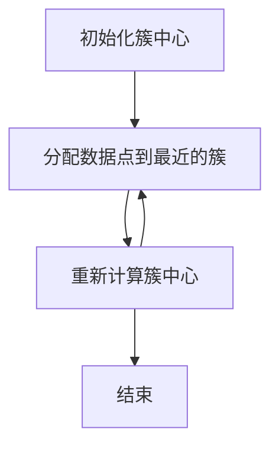
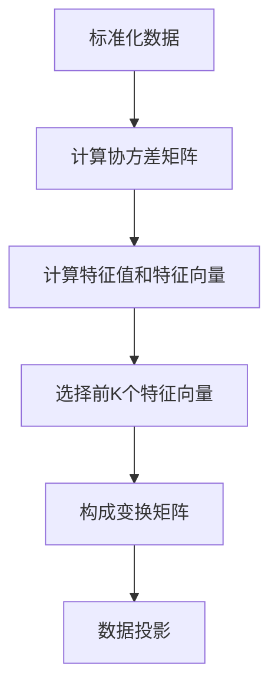

# 无监督学习原理与代码实战案例讲解

## 1.背景介绍

在机器学习的广阔领域中，无监督学习（Unsupervised Learning）作为一种重要的学习范式，逐渐受到越来越多的关注。与监督学习不同，无监督学习不依赖于标注数据，而是通过对数据的内在结构进行探索和分析，发现数据中的模式和规律。无监督学习在数据挖掘、聚类分析、降维等方面有着广泛的应用。

无监督学习的核心在于通过算法自动发现数据中的潜在结构，这使得它在处理大规模数据和复杂数据时具有独特的优势。本文将深入探讨无监督学习的核心概念、算法原理、数学模型，并通过实际项目案例展示其应用。

## 2.核心概念与联系

### 2.1 无监督学习的定义

无监督学习是一种机器学习方法，它在没有标签的情况下，通过分析数据的内在结构来进行学习。其主要目标是发现数据中的模式、结构或分布。

### 2.2 无监督学习与监督学习的区别

无监督学习与监督学习的主要区别在于数据是否有标签。监督学习依赖于标注数据进行训练，而无监督学习则不需要标签，直接从数据中提取信息。

### 2.3 无监督学习的主要任务

无监督学习主要包括以下几种任务：
- 聚类（Clustering）：将数据集划分为若干个组，使得同一组内的数据相似度高，不同组间的数据相似度低。
- 降维（Dimensionality Reduction）：将高维数据映射到低维空间，以便于数据的可视化和处理。
- 异常检测（Anomaly Detection）：识别数据集中与大多数数据不同的异常点。

## 3.核心算法原理具体操作步骤

### 3.1 K-means 聚类算法

K-means 是一种常用的聚类算法，其基本思想是将数据集划分为 K 个簇，使得每个簇内的数据点尽可能相似。其具体操作步骤如下：

1. 初始化 K 个簇中心（可以随机选择）。
2. 将每个数据点分配到最近的簇中心。
3. 重新计算每个簇的中心。
4. 重复步骤 2 和 3，直到簇中心不再变化或达到最大迭代次数。



### 3.2 主成分分析（PCA）

PCA 是一种常用的降维算法，其基本思想是通过线性变换将高维数据映射到低维空间，同时尽可能保留数据的方差。其具体操作步骤如下：

1. 标准化数据。
2. 计算数据的协方差矩阵。
3. 计算协方差矩阵的特征值和特征向量。
4. 选择前 K 个特征向量，构成变换矩阵。
5. 将数据投影到变换矩阵上，得到降维后的数据。



## 4.数学模型和公式详细讲解举例说明

### 4.1 K-means 聚类算法的数学模型

K-means 聚类算法的目标是最小化簇内平方和（Within-Cluster Sum of Squares, WCSS），其数学表达式为：

$$
\text{WCSS} = \sum_{i=1}^{K} \sum_{x \in C_i} \| x - \mu_i \|^2
$$

其中，$K$ 是簇的数量，$C_i$ 是第 $i$ 个簇，$\mu_i$ 是第 $i$ 个簇的中心，$x$ 是数据点。

### 4.2 主成分分析（PCA）的数学模型

PCA 的目标是通过线性变换将数据投影到低维空间，同时最大化投影后的方差。其数学表达式为：

$$
\text{Var}(Y) = \text{Var}(XW)
$$

其中，$X$ 是原始数据矩阵，$W$ 是变换矩阵，$Y$ 是降维后的数据矩阵。

## 5.项目实践：代码实例和详细解释说明

### 5.1 K-means 聚类算法的代码实例

以下是使用 Python 实现 K-means 聚类算法的代码示例：

```python
import numpy as np
from sklearn.datasets import make_blobs
from sklearn.cluster import KMeans
import matplotlib.pyplot as plt

# 生成数据
X, y = make_blobs(n_samples=300, centers=4, cluster_std=0.60, random_state=0)

# 使用 K-means 进行聚类
kmeans = KMeans(n_clusters=4)
kmeans.fit(X)
y_kmeans = kmeans.predict(X)

# 可视化结果
plt.scatter(X[:, 0], X[:, 1], c=y_kmeans, s=50, cmap='viridis')
centers = kmeans.cluster_centers_
plt.scatter(centers[:, 0], centers[:, 1], c='red', s=200, alpha=0.75)
plt.show()
```

### 5.2 主成分分析（PCA）的代码实例

以下是使用 Python 实现 PCA 的代码示