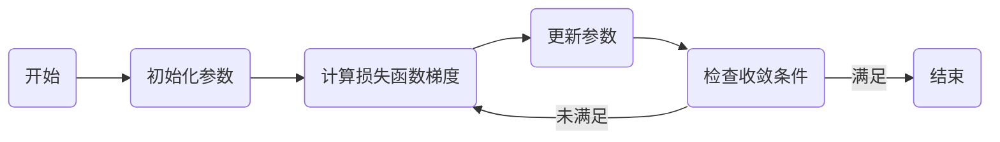

# 梯度下降Gradient Descent原理与代码实例讲解

## 1. 背景介绍

在机器学习和深度学习领域，梯度下降（Gradient Descent）是一种基础且广泛应用的优化算法，它用于最小化一个函数，即寻找函数的最小值。这个函数通常是损失函数（Loss Function），它衡量模型预测值与真实值之间的差异。通过不断迭代更新模型参数，梯度下降法能够使损失函数值逐渐减小，从而训练出性能更优的模型。

## 2. 核心概念与联系

### 2.1 梯度（Gradient）
梯度是多变量函数在某一点处沿着各个自变量增加最快的方向，其大小表示函数在该方向上的变化率。

### 2.2 下降（Descent）
下降指的是沿着梯度的反方向，即函数值减小的方向，更新参数的过程。

### 2.3 学习率（Learning Rate）
学习率决定了在梯度下降过程中参数更新的步长，过大可能导致超过最小值，过小则会使收敛速度变慢。

### 2.4 损失函数（Loss Function）
损失函数衡量模型预测值与真实值之间的差异，是梯度下降优化的目标函数。

### 2.5 参数更新（Parameter Update）
参数更新是指在每次迭代中，根据梯度和学习率调整模型参数的过程。

## 3. 核心算法原理具体操作步骤



1. 初始化参数：选择一个初始点作为参数的起始值。
2. 计算损失函数梯度：在当前参数下，计算损失函数关于每个参数的梯度。
3. 更新参数：根据梯度和学习率调整参数值，以减小损失函数。
4. 检查收敛条件：判断算法是否满足停止条件，如梯度趋近于零或达到预设的迭代次数。
5. 重复步骤2-4，直到满足收敛条件。

## 4. 数学模型和公式详细讲解举例说明

假设我们有一个损失函数 $L(\theta)$，其中 $\theta$ 表示模型参数。梯度下降的更新规则可以表示为：

$$
\theta_{new} = \theta_{old} - \alpha \cdot \nabla_\theta L(\theta_{old})
$$

其中，$\alpha$ 是学习率，$\nabla_\theta L(\theta_{old})$ 是损失函数在 $\theta_{old}$ 处的梯度。

梯度 $\nabla_\theta L(\theta)$ 的计算通常依赖于微分法则，例如链式法则。举例来说，如果损失函数是平方误差 $L(\theta) = (y - f(x; \theta))^2$，其中 $y$ 是真实值，$f(x; \theta)$ 是模型预测值，则梯度为：

$$
\nabla_\theta L(\theta) = -2(y - f(x; \theta)) \cdot \nabla_\theta f(x; \theta)
$$

## 5. 项目实践：代码实例和详细解释说明

以线性回归为例，我们的目标是找到参数 $\theta$，使得损失函数 $L(\theta) = \frac{1}{2m}\sum_{i=1}^{m}(h_\theta(x^{(i)}) - y^{(i)})^2$ 最小化，其中 $h_\theta(x) = \theta^Tx$ 是假设函数，$m$ 是样本数量。

```python
import numpy as np

# 假设函数
def hypothesis(theta, X):
    return np.dot(X, theta)

# 损失函数
def compute_loss(theta, X, y):
    m = len(y)
    return (1/(2*m)) * np.sum((hypothesis(theta, X) - y)**2)

# 梯度计算
def compute_gradient(theta, X, y):
    m = len(y)
    return (1/m) * np.dot(X.T, (hypothesis(theta, X) - y))

# 梯度下降算法
def gradient_descent(X, y, theta, alpha, iterations):
    loss_history = []
    for _ in range(iterations):
        theta -= alpha * compute_gradient(theta, X, y)
        loss_history.append(compute_loss(theta, X, y))
    return theta, loss_history

# 初始化参数
theta = np.zeros(X.shape[1])
alpha = 0.01
iterations = 1000

# 执行梯度下降
theta, loss_history = gradient_descent(X, y, theta, alpha, iterations)
```

在上述代码中，我们首先定义了假设函数和损失函数，然后计算梯度，并在梯度下降函数中迭代更新参数。最后，我们初始化参数并执行梯度下降算法。

## 6. 实际应用场景

梯度下降法在机器学习中有广泛的应用，例如：

- 线性回归和逻辑回归模型的参数优化。
- 神经网络的权重和偏置的调整。
- 支持向量机中核函数参数的优化。
- 聚类算法中心点的更新。

## 7. 工具和资源推荐

- TensorFlow和PyTorch：这两个深度学习框架提供了自动梯度计算和优化器，简化了梯度下降的实现。
- Scikit-learn：提供了许多机器学习算法的实现，包括支持梯度下降的模型。
- Coursera和edX：提供了机器学习和深度学习的在线课程，可以帮助理解梯度下降的原理和应用。

## 8. 总结：未来发展趋势与挑战

梯度下降法作为一种优化算法，在未来仍将是机器学习和深度学习领域的核心技术之一。随着计算能力的提升和算法的优化，梯度下降法将更加高效和稳定。然而，它也面临着如何处理非凸优化问题、如何避免陷入局部最小值、如何选择合适的学习率等挑战。

## 9. 附录：常见问题与解答

Q1: 梯度下降法是否总能找到全局最小值？
A1: 对于凸函数，梯度下降法可以找到全局最小值；对于非凸函数，可能只能找到局部最小值。

Q2: 学习率应该如何选择？
A2: 学习率的选择通常需要通过实验来确定，可以使用诸如学习率衰减或自适应学习率算法来辅助选择。

Q3: 梯度下降法的主要缺点是什么？
A3: 梯度下降法可能会因为学习率不当或非凸优化问题而收敛缓慢或陷入局部最小值。

作者：禅与计算机程序设计艺术 / Zen and the Art of Computer Programming