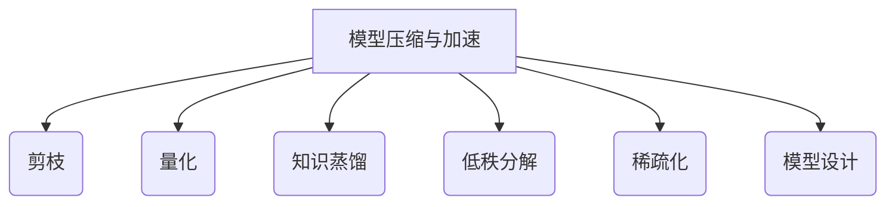

# 模型压缩与加速原理与代码实战案例讲解

## 1.背景介绍

随着深度学习模型在计算机视觉、自然语言处理等领域取得了卓越的成就,模型的规模也在不断增大。大型模型虽然能够提高任务的准确性,但也带来了巨大的计算和存储开销,这使得它们很难部署在资源受限的嵌入式设备或移动终端上。因此,如何在保持模型精度的同时减小其计算和存储开销,成为了一个亟待解决的问题。

模型压缩和加速技术应运而生,旨在缩小深度学习模型的尺寸,降低计算量,从而提高模型在资源受限环境下的推理效率。这些技术通过剪枝、量化、知识蒸馏等方式,减少模型中的冗余参数和计算,使得压缩后的模型能够在保持可接受的精度水平的同时,大幅降低计算和存储开销。

本文将全面介绍模型压缩与加速的核心原理、主流算法、实现细节以及实战案例,为读者提供一个系统的认识,帮助读者掌握这一领域的最新进展和实践技能。

## 2.核心概念与联系

模型压缩与加速技术主要包括以下几个核心概念:

1. **剪枝 (Pruning)**: 通过移除模型中的冗余参数和计算,来压缩模型的大小和减少计算量。常见的剪枝方法包括权重剪枝、滤波器剪枝、通道剪枝等。

2. **量化 (Quantization)**: 将原本使用高精度浮点数表示的模型参数和激活值,转换为低比特的定点数或整数表示,从而减小模型大小和计算量。

3. **知识蒸馏 (Knowledge Distillation)**: 利用一个大型教师模型指导一个小型学生模型的训练,使得学生模型能够学习到教师模型的知识,从而在保持较高精度的同时大幅减小模型尺寸。

4. **低秩分解 (Low-Rank Decomposition)**: 将全连接层或卷积核的权重矩阵分解为低秩的矩阵乘积,从而减少参数数量和计算量。

5. **稀疏化 (Sparsification)**: 通过引入正则项或其他约束,使得模型参数呈现出高度稀疏的分布,从而可以跳过大量的乘加运算,降低计算量。

6. **模型设计 (Model Design)**: 从模型设计的角度出发,构建计算高效、参数精简的网络架构,如SqueezeNet、MobileNet等。

这些概念相互关联、互为补充,共同构成了模型压缩与加速的理论基础和技术体系。下面将对它们进行详细阐述和案例分析。

## 3.核心算法原理具体操作步骤

### 3.1 剪枝算法

剪枝算法的目标是从预训练的深度神经网络模型中识别并移除冗余的权重连接或神经元,从而减小模型大小和计算量,同时尽可能保持模型的准确性。常见的剪枝算法包括以下几种:

#### 3.1.1 权重剪枝 (Weight Pruning)

权重剪枝的基本思想是移除权重绝对值较小的连接,因为这些连接对模型的输出影响较小。具体操作步骤如下:

1. 训练一个基准模型,获取所有权重参数。
2. 设置一个阈值,将绝对值小于该阈值的权重设置为0。
3. 对剪枝后的模型进行微调,使其在新的稀疏结构上重新收敛。
4. 根据需要,重复步骤2和3,逐步增大剪枝率,直到模型精度开始显著下降。

#### 3.1.2 滤波器剪枝 (Filter Pruning)

滤波器剪枝的目标是移除卷积层中冗余的滤波器,从而减小模型大小和计算量。操作步骤类似于权重剪枝:

1. 计算每个滤波器的归一化权重范数,作为其重要性的度量。
2. 移除范数最小的一些滤波器,并相应地修剪输入和输出特征图。
3. 对剪枝后的模型进行微调,使其在新的紧凑结构上重新收敛。

#### 3.1.3 通道剪枝 (Channel Pruning)

通道剪枝的目标是减少卷积层的输入通道数和输出通道数,从而降低计算量和内存占用。操作步骤包括:

1. 计算每个输入通道和输出通道对应滤波器的重要性评分。
2. 根据评分,移除重要性最低的一些输入通道和对应的输出通道。
3. 对剪枝后的模型进行微调,使其在新的紧凑结构上重新收敛。

剪枝算法的关键在于如何评估权重、滤波器或通道的重要性,以及如何在剪枝后保持模型的性能。常见的重要性评估方法包括绝对值范数、平均百分位数 (Average Percentage)、几何中值 (Geometric Median) 等。

### 3.2 量化算法

量化算法的目标是将原本使用高精度浮点数表示的模型参数和激活值,转换为低比特的定点数或整数表示,从而减小模型大小和计算量。常见的量化算法包括以下几种:

#### 3.2.1 张量量化 (Tensor Quantization)

张量量化是将模型的权重和激活值统一量化为低比特表示。具体操作步骤如下:

1. 确定量化的比特宽度,通常为8比特或更低。
2. 计算张量的最大值和最小值,确定量化的区间范围。
3. 将原始浮点数值线性映射到量化区间内的整数值。
4. 在推理时,使用整数计算代替原始的浮点数计算。

#### 3.2.2 权重量化 (Weight Quantization)

权重量化只对模型的权重参数进行量化,而保持激活值的浮点数表示。这种方法可以在一定程度上保持模型精度,但计算效率的提升有限。

#### 3.2.3 激活值量化 (Activation Quantization)

激活值量化只对模型的中间激活值进行量化,而保持权重参数的浮点数表示。这种方法可以减小内存占用和部分计算量,但对模型精度的影响较大。

#### 3.2.4 定点量化 (Fixed-Point Quantization)

定点量化将浮点数值映射到固定的定点数表示,例如INT8或INT16。这种方法简单高效,但精度损失较大。

#### 3.2.5 浮点量化 (Floating-Point Quantization)

浮点量化将原始的32位浮点数映射到更低比特宽度的浮点数表示,例如16位半精度或8位量子化浮点数。这种方法可以在一定程度上保持精度,但计算效率的提升有限。

量化算法的关键在于如何确定合适的量化比特宽度,以及如何最小化量化误差对模型精度的影响。常见的量化方法包括线性量化、对数量化、基于训练的量化等。

### 3.3 知识蒸馏算法

知识蒸馏算法的目标是利用一个大型教师模型指导一个小型学生模型的训练,使得学生模型能够学习到教师模型的知识,从而在保持较高精度的同时大幅减小模型尺寸。具体操作步骤如下:

1. 训练一个大型的教师模型,作为知识的来源。
2. 定义一个小型的学生模型,其结构和参数数量远小于教师模型。
3. 在训练学生模型时,除了使用原始的训练数据和标签,还引入一个额外的损失项,即教师模型在相同输入下的预测结果与学生模型的预测结果之间的差异。
4. 通过优化该损失函数,使得学生模型的预测结果尽可能地接近教师模型,从而学习到教师模型的知识。

知识蒸馏算法的关键在于如何定义教师模型和学生模型之间的知识传递机制,以及如何设计合适的损失函数来优化知识传递过程。常见的知识传递方式包括逐样本的软目标知识蒸馏、关系知识蒸馏、注意力知识蒸馏等。

### 3.4 低秩分解算法

低秩分解算法的目标是将全连接层或卷积核的权重矩阵分解为低秩的矩阵乘积,从而减少参数数量和计算量。常见的低秩分解算法包括以下几种:

#### 3.4.1 奇异值分解 (SVD)

奇异值分解将一个矩阵 $\mathbf{W}$ 分解为三个矩阵的乘积:

$$\mathbf{W} = \mathbf{U}\mathbf{\Sigma}\mathbf{V}^T$$

其中 $\mathbf{U}$ 和 $\mathbf{V}$ 是正交矩阵, $\mathbf{\Sigma}$ 是一个对角矩阵,对角线上的元素称为奇异值。通过保留前 $r$ 个最大的奇异值及对应的左右奇异向量,可以获得 $\mathbf{W}$ 的低秩近似:

$$\mathbf{W} \approx \mathbf{U}_r\mathbf{\Sigma}_r\mathbf{V}_r^T$$

其中 $\mathbf{U}_r\in\mathbb{R}^{m\times r}$, $\mathbf{\Sigma}_r\in\mathbb{R}^{r\times r}$, $\mathbf{V}_r\in\mathbb{R}^{n\times r}$, 参数数量从原始的 $mn$ 减少到 $m\times r + r + n\times r$。

#### 3.4.2 张量分解

对于高维的卷积核权重张量,可以使用张量分解算法进行低秩分解,例如CP分解、Tucker分解等。这些算法将高维张量分解为一系列低秩矩阵和向量的乘积,从而减少参数数量和计算量。

#### 3.4.3 矩阵/张量分解训练

除了对预训练模型进行低秩分解,也可以在模型训练过程中引入低秩约束,使得模型参数天生具有低秩结构。这种方法通常需要设计特殊的优化算法和损失函数,以实现参数低秩化和模型精度的同时优化。

低秩分解算法的关键在于如何确定合适的秩数,以及如何在分解过程中最小化近似误差对模型精度的影响。此外,如何高效地实现低秩矩阵和张量的乘法运算,也是一个需要解决的重要问题。

### 3.5 稀疏化算法

稀疏化算法的目标是通过引入正则项或其他约束,使得模型参数呈现出高度稀疏的分布,从而可以跳过大量的乘加运算,降低计算量。常见的稀疏化算法包括以下几种:

#### 3.5.1 基于正则化的稀疏化

通过在损失函数中引入 $L_1$ 范数或其他稀疏诱导正则项,可以促使模型参数趋向于稀疏解。具体操作步骤如下:

1. 定义包含稀疏正则项的损失函数,例如 $L = L_0 + \lambda\|\mathbf{W}\|_1$。
2. 在模型训练过程中,优化该损失函数,使得参数 $\mathbf{W}$ 趋向于稀疏解。
3. 对训练好的模型进行剪枝,移除绝对值很小的权重,获得高度稀疏的模型。

#### 3.5.2 基于掩码的稀疏化

另一种思路是直接在模型参数上施加硬性稀疏约束,例如引入二值掩码向量,使得部分参数被固定为0。具体操作步骤如下:

1. 为每个权重矩阵引入一个掩码向量,初始时全为1。
2. 在模型训练过程中,根据某种策略更新掩码向量,使得部分元素变为0。
3. 对训练好的模型进行剪枝,