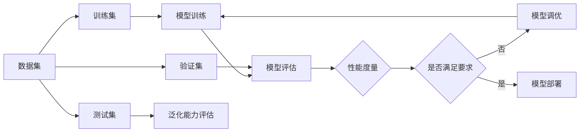

# 模型评估与性能度量原理与代码实战案例讲解

## 1. 背景介绍
### 1.1 机器学习模型评估的重要性
在机器学习领域,模型评估是一个至关重要的环节。它不仅能够帮助我们选择最优的模型,还能发现模型存在的问题,为模型的优化和改进提供方向。一个优秀的机器学习模型不仅要有良好的训练性能,更要有出色的泛化能力,在面对新数据时依然能保持稳定的预测效果。而模型评估与性能度量,正是检验模型泛化能力的重要手段。

### 1.2 性能度量指标的作用
性能度量指标是评估模型优劣的关键因素。不同的任务和场景,需要选取不同的评估指标。比如对于二分类问题,我们通常会关注准确率、精确率、召回率、F1值等指标;而对于多分类问题,除了以上指标外,我们还会使用混淆矩阵、micro-averaging、macro-averaging等方法进行更全面的评估。选择合适的性能度量指标,能够更准确地反映模型的实际表现,为后续的优化提供参考。

### 1.3 模型评估与调优的关系
模型评估为模型调优提供了重要依据。通过评估结果,我们能够发现模型的不足之处,进而有针对性地进行改进。比如当模型出现过拟合时,我们可以通过增大正则化系数、减小模型复杂度等手段来缓解;当模型出现欠拟合时,我们则可以增加模型复杂度、扩充训练数据等方法来提升拟合能力。模型评估与调优是一个反复迭代的过程,通过不断评估和优化,最终得到一个性能优异的模型。

## 2. 核心概念与联系
### 2.1 训练集、验证集和测试集
在模型评估中,数据集的划分至关重要。我们通常将整个数据集分为训练集、验证集和测试集三部分。

- 训练集(Training Set):用于训练模型,使模型学习到数据的特征。
- 验证集(Validation Set):用于在训练过程中评估模型的性能,帮助选择最优模型和超参数。
- 测试集(Test Set):在模型训练完成后,用于评估模型的泛化能力。

一个常见的做法是将数据集按照6:2:2的比例划分为训练集、验证集和测试集。需要注意的是,为了保证评估的客观性,测试集不应参与模型的训练和选择过程。

### 2.2 交叉验证
交叉验证(Cross Validation)是一种常用的模型评估方法。它将数据集划分为k个大小相似的子集,每次选择其中一个子集作为验证集,其余k-1个子集作为训练集,进行k次训练和评估,最后取k次评估结果的平均值作为最终的性能指标。交叉验证能够有效利用有限的数据,减少因数据划分不当而引入的偏差,提高评估结果的可靠性。常见的交叉验证方法有k折交叉验证、留一交叉验证等。

### 2.3 性能度量指标
不同的任务需要选取不同的性能度量指标。以下是一些常用的指标:

- 准确率(Accuracy):预测正确的样本数占总样本数的比例。
- 精确率(Precision):预测为正例的样本中,真正为正例的比例。
- 召回率(Recall):真实为正例的样本中,被预测为正例的比例。
- F1值(F1-score):精确率和召回率的调和平均数。
- ROC曲线和AUC值:反映二分类模型在不同阈值下的性能变化情况。
- 均方误差(MSE)和平均绝对误差(MAE):回归任务中常用的性能度量指标。

### 2.4 过拟合与欠拟合
模型评估的另一个重要目的是发现模型的过拟合或欠拟合问题。

- 过拟合(Overfitting):模型过于复杂,在训练集上表现很好,但在新数据上泛化能力差。
- 欠拟合(Underfitting):模型过于简单,无法很好地拟合训练数据,在训练集和测试集上表现都不理想。

通过比较模型在训练集和验证集上的性能差异,我们可以初步判断模型是否出现过拟合或欠拟合。如果训练集上的性能远好于验证集,则可能存在过拟合;如果训练集和验证集上的性能都很差,则可能存在欠拟合。

### 2.5 模型评估与性能度量的关系
下图展示了模型评估与性能度量的关系:



从图中可以看出,数据集被划分为训练集、验证集和测试集,训练集用于模型训练,验证集用于模型评估和选择,测试集用于评估模型的泛化能力。模型评估的结果用各种性能度量指标来衡量,如果不满足要求,则需要对模型进行调优,重新训练和评估,直到获得理想的性能为止。

## 3. 核心算法原理具体操作步骤
下面以二分类任务为例,介绍几种常用的模型评估方法的具体操作步骤。

### 3.1 留出法(Hold-out Method)
1. 将数据集按照一定比例(如7:3)随机划分为训练集和测试集。 
2. 用训练集训练模型,用测试集评估模型性能。
3. 重复以上步骤多次,取平均值作为最终的性能评估结果。

### 3.2 k折交叉验证(k-fold Cross Validation)
1. 将数据集随机划分为k个大小相似的子集。
2. 每次选择其中一个子集作为验证集,其余k-1个子集作为训练集。
3. 重复步骤2共k次,每次选择不同的子集作为验证集。
4. 对k次评估结果取平均,得到最终的性能评估结果。

### 3.3 留一交叉验证(Leave-one-out Cross Validation, LOOCV) 
1. 每次从数据集中选择一个样本作为验证集,其余样本作为训练集。
2. 重复步骤1,直到每个样本都被选为验证集一次。
3. 对所有评估结果取平均,得到最终的性能评估结果。

需要注意的是,留一交叉验证的计算开销较大,适用于小数据集的情况。

### 3.4 自助法(Bootstrap Method)
1. 从数据集中有放回地随机抽取n个样本,构成训练集。
2. 未被抽取到的样本构成验证集。
3. 用训练集训练模型,用验证集评估模型性能。
4. 重复步骤1-3多次,取平均值作为最终的性能评估结果。

自助法能够有效利用数据,减小估计的方差,但可能引入一定的偏差。

## 4. 数学模型和公式详细讲解举例说明
### 4.1 混淆矩阵(Confusion Matrix)
混淆矩阵是评估二分类模型性能的重要工具。以下是一个混淆矩阵的示例:

|      | 预测正例 | 预测反例 |
|------|---------|---------|
| 实际正例 | TP   | FN      |
| 实际反例 | FP   | TN      |

其中:
- TP(True Positive):真正例,实际为正例且被预测为正例。
- FN(False Negative):假反例,实际为正例但被预测为反例。
- FP(False Positive):假正例,实际为反例但被预测为正例。
- TN(True Negative):真反例,实际为反例且被预测为反例。

基于混淆矩阵,我们可以计算出多个性能度量指标:

- 准确率(Accuracy): $\frac{TP+TN}{TP+FN+FP+TN}$
- 精确率(Precision): $\frac{TP}{TP+FP}$
- 召回率(Recall): $\frac{TP}{TP+FN}$
- F1值(F1-score): $\frac{2*Precision*Recall}{Precision+Recall}$

### 4.2 ROC曲线和AUC值
ROC(Receiver Operating Characteristic)曲线反映了二分类模型在不同阈值下的性能变化情况。横轴为假正例率(FPR),纵轴为真正例率(TPR)。

- 真正例率(TPR): $\frac{TP}{TP+FN}$
- 假正例率(FPR): $\frac{FP}{FP+TN}$

AUC(Area Under Curve)值是ROC曲线下的面积,取值范围为[0.5, 1]。AUC值越大,说明模型的性能越好。

假设我们有以下样本的预测概率和真实标签:

| 样本 | 预测概率 | 真实标签 |
|-----|--------|---------|
| A   | 0.8    | 1       |
| B   | 0.6    | 0       |
| C   | 0.7    | 1       |  
| D   | 0.4    | 0       |

我们可以绘制ROC曲线如下:

```python
import numpy as np
import matplotlib.pyplot as plt

y_true = np.array([1, 0, 1, 0])
y_score = np.array([0.8, 0.6, 0.7, 0.4])

thresholds = np.sort(y_score)
tpr = []
fpr = []

for threshold in thresholds:
    tp = np.sum((y_score >= threshold) & (y_true == 1))
    fn = np.sum((y_score < threshold) & (y_true == 1)) 
    tn = np.sum((y_score < threshold) & (y_true == 0))
    fp = np.sum((y_score >= threshold) & (y_true == 0))
    
    tpr.append(tp / (tp + fn))
    fpr.append(fp / (fp + tn))

plt.plot(fpr, tpr)
plt.xlabel('False Positive Rate')
plt.ylabel('True Positive Rate')
plt.title('ROC Curve')
plt.show()
```

## 5. 项目实践:代码实例和详细解释说明
下面以scikit-learn库为例,演示如何进行模型评估。

### 5.1 留出法

```python
from sklearn.datasets import load_iris
from sklearn.model_selection import train_test_split
from sklearn.svm import SVC
from sklearn.metrics import accuracy_score

# 加载数据集
X, y = load_iris(return_X_y=True)

# 划分训练集和测试集
X_train, X_test, y_train, y_test = train_test_split(X, y, test_size=0.3, random_state=42)

# 训练模型
clf = SVC()
clf.fit(X_train, y_train)

# 预测并评估
y_pred = clf.predict(X_test)
acc = accuracy_score(y_test, y_pred)
print(f"Accuracy: {acc:.2f}")
```

### 5.2 k折交叉验证

```python
from sklearn.datasets import load_iris
from sklearn.model_selection import cross_val_score
from sklearn.svm import SVC

# 加载数据集
X, y = load_iris(return_X_y=True)

# 定义模型
clf = SVC()

# 进行5折交叉验证
scores = cross_val_score(clf, X, y, cv=5)
print(f"Accuracy: {scores.mean():.2f} (+/- {scores.std()*2:.2f})")
```

### 5.3 混淆矩阵与分类报告

```python
from sklearn.datasets import load_iris
from sklearn.model_selection import train_test_split
from sklearn.svm import SVC
from sklearn.metrics import confusion_matrix, classification_report

# 加载数据集
X, y = load_iris(return_X_y=True)

# 划分训练集和测试集 
X_train, X_test, y_train, y_test = train_test_split(X, y, test_size=0.3, random_state=42)

# 训练模型
clf = SVC()
clf.fit(X_train, y_train)

# 预测并评估
y_pred = clf.predict(X_test)
cm = confusion_matrix(y_test, y_pred)
report = classification_report(y_test, y_pred)

print("Confusion Matrix:")
print(cm)
print("Classification Report:")
print(report)
```

## 6. 实际应用场景
模型评估与性能度量在机器学习的各个领域都有广泛应用,以下是一些典型场景:

### 6.1 金融风控
在金融风控领域,我们通常需