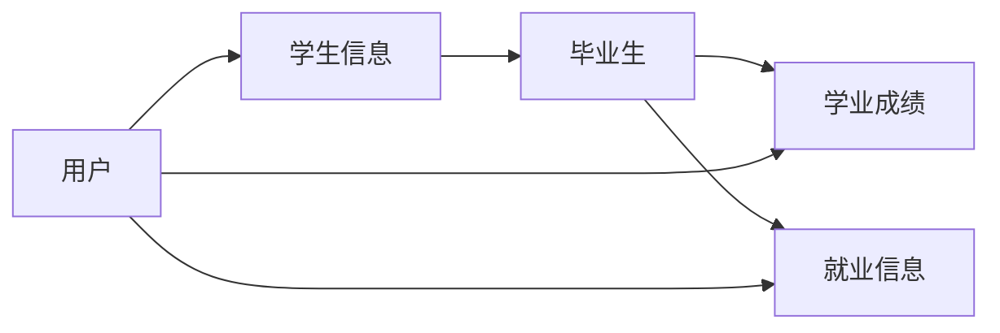

# 毕业生信息管理系统详细设计与具体代码实现

## 1. 背景介绍
随着高校毕业生人数的不断增加,对毕业生信息进行有效管理已成为高校工作的重要内容之一。传统的人工管理方式效率低下,难以满足日益增长的信息管理需求。因此,开发一套功能完善、易于操作的毕业生信息管理系统具有重要意义。

本文将详细介绍毕业生信息管理系统的设计与实现过程,包括需求分析、数据库设计、系统架构设计以及具体的代码实现。通过对系统的全面剖析,帮助读者深入理解信息管理系统的开发流程和关键技术。

### 1.1 系统目标
毕业生信息管理系统旨在实现以下目标:

1. 提供毕业生信息的录入、查询、修改等基本功能,方便管理人员进行日常操作。
2. 实现毕业生信息的统计和分析,为学校决策提供数据支持。
3. 提供友好的用户界面,降低系统使用难度,提高工作效率。
4. 保证系统的安全性和稳定性,防止非法访问和数据丢失。

### 1.2 应用场景
毕业生信息管理系统可应用于以下场景:

1. 高校教务部门:管理毕业生的基本信息、学业成绩、就业去向等。
2. 学生工作部门:了解毕业生的就业状况,为就业指导提供依据。
3. 校友会:维护毕业生联系方式,促进校友交流。

## 2. 核心概念与联系
在毕业生信息管理系统中,涉及到以下核心概念:

- 毕业生:已完成学业并获得学位的学生。
- 学生信息:包括学号、姓名、性别、出生日期、专业等基本信息。
- 学业成绩:学生在校期间修读课程的成绩记录。
- 就业信息:毕业生的就业去向、工作单位、职位等信息。
- 用户:使用系统的管理人员,具有不同的权限和操作范围。

这些概念之间存在着紧密的联系。学生信息是毕业生的基础数据,学业成绩和就业信息则反映了毕业生在校学习和毕业后的发展情况。用户通过系统对这些信息进行管理和分析,从而实现对毕业生的全面掌握和服务。

下图展示了毕业生信息管理系统的核心概念及其关系:



## 3. 核心算法原理与具体操作步骤
毕业生信息管理系统涉及到一些常用的算法,如数据的增删改查、数据统计与分析等。下面以数据查询为例,介绍其核心原理和操作步骤。

### 3.1 数据查询算法原理
数据查询是根据用户指定的条件,从数据库中检索出满足条件的记录。常用的查询算法有:

1. 顺序查找:逐条比对记录,直到找到符合条件的记录为止。
2. 二分查找:将记录按关键字排序,通过不断二分缩小查找范围,快速定位目标记录。
3. 索引查找:利用索引结构(如B+树)预先建立关键字与记录位置的映射,大幅提高查询效率。

### 3.2 查询操作步骤
以下是数据查询的一般操作步骤:

1. 用户输入查询条件,如姓名、学号等。
2. 系统解析查询条件,生成对应的SQL语句。
3. 数据库执行SQL语句,检索满足条件的记录。
4. 将查询结果返回给用户界面展示。

示例SQL语句:
```sql
SELECT * FROM student WHERE name = '张三';
```

## 4. 数学模型和公式详细讲解举例说明
在毕业生信息管理系统中,可利用数学模型和公式进行数据分析和预测。以就业去向分析为例:

假设某校毕业生有n个专业,第i个专业的毕业生人数为$a_i$,其中进入IT行业的人数为$b_i$。那么该校毕业生进入IT行业的比例$p$可表示为:

$$p = \frac{\sum_{i=1}^{n} b_i}{\sum_{i=1}^{n} a_i} \times 100\%$$

例如,某校共有3个专业,各专业毕业生人数和进入IT行业人数如下:

| 专业 | 毕业生人数 | 进入IT行业人数 |
|:----:|:----------:|:--------------:|
| 计算机 | 100 | 80 |
| 电子 | 80 | 50 |
| 机械 | 120 | 20 |

代入公式可得:

$$p = \frac{80 + 50 + 20}{100 + 80 + 120} \times 100\% = 50\%$$

即该校毕业生进入IT行业的比例为50%。通过建立数学模型,可以方便地进行各类统计分析,为学校决策提供量化依据。

## 5. 项目实践:代码实例和详细解释说明
下面以用户登录功能为例,给出具体的代码实现和说明。

### 5.1 用户实体类
```java
public class User {
    private String username;
    private String password;
    
    // 构造方法、getter和setter方法省略
}
```

User类表示系统用户,包含用户名和密码两个属性。

### 5.2 登录Servlet
```java
@WebServlet("/login")
public class LoginServlet extends HttpServlet {
    protected void doPost(HttpServletRequest request, HttpServletResponse response) throws ServletException, IOException {
        String username = request.getParameter("username");
        String password = request.getParameter("password");
        
        UserDao userDao = new UserDaoImpl();
        User user = userDao.findByUsername(username);
        
        if (user != null && user.getPassword().equals(password)) {
            request.getSession().setAttribute("user", user);
            response.sendRedirect("index.jsp");
        } else {
            request.setAttribute("error", "用户名或密码错误");
            request.getRequestDispatcher("login.jsp").forward(request, response);
        }
    }
}
```

LoginServlet处理用户登录请求,主要步骤如下:
1. 获取请求参数中的用户名和密码。
2. 调用UserDao的findByUsername方法,根据用户名查询用户。
3. 如果用户存在且密码正确,将用户对象存入Session,重定向到主页;否则转发回登录页,并显示错误信息。

### 5.3 用户数据访问层
```java
public interface UserDao {
    User findByUsername(String username);
}

public class UserDaoImpl implements UserDao {
    @Override
    public User findByUsername(String username) {
        // 从数据库查询用户记录的代码省略
    }
}
```

UserDao是数据访问层接口,定义了按用户名查询用户的方法。UserDaoImpl是其实现类,负责与数据库交互,执行具体的查询操作。

## 6. 实际应用场景
毕业生信息管理系统可应用于多个场景,例如:

1. 教务管理:学校教务部门可利用系统管理毕业生的基本信息和学业成绩,并进行成绩统计和分析。
2. 就业指导:就业指导部门可通过系统了解毕业生的就业去向和工作状况,为在校生提供就业指导服务。
3. 校友联络:校友会可使用系统维护毕业生的最新联系方式,定期发布校友活动信息,加强校友之间的交流。

## 7. 工具和资源推荐
开发毕业生信息管理系统可使用以下工具和资源:

1. 开发工具:
   - Eclipse/IntelliJ IDEA:Java开发IDE
   - MySQL Workbench:数据库设计工具
   - Tomcat:Web应用服务器
2. 技术框架:
   - Spring:轻量级Java开发框架
   - MyBatis:数据持久层框架
   - Bootstrap:前端UI框架
3. 学习资源:
   - 《Java编程思想》:Java语言经典书籍
   - 《Spring实战》:Spring框架权威指南
   - 《MySQL必知必会》:MySQL数据库入门教程

## 8. 总结:未来发展趋势与挑战
随着高校教育的不断发展,毕业生信息管理系统也面临着新的机遇和挑战。未来的发展趋势主要体现在以下几个方面:

1. 移动化:随着移动设备的普及,系统需要提供移动端访问支持,实现随时随地的信息查询和管理。
2. 大数据分析:利用大数据技术对毕业生信息进行深度挖掘和分析,为学校决策提供更加全面和精准的依据。
3. 人工智能应用:引入人工智能技术,实现智能化的信息处理和个性化服务,提高系统的智能水平。

同时,系统也面临一些挑战,例如:

1. 数据安全:如何有效保护毕业生的个人隐私,防止数据泄露和非法访问。
2. 系统性能:如何应对大规模并发访问,保证系统的高可用性和响应速度。
3. 跨平台整合:如何与学校其他信息系统实现无缝对接,提供一站式的信息服务。

## 9. 附录:常见问题与解答
1. 问:系统是否支持批量导入毕业生信息?
   答:是的,系统提供了Excel批量导入功能,可一次性导入大量毕业生信息,提高录入效率。

2. 问:系统如何保证数据安全?
   答:系统采用了多重安全防护措施,如用户身份验证、数据加密传输、定期数据备份等,最大限度地保障数据安全。

3. 问:系统是否支持自定义查询条件?
   答:是的,系统提供了灵活的查询功能,用户可根据实际需求自定义查询条件,实现精准查找。

4. 问:系统能否生成统计报表?
   答:系统内置了常用的统计报表,如毕业生就业率报表、专业分布报表等。同时,用户也可自行设计报表,满足个性化需求。

作者:禅与计算机程序设计艺术 / Zen and the Art of Computer Programming