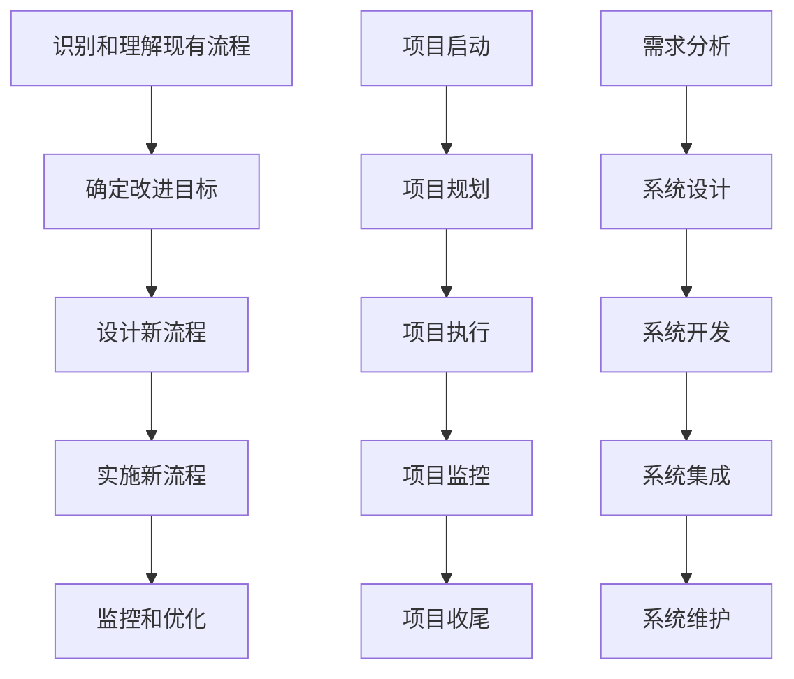

# 结合业务流程重组、项目管理实施集成信息系统管理

## 1.背景介绍

在当今快速变化的商业环境中，企业需要不断优化其业务流程和信息系统，以保持竞争力。业务流程重组（Business Process Reengineering, BPR）和项目管理（Project Management, PM）是实现这一目标的两大关键手段。通过将这两者结合，企业可以更有效地实施集成信息系统管理，从而提高效率、降低成本、增强灵活性。

业务流程重组是一种彻底重新设计企业核心业务流程的方法，旨在显著提高生产率、质量和客户满意度。项目管理则是一种系统化的方法，用于规划、执行和监控项目，以确保项目按时、按预算和按质量要求完成。将BPR和PM结合起来，可以在优化业务流程的同时，确保信息系统的实施和集成顺利进行。

## 2.核心概念与联系

### 2.1 业务流程重组（BPR）

业务流程重组是一种从根本上重新思考和彻底重新设计业务流程的方法，目的是在成本、质量、服务和速度等关键绩效指标上取得显著改善。BPR的核心概念包括：

- **流程导向**：关注业务流程而非职能部门。
- **彻底性**：从根本上重新设计流程，而不是对现有流程进行微调。
- **显著改善**：目标是实现显著的绩效提升，而不仅仅是小幅改进。

### 2.2 项目管理（PM）

项目管理是一种系统化的方法，用于规划、执行和监控项目。其核心概念包括：

- **项目生命周期**：包括启动、规划、执行、监控和收尾五个阶段。
- **项目范围管理**：确保项目包含所有必要的工作，并排除不必要的工作。
- **时间管理**：确保项目按时完成。
- **成本管理**：确保项目在预算内完成。
- **质量管理**：确保项目满足质量要求。

### 2.3 集成信息系统管理

集成信息系统管理是指通过协调和整合企业的各个信息系统，实现数据和信息的无缝流动。其核心概念包括：

- **系统集成**：将不同的信息系统连接起来，实现数据共享和流程自动化。
- **数据一致性**：确保各个系统中的数据一致且准确。
- **流程自动化**：通过自动化技术优化业务流程，提高效率。

### 2.4 BPR、PM与集成信息系统管理的联系

BPR、PM和集成信息系统管理之间有着紧密的联系。BPR提供了优化业务流程的框架，PM确保这些优化措施能够有效实施，而集成信息系统管理则通过技术手段实现业务流程的自动化和数据的一致性。三者的结合可以显著提高企业的运营效率和竞争力。

## 3.核心算法原理具体操作步骤

### 3.1 业务流程重组的操作步骤

1. **识别和理解现有流程**：通过流程图和数据分析，全面了解现有业务流程。
2. **确定改进目标**：明确需要改进的关键绩效指标，如成本、质量、服务和速度。
3. **设计新流程**：基于改进目标，设计新的业务流程。
4. **实施新流程**：通过项目管理方法，确保新流程的顺利实施。
5. **监控和优化**：持续监控新流程的绩效，并进行必要的优化。

### 3.2 项目管理的操作步骤

1. **项目启动**：定义项目目标、范围和关键干系人。
2. **项目规划**：制定详细的项目计划，包括时间表、预算和资源分配。
3. **项目执行**：按照计划执行项目任务，并进行进度和质量控制。
4. **项目监控**：持续监控项目进展，识别和解决问题。
5. **项目收尾**：完成所有项目任务，进行项目评估和总结。

### 3.3 集成信息系统管理的操作步骤

1. **需求分析**：识别和分析企业的信息系统需求。
2. **系统设计**：设计系统架构和数据模型，确保系统的可扩展性和数据一致性。
3. **系统开发**：开发和测试系统组件，确保其功能和性能满足需求。
4. **系统集成**：将各个系统组件集成起来，实现数据共享和流程自动化。
5. **系统维护**：持续监控和维护系统，确保其稳定性和安全性。

### 3.4 核心算法的Mermaid流程图



## 4.数学模型和公式详细讲解举例说明

### 4.1 业务流程重组的数学模型

业务流程重组可以通过线性规划模型来优化资源分配和流程设计。假设一个企业有 $n$ 个业务流程，每个流程有 $m$ 个任务，每个任务需要消耗一定的资源。目标是最小化总资源消耗，同时满足所有任务的需求。

$$
\text{Minimize} \quad Z = \sum_{i=1}^{n} \sum_{j=1}^{m} c_{ij} x_{ij}
$$

其中，$c_{ij}$ 是第 $i$ 个流程中第 $j$ 个任务的资源消耗，$x_{ij}$ 是第 $i$ 个流程中第 $j$ 个任务的执行情况（0 或 1）。

约束条件：

$$
\sum_{j=1}^{m} x_{ij} = 1 \quad \forall i \in \{1, 2, \ldots, n\}
$$

$$
x_{ij} \in \{0, 1\} \quad \forall i \in \{1, 2, \ldots, n\}, \forall j \in \{1, 2, \ldots, m\}
$$

### 4.2 项目管理的数学模型

项目管理中的关键路径法（Critical Path Method, CPM）可以通过图论模型来表示。假设一个项目有 $n$ 个任务，每个任务有一个开始时间和结束时间。目标是找到项目的关键路径，即完成项目所需的最短时间。

定义任务 $i$ 的开始时间为 $S_i$，结束时间为 $E_i$，任务 $i$ 的持续时间为 $D_i$。关键路径可以通过以下公式计算：

$$
E_i = S_i + D_i
$$

关键路径上的任务满足以下条件：

$$
E_i = \max_{j \in \text{前置任务}} (E_j) + D_i
$$

### 4.3 集成信息系统管理的数学模型

集成信息系统管理中的数据一致性问题可以通过一致性模型来表示。假设一个企业有 $n$ 个信息系统，每个系统有 $m$ 个数据项。目标是确保所有系统中的数据一致。

定义系统 $i$ 中数据项 $j$ 的值为 $d_{ij}$，数据一致性可以通过以下公式表示：

$$
d_{ij} = d_{kj} \quad \forall i, k \in \{1, 2, \ldots, n\}, \forall j \in \{1, 2, \ldots, m\}
$$

## 5.项目实践：代码实例和详细解释说明

### 5.1 业务流程重组的代码实例

以下是一个使用Python实现业务流程重组的简单示例，使用线性规划库PuLP来优化资源分配。

```python
import pulp

# 定义问题
problem = pulp.LpProblem("BPR_Optimization", pulp.LpMinimize)

# 定义变量
x = pulp.LpVariable.dicts("x", [(i, j) for i in range(1, n+1) for j in range(1, m+1)], cat='Binary')

# 定义目标函数
problem += pulp.lpSum([c[i][j] * x[i, j] for i in range(1, n+1) for j in range(1, m+1)])

# 定义约束条件
for i in range(1, n+1):
    problem += pulp.lpSum([x[i, j] for j in range(1, m+1)]) == 1

# 求解问题
problem.solve()

# 输出结果
for i in range(1, n+1):
    for j in range(1, m+1):
        if x[i, j].varValue == 1:
            print(f"流程 {i} 的任务 {j} 被选择")
```

### 5.2 项目管理的代码实例

以下是一个使用Python实现关键路径法的简单示例，使用NetworkX库来计算项目的关键路径。

```python
import networkx as nx

# 定义项目任务和持续时间
tasks = {
    'A': 3,
    'B': 2,
    'C': 4,
    'D': 2,
    'E': 1
}

# 定义任务依赖关系
dependencies = [
    ('A', 'B'),
    ('A', 'C'),
    ('B', 'D'),
    ('C', 'D'),
    ('D', 'E')
]

# 创建有向图
G = nx.DiGraph()

# 添加任务节点
for task, duration in tasks.items():
    G.add_node(task, duration=duration)

# 添加依赖关系边
G.add_edges_from(dependencies)

# 计算关键路径
critical_path = nx.dag_longest_path(G, weight='duration')

# 输出关键路径
print("关键路径:", critical_path)
```

### 5.3 集成信息系统管理的代码实例

以下是一个使用Python实现数据一致性的简单示例，使用SQLAlchemy库来确保多个数据库中的数据一致。

```python
from sqlalchemy import create_engine, Column, Integer, String, MetaData, Table
from sqlalchemy.orm import sessionmaker

# 定义数据库连接
engine1 = create_engine('sqlite:///db1.sqlite')
engine2 = create_engine('sqlite:///db2.sqlite')

# 定义元数据
metadata = MetaData()

# 定义数据表
data_table = Table('data', metadata,
                   Column('id', Integer, primary_key=True),
                   Column('value', String))

# 创建数据表
metadata.create_all(engine1)
metadata.create_all(engine2)

# 定义会话
Session1 = sessionmaker(bind=engine1)
Session2 = sessionmaker(bind=engine2)

# 插入数据
session1 = Session1()
session2 = Session2()

session1.add_all([data_table.insert().values(id=1, value='A'),
                  data_table.insert().values(id=2, value='B')])
session2.add_all([data_table.insert().values(id=1, value='A'),
                  data_table.insert().values(id=2, value='B')])

session1.commit()
session2.commit()

# 确保数据一致性
data1 = session1.query(data_table).all()
data2 = session2.query(data_table).all()

for d1, d2 in zip(data1, data2):
    assert d1.value == d2.value, "数据不一致"

print("数据一致性检查通过")
```

## 6.