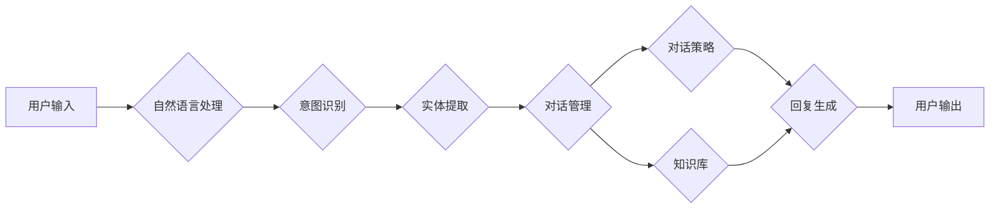

# 聊天机器人的崛起：一个技术革新的历史回顾

## 1. 背景介绍
### 1.1 聊天机器人的定义与发展历程
#### 1.1.1 聊天机器人的定义
#### 1.1.2 聊天机器人技术的发展历程
#### 1.1.3 聊天机器人在不同领域的应用现状
### 1.2 聊天机器人技术革新的意义
#### 1.2.1 提升用户交互体验
#### 1.2.2 优化客户服务效率
#### 1.2.3 拓展人机交互的新边界

## 2. 核心概念与联系
### 2.1 自然语言处理(NLP)
#### 2.1.1 NLP的定义与原理
#### 2.1.2 NLP在聊天机器人中的应用
#### 2.1.3 NLP技术的发展趋势
### 2.2 机器学习(Machine Learning)
#### 2.2.1 机器学习的定义与分类
#### 2.2.2 机器学习在聊天机器人中的应用
#### 2.2.3 机器学习算法的选择与优化
### 2.3 知识图谱(Knowledge Graph)
#### 2.3.1 知识图谱的定义与构建
#### 2.3.2 知识图谱在聊天机器人中的应用
#### 2.3.3 知识图谱的扩展与维护

## 3. 核心算法原理具体操作步骤
### 3.1 基于规则的聊天机器人
#### 3.1.1 模式匹配算法
#### 3.1.2 关键词提取算法
#### 3.1.3 语义理解算法
### 3.2 基于检索的聊天机器人  
#### 3.2.1 文本相似度计算算法
#### 3.2.2 信息检索算法
#### 3.2.3 答案排序算法
### 3.3 基于生成的聊天机器人
#### 3.3.1 序列到序列(Seq2Seq)模型
#### 3.3.2 注意力机制(Attention Mechanism)
#### 3.3.3 Transformer模型

## 4. 数学模型和公式详细讲解举例说明
### 4.1 TF-IDF模型
#### 4.1.1 TF-IDF模型的数学定义
#### 4.1.2 TF-IDF模型的计算过程
#### 4.1.3 TF-IDF模型在聊天机器人中的应用
### 4.2 Word2Vec模型 
#### 4.2.1 Word2Vec模型的数学定义
#### 4.2.2 Word2Vec模型的训练过程
#### 4.2.3 Word2Vec模型在聊天机器人中的应用
### 4.3 LSTM模型
#### 4.3.1 LSTM模型的数学定义 
#### 4.3.2 LSTM模型的前向传播与反向传播
#### 4.3.3 LSTM模型在聊天机器人中的应用

## 5. 项目实践：代码实例和详细解释说明
### 5.1 基于规则的聊天机器人实现
#### 5.1.1 模式匹配的代码实现
#### 5.1.2 关键词提取的代码实现  
#### 5.1.3 语义理解的代码实现
### 5.2 基于检索的聊天机器人实现
#### 5.2.1 文本相似度计算的代码实现
#### 5.2.2 信息检索的代码实现
#### 5.2.3 答案排序的代码实现
### 5.3 基于生成的聊天机器人实现  
#### 5.3.1 Seq2Seq模型的代码实现
#### 5.3.2 注意力机制的代码实现
#### 5.3.3 Transformer模型的代码实现

## 6. 实际应用场景
### 6.1 客服聊天机器人
#### 6.1.1 客服聊天机器人的应用价值
#### 6.1.2 客服聊天机器人的实现流程
#### 6.1.3 客服聊天机器人的优化策略
### 6.2 智能问答聊天机器人
#### 6.2.1 智能问答聊天机器人的应用价值  
#### 6.2.2 智能问答聊天机器人的实现流程
#### 6.2.3 智能问答聊天机器人的优化策略
### 6.3 任务型聊天机器人
#### 6.3.1 任务型聊天机器人的应用价值
#### 6.3.2 任务型聊天机器人的实现流程
#### 6.3.3 任务型聊天机器人的优化策略

## 7. 工具和资源推荐
### 7.1 自然语言处理工具
#### 7.1.1 NLTK
#### 7.1.2 SpaCy
#### 7.1.3 Stanford CoreNLP
### 7.2 机器学习框架 
#### 7.2.1 TensorFlow
#### 7.2.2 PyTorch
#### 7.2.3 Scikit-learn
### 7.3 聊天机器人开发平台
#### 7.3.1 Dialogflow
#### 7.3.2 Rasa
#### 7.3.3 Botpress

## 8. 总结：未来发展趋势与挑战
### 8.1 聊天机器人技术的发展趋势
#### 8.1.1 多模态交互
#### 8.1.2 个性化与情感化
#### 8.1.3 知识的持续学习与更新
### 8.2 聊天机器人面临的挑战
#### 8.2.1 语义理解的准确性
#### 8.2.2 上下文理解的连贯性
#### 8.2.3 伦理与安全问题
### 8.3 聊天机器人的未来展望
#### 8.3.1 人机协作的新模式  
#### 8.3.2 智能助理的普及应用
#### 8.3.3 行业变革与价值创造

## 9. 附录：常见问题与解答
### 9.1 如何评估聊天机器人的性能？
### 9.2 如何处理聊天机器人无法回答的问题？
### 9.3 如何保障聊天机器人的数据安全与隐私？



聊天机器人技术的崛起源于人工智能、自然语言处理、机器学习等领域的快速发展。早在20世纪60年代，人们就开始尝试开发能够与人对话的计算机程序。1966年，MIT人工智能实验室的Joseph Weizenbaum开发了著名的Eliza聊天机器人，它能够通过模式匹配的方式与人进行简单的对话。这标志着聊天机器人技术的起步。

此后，聊天机器人技术不断发展，从基于规则的方法到基于检索的方法，再到如今基于深度学习的生成式方法，聊天机器人变得越来越智能。基于规则的聊天机器人通过预先定义的模式和规则来匹配用户输入并给出相应的回复。这种方法简单直观，但难以处理复杂的对话场景。基于检索的聊天机器人通过在海量语料库中检索与用户输入最相似的问题，然后返回对应的答案。这种方法能够利用已有的知识来回答问题，但缺乏灵活性和创造力。

近年来，随着深度学习技术的兴起，基于生成的聊天机器人得到了广泛关注。这类机器人通过端到端的方式，直接从海量对话数据中学习对话模式，生成与用户输入相关的回复。基于生成的方法能够生成更加自然、连贯的对话，但也面临着语义理解、知识获取等诸多挑战。

聊天机器人技术的核心在于自然语言处理、机器学习和知识表示。自然语言处理技术使机器人能够理解用户的输入，并将其转化为计算机可处理的结构化表示。常用的NLP技术包括分词、词性标注、命名实体识别、句法分析等。机器学习技术使机器人能够从大量数据中自动学习对话模式和策略。常用的机器学习算法包括监督学习、无监督学习、强化学习等。知识表示技术使机器人能够存储和利用结构化的知识来回答问题。知识图谱是一种常用的知识表示方法，它以图的形式表示实体及其之间的关系。

在聊天机器人的实际开发中，我们需要根据具体的应用场景来选择合适的技术方案。对于客服场景，我们可以采用基于规则或检索的方法，快速构建一个能够回答常见问题的聊天机器人。对于开放域聊天，我们可以采用基于生成的方法，训练一个能够进行自然对话的聊天机器人。同时，我们还需要考虑如何融合规则、检索和生成等不同方法，构建一个兼具效率和智能的混合型聊天机器人。

下面我们通过一个简单的例子来说明基于检索的聊天机器人的实现过程。首先，我们需要准备一个问答对语料库，其中每个问答对包含一个问题和一个答案。然后，我们对问题进行分词、去停用词等预处理，并使用TF-IDF等方法将问题转化为向量表示。当用户输入一个问题时，我们对其进行同样的预处理，并计算其与语料库中所有问题的相似度。最后，我们选择相似度最高的问题，并返回对应的答案。

以下是一个基于Python的简单实现：

```python
import jieba
from sklearn.feature_extraction.text import TfidfVectorizer
from sklearn.metrics.pairwise import cosine_similarity

# 语料库
corpus = [
    {"question": "你好，你是谁？", "answer": "我是一个聊天机器人，我叫ChatBot。"},
    {"question": "你可以做什么？", "answer": "我可以和你聊天，回答你的问题，提供一些建议和帮助。"},
    {"question": "你喜欢什么颜色？", "answer": "作为一个机器人，我没有颜色的偏好。但我觉得蓝色看起来很酷。"},
]

# 问题预处理
def preprocess(text):
    return " ".join(jieba.cut(text))

# 构建问题向量
questions = [preprocess(item["question"]) for item in corpus]
tfidf = TfidfVectorizer()
tfidf_matrix = tfidf.fit_transform(questions)

# 查询
def query(text):
    text = preprocess(text)
    text_tfidf = tfidf.transform([text])
    similarities = cosine_similarity(text_tfidf, tfidf_matrix)
    index = similarities.argmax()
    return corpus[index]["answer"]

# 测试
print(query("你是什么？"))  # 我是一个聊天机器人，我叫ChatBot。
print(query("你有什么功能？"))  # 我可以和你聊天，回答你的问题，提供一些建议和帮助。
print(query("你最喜欢什么颜色？"))  # 作为一个机器人，我没有颜色的偏好。但我觉得蓝色看起来很酷。
```

这个例子展示了一个基于TF-IDF和余弦相似度的简单聊天机器人。我们首先对语料库中的问题进行分词，并使用TF-IDF将其转化为向量表示。然后，对于用户输入的问题，我们同样进行分词和向量化，并计算其与语料库中所有问题的余弦相似度。最后，我们选择相似度最高的问题，返回对应的答案。

当然，这只是一个简单的示例，真实的聊天机器人系统要复杂得多。我们需要考虑如何扩大语料库、如何处理词义歧义、如何结合上下文进行多轮对话等问题。同时，我们还需要引入更加先进的算法，如深度学习、强化学习等，来提升聊天机器人的智能化水平。

聊天机器人技术的发展为人机交互开辟了新的可能性。未来，聊天机器人有望成为人们日常生活中不可或缺的智能助手，为我们提供个性化、情感化的服务。同时，聊天机器人也将在客服、教育、医疗等领域发挥越来越重要的作用，极大地提升工作效率和服务质量。

当然，聊天机器人的发展也面临着诸多挑战。其中最重要的是如何提升聊天机器人的语义理解和知识获取能力。尽管深度学习技术取得了长足进步，但机器人要像人一样理解语言的内在含义，并运用