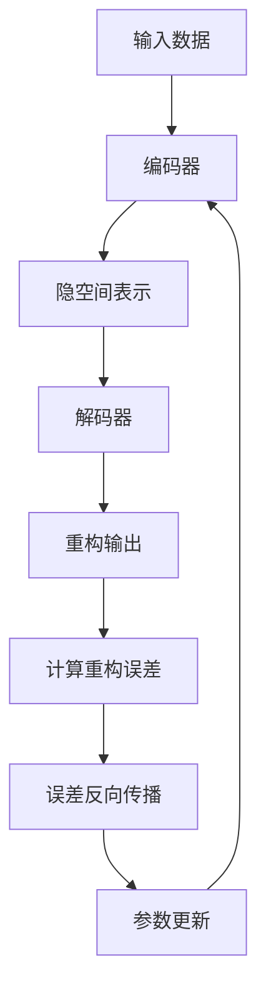

# 自编码器原理与代码实战案例讲解

## 1. 背景介绍

### 1.1 自编码器的定义与发展历程
自编码器(Autoencoder)是一种无监督学习的神经网络模型,其主要目的是学习数据的有效表示。自编码器由Hinton等人在2006年首次提出,经过十多年的发展,已经成为机器学习和深度学习领域的重要模型之一。

### 1.2 自编码器的应用场景
自编码器在实际应用中有着广泛的用途,主要包括:
- 数据降维:通过自编码器可以将高维数据映射到低维空间,实现数据压缩和降维。
- 特征提取:自编码器可以自动学习数据的有效特征表示,用于后续的分类、聚类等任务。  
- 异常检测:通过训练自编码器重构正常数据,当输入异常数据时重构误差会较大,据此可以实现异常检测。
- 图像去噪:利用自编码器可以训练出一个去噪自编码器模型,实现图像降噪功能。

### 1.3 自编码器的优势
与传统的降维方法如PCA相比,自编码器具有以下优势:  
- 非线性:自编码器可以学习数据的非线性结构,更好地刻画复杂数据流形。
- 灵活性:自编码器的网络结构可以灵活设计,适应不同的任务需求。
- 端到端:自编码器可以实现数据特征的端到端学习,无需人工设计特征。

## 2. 核心概念与联系

### 2.1 自编码器的网络结构
自编码器由编码器(Encoder)和解码器(Decoder)两部分组成:
- 编码器:将输入数据 $x$ 映射到隐空间表示 $z$,即 $z=f(x)$  
- 解码器:将隐空间表示 $z$ 重构为输出 $\hat{x}$,即 $\hat{x}=g(z)$

整个网络结构可以表示为: $\hat{x} = g(f(x))$

### 2.2 重构误差与损失函数 
自编码器的训练目标是最小化重构误差,即输入 $x$ 与重构输出 $\hat{x}$ 之间的差异。常用的重构误差度量有:
- 均方误差(MSE): $L(x,\hat{x}) = \frac{1}{n}\sum_{i=1}^n(x^{(i)}-\hat{x}^{(i)})^2$
- 交叉熵误差(Cross Entropy): $L(x,\hat{x}) = -\sum_{i=1}^n [x^{(i)}\log \hat{x}^{(i)} + (1-x^{(i)})\log(1-\hat{x}^{(i)})]$

### 2.3 自编码器的变体
- 欠完备自编码器(Undercomplete Autoencoder):隐藏层维度小于输入维度,起到降维作用。
- 正则化自编码器(Regularized Autoencoder):在损失函数中加入权重衰减项,防止过拟合。
- 降噪自编码器(Denoising Autoencoder):在输入数据中加入噪声,提高鲁棒性。
- 变分自编码器(Variational Autoencoder):引入概率编码器,可生成新样本。

### 2.4 自编码器与其他模型的联系
- 与PCA的联系:线性自编码器可以等价于PCA。
- 与RBM的联系:堆叠自编码器与深度信念网络等价。  
- 与生成对抗网络的联系:VAE和GAN都是生成模型,但原理不同。

## 3. 核心算法原理具体操作步骤

### 3.1 自编码器的前向传播
1. 编码阶段:将输入 $x\in R^d$ 通过编码器映射到隐空间表示 $z\in R^p$:
$$z = f(x) = \sigma(Wx+b)$$
其中 $W\in R^{p\times d}$ 是权重矩阵,$b\in R^p$ 是偏置向量,$\sigma$ 是激活函数,如sigmoid、tanh等。

2. 解码阶段:将隐空间表示 $z$ 通过解码器映射为重构输出 $\hat{x}\in R^d$:  
$$\hat{x} = g(z) = \sigma'(W'z+b')$$
其中 $W'\in R^{d\times p}$ 是权重矩阵,$b'\in R^d$ 是偏置向量,$\sigma'$ 是激活函数。

### 3.2 自编码器的反向传播与参数更新
1. 计算重构误差:
$$L(x,\hat{x}) = \frac{1}{n}\sum_{i=1}^n(x^{(i)}-\hat{x}^{(i)})^2$$

2. 误差反向传播,计算梯度:
$$\frac{\partial L}{\partial W'} = \frac{\partial L}{\partial \hat{x}} \frac{\partial \hat{x}}{\partial W'}, \quad 
\frac{\partial L}{\partial b'} = \frac{\partial L}{\partial \hat{x}} \frac{\partial \hat{x}}{\partial b'} \\
\frac{\partial L}{\partial W} = \frac{\partial L}{\partial \hat{x}} \frac{\partial \hat{x}}{\partial z} \frac{\partial z}{\partial W}, \quad
\frac{\partial L}{\partial b} = \frac{\partial L}{\partial \hat{x}} \frac{\partial \hat{x}}{\partial z} \frac{\partial z}{\partial b}$$

3. 参数更新:
$$W \leftarrow W - \alpha \frac{\partial L}{\partial W}, \quad
b \leftarrow b - \alpha \frac{\partial L}{\partial b} \\  
W' \leftarrow W' - \alpha \frac{\partial L}{\partial W'}, \quad
b' \leftarrow b' - \alpha \frac{\partial L}{\partial b'}$$
其中 $\alpha$ 是学习率。重复以上步骤直到模型收敛。

### 3.3 自编码器算法流程图


## 4. 数学模型和公式详细讲解举例说明

### 4.1 自编码器的数学模型
给定训练集 $D=\{x^{(1)},x^{(2)},...,x^{(n)}\}$,自编码器的数学模型可以表示为:

1. 编码器:
$$z^{(i)} = f(x^{(i)}) = \sigma(Wx^{(i)}+b), \quad i=1,2,...,n$$

2. 解码器:
$$\hat{x}^{(i)} = g(z^{(i)}) = \sigma'(W'z^{(i)}+b'), \quad i=1,2,...,n$$

3. 重构误差:
$$J(W,b,W',b') = \frac{1}{n}\sum_{i=1}^nL(x^{(i)},\hat{x}^{(i)})$$

目标是找到最优参数 $W^*,b^*,W'^*,b'^*$ 使得重构误差最小化:
$$W^*,b^*,W'^*,b'^* = \arg\min_{W,b,W',b'} J(W,b,W',b')$$

### 4.2 自编码器的训练过程举例
以mnist手写数字数据集为例,输入为 $28\times28$ 的灰度图像,隐空间维度为32。

编码器:
$$z = \sigma(Wx+b), \quad W\in R^{32\times 784}, b\in R^{32}$$

解码器:
$$\hat{x} = \sigma(W'z+b'), \quad W'\in R^{784\times 32}, b'\in R^{784}$$

设置均方误差损失函数,学习率为0.01,批量大小为128,训练100个epoch。每个epoch的训练步骤如下:
1. 从训练集中抽取128个样本 $\{x^{(1)},x^{(2)},...,x^{(128)}\}$
2. 前向传播计算重构输出 $\{\hat{x}^{(1)},\hat{x}^{(2)},...,\hat{x}^{(128)}\}$
3. 计算重构误差 $J = \frac{1}{128}\sum_{i=1}^{128}(x^{(i)}-\hat{x}^{(i)})^2$
4. 误差反向传播计算梯度 $\frac{\partial J}{\partial W},\frac{\partial J}{\partial b},\frac{\partial J}{\partial W'},\frac{\partial J}{\partial b'}$
5. 更新参数 $W \leftarrow W - 0.01\frac{\partial J}{\partial W}, b \leftarrow b - 0.01\frac{\partial J}{\partial b}, W' \leftarrow W' - 0.01\frac{\partial J}{\partial W'}, b' \leftarrow b' - 0.01\frac{\partial J}{\partial b'}$

重复以上步骤直到训练完100个epoch,得到训练好的自编码器模型。

## 5. 项目实践：代码实例和详细解释说明

下面给出基于Pytorch实现的自编码器代码示例:

```python
import torch
import torch.nn as nn
import torch.optim as optim
from torchvision import datasets, transforms

# 定义自编码器模型
class Autoencoder(nn.Module):
    def __init__(self):
        super(Autoencoder, self).__init__()
        
        # 编码器
        self.encoder = nn.Sequential(
            nn.Linear(28*28, 128),
            nn.ReLU(),
            nn.Linear(128, 64),
            nn.ReLU(),
            nn.Linear(64, 32),
            nn.ReLU()
        )
        
        # 解码器
        self.decoder = nn.Sequential(
            nn.Linear(32, 64),
            nn.ReLU(),
            nn.Linear(64, 128),
            nn.ReLU(),
            nn.Linear(128, 28*28),
            nn.Sigmoid()
        )

    def forward(self, x):
        # 前向传播
        z = self.encoder(x)
        x_hat = self.decoder(z)
        return x_hat

# 设置超参数    
batch_size = 128
learning_rate = 0.01
num_epochs = 10

# 加载MNIST数据集
train_dataset = datasets.MNIST(root='./data', 
                               train=True, 
                               transform=transforms.ToTensor(),
                               download=True)

test_dataset = datasets.MNIST(root='./data', 
                              train=False, 
                              transform=transforms.ToTensor())

train_loader = torch.utils.data.DataLoader(dataset=train_dataset, 
                                           batch_size=batch_size, 
                                           shuffle=True)

test_loader = torch.utils.data.DataLoader(dataset=test_dataset, 
                                          batch_size=batch_size, 
                                          shuffle=False)
                                          
# 初始化模型
model = Autoencoder()

# 定义损失函数和优化器                                                                                    
criterion = nn.MSELoss()
optimizer = optim.Adam(model.parameters(), lr=learning_rate)

# 训练模型
for epoch in range(num_epochs):
    for i, (images, _) in enumerate(train_loader):
        images = images.reshape(-1, 28*28) 
        
        # 前向传播
        outputs = model(images)
        loss = criterion(outputs, images)
        
        # 反向传播和优化
        optimizer.zero_grad()
        loss.backward()
        optimizer.step()
        
    print('Epoch [{}/{}], Loss: {:.4f}'.format(epoch+1, num_epochs, loss.item()))

# 测试模型
with torch.no_grad():
    for i, (images, _) in enumerate(test_loader):
        images = images.reshape(-1, 28*28)
        outputs = model(images)
        
        # 可视化重构结果
        if i == 0:
            n = min(images.size(0), 8)
            comparison = torch.cat([images[:n],
                                    outputs.view(batch_size, 1, 28, 28)[:n]])
            save_image(comparison.cpu(),
                       'reconstruction_' + str(epoch) + '.png', nrow=n)
```

代码说明:
1. 定义了一个包含编码器和解码器的自编码器模型`Autoencoder`,其中编码器将784维输入压缩到32维隐空间,解码器再将隐空间表示重构为784维输出。
2. 加载MNIST数据集,并定义了数据加载器`train_loader`和`test_loader`。  
3. 初始化自编码器模型,定义均方误差损失函数和Adam优化器。
4. 训练模型,对每个batch的数据进行前向传播,计算重构误差,反向传播更新参数,并打印每个epoch的损失值。
5. 测试模型,对测试集数据进行重构,并可视化重构结果。

以上就是一个完整的自编码器模型训练和测试的Pytorch代码实现。通过该代码示例,读者可以深入理解自编码器的实现细节和训练过程。

## 6. 实际应用场景

自编码器在实际应用中有广泛的用途,下面列举几个典型应用场