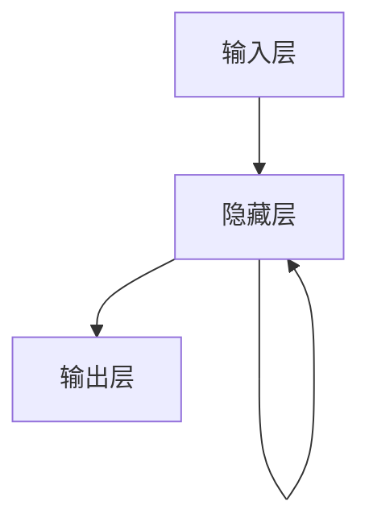

# 递归神经网络 原理与代码实例讲解

## 1.背景介绍

递归神经网络（Recurrent Neural Network，RNN）是一种专门用于处理序列数据的神经网络架构。与传统的前馈神经网络不同，RNN具有循环连接的特性，使其能够捕捉序列中的时间依赖关系。这种特性使得RNN在自然语言处理、时间序列预测、语音识别等领域得到了广泛应用。

## 2.核心概念与联系

### 2.1 序列数据

序列数据是指数据点按照时间或顺序排列的集合。例如，文本、时间序列数据、音频信号等都是序列数据。处理序列数据的关键在于捕捉数据点之间的依赖关系。

### 2.2 递归神经网络的基本结构

RNN的基本结构包括输入层、隐藏层和输出层。与传统神经网络不同的是，RNN的隐藏层不仅接收当前时间步的输入，还接收前一时间步的隐藏状态。这种循环连接使得RNN能够记住之前的信息。



### 2.3 隐藏状态

隐藏状态是RNN的核心概念之一。隐藏状态是一个向量，包含了当前时间步的信息以及之前时间步的信息。隐藏状态通过循环连接在时间步之间传递，使得RNN能够捕捉序列中的时间依赖关系。

## 3.核心算法原理具体操作步骤

### 3.1 前向传播

在RNN中，前向传播的过程如下：

1. 输入序列 $x = (x_1, x_2, ..., x_T)$。
2. 初始化隐藏状态 $h_0$。
3. 对于每个时间步 $t$：
   - 计算当前时间步的隐藏状态 $h_t = f(W_{xh} x_t + W_{hh} h_{t-1} + b_h)$，其中 $W_{xh}$ 和 $W_{hh}$ 是权重矩阵，$b_h$ 是偏置，$f$ 是激活函数。
   - 计算当前时间步的输出 $y_t = g(W_{hy} h_t + b_y)$，其中 $W_{hy}$ 是权重矩阵，$b_y$ 是偏置，$g$ 是激活函数。

### 3.2 反向传播

RNN的反向传播过程称为反向传播通过时间（Backpropagation Through Time，BPTT）。BPTT的基本步骤如下：

1. 计算损失函数 $L$。
2. 对于每个时间步 $t$，计算损失函数对输出的梯度 $\frac{\partial L}{\partial y_t}$。
3. 计算损失函数对隐藏状态的梯度 $\frac{\partial L}{\partial h_t}$。
4. 计算损失函数对权重矩阵和偏置的梯度。

## 4.数学模型和公式详细讲解举例说明

### 4.1 前向传播公式

对于时间步 $t$，前向传播的公式如下：

$$
h_t = \tanh(W_{xh} x_t + W_{hh} h_{t-1} + b_h)
$$

$$
y_t = W_{hy} h_t + b_y
$$

### 4.2 反向传播公式

反向传播通过时间的公式如下：

$$
\frac{\partial L}{\partial W_{hy}} = \sum_{t=1}^T \frac{\partial L}{\partial y_t} \cdot h_t^T
$$

$$
\frac{\partial L}{\partial W_{hh}} = \sum_{t=1}^T \frac{\partial L}{\partial h_t} \cdot h_{t-1}^T
$$

$$
\frac{\partial L}{\partial W_{xh}} = \sum_{t=1}^T \frac{\partial L}{\partial h_t} \cdot x_t^T
$$

## 5.项目实践：代码实例和详细解释说明

### 5.1 数据准备

在本节中，我们将使用Python和TensorFlow/Keras库来实现一个简单的RNN模型。首先，我们需要准备数据。这里我们使用一个简单的时间序列数据集。

```python
import numpy as np

# 生成简单的时间序列数据
def generate_data(seq_length, num_samples):
    X = np.random.rand(num_samples, seq_length, 1)
    y = np.sum(X, axis=1)
    return X, y

seq_length = 10
num_samples = 1000
X, y = generate_data(seq_length, num_samples)
```

### 5.2 模型构建

接下来，我们使用Keras构建一个简单的RNN模型。

```python
from tensorflow.keras.models import Sequential
from tensorflow.keras.layers import SimpleRNN, Dense

model = Sequential()
model.add(SimpleRNN(50, input_shape=(seq_length, 1)))
model.add(Dense(1))

model.compile(optimizer='adam', loss='mse')
model.summary()
```

### 5.3 模型训练

我们将数据分为训练集和测试集，并训练模型。

```python
from sklearn.model_selection import train_test_split

X_train, X_test, y_train, y_test = train_test_split(X, y, test_size=0.2, random_state=42)

model.fit(X_train, y_train, epochs=20, batch_size=32, validation_data=(X_test, y_test))
```

### 5.4 模型评估

最后，我们评估模型的性能。

```python
loss = model.evaluate(X_test, y_test)
print(f'Test Loss: {loss}')
```

## 6.实际应用场景

### 6.1 自然语言处理

RNN在自然语言处理（NLP）中的应用非常广泛。例如，RNN可以用于文本生成、机器翻译、情感分析等任务。在这些任务中，RNN能够捕捉文本中的上下文信息，从而提高模型的性能。

### 6.2 时间序列预测

RNN在时间序列预测中的应用也非常广泛。例如，RNN可以用于股票价格预测、天气预报、销售量预测等任务。在这些任务中，RNN能够捕捉时间序列中的时间依赖关系，从而提高预测的准确性。

### 6.3 语音识别

RNN在语音识别中的应用也非常广泛。例如，RNN可以用于语音到文本的转换、语音情感分析等任务。在这些任务中，RNN能够捕捉语音信号中的时间依赖关系，从而提高识别的准确性。

## 7.工具和资源推荐

### 7.1 开发工具

- **TensorFlow/Keras**：一个流行的深度学习框架，提供了丰富的API来构建和训练RNN模型。
- **PyTorch**：另一个流行的深度学习框架，提供了灵活的API来构建和训练RNN模型。

### 7.2 学习资源

- **《深度学习》**：由Ian Goodfellow等人编写的经典教材，详细介绍了RNN的原理和应用。
- **Coursera上的深度学习课程**：由Andrew Ng教授讲授的深度学习课程，包含了RNN的详细讲解和实践。

## 8.总结：未来发展趋势与挑战

### 8.1 未来发展趋势

随着深度学习技术的不断发展，RNN的应用前景非常广阔。未来，RNN有望在更多领域得到应用，例如医疗诊断、自动驾驶、智能家居等。此外，随着硬件技术的进步，RNN的训练速度和性能也将不断提升。

### 8.2 挑战

尽管RNN在许多领域取得了显著的成果，但仍然面临一些挑战。例如，RNN在处理长序列数据时容易出现梯度消失和梯度爆炸问题。此外，RNN的训练过程较为复杂，训练时间较长。为了解决这些问题，研究人员提出了长短期记忆网络（LSTM）和门控循环单元（GRU）等改进模型。

## 9.附录：常见问题与解答

### 9.1 什么是梯度消失和梯度爆炸问题？

梯度消失和梯度爆炸是RNN在训练过程中常见的问题。梯度消失是指在反向传播过程中，梯度逐渐变小，导致模型无法更新参数。梯度爆炸是指在反向传播过程中，梯度逐渐变大，导致模型参数更新过大。解决这些问题的方法包括使用LSTM和GRU等改进模型，以及使用梯度裁剪等技术。

### 9.2 如何选择RNN的超参数？

选择RNN的超参数是一个复杂的过程。常见的超参数包括隐藏层的数量、隐藏单元的数量、学习率、批量大小等。选择超参数的方法包括网格搜索、随机搜索和贝叶斯优化等。

### 9.3 RNN和LSTM、GRU有什么区别？

RNN、LSTM和GRU都是处理序列数据的神经网络模型。RNN是最基本的模型，具有循环连接的特性。LSTM和GRU是RNN的改进模型，能够更好地解决梯度消失和梯度爆炸问题。LSTM通过引入记忆单元和门控机制来捕捉长时间依赖关系，而GRU则是LSTM的简化版本，具有更少的参数。

---

作者：禅与计算机程序设计艺术 / Zen and the Art of Computer Programming