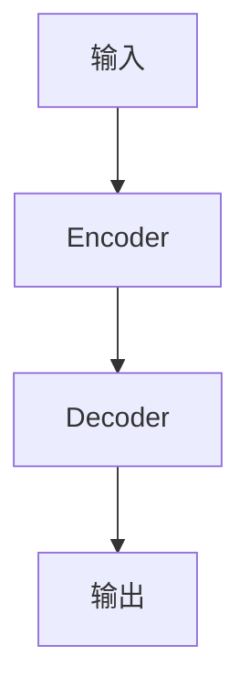

# AI Agent: AI的下一个风口 大模型时代狂飙猛进

## 1. 背景介绍

### 1.1 人工智能的发展历程

人工智能(Artificial Intelligence, AI)是当代科技领域最具革命性和颠覆性的技术之一。自20世纪50年代AI概念被正式提出以来,它已经经历了几个重要的发展阶段。

- **早期阶段(1950s-1960s)**: 这一时期主要集中在知识表示、推理、博弈等基础研究领域,诞生了逻辑推理、专家系统等早期AI技术。

- **知识陷阱时期(1970s-1980s)**: 由于计算能力和数据量的限制,AI研究进入了一个相对低迷的时期,被称为"AI冬天"。

- **统计学习时期(1990s-2000s)**: 随着机器学习、神经网络等统计学习方法的兴起,AI研究重新焕发了生机,取得了诸多突破性进展。

- **深度学习时代(2010s至今)**: 在大数据和强大算力的支持下,深度学习技术异军突起,推动AI在计算机视觉、自然语言处理等领域取得了令人瞩目的成就。

### 1.2 大模型时代的到来

近年来,AI领域出现了一种新型的技术范式——大模型(Large Model)。大模型指的是具有数十亿甚至上万亿参数的巨型神经网络模型,通过在海量数据上进行预训练,获得了强大的泛化能力。

大模型的崛起主要源于以下几个关键因素:

1. **计算能力的飞速提升**: benefited from GPU和TPU等专用硬件的发展,训练大规模神经网络模型成为可能。

2. **数据量的爆炸式增长**: 互联网时代海量的文本、图像、视频等数据为大模型训练提供了重要资源。

3. **算法创新**: Transformer等新型神经网络架构的提出,使得训练大规模模型变得更加高效。

4. **预训练范式的普及**: 通过自监督学习等预训练方式,可以在大量未标注数据上训练通用模型,降低了数据标注成本。

大模型凭借其强大的泛化能力,在自然语言处理、计算机视觉、多模态等多个领域展现出了卓越的性能表现,成为AI发展的一个重要引擎。

## 2. 核心概念与联系

### 2.1 大模型的核心思想

大模型的核心思想是通过在海量数据上进行预训练,学习通用的表示能力,从而获得强大的泛化性能。这种思路与传统的监督学习方法形成了鲜明对比。

传统的监督学习方法通常需要大量的人工标注数据,并针对特定任务进行训练,存在数据标注成本高、泛化能力差的问题。而大模型则是先在大量未标注数据上进行自监督预训练,学习通用的表示能力,再通过微调(fine-tuning)等方式迁移到下游任务。

这种预训练+微调的范式,使得大模型能够有效利用海量的未标注数据,降低了数据标注成本;同时,通过预训练学习到的通用表示能力,也赋予了大模型强大的泛化性能。

### 2.2 大模型的核心架构

大模型通常采用基于Transformer的编码器-解码器(Encoder-Decoder)架构,如下图所示:

其中,Encoder用于将输入序列(如文本、图像等)编码为高维向量表示;Decoder则根据Encoder的输出,生成目标序列(如机器翻译、图像描述等)。

Transformer架构的关键创新在于引入了Self-Attention机制,能够有效捕捉输入序列中长距离的依赖关系,从而提高了模型的表示能力。

除了标准的Transformer架构外,一些新型大模型还引入了诸如反馈机制(Feedback)、层次结构(Hierarchy)等创新设计,进一步提升了模型的性能和效率。

### 2.3 大模型的训练策略

训练大规模神经网络模型面临着诸多挑战,需要采取一些特殊的训练策略:

1. **预训练(Pre-training)**: 通过自监督学习等方式,在大量未标注数据上进行预训练,学习通用的表示能力。

2. **微调(Fine-tuning)**: 在完成预训练后,通过在标注数据上进行微调,将模型迁移到特定的下游任务。

3. **模型压缩(Model Compression)**: 由于大模型参数量巨大,需要采用量化、蒸馏、剪枝等技术对模型进行压缩,以降低推理时的计算和存储开销。

4. **分布式训练(Distributed Training)**: 利用多机并行训练的方式,加速大规模模型的训练过程。

5. **自回归生成(Autoregressive Generation)**: 对于生成类任务,通常采用自回归(Autoregressive)的方式逐步生成输出序列。

通过上述策略的综合运用,大模型得以在合理的时间和计算资源下高效训练和部署。

## 3. 核心算法原理具体操作步骤

### 3.1 Transformer模型

Transformer是大模型中最核心和最广泛采用的神经网络架构,我们先来详细介绍其工作原理。

Transformer由编码器(Encoder)和解码器(Decoder)两个子模块组成。编码器的主要作用是将输入序列(如文本)映射为一系列向量表示;解码器则根据编码器的输出,生成目标序列(如翻译结果)。

#### 3.1.1 Encoder

Encoder由多个相同的层组成,每一层包括两个核心子层:

1. **Multi-Head Attention层**

   Attention机制是Transformer的核心创新,它能够自动捕捉输入序列中任意两个单词之间的依赖关系,避免了RNN中的长程依赖问题。

   Multi-Head Attention将注意力分成多个"头部"(Head),每个头部关注输入序列的不同子空间表示,最后将所有头部的结果拼接起来,捕捉更丰富的依赖信息。

   具体计算过程如下:

   $$\begin{aligned}
   \text{MultiHead}(Q, K, V) &= \text{Concat}(\text{head}_1, \ldots, \text{head}_h)W^O\\
   \text{where\ head}_i &= \text{Attention}(QW_i^Q, KW_i^K, VW_i^V)
   \end{aligned}$$

   其中 $Q$、$K$、$V$ 分别表示查询(Query)、键(Key)和值(Value)向量。

2. **前馈全连接层(Feed-Forward)**

   前馈全连接层对每个位置的向量进行独立的非线性变换,增强了表示能力:

   $$\text{FFN}(x)=\max(0,xW_1+b_1)W_2+b_2$$

   其中使用了ReLU激活函数和两个线性变换。

在Encoder的每一层中,先后经过上述两个子层的变换,并加入了残差连接(Residual Connection)和层归一化(Layer Normalization),以保持梯度稳定性。

#### 3.1.2 Decoder

Decoder的结构与Encoder类似,也由多个相同的层组成,每一层包括三个子层:

1. **Masked Multi-Head Attention层**: 与Encoder中的Attention类似,但在自注意力计算时,对未来位置的单词做了遮掩(Mask),确保每个位置的单词只能看到它前面的单词,以保证自回归(Autoregressive)属性。

2. **Encoder-Decoder Attention层**: 对编码器的输出序列进行Attention操作,捕捉输入和输出序列之间的依赖关系。

3. **前馈全连接层(Feed-Forward)**: 与Encoder中的子层相同。

通过上述层次的变换,Decoder能够基于输入序列的编码表示,生成目标序列。

整个Transformer模型的训练过程,是最小化输入序列和目标序列之间的交叉熵损失函数。对于不同的任务,如机器翻译、文本生成等,只需将对应的输入和输出序列输入到Transformer中即可。

### 3.2 GPT模型

GPT(Generative Pre-trained Transformer)是一种基于Transformer解码器的大型语言模型,主要用于生成式任务,如文本生成、对话系统等。

GPT模型的核心思想是:先在大量文本语料上进行自监督预训练,学习通用的语言表示能力;然后再将预训练模型转移到下游任务,通过少量的微调(Fine-tuning)即可获得良好的性能。

#### 3.2.1 预训练阶段

在预训练阶段,GPT采用了自回归语言模型(Autoregressive Language Model)的训练目标:给定一个文本序列的前缀,模型需要预测下一个单词的概率分布。

具体来说,对于一个长度为 $n$ 的文本序列 $\boldsymbol{x}=(x_1, x_2, \ldots, x_n)$,训练目标是最大化下式的对数似然:

$$\log P(\boldsymbol{x}) = \sum_{t=1}^n \log P(x_t | x_{<t}; \theta)$$

其中 $\theta$ 表示模型参数, $x_{<t}$ 表示序列前缀 $(x_1, x_2, \ldots, x_{t-1})$。

通过在海量语料上最小化上述目标函数,GPT能够学习到通用的语言表示能力。

#### 3.2.2 微调阶段

在完成预训练后,GPT可以通过在特定任务的标注数据上进行微调,将模型迁移到下游任务。

以文本生成任务为例,给定一个起始文本 $x_1, \ldots, x_t$,GPT需要生成下文 $x_{t+1}, x_{t+2}, \ldots$。这可以通过以下自回归(Autoregressive)方式实现:

1. 将起始文本输入GPT,获取第 $t$ 个位置的输出向量表示 $\boldsymbol{h}_t$。
2. 通过线性层和Softmax,从 $\boldsymbol{h}_t$ 预测下一个单词 $x_{t+1}$ 的概率分布:
   $$P(x_{t+1}|\boldsymbol{x}_{<t+1}) = \text{Softmax}(W\boldsymbol{h}_t + \boldsymbol{b})$$
3. 将 $x_{t+1}$ 附加到输入序列,重复上述过程生成 $x_{t+2}$, $x_{t+3}$ 等。

通过上述方式,GPT可以逐个生成文本序列,实现文本生成等任务。在微调阶段,主要是对模型的输出层(如线性层的权重矩阵 $W$)进行调整,使其适应特定任务。

GPT的后续版本,如GPT-2、GPT-3等,通过使用更大的模型和数据集,进一步提升了性能表现。

## 4. 数学模型和公式详细讲解举例说明

### 4.1 Transformer中的Attention机制

Attention是Transformer的核心创新,它能够自动捕捉输入序列中任意两个单词之间的依赖关系。我们来详细解释一下Attention机制的数学原理。

给定一个查询向量 $\boldsymbol{q}$ 和一组键向量 $\boldsymbol{K}=(\boldsymbol{k}_1, \boldsymbol{k}_2, \ldots, \boldsymbol{k}_n)$,以及对应的值向量 $\boldsymbol{V}=(\boldsymbol{v}_1, \boldsymbol{v}_2, \ldots, \boldsymbol{v}_n)$,Attention的计算过程如下:

1. 计算查询向量 $\boldsymbol{q}$ 与每个键向量 $\boldsymbol{k}_i$ 的相似度得分:

   $$s_i = \boldsymbol{q}^\top \boldsymbol{k}_i$$

2. 通过Softmax函数将相似度得分归一化为注意力权重:

   $$\alpha_i = \frac{\exp(s_i)}{\sum_{j=1}^n \exp(s_j)}$$

3. 将注意力权重与值向量 $\boldsymbol{V}$ 加权求和,得到最终的注意力输出:

   $$\text{Attention}(\boldsymbol{q}, \boldsymbol{K}, \boldsymbol{V}) = \sum_{i=1}^n \alpha_i \boldsymbol{v}_i$$

上述过程可以看作是根据查询向量 $\boldsymbol{q}$ 动态地从值向量 $\bol