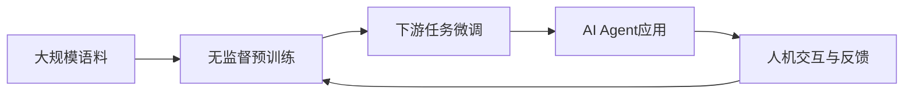

# AI Agent: AI的下一个风口 大模型时代狂飙猛进

## 1. 背景介绍
### 1.1 人工智能的发展历程
#### 1.1.1 人工智能的起源与定义
#### 1.1.2 人工智能的三次浪潮
#### 1.1.3 当前人工智能的发展现状

### 1.2 大模型的崛起
#### 1.2.1 大模型的定义与特点  
#### 1.2.2 大模型的发展历程
#### 1.2.3 大模型的代表性成果

### 1.3 AI Agent的兴起
#### 1.3.1 AI Agent的定义与内涵
#### 1.3.2 AI Agent的发展现状
#### 1.3.3 AI Agent的应用前景

## 2. 核心概念与联系
### 2.1 大模型
#### 2.1.1 大模型的核心理念
#### 2.1.2 大模型的关键技术
#### 2.1.3 大模型的优势与局限

### 2.2 AI Agent
#### 2.2.1 AI Agent的核心功能
#### 2.2.2 AI Agent的技术架构  
#### 2.2.3 AI Agent的交互方式

### 2.3 大模型与AI Agent的关系
#### 2.3.1 大模型是AI Agent的基础
#### 2.3.2 AI Agent是大模型的应用延伸
#### 2.3.3 二者协同发展的必然趋势

## 3. 核心算法原理具体操作步骤
### 3.1 Transformer架构
#### 3.1.1 Transformer的网络结构
#### 3.1.2 Self-Attention机制
#### 3.1.3 位置编码

### 3.2 预训练与微调
#### 3.2.1 无监督预训练
#### 3.2.2 有监督微调
#### 3.2.3 Prompt工程

### 3.3 知识蒸馏与模型压缩
#### 3.3.1 知识蒸馏的原理 
#### 3.3.2 模型剪枝与量化
#### 3.3.3 模型部署优化

## 4. 数学模型和公式详细讲解举例说明
### 4.1 Transformer的数学表示
#### 4.1.1 输入嵌入
$X = [x_1, x_2, ..., x_n]$
#### 4.1.2 自注意力计算
$Attention(Q,K,V) = softmax(\frac{QK^T}{\sqrt{d_k}})V$
#### 4.1.3 前馈神经网络
$FFN(x) = max(0, xW_1 + b_1)W_2 + b_2$

### 4.2 预训练目标函数
#### 4.2.1 掩码语言模型(MLM)
$\mathcal{L}_{MLM} = -\sum_{i\in \mathcal{C}}\log p(x_i|x_{\backslash \mathcal{C}})$
#### 4.2.2 下一句预测(NSP)  
$\mathcal{L}_{NSP} = -\log p(y|x_1,x_2)$
#### 4.2.3 对比学习
$\mathcal{L}_{CL} = -\log \frac{e^{f(x)^Tf(x^+)}}{e^{f(x)^Tf(x^+)} + \sum_{x^-}e^{f(x)^Tf(x^-)}}$

### 4.3 知识蒸馏的损失函数
#### 4.3.1 软标签蒸馏
$\mathcal{L}_{KD} = \sum_i t_i^2 \cdot \log(\frac{t_i}{s_i})$
#### 4.3.2 注意力蒸馏
$\mathcal{L}_{Attn} = \sum_l\sum_i\sum_j (A_S^{(l)}[i,j] - A_T^{(l)}[i,j])^2$
#### 4.3.3 互信息蒸馏
$I(T;S) = \sum_{t\in T}\sum_{s\in S}p(s,t)\log\frac{p(s,t)}{p(s)p(t)}$

## 5. 项目实践：代码实例和详细解释说明
### 5.1 使用Hugging Face的Transformers库
#### 5.1.1 加载预训练模型
```python
from transformers import AutoModelForCausalLM, AutoTokenizer

model_name = "gpt2-large" 
tokenizer = AutoTokenizer.from_pretrained(model_name)
model = AutoModelForCausalLM.from_pretrained(model_name)
```
#### 5.1.2 模型推理
```python
input_text = "Hello, how are you?"
input_ids = tokenizer.encode(input_text, return_tensors='pt')

output = model.generate(input_ids, 
                        max_length=100, 
                        num_return_sequences=1,
                        no_repeat_ngram_size=2,
                        early_stopping=True)

print(tokenizer.decode(output[0], skip_special_tokens=True))
```

### 5.2 使用PyTorch构建Transformer
#### 5.2.1 定义Transformer模块
```python
import torch
import torch.nn as nn

class TransformerBlock(nn.Module):
    def __init__(self, embed_dim, num_heads, ff_dim):
        super().__init__()
        
        self.attn = nn.MultiheadAttention(embed_dim, num_heads)
        self.ff = nn.Sequential(
            nn.Linear(embed_dim, ff_dim),
            nn.ReLU(),
            nn.Linear(ff_dim, embed_dim)
        )
        self.norm1 = nn.LayerNorm(embed_dim)
        self.norm2 = nn.LayerNorm(embed_dim)
        
    def forward(self, x):
        attn_output = self.attn(x, x, x)[0]
        x = self.norm1(x + attn_output)
        ff_output = self.ff(x)
        x = self.norm2(x + ff_output)
        return x
```

#### 5.2.2 搭建完整的Transformer模型
```python
class Transformer(nn.Module):
    def __init__(self, num_tokens, embed_dim, num_heads, ff_dim, num_layers):
        super().__init__()
        
        self.embedding = nn.Embedding(num_tokens, embed_dim)
        self.layers = nn.ModuleList([
            TransformerBlock(embed_dim, num_heads, ff_dim)
            for _ in range(num_layers)
        ])
        
    def forward(self, x):
        x = self.embedding(x)
        for layer in self.layers:
            x = layer(x)
        return x
```

### 5.3 使用TensorFlow实现BERT预训练
#### 5.3.1 构建输入管道
```python
import tensorflow as tf

def create_dataset(sentences, tokenizer, max_len, batch_size):
    input_ids = []
    attention_masks = []
    
    for sentence in sentences:
        encoded_dict = tokenizer.encode_plus(
                            sentence,
                            add_special_tokens=True,
                            max_length=max_len,
                            pad_to_max_length=True,
                            return_attention_mask=True,
                            return_tensors='tf')
        input_ids.append(encoded_dict['input_ids'])
        attention_masks.append(encoded_dict['attention_mask'])
    
    input_ids = tf.concat(input_ids, axis=0)
    attention_masks = tf.concat(attention_masks, axis=0)
    
    dataset = tf.data.Dataset.from_tensor_slices((input_ids, attention_masks))
    dataset = dataset.batch(batch_size)
    
    return dataset
```

#### 5.3.2 定义MLM和NSP任务
```python
def masked_language_model(features, vocab_size):
    input_ids, _ = features
    input_ids_masked, labels = mask_tokens(input_ids)
    
    bert_output = bert_model(input_ids_masked)
    prediction_scores = tf.keras.layers.Dense(vocab_size)(bert_output)
    
    masked_lm_loss = tf.keras.losses.SparseCategoricalCrossentropy(
        from_logits=True, reduction=tf.keras.losses.Reduction.NONE)(labels, prediction_scores)
    masked_lm_loss = tf.reduce_mean(masked_lm_loss)
    
    return masked_lm_loss

def next_sentence_prediction(features):
    input_ids_a, input_ids_b, labels = features
    
    bert_output_a = bert_model(input_ids_a)
    bert_output_b = bert_model(input_ids_b)
    
    cls_token_a = bert_output_a[:, 0, :]
    cls_token_b = bert_output_b[:, 0, :]
    
    nsp_scores = tf.keras.layers.Dense(2)(tf.concat([cls_token_a, cls_token_b], axis=-1))
    
    nsp_loss = tf.keras.losses.SparseCategoricalCrossentropy(
        from_logits=True, reduction=tf.keras.losses.Reduction.NONE)(labels, nsp_scores)
    nsp_loss = tf.reduce_mean(nsp_loss)
    
    return nsp_loss
```

#### 5.3.3 组合MLM和NSP损失进行联合训练
```python
def train_step(features):
    with tf.GradientTape() as tape:
        mlm_loss = masked_language_model(features['mlm'], vocab_size)
        nsp_loss = next_sentence_prediction(features['nsp'])
        total_loss = mlm_loss + nsp_loss
        
    gradients = tape.gradient(total_loss, bert_model.trainable_variables)
    optimizer.apply_gradients(zip(gradients, bert_model.trainable_variables))
    
    return total_loss

num_epochs = 10
for epoch in range(num_epochs):
    for batch in dataset:
        total_loss = train_step(batch)
```

## 6. 实际应用场景
### 6.1 智能客服
#### 6.1.1 客户意图识别与分类
#### 6.1.2 问答系统与知识库构建
#### 6.1.3 多轮对话与上下文理解

### 6.2 个性化推荐
#### 6.2.1 用户画像与兴趣建模
#### 6.2.2 协同过滤与深度学习推荐
#### 6.2.3 推荐解释与反馈机制

### 6.3 智能写作
#### 6.3.1 文本生成与续写
#### 6.3.2 风格迁移与创意写作
#### 6.3.3 文章总结与关键信息提取

### 6.4 智能搜索
#### 6.4.1 查询理解与语义匹配
#### 6.4.2 搜索排序与相关性计算
#### 6.4.3 个性化搜索与用户意图预测

## 7. 工具和资源推荐
### 7.1 开源框架
#### 7.1.1 TensorFlow与Keras
#### 7.1.2 PyTorch与FastAI 
#### 7.1.3 Hugging Face Transformers

### 7.2 预训练模型
#### 7.2.1 BERT系列
#### 7.2.2 GPT系列
#### 7.2.3 T5与BART

### 7.3 数据集
#### 7.3.1 维基百科与Common Crawl
#### 7.3.2 BookCorpus与OpenWebText
#### 7.3.3 MS MARCO与SQuAD

### 7.4 开发工具
#### 7.4.1 Jupyter Notebook与Google Colab
#### 7.4.2 Weights & Biases
#### 7.4.3 TensorBoard与MLflow

## 8. 总结：未来发展趋势与挑战
### 8.1 模型规模与计算力的增长
#### 8.1.1 更大的参数量与数据规模
#### 8.1.2 新型硬件与分布式训练
#### 8.1.3 模型并行与流水线并行

### 8.2 多模态学习与跨领域迁移
#### 8.2.1 视觉-语言预训练模型
#### 8.2.2 语音-文本预训练模型
#### 8.2.3 知识图谱与常识推理

### 8.3 人机协作与反馈学习
#### 8.3.1 主动学习与交互式训练
#### 8.3.2 小样本学习与持续学习
#### 8.3.3 人性化交互与情感计算

### 8.4 安全与伦理的考量
#### 8.4.1 隐私保护与数据安全
#### 8.4.2 公平性与去偏见
#### 8.4.3 可解释性与可控性

## 9. 附录：常见问题与解答
### 9.1 如何选择合适的预训练模型？
### 9.2 如何高效地微调预训练模型？
### 9.3 如何处理训练过程中的过拟合问题？
### 9.4 如何平衡模型性能与推理速度？
### 9.5 如何设计有效的人机交互界面？



人工智能领域正处于快速发展的阶段，大模型和AI Agent的结合为未来智能系统的构建提供了无限可能。通过不断扩大模型规模、丰富学习范式、优化人机协作，我们有望实现更加通用、高效、安全的人工智能，为人类社会的发展带来深远影响。同时，我们也要审慎地考虑AI系统可能带来的风险与挑战，在技术创新的同时兼顾伦理道德，确保人工智能沿着正确的方向发展。让我们携手共进，