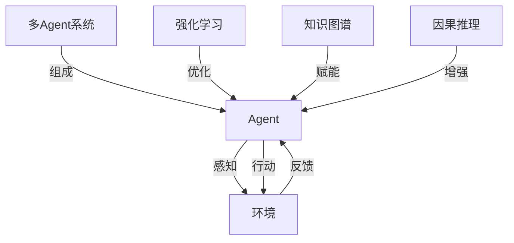

# AI Agent: AI的下一个风口 当前的研究难点与挑战

## 1. 背景介绍
### 1.1 人工智能的发展历程
#### 1.1.1 早期人工智能
#### 1.1.2 专家系统时代 
#### 1.1.3 机器学习与深度学习的崛起

### 1.2 AI Agent的定义与内涵
#### 1.2.1 AI Agent的概念
AI Agent,也称智能代理或智能体,是一种能够感知环境并根据环境做出自主决策和行动的人工智能系统。它集成了感知、推理、决策、学习等多种人工智能能力,能够代替人类执行特定任务。
#### 1.2.2 AI Agent的特点
AI Agent具有自主性、社会性、反应性、主动性等特点。它能够根据环境的变化自主地调整行为,与人类或其他Agent进行交互,对环境做出实时反应,并主动地完成目标。
#### 1.2.3 AI Agent的应用前景
AI Agent有望在智能客服、自动驾驶、工业控制、智慧城市等领域得到广泛应用,极大提升生产效率和生活品质。它代表了人工智能从感知智能向认知智能、从专用智能向通用智能跃迁的重要方向。

### 1.3 AI Agent研究的意义
#### 1.3.1 推动人工智能理论突破
#### 1.3.2 催生智能经济新业态
#### 1.3.3 应对社会老龄化挑战

## 2. 核心概念与联系
### 2.1 Agent
Agent是一个可以感知环境并作出行动的实体。它具有一定的自主性,能够根据自身的感知、知识和目标来决定下一步的行动。
### 2.2 多Agent系统
多Agent系统由多个Agent组成,通过Agent之间的交互与协作来解决复杂问题。每个Agent负责完成系统中的部分任务,通过分工协作最终实现整个系统的功能。
### 2.3 强化学习
强化学习是一种重要的机器学习范式。Agent通过与环境的交互,根据环境反馈的奖励或惩罚来不断优化自己的决策,最终学会执行特定任务的最优策略。
### 2.4 知识图谱
知识图谱以结构化的方式表示客观世界中的实体、概念及其关联。它为Agent提供了全面的背景知识,增强了Agent对环境的理解和推理能力。
### 2.5 因果推理
因果推理是揭示事物因果关系、解释现象成因的重要方法。通过因果推理,Agent能够在有限的信息下对环境做出合理预测,规避风险,把握机遇。



## 3. 核心算法原理具体操作步骤
### 3.1 Q-Learning
#### 3.1.1 Q值函数
#### 3.1.2 Q-Learning的更新公式
#### 3.1.3 ε-greedy策略

### 3.2 深度强化学习
#### 3.2.1 DQN
#### 3.2.2 DDPG
#### 3.2.3 PPO

### 3.3 多Agent强化学习
#### 3.3.1 Independent Q-Learning
#### 3.3.2 Joint Action Learning 
#### 3.3.3 Decentralized POMDP

## 4. 数学模型和公式详细讲解举例说明
### 4.1 马尔可夫决策过程
马尔可夫决策过程(Markov Decision Process, MDP)是表示强化学习问题的经典数学模型。一个MDP由状态集合$S$、动作集合$A$、转移概率$P$、奖励函数$R$和折扣因子$\gamma$组成。Agent与环境交互的过程可以用MDP来建模:

$$
\begin{aligned}
&S: \text{一个状态集合,表示Agent所处的环境状态}\\
&A: \text{一个动作集合,表示Agent可以采取的动作}\\
&P: S \times A \times S \to [0,1] \text{状态转移概率}\\
&R: S \times A \times S \to \mathbb{R} \text{奖励函数}\\
&\gamma: \text{折扣因子,表示对未来奖励的衰减}
\end{aligned}
$$

在时刻$t$,Agent处于状态$s_t \in S$,采取动作$a_t \in A$,环境根据概率$P(s_{t+1}|s_t, a_t)$转移到下一个状态$s_{t+1}$,同时Agent获得奖励$r_t = R(s_t, a_t, s_{t+1})$。Agent的目标是找到一个最优策略$\pi^*: S \to A$,使得期望累积奖励最大化:

$$\pi^* = \arg\max_{\pi} \mathbb{E}[\sum_{t=0}^{\infty} \gamma^t r_t | \pi]$$

### 4.2 Q-Learning
Q-Learning是一种无模型(model-free)的异策略(off-policy)时序差分学习算法。它通过不断更新状态-动作值函数$Q(s,a)$来逼近最优策略。$Q(s,a)$表示在状态$s$下采取动作$a$可以获得的期望累积奖励:

$$Q(s,a) = \mathbb{E}[\sum_{t=0}^{\infty} \gamma^t r_t | s_0=s, a_0=a, \pi]$$

Q-Learning的更新公式为:

$$Q(s_t,a_t) \leftarrow Q(s_t,a_t) + \alpha[r_t + \gamma \max_a Q(s_{t+1},a) - Q(s_t,a_t)]$$

其中$\alpha$是学习率。Q-Learning的一个重要特点是使用$\max_a Q(s_{t+1},a)$来近似下一状态的最优值,这使得它能够脱离当前策略进行学习,收敛到最优策略。

## 5. 项目实践：代码实例和详细解释说明
下面我们用Python实现一个简单的Q-Learning算法,并应用于经典的网格世界环境。

```python
import numpy as np

class QLearning:
    def __init__(self, n_states, n_actions, epsilon=0.1, alpha=0.1, gamma=0.9):
        self.n_states = n_states
        self.n_actions = n_actions
        self.epsilon = epsilon
        self.alpha = alpha
        self.gamma = gamma
        self.Q = np.zeros((n_states, n_actions))

    def choose_action(self, state):
        if np.random.uniform() < self.epsilon:
            action = np.random.choice(self.n_actions)
        else:
            action = np.argmax(self.Q[state])
        return action

    def update(self, state, action, reward, next_state):
        target = reward + self.gamma * np.max(self.Q[next_state])
        self.Q[state][action] += self.alpha * (target - self.Q[state][action])

# 创建网格世界环境
env = GridWorld(5, 5)

# 创建Q-Learning Agent
agent = QLearning(env.n_states, env.n_actions)

# 训练1000轮
for episode in range(1000):
    state = env.reset()
    done = False
    while not done:
        action = agent.choose_action(state)
        next_state, reward, done = env.step(action)
        agent.update(state, action, reward, next_state)
        state = next_state
```

代码解释:
1. 首先定义了一个`QLearning`类,包含Q值表`Q`以及epsilon-greedy探索策略。
2. `choose_action`方法根据epsilon-greedy策略选择动作,以epsilon的概率随机探索,否则选择Q值最大的动作。
3. `update`方法根据Q-Learning的更新公式更新Q值表。
4. 创建一个网格世界环境`env`,它封装了状态空间、动作空间以及状态转移函数等信息。
5. 创建一个`QLearning` Agent,输入状态数和动作数。
6. 循环训练1000轮,每轮从初始状态开始,根据Agent选择的动作与环境交互,并更新Q值,直到达到终止状态。

通过不断的试错和学习,Agent最终能够找到一条从起点到终点的最优路径。

## 6. 实际应用场景
### 6.1 智能客服
AI Agent可以作为智能客服,通过自然语言交互为用户提供咨询、问题解答、业务办理等服务。它能够理解用户意图,检索知识库,生成恰当的回复,大幅提升客服效率和用户体验。
### 6.2 自动驾驶
自动驾驶汽车可以看作一种AI Agent,它通过传感器感知道路环境,通过决策系统控制车辆行驶。自动驾驶Agent需要在复杂多变的真实交通环境中做出实时决策,保障行车安全和效率。
### 6.3 智能制造
在工业制造领域,AI Agent可以应用于设备控制、生产调度、质量检测等环节。例如,一台加工中心可以看作一个Agent,根据产品设计参数和工件状态,自主地生成和优化加工路径,并控制机床完成加工任务。
### 6.4 智慧城市
在智慧城市场景下,各类公共基础设施、楼宇、车辆都可以部署AI Agent,通过数据感知和智能调控,提升城市管理和服务水平。例如,智能交通信号灯Agent可以根据道路车流量实时调节信号配时,缓解交通拥堵。

## 7. 工具和资源推荐
### 7.1 开发框架
- [OpenAI Gym](https://gym.openai.com/): 强化学习环境模拟库
- [TensorFlow](https://www.tensorflow.org/): 端到端的机器学习平台
- [PyTorch](https://pytorch.org/): 基于Python的深度学习框架
- [PaddlePaddle](https://www.paddlepaddle.org.cn/): 百度开源的深度学习平台
### 7.2 学习资源
- [《Reinforcement Learning: An Introduction》](http://incompleteideas.net/book/the-book-2nd.html): 强化学习经典教材
- [《Multi-Agent Machine Learning: A Reinforcement Approach》](https://onlinelibrary.wiley.com/doi/book/10.1002/9781118884614): 多Agent强化学习专著
- [David Silver强化学习公开课](https://www.davidsilver.uk/teaching/): DeepMind科学家David Silver的强化学习课程
- [蒸汽平台AI课程](https://edu.steamcn.com/): 包含多门人工智能前沿课程
### 7.3 竞赛平台
- [Kaggle](https://www.kaggle.com/): 全球最大的数据科学竞赛平台
- [FlyAI](https://www.flyai.com/): 人工智能专业竞赛平台
- [Botzone](https://botzone.org.cn/): 人工智能游戏对战平台

## 8. 总结：未来发展趋势与挑战
### 8.1 AI Agent的研究方向
#### 8.1.1 多智能体协作与博弈
#### 8.1.2 人机混合增强智能
#### 8.1.3 Agent的可解释性与安全性
### 8.2 技术挑战
#### 8.2.1 大规模多Agent系统的分布式学习
#### 8.2.2 复杂环境下Agent的泛化与迁移能力
#### 8.2.3 Agent行为的可解释性与可控性
### 8.3 发展趋势展望
#### 8.3.1 自适应智能Agent将无处不在
#### 8.3.2 群体协同涌现出更高层次的智能
#### 8.3.3 人机协同开创智能社会新图景

AI Agent作为人工智能的前沿方向,代表了未来智能系统的发展趋势。从单个Agent到多Agent协同,从感知交互到认知决策,从专用智能到通用智能,AI Agent正在不断突破技术瓶颈,拓展应用边界。同时,我们也需要正视其在安全性、可解释性等方面的挑战,确保这一变革性技术造福人类。可以预见,AI Agent将与人类形成更加紧密的共生关系,在智慧城市、智能制造、数字经济等领域创造出令人难以想象的价值。

## 9. 附录：常见问题与解答
### 9.1 AI Agent与传统软件系统有何区别?
传统软件系统通常是基于规则的,根据预先设定的流程和算法运行。而AI Agent具有自主学习和决策的能力,可以根据环境反馈动态地优化行为策略,适应复杂多变的应用场景。
### 9.2 如何解决AI Agent的安全性问题?
AI Agent的安全性问题主要