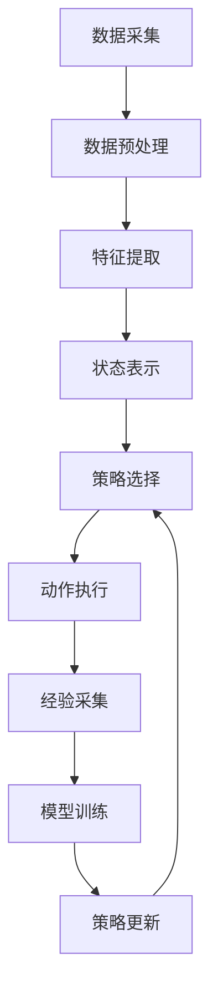

# AI Agent: AI的下一个风口 自然语言带来交互革命

## 1.背景介绍

在过去的几十年里，人工智能（AI）技术取得了飞速的发展。从早期的规则系统到如今的深度学习，AI已经在多个领域展现了其强大的能力。特别是自然语言处理（NLP）的进步，使得AI能够理解和生成人类语言，从而实现更自然的交互方式。AI Agent，作为一种能够自主执行任务的智能体，正逐渐成为AI领域的下一个风口。本文将深入探讨AI Agent的核心概念、算法原理、数学模型、实际应用以及未来发展趋势。

## 2.核心概念与联系

### 2.1 AI Agent的定义

AI Agent是一种能够自主感知环境、决策并执行任务的智能体。它通常具备以下几个特性：

- **自主性**：能够独立完成任务，无需人工干预。
- **适应性**：能够根据环境变化调整自身行为。
- **交互性**：能够与人类或其他智能体进行交互。

### 2.2 自然语言处理的角色

自然语言处理（NLP）是AI Agent实现自然交互的关键技术。通过NLP，AI Agent能够理解人类语言的语义和语法，从而进行有效的沟通和任务执行。

### 2.3 相关技术

AI Agent的实现涉及多种技术，包括但不限于：

- **机器学习**：用于训练模型，使其具备感知和决策能力。
- **深度学习**：特别是用于处理复杂的语言和图像数据。
- **强化学习**：用于优化智能体的决策过程。
- **知识图谱**：用于存储和检索知识，提高智能体的理解能力。

## 3.核心算法原理具体操作步骤

### 3.1 感知模块

感知模块负责从环境中获取信息，通常包括以下步骤：

1. **数据采集**：通过传感器或API获取原始数据。
2. **数据预处理**：对数据进行清洗、归一化等处理。
3. **特征提取**：从原始数据中提取有用的特征。

### 3.2 决策模块

决策模块负责根据感知到的信息做出决策，通常包括以下步骤：

1. **状态表示**：将感知到的信息转换为内部状态表示。
2. **策略选择**：根据当前状态选择最优策略。
3. **动作执行**：执行选定的策略。

### 3.3 学习模块

学习模块负责优化智能体的行为，通常包括以下步骤：

1. **经验采集**：记录智能体的行为和结果。
2. **模型训练**：使用采集的经验训练模型。
3. **策略更新**：根据训练结果更新策略。

以下是一个简单的Mermaid流程图，展示了AI Agent的工作流程：



## 4.数学模型和公式详细讲解举例说明

### 4.1 强化学习中的马尔可夫决策过程

在强化学习中，AI Agent的决策过程通常被建模为一个马尔可夫决策过程（MDP），其定义如下：

- **状态空间** $S$：智能体可能处于的所有状态的集合。
- **动作空间** $A$：智能体可以执行的所有动作的集合。
- **状态转移概率** $P(s'|s,a)$：在状态$s$执行动作$a$后转移到状态$s'$的概率。
- **奖励函数** $R(s,a)$：在状态$s$执行动作$a$后获得的即时奖励。

MDP的目标是找到一个策略$\pi(a|s)$，使得智能体在长期内获得的累积奖励最大化。累积奖励通常表示为折扣回报：

$$
G_t = \sum_{k=0}^{\infty} \gamma^k R_{t+k+1}
$$

其中，$\gamma$是折扣因子，$0 \leq \gamma < 1$。

### 4.2 Q学习算法

Q学习是一种常用的强化学习算法，其核心思想是通过学习状态-动作值函数$Q(s,a)$来近似最优策略。Q学习的更新公式如下：

$$
Q(s_t, a_t) \leftarrow Q(s_t, a_t) + \alpha \left[ R_{t+1} + \gamma \max_{a'} Q(s_{t+1}, a') - Q(s_t, a_t) \right]
$$

其中，$\alpha$是学习率，$0 < \alpha \leq 1$。

### 4.3 示例

假设我们有一个简单的迷宫问题，智能体需要从起点到达终点。迷宫的状态空间$S$是所有可能的位置，动作空间$A$是上下左右四个方向。我们可以使用Q学习算法来训练智能体找到最优路径。

## 5.项目实践：代码实例和详细解释说明

### 5.1 环境搭建

首先，我们需要搭建一个Python环境，并安装必要的库：

```bash
pip install numpy gym
```

### 5.2 迷宫环境

我们使用OpenAI Gym库来创建一个简单的迷宫环境：

```python
import gym
import numpy as np

env = gym.make('FrozenLake-v0')
```

### 5.3 Q学习算法实现

以下是Q学习算法的实现代码：

```python
import numpy as np

# 初始化Q表
Q = np.zeros([env.observation_space.n, env.action_space.n])

# 设置参数
alpha = 0.1
gamma = 0.99
epsilon = 0.1
num_episodes = 1000

# 训练智能体
for i in range(num_episodes):
    state = env.reset()
    done = False
    while not done:
        if np.random.rand() < epsilon:
            action = env.action_space.sample()
        else:
            action = np.argmax(Q[state, :])
        
        next_state, reward, done, _ = env.step(action)
        
        Q[state, action] = Q[state, action] + alpha * (reward + gamma * np.max(Q[next_state, :]) - Q[state, action])
        
        state = next_state

print("训练完成后的Q表：")
print(Q)
```

### 5.4 结果分析

训练完成后，我们可以使用训练好的Q表来测试智能体的表现：

```python
state = env.reset()
done = False
while not done:
    action = np.argmax(Q[state, :])
    state, reward, done, _ = env.step(action)
    env.render()
```

## 6.实际应用场景

### 6.1 智能客服

AI Agent在智能客服中的应用已经非常广泛。通过NLP技术，智能客服能够理解用户的自然语言问题，并提供准确的回答。例如，银行的智能客服可以帮助用户查询账户余额、转账等操作。

### 6.2 智能家居

在智能家居领域，AI Agent可以通过语音助手与用户进行交互，控制家中的各种设备。例如，用户可以通过语音命令让AI Agent调节空调温度、播放音乐等。

### 6.3 自动驾驶

自动驾驶汽车是AI Agent在交通领域的典型应用。通过感知周围环境，自动驾驶汽车能够自主决策和执行驾驶任务，从而提高交通安全和效率。

### 6.4 医疗诊断

在医疗领域，AI Agent可以辅助医生进行诊断和治疗。通过分析患者的病历和检查结果，AI Agent能够提供诊断建议和治疗方案，从而提高医疗服务的质量和效率。

## 7.工具和资源推荐

### 7.1 开发工具

- **TensorFlow**：一个开源的机器学习框架，适用于构建和训练深度学习模型。
- **PyTorch**：另一个流行的深度学习框架，具有灵活性和易用性。
- **OpenAI Gym**：一个用于开发和比较强化学习算法的工具包。

### 7.2 数据集

- **MNIST**：一个手写数字识别数据集，常用于图像分类任务。
- **IMDB**：一个电影评论数据集，常用于情感分析任务。
- **COCO**：一个大规模图像数据集，常用于目标检测和图像分割任务。

### 7.3 学习资源

- **Coursera**：提供多种AI和机器学习课程。
- **edX**：提供来自顶尖大学的在线课程。
- **Kaggle**：一个数据科学竞赛平台，提供丰富的数据集和学习资源。

## 8.总结：未来发展趋势与挑战

### 8.1 未来发展趋势

随着技术的不断进步，AI Agent将在更多领域展现其强大的能力。未来的发展趋势包括：

- **多模态交互**：结合语音、图像、手势等多种交互方式，使AI Agent更加智能和自然。
- **自我学习**：通过自我学习和自我优化，AI Agent能够不断提高自身能力。
- **情感计算**：通过情感计算技术，AI Agent能够理解和回应用户的情感，从而提供更人性化的服务。

### 8.2 挑战

尽管AI Agent具有广阔的应用前景，但仍面临一些挑战：

- **数据隐私**：如何保护用户的数据隐私是一个重要问题。
- **伦理问题**：AI Agent的决策可能涉及伦理问题，需要制定相应的规范和标准。
- **技术瓶颈**：当前的技术仍存在一些瓶颈，如自然语言理解的准确性和智能体的自主学习能力等。

## 9.附录：常见问题与解答

### 9.1 什么是AI Agent？

AI Agent是一种能够自主感知环境、决策并执行任务的智能体，通常具备自主性、适应性和交互性等特性。

### 9.2 AI Agent如何实现自然语言交互？

通过自然语言处理（NLP）技术，AI Agent能够理解和生成人类语言，从而实现自然的交互。

### 9.3 强化学习在AI Agent中的作用是什么？

强化学习是一种优化智能体决策过程的技术，通过学习状态-动作值函数来近似最优策略，从而提高智能体的表现。

### 9.4 AI Agent的实际应用有哪些？

AI Agent在智能客服、智能家居、自动驾驶和医疗诊断等领域有广泛的应用。

### 9.5 如何保护AI Agent中的数据隐私？

可以通过数据加密、访问控制和隐私保护算法等技术来保护用户的数据隐私。

---

作者：禅与计算机程序设计艺术 / Zen and the Art of Computer Programming