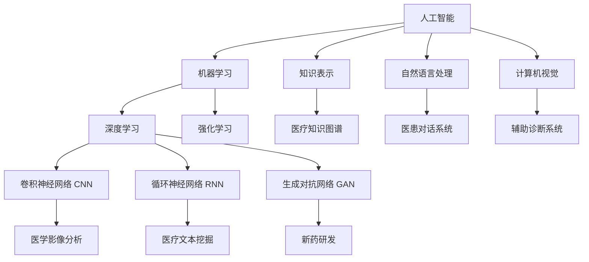

# AI+医疗:人工智能在医疗保健领域的创新应用

## 1. 背景介绍

### 1.1 医疗保健的挑战与机遇

医疗保健行业面临着诸多挑战,如人口老龄化、慢性病高发、医疗资源不均衡分布等问题。与此同时,大数据、人工智能等新兴技术的发展为医疗保健领域带来了新的机遇。人工智能技术在医疗保健领域的应用,有望提高医疗质量、降低医疗成本、优化医疗资源配置,推动医疗保健行业的智能化转型。

### 1.2 人工智能在医疗保健领域的发展现状

近年来,人工智能技术在医疗保健领域得到了广泛应用和快速发展。许多科技公司和医疗机构开始探索将人工智能技术应用于医学影像分析、辅助诊断、药物研发、个性化治疗等方面。一些成功的应用案例,如 IBM Watson for Oncology、Google DeepMind 的 AlphaFold 等,展示了人工智能在医疗保健领域的巨大潜力。

### 1.3 人工智能医疗应用面临的挑战

尽管人工智能在医疗保健领域展现出广阔的应用前景,但同时也面临着一些挑战。医疗数据的隐私性和安全性、人工智能模型的可解释性和可信赖性、人工智能系统的监管和伦理问题等,都是亟需解决的关键问题。如何在发挥人工智能优势的同时,确保其在医疗领域的应用安全、可靠、合规,是业界和学界共同关注的焦点。

## 2. 核心概念与联系

### 2.1 人工智能的定义与分类

人工智能(Artificial Intelligence,AI)是研究、开发用于模拟、延伸和扩展人的智能的理论、方法、技术及应用系统的一门新的技术科学。根据实现方式和应用领域的不同,人工智能可分为弱人工智能、强人工智能、狭义人工智能和广义人工智能等类型。

### 2.2 机器学习与深度学习

机器学习(Machine Learning,ML)是人工智能的一个重要分支,它通过对数据进行分析,从中学习规律,并利用这些规律对未知数据进行预测。深度学习(Deep Learning,DL)是机器学习的一种方法,通过构建多层神经网络,模拟人脑学习和决策的过程,在处理复杂任务方面表现出色。

### 2.3 人工智能与医疗保健的关系

人工智能技术与医疗保健领域有着天然的联系。海量的医疗数据为人工智能模型的训练提供了数据基础,而人工智能强大的数据处理和分析能力,可以帮助医生更高效、更准确地进行医疗决策。将人工智能技术应用于医疗保健领域,有望改善医疗服务质量,提高医疗系统运行效率。



## 3. 核心算法原理与具体操作步骤

### 3.1 卷积神经网络(CNN)在医学影像分析中的应用

卷积神经网络是深度学习中的一种重要算法,特别适用于图像识别和分类任务。将 CNN 应用于医学影像分析,可以自动化诊断过程,提高诊断效率和准确性。以下是使用 CNN 进行医学影像分析的具体步骤:

1. 数据准备:收集和标注大量的医学影像数据,如 CT、MRI、X光片等,并将其划分为训练集、验证集和测试集。

2. 数据预处理:对医学影像进行预处理,如去噪、归一化、数据增强等,以提高数据质量和模型鲁棒性。

3. 构建 CNN 模型:设计 CNN 模型的架构,如输入层、卷积层、池化层、全连接层等,并选择合适的激活函数、损失函数和优化算法。

4. 训练模型:使用训练集数据对 CNN 模型进行训练,通过前向传播和反向传播不断更新模型参数,并使用验证集数据对模型性能进行评估和调优。

5. 测试模型:使用测试集数据对训练好的 CNN 模型进行测试,评估其在实际应用中的性能表现。

6. 模型部署:将训练好的 CNN 模型集成到医疗影像分析系统中,辅助医生进行疾病诊断和筛查。

### 3.2 自然语言处理(NLP)在医疗文本挖掘中的应用

自然语言处理技术可以从非结构化的医疗文本数据(如电子病历、医疗文献等)中提取有价值的信息和知识。以下是使用 NLP 技术进行医疗文本挖掘的具体步骤:

1. 数据采集:收集医疗领域的非结构化文本数据,如电子病历、医疗指南、研究论文等。

2. 文本预处理:对原始医疗文本进行预处理,如去除停用词、分词、词性标注、命名实体识别等,提取关键信息。

3. 特征提取:从预处理后的医疗文本中提取特征,如 TF-IDF、主题模型、词向量等,将非结构化文本转化为结构化特征。

4. 文本分类与聚类:使用机器学习算法(如支持向量机、朴素贝叶斯、K-means 等)对医疗文本进行分类和聚类,发现文本的内在模式和关联。

5. 信息抽取:利用规则或机器学习方法从医疗文本中抽取关键信息,如症状、药物、治疗方案等,构建结构化的医疗知识库。

6. 知识应用:将挖掘出的医疗知识应用于临床决策支持、医疗问答系统、药物研发等领域,提升医疗服务质量和效率。

## 4. 数学模型和公式详细讲解举例说明

### 4.1 卷积神经网络(CNN)的数学原理

卷积神经网络的核心思想是利用卷积运算和池化操作提取图像的局部特征,并通过多层网络结构实现特征的层次化表示。以下是 CNN 的关键数学概念和公式:

1. 卷积运算:对输入图像进行卷积操作,提取局部特征。

$$
\begin{aligned}
O(i,j) &= (I * K)(i,j) \\
&= \sum_{m}\sum_{n}I(i+m,j+n)K(m,n)
\end{aligned}
$$

其中,$I$为输入图像,$K$为卷积核,$O$为输出特征图。

2. 激活函数:在卷积层之后引入非线性激活函数,提高网络的表达能力。常见的激活函数有 ReLU、Sigmoid、Tanh 等。

$$
ReLU(x) = max(0,x)
$$

3. 池化操作:对卷积层的输出进行下采样,减小特征图的尺寸,提高特征的鲁棒性。常见的池化操作有最大池化和平均池化。

$$
MaxPool(x) = max(x_i), i \in \text{pooling region}
$$

4. 损失函数:衡量模型预测结果与真实标签之间的差异,常见的损失函数有交叉熵损失、均方误差损失等。

$$
CrossEntropyLoss = -\sum_{i=1}^{n}y_i \log(\hat{y}_i)
$$

其中,$y_i$为真实标签,$\hat{y}_i$为预测概率。

5. 反向传播:通过梯度下降法更新网络参数,最小化损失函数。

$$
w := w - \eta \frac{\partial L}{\partial w}
$$

其中,$w$为网络参数,$\eta$为学习率,$L$为损失函数。

### 4.2 自然语言处理(NLP)中的 TF-IDF 算法

TF-IDF(Term Frequency-Inverse Document Frequency)是一种常用的文本特征提取算法,用于衡量词语在文本中的重要性。

1. 词频(Term Frequency,TF):表示词语 $t$ 在文档 $d$ 中出现的频率。

$$
TF(t,d) = \frac{f_{t,d}}{\sum_{t'\in d}f_{t',d}}
$$

其中,$f_{t,d}$为词语 $t$ 在文档 $d$ 中出现的次数。

2. 逆文档频率(Inverse Document Frequency,IDF):表示词语 $t$ 在整个文档集合中的稀有程度。

$$
IDF(t) = \log\frac{N}{|\{d\in D:t\in d\}|}
$$

其中,$N$为文档总数,$|\{d\in D:t\in d\}|$为包含词语 $t$ 的文档数。

3. TF-IDF:综合考虑词语在文档中的频率和在整个文档集合中的稀有程度,计算词语的重要性得分。

$$
TFIDF(t,d) = TF(t,d) \times IDF(t)
$$

TF-IDF 得分高的词语,通常是文档的关键词,在文本挖掘任务中具有重要作用。

## 5. 项目实践:代码实例和详细解释说明

### 5.1 基于卷积神经网络的肺结节检测

以下是使用 PyTorch 实现基于 CNN 的肺结节检测的示例代码:

```python
import torch
import torch.nn as nn
import torchvision.transforms as transforms
from torch.utils.data import DataLoader
from dataset import LungNoduleDataset

# 定义 CNN 模型
class LungNoduleDetector(nn.Module):
    def __init__(self):
        super(LungNoduleDetector,self).__init__()
        self.conv1 = nn.Conv2d(1,32,kernel_size=3)
        self.conv2 = nn.Conv2d(32,64,kernel_size=3)
        self.fc1 = nn.Linear(64*28*28,128)  
        self.fc2 = nn.Linear(128,2)
        
    def forward(self,x):
        x = nn.functional.relu(self.conv1(x))
        x = nn.functional.max_pool2d(x,2)
        x = nn.functional.relu(self.conv2(x))
        x = nn.functional.max_pool2d(x,2)
        x = x.view(-1,64*28*28)
        x = nn.functional.relu(self.fc1(x))
        x = self.fc2(x)
        return x

# 数据预处理  
transform = transforms.Compose([
    transforms.Resize((224,224)),
    transforms.ToTensor(),
    transforms.Normalize((0.5,),(0.5,))
])

# 加载数据集
train_dataset = LungNoduleDataset(train_data,transform)
train_loader = DataLoader(train_dataset,batch_size=16,shuffle=True)

test_dataset = LungNoduleDataset(test_data,transform) 
test_loader = DataLoader(test_dataset,batch_size=16)

# 初始化模型
model = LungNoduleDetector()

# 定义损失函数和优化器
criterion = nn.CrossEntropyLoss()
optimizer = torch.optim.Adam(model.parameters())

# 训练模型
num_epochs = 10
for epoch in range(num_epochs):
    model.train()
    for images,labels in train_loader:
        outputs = model(images)
        loss = criterion(outputs,labels)
        
        optimizer.zero_grad()
        loss.backward()
        optimizer.step()
    
    # 在测试集上评估模型
    model.eval()
    with torch.no_grad():
        correct = 0
        total = 0
        for images,labels in test_loader:
            outputs = model(images)
            _,predicted = torch.max(outputs.data,1)
            total += labels.size(0)
            correct += (predicted == labels).sum().item()
        
        print(f'Epoch [{epoch+1}/{num_epochs}], Accuracy: {100*correct/total:.2f}%')

# 保存训练好的模型
torch.save(model.state_dict(),'lung_nodule_detector.pth')
```

代码详细解释:

1. 定义了一个简单的 CNN 模型 `LungNoduleDetector`,包含两个卷积层和两个全连接层,用于肺结节的二分类任务。

2. 对输入的肺部 CT 图像