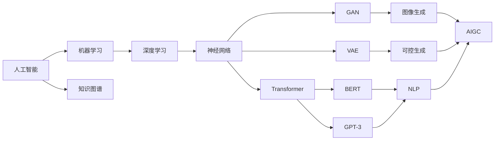
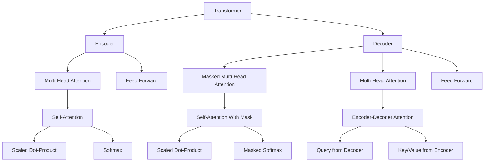

# AIGC从入门到实战：AIGC 的产业图谱带来新的创变纪元

## 1. 背景介绍
### 1.1 AIGC的兴起与发展历程
#### 1.1.1 人工智能的发展奠定AIGC基础  
#### 1.1.2 AIGC技术的突破与进展
#### 1.1.3 AIGC应用场景的不断拓展

### 1.2 AIGC对产业格局的影响
#### 1.2.1 AIGC重塑内容生产模式
#### 1.2.2 AIGC催生新的商业模式
#### 1.2.3 AIGC带来产业升级与变革

### 1.3 AIGC的发展现状与趋势
#### 1.3.1 AIGC技术不断成熟完善
#### 1.3.2 AIGC应用领域持续扩大
#### 1.3.3 AIGC生态日益丰富多元

人工智能生成内容(AIGC)技术的兴起,标志着人工智能发展进入了一个新的阶段。得益于深度学习、自然语言处理、计算机视觉等AI技术的长足进步,AIGC在图像、视频、文本、音频等领域实现了从0到1的突破,为内容生产带来了革命性的变化。

从最初的学术研究,到AlphaGo战胜人类围棋冠军引发广泛关注,再到近年来DALL-E、GPT-3、Stable Diffusion等AIGC模型和应用的陆续问世,AIGC经历了从理论到落地的发展历程。如今,AIGC正在对传统内容产业形成强烈冲击,催生出全新的内容生产方式和商业模式,AIGC俨然成为数字经济时代最炙手可热的风口技术。

放眼全球,AIGC正掀起新一轮技术浪潮。谷歌、Meta、微软、OpenAI等科技巨头纷纷布局,初创公司也异军突起,万亿级AIGC赛道竞争日益激烈。与此同时,AIGC在营销广告、娱乐媒体、教育培训、游戏设计等领域加速落地,大幅提升生产力,开启内容产业新纪元。未来,随着大模型、多模态、小样本学习等前沿技术不断突破,AIGC有望进一步拓展应用边界,重塑更多行业图景。

AIGC引领内容生产变革大潮,为数字经济注入新动能。本文将从技术原理、产业图谱、应用实践等角度出发,深入解析AIGC的发展现状与未来趋势,为读者提供一个全面认识AIGC的视角。

## 2. 核心概念与联系
### 2.1 人工智能(AI)
#### 2.1.1 机器学习
#### 2.1.2 深度学习
#### 2.1.3 神经网络

### 2.2 生成式AI模型  
#### 2.2.1 GAN(生成对抗网络)
#### 2.2.2 VAE(变分自编码器)
#### 2.2.3 Transformer

### 2.3 AIGC的关键技术
#### 2.3.1 自然语言处理(NLP)
#### 2.3.2 计算机视觉(CV)
#### 2.3.3 语音识别(ASR)

AIGC是人工智能(AI)技术与生成式内容(GC)结合的产物。人工智能是使机器具备智能的科学,它包括机器学习、深度学习、知识图谱等多个分支。其中,深度学习借助神经网络实现了AI的跨越式发展,是当前AI的主流范式。

生成式AI模型是AIGC的核心,它能够学习数据分布,生成与训练数据相似的新样本。常见的生成式模型有GAN、VAE和Transformer等。GAN通过生成器和判别器的博弈学习,生成逼真的图像;VAE通过隐空间表征实现可控生成;Transformer凭借自注意力机制在NLP任务上大放异彩。

AIGC汇聚了NLP、CV、ASR等多个AI领域的研究成果。NLP赋予AIGC以语言理解和生成能力,如机器翻译、文本摘要、对话系统等;CV使AIGC具备图像识别和生成能力,催生出以文生图、以图生图等应用;ASR则是AIGC的听觉,实现语音转文字、语音合成、说话人识别等功能。

AIGC代表了AI发展的新方向,它不再局限于感知和理解,而是进一步实现智能创作。生成式AI模型、大规模语料库、算力提升等因素共同推动了AIGC的崛起。未来,AIGC有望在更多领域实现应用突破,为人类生活和生产带来深远影响。

## 3. 核心算法原理与操作步骤
### 3.1 基于Transformer的语言模型
#### 3.1.1 Transformer结构解析
#### 3.1.2 Self-Attention机制
#### 3.1.3 Masked Language Model(MLM)预训练

### 3.2 GPT系列模型
#### 3.2.1 GPT发展历程
#### 3.2.2 GPT模型结构与创新点
#### 3.2.3 GPT在NLP任务中的应用

### 3.3 DALL-E图像生成模型
#### 3.3.1 DALL-E的技术原理
#### 3.3.2 CLIP对图文特征的对齐
#### 3.3.3 Diffusion模型的迭代优化

Transformer是AIGC的核心算法之一,尤其在NLP领域发挥了重要作用。Transformer采用Encoder-Decoder结构,摒弃了RNN的循环机制,转而使用Self-Attention实现并行计算。具体而言,Transformer的Encoder包含多个相同的层,每层由两个子层组成:Multi-Head Attention和Feed Forward Neural Network。Decoder也采用类似结构,但在Encoder-Decoder Attention中引入Mask机制,避免看到后面的信息。

Self-Attention是Transformer的关键,它捕捉输入序列中不同位置之间的依赖关系。对于每个位置,Self-Attention计算它与其他所有位置的相关性权重,然后加权求和得到该位置的新表示。Multi-Head Attention将这一过程独立执行多次,捕捉不同子空间的信息。Feed Forward层则对Multi-Head Attention的输出做非线性变换和特征提取。

GPT(Generative Pre-trained Transformer)是基于Transformer Decoder的语言模型,它通过自回归的方式进行预训练和微调。GPT在预训练阶段采用MLM的变体,随机Mask掉输入序列中的Token,并预测这些Token。这使得GPT能够学习到丰富的语言知识。在下游任务中,GPT根据Prompt生成相应的文本,展现出惊人的语言理解和生成能力。从最初的GPT-1到GPT-3、GPT-3.5、GPT-4,GPT系列模型在参数量、语料规模、训练技巧等方面不断创新,推动NLP领域持续进步。

DALL-E则开创了文本-图像跨模态AIGC的先河。它采用两阶段方案:首先预训练一个名为CLIP的图文对齐模型,学习视觉-语言的联合表征空间;然后训练一个Transformer模型,以文本特征为条件生成与之匹配的图像特征。CLIP中的视觉Encoder和文本Encoder分别提取图像和文本的特征向量,并通过对比学习拉近正样本的距离。Diffusion模型则将图像生成建模为逐步去噪的过程,通过估计噪声分布从高斯噪声恢复原图。DALL-E的后续版本进一步扩大了训练数据规模,改进了生成算法,生成效果惊艳。

综上,Transformer及其衍生模型是AIGC的基石,它们从底层算法和模型结构上支撑了大规模语言模型和多模态生成模型的建立。掌握Transformer的原理,有助于理解AIGC技术的精髓,把握AIGC未来的发展方向。

## 4. 数学模型与公式详解
### 4.1 Transformer的数学表示
#### 4.1.1 Self-Attention计算过程
#### 4.1.2 Multi-Head Attention的数学描述
#### 4.1.3 Layer Normalization与残差连接

### 4.2 GAN的数学原理
#### 4.2.1 生成器与判别器的博弈过程
#### 4.2.2 JS散度与Wasserstein距离
#### 4.2.3 WGAN的梯度惩罚

### 4.3 Diffusion模型的数学建模
#### 4.3.1 正向与逆向扩散过程
#### 4.3.2 Score Matching与Langevin动力学采样
#### 4.3.3 DDPM的噪声估计网络

Transformer中的Self-Attention可以用数学公式精确刻画。给定输入序列的嵌入表示矩阵 $X\in \mathbb{R}^{n\times d}$,Self-Attention的计算过程如下:

$$
\begin{aligned}
Q &= XW^Q \\
K &= XW^K \\
V &= XW^V \\
\text{Attention}(Q,K,V) &= \text{softmax}(\frac{QK^T}{\sqrt{d_k}})V
\end{aligned}
$$

其中,$Q$、$K$、$V$分别表示Query、Key、Value矩阵,$W^Q$、$W^K$、$W^V$为对应的权重矩阵。先将$X$线性变换得到$Q$、$K$、$V$,然后计算$Q$与$K$的点积并缩放,再经过Softmax归一化得到注意力权重,最后与$V$加权求和得到输出。Multi-Head Attention则是将$Q$、$K$、$V$划分为多个Head,独立计算注意力并拼接:

$$
\begin{aligned}
\text{MultiHead}(Q,K,V) &= \text{Concat}(\text{head}_1,\ldots,\text{head}_h)W^O \\
\text{head}_i &= \text{Attention}(QW_i^Q,KW_i^K,VW_i^V)
\end{aligned}
$$

Layer Normalization和残差连接则有助于稳定训练。Layer Norm在每一层对隐状态做归一化,使其均值为0、方差为1;残差连接将前一层的输出直接加到当前层,防止梯度消失。

GAN通过生成器(G)和判别器(D)的对抗学习生成逼真样本。G将随机噪声映射到数据空间,D则判断输入是真实样本还是生成样本。G和D的目标函数为:

$$
\begin{aligned}
\min_G \max_D V(D,G) &= \mathbb{E}_{x\sim p_{\text{data}}(x)}[\log D(x)] + \mathbb{E}_{z\sim p_z(z)}[\log (1-D(G(z)))]
\end{aligned}
$$

GAN常用JS散度度量真实分布和生成分布的差异,但JS散度不连续、不稳定。WGAN引入Wasserstein距离,并用梯度惩罚替代Lipschitz约束,loss函数为:

$$
L = \underset{\tilde{x} \sim \mathbb{P}_g}{\mathbb{E}}[D(\tilde{x})] - \underset{x \sim \