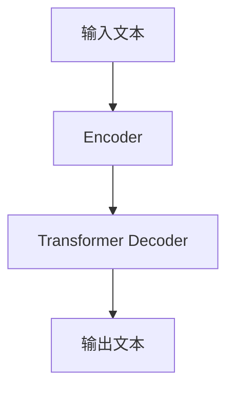

# AIGC从入门到实战：ChatGPT 是新一代的人机交互"操作系统"

## 1. 背景介绍

### 1.1 人工智能的发展历程

人工智能(Artificial Intelligence, AI)是一门研究如何使机器模拟人类智能行为的学科。自20世纪50年代诞生以来,AI经历了几个重要的发展阶段。

#### 1.1.1 第一次AI春天(1956-1974年)

1956年,约翰·麦卡锡在达特茅斯学院召开了著名的"人工智能"研讨会,正式提出了"人工智能"这一术语。这标志着AI研究的开端。在这一时期,专家系统、博弈理论、逻辑推理等领域取得了一些进展。

#### 1.1.2 第一次AI寒冬(1974-1980年)

由于AI研究进展缓慢,投资减少,导致了第一次AI寒冬的到来。

#### 1.1.3 第二次AI春天(1980-1987年)

随着专家系统的兴起,AI再次进入繁荣期。但专家系统存在知识获取瓶颈等问题,使AI发展受阻。

#### 1.1.4 第二次AI寒冬(1987-1993年)

专家系统的局限性导致了第二次AI寒冬。

#### 1.1.5 AI复兴期(1993-至今)

随着大数据、机器学习、深度学习等技术的发展,AI开始走向实用化,在多个领域取得突破。

### 1.2 人工智能的新时代:AIGC

AIGC(AI Generated Content)是指利用人工智能技术生成文字、图像、音频、视频等内容,是AI在内容创作领域的应用。AIGC的核心是大模型,代表性模型包括:

- GPT-3(文本生成模型)
- DALL-E(图像生成模型)  
- PaddleSpeech(语音合成模型)
- Stable Diffusion(图像生成模型)

其中,ChatGPT是基于GPT-3训练的对话式AI助手,具有强大的自然语言理解和生成能力,被视为AIGC的杰出代表,开启了人机交互的新时代。

## 2. 核心概念与联系

### 2.1 ChatGPT的核心概念

#### 2.1.1 大语言模型(Large Language Model, LLM)

ChatGPT是一种大语言模型,通过在海量文本数据上训练,学习人类语言的模式和规律,从而具备自然语言理解和生成能力。

#### 2.1.2 自然语言处理(Natural Language Processing, NLP)

NLP是ChatGPT的核心技术,包括自然语言理解(NLU)和自然语言生成(NLG)两个方面。NLU是理解人类语言的意图和语义,NLG是生成自然、流畅的语言输出。

#### 2.1.3 对话系统(Dialog System)

ChatGPT是一种对话式AI助手,能够与人类进行自然的多轮对话交互,并根据上下文给出合理响应。

#### 2.1.4 迁移学习(Transfer Learning)

ChatGPT是基于GPT-3等预训练大模型进行微调和迁移学习,从而获得特定任务的能力,如问答、写作、编程等。

#### 2.1.5 人工智能伦理(AI Ethics)

ChatGPT等大模型存在一定的风险和挑战,需要注重AI伦理,如数据隐私、公平性、透明度等。

### 2.2 ChatGPT与其他AIGC模型的关系

ChatGPT作为文本生成的大语言模型,与其他AIGC模型存在紧密联系:

- 可以为图像生成模型(如DALL-E)提供文本描述输入
- 可以与语音合成模型(如PaddleSpeech)结合,实现语音交互
- 可以为视频生成模型提供文本脚本输入
- 可以与其他AIGC模型协同工作,实现多模态内容生成

因此,ChatGPT是AIGC生态系统中的关键组成部分,为人机交互提供了新的操作系统。

## 3. 核心算法原理具体操作步骤

### 3.1 ChatGPT的基本架构

ChatGPT的基本架构如下图所示:



其中:

1. Encoder将输入文本编码为向量表示
2. Transformer Decoder基于Encoder的输出和上下文,生成输出文本

### 3.2 Transformer架构

Transformer是ChatGPT等大语言模型的核心架构,由Encoder和Decoder两部分组成。

#### 3.2.1 Encoder

Encoder的主要作用是将输入序列编码为向量表示,其关键组件包括:

1. **词嵌入(Word Embedding)**: 将每个词映射为一个固定长度的向量表示
2. **位置编码(Positional Encoding)**: 引入位置信息,使模型能够捕获序列的顺序
3. **多头注意力机制(Multi-Head Attention)**: 捕获输入序列中不同位置之间的依赖关系

#### 3.2.2 Decoder

Decoder的主要作用是生成输出序列,其关键组件包括:

1. **掩码多头注意力机制(Masked Multi-Head Attention)**: 防止模型利用将来的信息
2. **编码器-解码器注意力(Encoder-Decoder Attention)**: 将编码器的输出与解码器的输入相结合
3. **前馈神经网络(Feed-Forward Neural Network)**: 进一步处理注意力的输出

#### 3.2.3 自注意力机制(Self-Attention)

自注意力机制是Transformer的核心,它允许模型直接捕获输入序列中任意两个位置之间的依赖关系,而不需要按序扫描。这种并行计算方式大大提高了模型的效率。

### 3.3 ChatGPT的训练过程

ChatGPT是基于GPT-3等预训练大模型进行微调和迁移学习,具体步骤如下:

1. **预训练**: 在海量文本数据上训练GPT-3等大模型,获得通用的语言理解和生成能力
2. **微调**: 在特定任务数据(如对话数据)上进行微调,使模型适应特定任务
3. **迁移学习**: 将微调后的模型应用于新的任务,如问答、写作、编程等

在训练过程中,还需要注意以下几点:

- **数据预处理**: 对训练数据进行清洗、标注等预处理
- **模型优化**: 调整超参数、正则化等,提高模型性能
- **评估指标**: 设计合理的评估指标,如BLEU、ROUGE等

## 4. 数学模型和公式详细讲解举例说明

### 4.1 Transformer中的注意力机制

注意力机制是Transformer的核心,它能够捕获输入序列中任意两个位置之间的依赖关系。具体来说,给定一个查询向量(Query) $q$和一组键值对(Key-Value) $\{(k_1, v_1), (k_2, v_2), \dots, (k_n, v_n)\}$,注意力机制的计算过程如下:

$$\begin{aligned}
\text{Attention}(Q, K, V) &= \text{softmax}\left(\frac{QK^T}{\sqrt{d_k}}\right)V \\
&= \sum_{i=1}^n \alpha_i v_i
\end{aligned}$$

其中:

- $Q$是查询向量的矩阵表示
- $K$是键向量的矩阵表示
- $V$是值向量的矩阵表示
- $d_k$是缩放因子,用于防止内积过大导致梯度消失
- $\alpha_i$是注意力权重,表示查询向量对第$i$个键值对的关注程度

注意力机制的优点在于,它能够自适应地为每个位置分配不同的权重,从而更好地捕获长距离依赖关系。

### 4.2 Transformer中的多头注意力机制

为了进一步提高模型的表现力,Transformer引入了多头注意力机制。具体来说,将查询向量$Q$、键向量$K$和值向量$V$分别线性投影到$h$个子空间,然后在每个子空间中计算注意力,最后将所有子空间的注意力结果拼接起来:

$$\begin{aligned}
\text{MultiHead}(Q, K, V) &= \text{Concat}(\text{head}_1, \dots, \text{head}_h)W^O\\
\text{where } \text{head}_i &= \text{Attention}(QW_i^Q, KW_i^K, VW_i^V)
\end{aligned}$$

其中$W_i^Q$、$W_i^K$、$W_i^V$和$W^O$是可学习的线性投影矩阵。多头注意力机制能够从不同的子空间捕获不同的依赖关系,提高了模型的表现力。

### 4.3 Transformer中的位置编码

由于Transformer没有像RNN那样的递归结构,因此需要引入位置编码来赋予序列位置信息。位置编码的计算公式如下:

$$\begin{aligned}
\text{PE}_{(pos, 2i)} &= \sin\left(\frac{pos}{10000^{2i/d_\text{model}}}\right)\\
\text{PE}_{(pos, 2i+1)} &= \cos\left(\frac{pos}{10000^{2i/d_\text{model}}}\right)
\end{aligned}$$

其中$pos$是词在序列中的位置,$i$是维度的索引,$d_\text{model}$是词嵌入的维度。位置编码与词嵌入相加,使模型能够捕获序列的位置信息。

## 5. 项目实践:代码实例和详细解释说明

以下是使用PyTorch实现Transformer的简化版本代码,包括Encoder、Decoder和注意力机制的实现:

```python
import torch
import torch.nn as nn
import math

# 定义缩放因子
def scaled_dot_product_attention(q, k, v, mask=None):
    # 计算注意力权重
    attn = torch.matmul(q, k.transpose(-2, -1))
    attn = attn / math.sqrt(q.size(-1))
    if mask is not None:
        attn = attn.masked_fill(mask == 0, -1e9)
    attn_weights = torch.softmax(attn, dim=-1)
    
    # 计算加权和
    output = torch.matmul(attn_weights, v)
    return output, attn_weights

# 定义多头注意力机制
class MultiHeadAttention(nn.Module):
    def __init__(self, d_model, num_heads):
        super(MultiHeadAttention, self).__init__()
        self.num_heads = num_heads
        self.d_model = d_model
        
        self.W_q = nn.Linear(d_model, d_model)
        self.W_k = nn.Linear(d_model, d_model)
        self.W_v = nn.Linear(d_model, d_model)
        self.W_o = nn.Linear(d_model, d_model)
        
    def forward(self, q, k, v, mask=None):
        # 线性投影
        q = self.W_q(q).view(q.size(0), q.size(1), self.num_heads, self.d_model // self.num_heads).transpose(1, 2)
        k = self.W_k(k).view(k.size(0), k.size(1), self.num_heads, self.d_model // self.num_heads).transpose(1, 2)
        v = self.W_v(v).view(v.size(0), v.size(1), self.num_heads, self.d_model // self.num_heads).transpose(1, 2)
        
        # 计算注意力
        attn_output, attn_weights = scaled_dot_product_attention(q, k, v, mask)
        
        # 合并多头注意力结果
        attn_output = attn_output.transpose(1, 2).contiguous().view(attn_output.size(0), attn_output.size(1), -1)
        attn_output = self.W_o(attn_output)
        
        return attn_output, attn_weights

# 定义Encoder层
class EncoderLayer(nn.Module):
    def __init__(self, d_model, num_heads, ff_dim, dropout_rate=0.1):
        super(EncoderLayer, self).__init__()
        self.multi_head_attn = MultiHeadAttention(d_model, num_heads)
        self.ff = nn.Sequential(
            nn.Linear(d_model, ff_dim),
            nn.ReLU(),
            nn.Dropout(dropout_rate),
            nn.Linear(ff_dim, d_model),
            nn.Dropout(dropout_rate)
        )
        self.norm1 = nn.LayerNorm(d_model)
        self.norm2 = nn.LayerNorm(d_model)
        
    def forward(self, x, mask=None):
        # 多头注意力
        attn_output, _ = self.multi_head_attn(x, x, x, mask)
        x = self.norm1(x + attn_output)
        
        # 前馈神经网络
        ff_