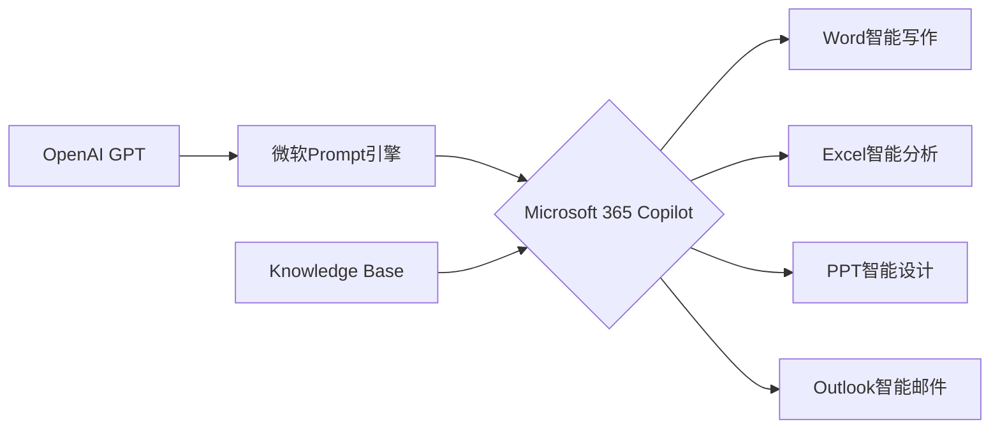

# AIGC从入门到实战：Microsoft 365 Copilot—用 AI 助手轻松驾驭办公软件

## 1. 背景介绍
### 1.1 人工智能生成内容AIGC的兴起
#### 1.1.1 AIGC的定义与内涵
#### 1.1.2 AIGC技术的发展历程
#### 1.1.3 AIGC在各行各业的应用现状

### 1.2 微软对AIGC的战略布局 
#### 1.2.1 微软在人工智能领域的研发投入
#### 1.2.2 微软收购OpenAI的意图
#### 1.2.3 微软发布Microsoft 365 Copilot的时机选择

### 1.3 Microsoft 365 Copilot 的定位与愿景
#### 1.3.1 Copilot作为生产力工具的定位
#### 1.3.2 Copilot赋能办公场景的设想
#### 1.3.3 Copilot推动微软Office向智能化升级

## 2. 核心概念与联系
### 2.1 Microsoft 365 Copilot的架构设计
#### 2.1.1 基于OpenAI GPT模型的微调
#### 2.1.2 针对Office场景的Prompt引擎
#### 2.1.3 Knowledge Base知识库的构建

### 2.2 Copilot与Office应用的无缝集成
#### 2.2.1 Word中的智能写作助手
#### 2.2.2 Excel中的智能数据分析
#### 2.2.3 PowerPoint中的智能演示设计
#### 2.2.4 Outlook中的智能邮件助理

### 2.3 Copilot的人机交互体验设计
#### 2.3.1 自然语言交互界面
#### 2.3.2 对话式交互范式
#### 2.3.3 多模态交互的探索



## 3. 核心算法原理具体操作步骤
### 3.1 基于OpenAI GPT的微调fine-tuning
#### 3.1.1 构建Office场景的微调数据集
#### 3.1.2 微调模型的训练过程
#### 3.1.3 微调后模型效果评估

### 3.2 Prompt引擎的关键技术
#### 3.2.1 Few-shot learning小样本学习
#### 3.2.2 Prompt模板的设计
#### 3.2.3 Prompt分类与管理

### 3.3 知识库Knowledge Base构建流程
#### 3.3.1 结构化数据的抽取与存储
#### 3.3.2 非结构化数据的语义理解
#### 3.3.3 知识库智能检索与排序

## 4. 数学模型和公式详细讲解举例说明
### 4.1 Transformer模型的核心原理
#### 4.1.1 Self-Attention机制
$Attention(Q,K,V) = softmax(\frac{QK^T}{\sqrt{d_k}})V$
#### 4.1.2 Multi-Head Attention
$$MultiHead(Q,K,V) = Concat(head_1,...,head_h)W^O$$
$$head_i=Attention(QW_i^Q, KW_i^K, VW_i^V)$$
#### 4.1.3 Transformer的Encoder-Decoder结构

### 4.2 GPT模型的改进与创新
#### 4.2.1 Masked Self-Attention
#### 4.2.2 Transformer Decoder堆叠
#### 4.2.3 参数的放大与训练优化

### 4.3 RLHF强化学习与人类反馈
#### 4.3.1 PPO Proximal Policy Optimization算法
$$J^{CLIP}(\theta)=\hat{E}_t[min(r_t(\theta)\hat{A}_t,clip(r_t(\theta),1-\epsilon,1+\epsilon)\hat{A}_t)]$$
#### 4.3.2 人类偏好反馈的引入
#### 4.3.3 Reward modeling奖励建模

## 5. 项目实践：代码实例和详细解释说明
### 5.1 使用微软Azure OpenAI接口进行模型微调
```python
from azure.ai.openai import OpenAIClient
from azure.identity import DefaultAzureCredential

openai_api_base = "https://your-resource-name.openai.azure.com/"
openai_api_version = "2023-03-15-preview"

credential = DefaultAzureCredential()
client = OpenAIClient(openai_api_base, openai_api_version, credential)

training_data = [
  {"prompt": "写一个励志的故事", "completion": "从前有一个..."},
  {"prompt": "帮我设计一个PPT", "completion": "主题是什么..."},
  ...
]

response = client.finetune(
    training_file="<SAS_URL_OF_JSONL_FILE>",
    model="text-davinci-003", 
    n_epochs=4,
    batch_size=1,
    learning_rate_multiplier=0.1
)
```

### 5.2 Prompt引擎的实现示例
```python
class PromptTemplate:
    def __init__(self, template):
        self.template = template
        
    def format(self, **kwargs):
        return self.template.format(**kwargs)

class PromptManager:
    def __init__(self):
        self.templates = {}
        
    def add_template(self, name, template):
        self.templates[name] = PromptTemplate(template)
        
    def get_prompt(self, name, **kwargs):
        return self.templates[name].format(**kwargs)
        
# 示例用法
manager = PromptManager()
manager.add_template("写作", "以"{title}"为题，写一篇{n}字的文章，体裁是{style}。")
manager.add_template("翻译", "将以下内容从{lang1}翻译成{lang2}:\n{text}")

prompt1 = manager.get_prompt("写作", title="我的大学生活", n=1000, style="记叙文")
prompt2 = manager.get_prompt("翻译", lang1="英语", lang2="中文", text="Hello world!")
```

### 5.3 知识库检索与排序算法
```python
from sklearn.feature_extraction.text import TfidfVectorizer
from sklearn.metrics.pairwise import cosine_similarity

class KnowledgeBase:
    def __init__(self, docs):
        self.docs = docs
        self.vectorizer = TfidfVectorizer()
        self.tfidf_matrix = self.vectorizer.fit_transform(docs)
        
    def search(self, query, top_n=5):
        query_vec = self.vectorizer.transform([query])
        similarity_scores = cosine_similarity(query_vec, self.tfidf_matrix)
        top_docs_indices = similarity_scores.argsort()[0][-top_n:][::-1]
        return [self.docs[i] for i in top_docs_indices]
        
# 示例用法  
kb = KnowledgeBase([
    "Python是一种解释型、面向对象、动态数据类型的高级程序设计语言",
    "OpenAI是一家人工智能研究公司，致力于开发友好的AI造福人类", 
    "微软是一家总部位于美国的跨国科技公司，以研发、制造、授权和提供广泛的电脑软件服务为主"
])

query = "微软公司的基本情况"
results = kb.search(query)
print(results)
```

## 6. 实际应用场景
### 6.1 智能办公场景
#### 6.1.1 自动文档生成与编辑
#### 6.1.2 数据分析与可视化报告
#### 6.1.3 演示文稿智能设计
#### 6.1.4 邮件写作与信息提取

### 6.2 个人生产力提升
#### 6.2.1 日程管理与任务规划
#### 6.2.2 笔记整理与知识管理
#### 6.2.3 自动化文案与社交媒体运营  
#### 6.2.4 个性化学习路径规划

### 6.3 企业级应用拓展
#### 6.3.1 客户服务智能助理
#### 6.3.2 市场调研与竞争分析
#### 6.3.3 财务报表自动生成
#### 6.3.4 HR招聘流程优化

## 7. 工具和资源推荐
### 7.1 微软官方学习资源
- [Microsoft Learn](https://learn.microsoft.com/) 
- [Microsoft 365 开发者计划](https://developer.microsoft.com/microsoft-365/dev-program) 
- [Microsoft Build大会](https://mybuild.microsoft.com/)

### 7.2 Prompt工程最佳实践
- [OpenAI官方文档](https://platform.openai.com/docs/guides/completion/prompt-design)
- [Prompt Engineering Guide](https://github.com/dair-ai/Prompt-Engineering-Guide)
- [PromptPerfect](https://promptperfect.jina.ai/)

### 7.3 知识库构建工具
- [Haystack](https://haystack.deepset.ai/)
- [Weaviate](https://weaviate.io/)
- [Milvus](https://milvus.io/)

## 8. 总结：未来发展趋势与挑战
### 8.1 AIGC技术的发展趋势
#### 8.1.1 大模型的持续突破
#### 8.1.2 多模态生成能力提升 
#### 8.1.3 人机协作范式创新

### 8.2 Microsoft 365 Copilot的未来展望
#### 8.2.1 与行业知识库的深度融合
#### 8.2.2 基于Copilot的低代码开发
#### 8.2.3 个性化用户体验优化

### 8.3 AIGC带来的挑战与思考
#### 8.3.1 内容生成的版权归属问题
#### 8.3.2 AIGC内容的准确性与可解释性
#### 8.3.3 就业结构的转型与再教育

## 9. 附录：常见问题与解答
### 9.1 Microsoft 365 Copilot的定价与购买方式？
目前Copilot还处于预览阶段，具体定价暂未公布。感兴趣的用户可以通过申请加入候补名单，获得最新产品动态。未来很可能采取订阅制模式，集成在Microsoft 365套件中。

### 9.2 Copilot生成的内容是否有版权风险？ 
根据微软的声明，Copilot生成的内容版权归用户所有。但是大语言模型训练数据的版权争议尚无定论，微软表示会持续关注业界动态并调整策略。用户使用Copilot时还是需要辨别生成内容的合规性。

### 9.3 Copilot对于不同领域的适用性如何？
得益于在海量高质量Office数据上的训练，Copilot对于日常办公场景有较好的适配性。对于金融、法律等专业领域，可能还需要进一步的领域知识微调。微软正在与不同行业客户合作，为Copilot构建行业知识库。

作者：禅与计算机程序设计艺术 / Zen and the Art of Computer Programming