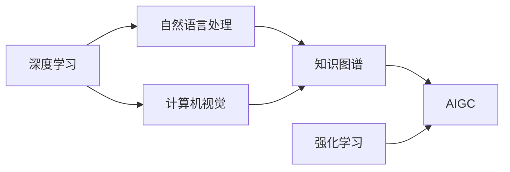

# AIGC从入门到实战：关于企业和组织

## 1.背景介绍

人工智能生成内容(AIGC)技术正在迅速发展,并对各行各业产生重大影响。企业和组织正在探索如何利用AIGC来提高效率、降低成本并创造新的商业机会。本文将深入探讨AIGC技术在企业和组织中的应用,从入门到实战,全面解析AIGC的核心概念、算法原理、数学模型、项目实践、应用场景等,为企业和组织提供实用的AIGC知识和洞见。

### 1.1 AIGC的定义与内涵
#### 1.1.1 AIGC的定义
#### 1.1.2 AIGC的内涵与外延
#### 1.1.3 AIGC与传统内容生成的区别

### 1.2 AIGC的发展历程
#### 1.2.1 AIGC技术的起源与演变
#### 1.2.2 AIGC技术的里程碑事件
#### 1.2.3 AIGC技术的未来趋势

### 1.3 AIGC对企业和组织的影响
#### 1.3.1 AIGC带来的机遇与挑战  
#### 1.3.2 AIGC对企业和组织的颠覆性影响
#### 1.3.3 企业和组织如何应对AIGC浪潮

## 2.核心概念与联系

要深入理解AIGC技术,首先需要掌握其核心概念及其内在联系。本章将系统阐述AIGC的关键概念,并通过直观的Mermaid流程图展示它们之间的逻辑关系。

### 2.1 AIGC的核心概念
#### 2.1.1 深度学习
#### 2.1.2 自然语言处理
#### 2.1.3 计算机视觉
#### 2.1.4 知识图谱
#### 2.1.5 强化学习

### 2.2 AIGC核心概念的内在联系
#### 2.2.1 深度学习与自然语言处理的关系
#### 2.2.2 计算机视觉与知识图谱的关系 
#### 2.2.3 强化学习在AIGC中的作用

### 2.3 AIGC核心概念Mermaid流程图



## 3.核心算法原理具体操作步骤

AIGC的实现离不开一系列复杂的算法。本章将深入剖析AIGC的核心算法原理,并提供详细的操作步骤,帮助读者全面掌握AIGC算法的精髓。

### 3.1 Transformer模型
#### 3.1.1 Transformer的网络结构
#### 3.1.2 自注意力机制
#### 3.1.3 位置编码
#### 3.1.4 Transformer的训练与推理

### 3.2 GPT系列模型
#### 3.2.1 GPT模型概述
#### 3.2.2 GPT-2的改进
#### 3.2.3 GPT-3的特点与能力
#### 3.2.4 GPT-4的展望

### 3.3 DALL-E模型
#### 3.3.1 DALL-E的原理
#### 3.3.2 DALL-E的训练数据
#### 3.3.3 DALL-E的生成过程
#### 3.3.4 DALL-E 2的进步

### 3.4 Stable Diffusion模型
#### 3.4.1 Stable Diffusion的架构  
#### 3.4.2 潜在扩散模型
#### 3.4.3 Stable Diffusion的训练技巧
#### 3.4.4 Stable Diffusion的应用

## 4.数学模型和公式详细讲解举例说明

AIGC的背后是深厚的数学基础。本章将通过通俗易懂的讲解和生动形象的例子,揭开AIGC数学模型的神秘面纱,让读者轻松掌握AIGC的数学本质。

### 4.1 Transformer的数学原理
#### 4.1.1 自注意力机制的数学表示
$$Attention(Q,K,V) = softmax(\frac{QK^T}{\sqrt{d_k}})V$$
其中,$Q$,$K$,$V$分别表示查询、键、值向量,$d_k$为键向量的维度。

#### 4.1.2 前馈神经网络的数学表示
$$FFN(x) = max(0, xW_1 + b_1)W_2 + b_2$$
其中,$W_1$,$W_2$为权重矩阵,$b_1$,$b_2$为偏置向量。

#### 4.1.3 残差连接与层归一化的数学表示  
$$LayerNorm(x + Sublayer(x))$$
其中,$Sublayer(x)$表示子层(自注意力层或前馈层)的输出。

### 4.2 VAE的数学原理
#### 4.2.1 VAE的目标函数
$$L(\theta,\phi) = -E_{z \sim q_\phi(z|x)}[log p_\theta(x|z)] + KL(q_\phi(z|x) || p(z))$$
其中,$\theta$,$\phi$分别表示生成模型和推断模型的参数。

#### 4.2.2 重参数技巧
$$z = \mu + \sigma \odot \epsilon, \epsilon \sim N(0,I)$$
其中,$\mu$,$\sigma$为推断模型输出的均值和标准差,$\epsilon$为标准正态分布的噪声。

### 4.3 GAN的数学原理 
#### 4.3.1 GAN的目标函数
$$min_G max_D V(D,G) = E_{x \sim p_{data}(x)}[logD(x)] + E_{z \sim p_z(z)}[log(1-D(G(z)))]$$
其中,$D$为判别器,$G$为生成器。

#### 4.3.2 WGAN的改进
$$min_G max_{D \in \mathcal{D}} E_{x \sim p_{data}(x)}[D(x)] - E_{z \sim p_z(z)}[D(G(z))]$$
其中,$\mathcal{D}$表示1-Lipschitz函数的集合。

## 5.项目实践：代码实例和详细解释说明

理论固然重要,但实践出真知。本章将提供AIGC的代码实例,并进行详细的解释说明,手把手教你如何用代码实现AIGC,让你快速掌握AIGC的开发技能。

### 5.1 使用GPT-2生成文本
#### 5.1.1 安装依赖库
```
pip install transformers torch
```
#### 5.1.2 加载预训练模型
```python
from transformers import GPT2LMHeadModel, GPT2Tokenizer

model = GPT2LMHeadModel.from_pretrained('gpt2')
tokenizer = GPT2Tokenizer.from_pretrained('gpt2')
```
#### 5.1.3 生成文本
```python
input_text = "AIGC is"
input_ids = tokenizer.encode(input_text, return_tensors='pt')

output = model.generate(input_ids, 
                        max_length=100, 
                        num_return_sequences=1,
                        no_repeat_ngram_size=2,
                        early_stopping=True)

print(tokenizer.decode(output[0], skip_special_tokens=True))
```

### 5.2 使用DALL-E生成图像
#### 5.2.1 安装OpenAI库
```
pip install openai
```
#### 5.2.2 设置API密钥
```python
import openai
openai.api_key = "your_api_key"
```
#### 5.2.3 生成图像
```python
response = openai.Image.create(
  prompt="a cat sitting on a couch",
  n=1,
  size="1024x1024"
)
image_url = response['data'][0]['url']
print(image_url)
```

### 5.3 使用Stable Diffusion生成图像
#### 5.3.1 安装依赖库
```
pip install torch diffusers transformers scipy ftfy
```
#### 5.3.2 加载预训练模型
```python
from diffusers import StableDiffusionPipeline

model_id = "CompVis/stable-diffusion-v1-4"
pipe = StableDiffusionPipeline.from_pretrained(model_id, torch_dtype=torch.float16)  
pipe = pipe.to("cuda")
```
#### 5.3.3 生成图像
```python
prompt = "a photo of an astronaut riding a horse on mars"

image = pipe(prompt).images[0]  
image.save("astronaut_rides_horse.png")
```

## 6.实际应用场景

AIGC技术在现实世界中有广泛的应用前景。本章将列举AIGC在不同行业和领域的实际应用场景,展示AIGC的巨大潜力和无限可能。

### 6.1 数字营销
#### 6.1.1 自动生成营销文案
#### 6.1.2 个性化推荐与广告投放
#### 6.1.3 智能客服与销售助理

### 6.2 内容创作
#### 6.2.1 自动撰写新闻报道
#### 6.2.2 辅助设计游戏场景与角色
#### 6.2.3 创作音乐与绘画艺术品

### 6.3 教育培训
#### 6.3.1 智能组卷与作业批改
#### 6.3.2 个性化教学与课程推荐
#### 6.3.3 虚拟助教与智能答疑

### 6.4 医疗健康
#### 6.4.1 辅助医疗诊断与治疗方案制定
#### 6.4.2 药物分子结构设计与筛选
#### 6.4.3 智能健康管理与生活方式指导

## 7.工具和资源推荐

工欲善其事,必先利其器。本章将推荐一些优秀的AIGC工具和学习资源,助你在AIGC的道路上披荆斩棘,一路前行。

### 7.1 AIGC开发工具
#### 7.1.1 OpenAI API
#### 7.1.2 Hugging Face Transformers
#### 7.1.3 TensorFlow与PyTorch

### 7.2 AIGC学习资源
#### 7.2.1 吴恩达的《AI For Everyone》课程
#### 7.2.2 《Generative Deep Learning》一书
#### 7.2.3 AIGC相关的顶会论文与教程

### 7.3 AIGC社区与平台
#### 7.3.1 Hugging Face社区
#### 7.3.2 OpenAI Universe平台
#### 7.3.3 PapersWithCode网站

## 8.总结：未来发展趋势与挑战

AIGC技术方兴未艾,未来可期。本章将展望AIGC技术的发展趋势,分析其面临的机遇与挑战,为企业和组织提供前瞻性的思考。

### 8.1 AIGC的发展趋势
#### 8.1.1 模型规模不断增大
#### 8.1.2 多模态融合生成
#### 8.1.3 小样本学习与迁移学习

### 8.2 AIGC面临的机遇
#### 8.2.1 赋能传统行业转型升级
#### 8.2.2 催生新业态与商业模式
#### 8.2.3 提升生产效率与创新能力

### 8.3 AIGC面临的挑战
#### 8.3.1 内容质量与版权问题
#### 8.3.2 伦理与安全风险
#### 8.3.3 人才缺口与技术壁垒

## 9.附录：常见问题与解答

对于AIGC的学习和应用,读者难免会有疑问。本章将解答一些常见问题,帮助读者消除疑虑,坚定前行。

### 9.1 AIGC会取代人类的创造力吗?
AIGC是人类智慧的延伸和拓展,它不会取代人类的创造力,而是与人类形成互补与协作,激发更多的创新灵感,拓展创意表达的疆域。

### 9.2 AIGC生成的内容是否有版权?
AIGC生成的内容可能涉及数据源的版权问题。在商业使用时,需要仔细甄别内容的版权归属,必要时征得原作者的授权同意,以免侵权。

### 9.3 如何防范AIGC可能带来的伦理与安全风险?
开发和使用AIGC时,需要遵循伦理准则,设置必要的内容过滤机制,防止生成违法违规、低俗色情、歧视仇恨等不良内容。同时,要加强对AIGC系统的安全防护,防范黑客攻击和恶意利用。

### 9.4 企业和组织如何布局AIGC?
企业和组织应密切关注AIGC领域的最新进展,积极开展前瞻性研究和技术攻关,加强与科研院所、高校的产学研合作。要结合自身业务特点和发展需求,选择适宜的AIGC技术路线,探索创新应用场景。同时,要加大AIGC人才的培养