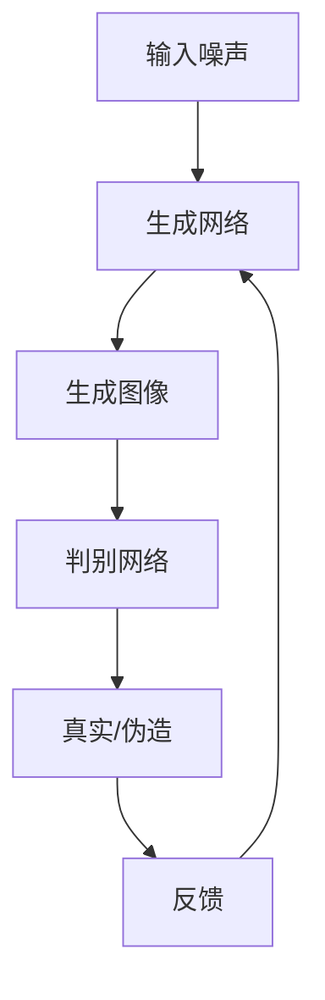
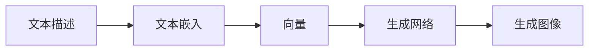
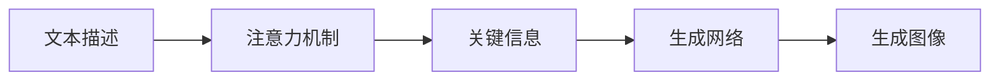

# AIGC从入门到实战：变化：活用Midjourney，你也能成为神笔马良

## 1.背景介绍

### 1.1 人工智能生成内容(AIGC)的兴起

在过去几年中,人工智能生成内容(AIGC)技术取得了长足进步,催生了一场新的创意革命。AIGC指的是利用人工智能算法生成文本、图像、音频和视频等数字内容的技术。这些技术不仅提高了内容创作的效率,还拓展了创意的边界,为艺术家和创作者带来了前所未有的机遇。

### 1.2 Midjourney:革命性的AIGC图像生成工具

在AIGC图像生成工具中,Midjourney脱颖而出,成为了艺术家和创作者的新宠。这款基于人工智能的工具可以根据用户的文本描述生成逼真的图像,无论是写实风格还是抽象画作,都能完成出色的图像生成。Midjourney的出现,让普通人也能够创作出专业级别的艺术作品,从而极大地降低了艺术创作的门槛。

### 1.3 艺术与技术的完美融合

Midjourney的崛起,标志着艺术和技术的完美融合。它不仅为艺术家提供了一种全新的创作方式,还为技术爱好者打开了一扇通往艺术世界的大门。无论你是资深艺术家还是技术新手,都能在Midjourney的世界里尽情发挥创意,探索艺术与科技的无限可能。

## 2.核心概念与联系

### 2.1 生成式对抗网络(GAN)

Midjourney的核心技术是生成式对抗网络(GAN)。GAN由两个神经网络组成:生成网络和判别网络。生成网络的目标是生成逼真的图像,而判别网络则判断生成的图像是真实的还是伪造的。两个网络相互对抗,不断优化,最终达到生成高质量图像的目的。



### 2.2 文本到图像(Text-to-Image)

Midjourney采用了文本到图像(Text-to-Image)的方法,用户只需输入文本描述,就能生成相应的图像。这种方法的关键是将文本嵌入到一个高维向量空间中,然后将这个向量输入到生成网络,生成相应的图像。



### 2.3 注意力机制(Attention Mechanism)

为了更好地捕捉文本描述和图像之间的关系,Midjourney采用了注意力机制。注意力机制可以自动关注输入序列中的关键部分,从而更准确地生成图像。这种机制在自然语言处理和计算机视觉领域都有广泛应用。



## 3.核心算法原理具体操作步骤

Midjourney的核心算法原理可以概括为以下几个步骤:

### 3.1 文本嵌入

1) 将用户输入的文本描述tokenize成一系列token。
2) 将每个token映射到一个固定长度的向量,得到一系列向量表示。
3) 将这些向量序列输入到一个Transformer模型中,得到文本的上下文表示。

### 3.2 注意力机制

1) 计算查询向量(Query)、键向量(Key)和值向量(Value)。
2) 计算查询向量和键向量之间的点积,得到注意力分数。
3) 对注意力分数进行softmax操作,得到注意力权重。
4) 将注意力权重与值向量相乘,得到加权和,作为注意力的输出。

### 3.3 生成网络

1) 将文本的上下文表示和一个随机噪声向量concatenate在一起,作为生成网络的输入。
2) 输入通过一系列卷积层、上采样层和残差连接,逐步生成高分辨率的图像。
3) 在每个尺度上,注意力模块会选择性地关注输入的不同部分,以捕捉文本描述和图像之间的关系。

### 3.4 判别网络

1) 将真实图像和生成图像输入到判别网络中。
2) 判别网络通过一系列卷积层和全连接层,输出一个标量值,表示输入图像是真实的还是伪造的。
3) 生成网络和判别网络相互对抗,不断优化,最终达到生成高质量图像的目的。

## 4.数学模型和公式详细讲解举例说明

### 4.1 文本嵌入

假设输入文本为 $X = (x_1, x_2, ..., x_n)$,其中 $x_i$ 表示第 $i$ 个token。我们将每个token映射到一个固定长度的向量 $e_i \in \mathbb{R}^{d_\text{model}}$,得到嵌入序列 $E = (e_1, e_2, ..., e_n)$。

然后,我们将嵌入序列输入到一个Transformer模型中,得到文本的上下文表示 $C \in \mathbb{R}^{d_\text{model}}$:

$$C = \text{Transformer}(E)$$

### 4.2 注意力机制

注意力机制的核心是计算查询向量(Query)、键向量(Key)和值向量(Value)之间的相似性,并根据相似性分配注意力权重。

给定一个查询向量 $Q \in \mathbb{R}^{d_k}$,一组键向量 $K = (k_1, k_2, ..., k_n)$,其中 $k_i \in \mathbb{R}^{d_k}$,以及一组值向量 $V = (v_1, v_2, ..., v_n)$,其中 $v_i \in \mathbb{R}^{d_v}$,我们计算注意力权重如下:

$$\text{Attention}(Q, K, V) = \text{softmax}\left(\frac{QK^T}{\sqrt{d_k}}\right)V$$

其中,softmax函数对每一行进行归一化,确保注意力权重的和为1。

在Midjourney中,注意力机制用于捕捉文本描述和图像之间的关系。查询向量来自文本的上下文表示,键向量和值向量来自图像的特征图。通过计算相似性,注意力机制可以自动关注输入序列中的关键部分,从而更准确地生成图像。

### 4.3 生成网络

生成网络的目标是根据文本的上下文表示和一个随机噪声向量,生成逼真的图像。

假设文本的上下文表示为 $C \in \mathbb{R}^{d_\text{model}}$,随机噪声向量为 $z \in \mathbb{R}^{d_z}$,我们将它们concatenate在一起,得到生成网络的输入 $I \in \mathbb{R}^{d_\text{model} + d_z}$:

$$I = [C, z]$$

然后,输入 $I$ 通过一系列卷积层、上采样层和残差连接,逐步生成高分辨率的图像 $G(I) \in \mathbb{R}^{H \times W \times 3}$:

$$G(I) = f_\text{conv}(f_\text{upsampling}(...f_\text{upsampling}(f_\text{conv}(I))))$$

其中,$f_\text{conv}$表示卷积层,$f_\text{upsampling}$表示上采样层。

在每个尺度上,注意力模块会选择性地关注输入的不同部分,以捕捉文本描述和图像之间的关系。这种注意力机制可以帮助生成网络更准确地生成符合文本描述的图像。

### 4.4 判别网络

判别网络的目标是判断输入图像是真实的还是伪造的。

给定一个输入图像 $x \in \mathbb{R}^{H \times W \times 3}$,判别网络通过一系列卷积层和全连接层,输出一个标量值 $D(x) \in \mathbb{R}$:

$$D(x) = f_\text{fc}(f_\text{conv}(...f_\text{conv}(x)))$$

其中,$f_\text{conv}$表示卷积层,$f_\text{fc}$表示全连接层。

判别网络的输出值 $D(x)$ 表示输入图像 $x$ 是真实图像的概率。我们将真实图像的标签设为1,生成图像的标签设为0,则判别网络的损失函数可以定义为:

$$\mathcal{L}_D = -\mathbb{E}_{x \sim p_\text{data}}[\log D(x)] - \mathbb{E}_{z \sim p_z}[\log(1 - D(G(z)))]$$

其中,$p_\text{data}$表示真实图像的数据分布,$p_z$表示随机噪声向量的分布。

生成网络和判别网络相互对抗,不断优化,最终达到生成高质量图像的目的。生成网络的目标是最小化判别网络的损失函数,即生成更逼真的图像,以欺骗判别网络。判别网络的目标是最大化损失函数,即更好地区分真实图像和生成图像。

通过这种对抗训练,生成网络和判别网络不断提高,最终达到生成高质量图像的目的。

## 5.项目实践:代码实例和详细解释说明

为了更好地理解Midjourney的工作原理,我们将通过一个简化的代码示例来演示生成网络和判别网络的实现。

### 5.1 生成网络

生成网络的核心是将文本的上下文表示和随机噪声向量作为输入,经过一系列卷积层和上采样层,生成高分辨率的图像。

```python
import torch
import torch.nn as nn

class Generator(nn.Module):
    def __init__(self, text_dim, noise_dim, img_channels):
        super().__init__()
        self.text_dim = text_dim
        self.noise_dim = noise_dim
        self.img_channels = img_channels

        # 将文本上下文表示和噪声向量concatenate
        self.fc = nn.Linear(text_dim + noise_dim, 64 * 8 * 4 * 4)

        # 卷积层和上采样层
        self.conv_blocks = nn.Sequential(
            nn.BatchNorm2d(64 * 8),
            nn.Upsample(scale_factor=2),
            nn.Conv2d(64 * 8, 64 * 4, 3, stride=1, padding=1),
            nn.BatchNorm2d(64 * 4),
            nn.LeakyReLU(0.2, inplace=True),
            nn.Upsample(scale_factor=2),
            nn.Conv2d(64 * 4, 64 * 2, 3, stride=1, padding=1),
            nn.BatchNorm2d(64 * 2),
            nn.LeakyReLU(0.2, inplace=True),
            nn.Upsample(scale_factor=2),
            nn.Conv2d(64 * 2, 64, 3, stride=1, padding=1),
            nn.BatchNorm2d(64),
            nn.LeakyReLU(0.2, inplace=True),
            nn.Conv2d(64, img_channels, 3, stride=1, padding=1),
            nn.Tanh(),
        )

    def forward(self, text, noise):
        # 将文本上下文表示和噪声向量concatenate
        x = torch.cat([text, noise], dim=1)
        x = self.fc(x)
        x = x.view(-1, 64 * 8, 4, 4)
        x = self.conv_blocks(x)
        return x
```

在上面的代码中,我们首先将文本的上下文表示和随机噪声向量concatenate在一起,然后通过一个全连接层将其映射到一个特征图。接下来,我们使用一系列卷积层和上采样层,逐步生成高分辨率的图像。

### 5.2 判别网络

判别网络的目标是判断输入图像是真实的还是伪造的。我们使用一系列卷积层和全连接层来实现这个功能。

```python
import torch
import torch.nn as nn

class Discriminator(nn.Module):
    def __init__(self, img_channels):
        super().__init__()
        self.img_channels = img_channels

        # 卷积层
        self.conv_blocks = nn.Sequential(
            nn.Conv2d(img_channels, 64, 4, stride=2, padding=1),
            nn.LeakyReLU(0.2, inplace=True