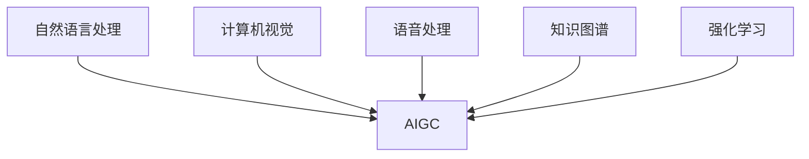
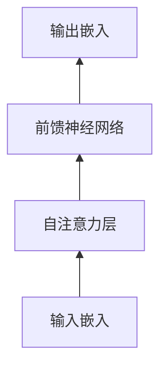
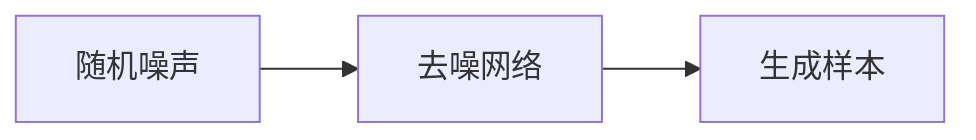

# AIGC从入门到实战：超强的"文科状元"

## 1. 背景介绍
### 1.1 人工智能与AIGC的崛起
人工智能(Artificial Intelligence, AI)经过几十年的发展,已经取得了令人瞩目的成就。尤其是近年来,随着深度学习、大数据、云计算等技术的突破,AI开始在许多领域大放异彩,成为引领新一轮科技革命和产业变革的战略性技术。

而AIGC(AI Generated Content)作为AI技术在内容创作领域的应用,更是引发了广泛关注。AIGC利用AI算法,自动生成文本、图像、音频、视频等多种形式的内容,极大地提高了内容生产的效率和质量。从某种意义上说,AIGC正在成为一种"超强的文科状元",在创意、写作、艺术等领域展现出惊人的能力。

### 1.2 AIGC的应用前景
AIGC在诸多领域都有广阔的应用前景,例如:

- 在新闻传媒领域,AIGC可以自动生成新闻报道,提高新闻生产效率;
- 在教育领域,AIGC可以生成个性化的教学内容,实现因材施教; 
- 在游戏领域,AIGC可以自动生成游戏关卡、NPC对话等内容,丰富游戏内容;
- 在营销领域,AIGC可以生成产品文案、广告创意等,助力营销自动化;
- 在艺术创作领域,AIGC可以创作出令人惊艳的数字艺术作品,开启全新的艺术形式。

可以预见,AIGC将在未来释放出巨大的商业价值和创新动能,成为数字经济时代的"超级引擎"。本文将带领读者从入门到实战,系统掌握AIGC的核心原理和关键技术,开启AIGC之旅。

## 2. 核心概念与联系
### 2.1 人工智能的定义与分类
人工智能是研究、开发用于模拟、延伸和扩展人的智能的理论、方法、技术及应用系统的一门新的技术科学。根据实现方式和应用领域,人工智能可以分为以下几类:

- 符号主义AI:通过符号推理、知识表示等方式实现智能,代表技术有专家系统等。
- 连接主义AI:模拟大脑神经网络结构,通过网络连接实现智能,代表技术有深度学习等。 
- 行为主义AI:通过感知-动作映射实现智能,代表技术有强化学习等。
- 混合AI:综合运用以上多种AI范式,实现更强大的智能。

### 2.2 AIGC的定义与特点
AIGC是人工智能在内容生成领域的应用,指利用AI算法自动生成文本、图像、音频、视频等内容的技术。与传统的内容创作方式相比,AIGC具有以下特点:

- 高效:AIGC可以在短时间内生成海量内容,效率远超人工创作。
- 个性化:AIGC可以根据用户画像生成个性化内容,提供定制化服务。
- 智能化:AIGC生成的内容在创意、逻辑、情感等方面都有不错的表现,具有一定智能。
- 多样化:AIGC可以生成文本、图像、音频、视频等多种形式的内容,应用场景丰富。

### 2.3 AIGC的关键技术
AIGC涉及多个AI领域的关键技术,主要包括:

- 自然语言处理:用于文本内容生成,如文本生成、对话生成、写作助手等。
- 计算机视觉:用于图像、视频内容生成,如图像生成、视频生成、虚拟主播等。  
- 语音处理:用于音频内容生成,如语音合成、音乐生成等。
- 知识图谱:用于提供结构化知识,增强内容生成的逻辑和连贯性。
- 强化学习:用于优化内容生成策略,提高内容质量。

以上技术相互配合,构成了AIGC的核心架构:

## 3. 核心算法原理与操作步骤
### 3.1 Transformer模型
Transformer是AIGC的核心算法模型,广泛应用于文本生成、图像生成等任务。它摒弃了传统的RNN/CNN结构,完全基于Attention机制,并引入了自注意力、多头注意力等创新机制,极大地提高了建模能力。Transformer的基本结构如下:

Transformer的训练过程通常包括以下步骤:

1. 准备大规模语料数据,进行清洗和预处理。
2. 对输入序列进行嵌入表示,加入位置编码。
3. 通过自注意力机制,计算序列内部的依赖关系。
4. 通过前馈神经网络,对特征进行非线性变换。
5. 重复步骤3-4多个Transformer Block,提取深层特征。
6. 根据任务类型设置输出层,计算损失函数。
7. 利用优化算法(如Adam)迭代更新模型参数,直至收敛。

### 3.2 GPT模型
GPT(Generative Pre-trained Transformer)是OpenAI开发的大型语言模型,在Transformer基础上进行了改进和扩展,是当前AIGC领域的SOTA模型。GPT的主要特点包括:

- 海量预训练:在超大规模语料上进行无监督预训练,学习通用语言知识。
- 任务微调:在特定任务数据上进行微调,快速适应下游任务。
- 零样本学习:无需标注数据,直接通过prompt学习完成任务。
- 多任务学习:可同时处理对话、写作、问答、摘要等多种任务。

GPT的训练过程与Transformer类似,但加入了一些改进:

1. 使用更大规模的语料数据(如Common Crawl)进行预训练。
2. 采用Byte Pair Encoding(BPE)算法构建subword词表,平衡词汇量和计算效率。
3. 在预训练阶段使用Language Modeling目标,预测下一个token。
4. 在微调阶段使用Prefix Language Modeling,根据prompt预测答案。
5. 使用Beam Search、Top-k Sampling等解码策略生成文本。

目前GPT已发展到第4代(GPT-4),在多个NLP基准测试中取得了超越人类的成绩,是AIGC的代表性模型。

### 3.3 扩散模型
扩散模型(Diffusion Model)是一种生成式模型,最初用于图像生成领域,后扩展到音频、视频、3D等领域。其基本思想是:将数据分布看作一个扩散过程,通过逐步添加高斯噪声破坏数据,然后学习逆转该过程以生成数据。扩散模型的生成过程如下:

扩散模型的训练过程通常包括以下步骤:

1. 定义前向扩散过程,对原始数据分布逐步添加高斯噪声。
2. 定义逆向去噪过程,学习从噪声恢复原始数据。
3. 构建时间感知的去噪自回归模型,输入带噪声的数据和时间步,输出去噪结果。
4. 采用加权平均的变分下界(VLB)作为训练目标,最大化似然概率。 
5. 在生成阶段,从高斯噪声出发,迭代去噪直至生成干净样本。

扩散模型在图像生成领域取得了瞩目成绩,代表模型有DALL-E、Stable Diffusion等,生成效果已接近真实图像。同时扩散模型也被用于语音合成、视频生成等任务,展现出广阔的应用前景。

## 4. 数学模型与公式详解
### 4.1 Transformer的数学原理
Transformer的核心是自注意力机制(Self-Attention),可以建模序列内部的长距离依赖关系。对于输入序列$X=(x_1,…,x_n)$,自注意力的计算过程为:

1. 计算查询矩阵$Q$、键矩阵$K$、值矩阵$V$:

$$
\begin{aligned}
Q &= XW^Q \\
K &= XW^K \\
V &= XW^V
\end{aligned}
$$

其中$W^Q,W^K,W^V$为可学习的参数矩阵。

2. 计算注意力权重$A$:

$$
A = \text{softmax}(\frac{QK^T}{\sqrt{d_k}})
$$

其中$d_k$为$K$的维度,用于缩放点积结果。

3. 计算注意力输出$Z$:

$$
Z = AV
$$

将$Z$与残差连接和Layer Normalization结合,得到自注意力层的输出。

Transformer还引入了多头注意力(Multi-head Attention),将$Q,K,V$划分为多个子空间,并行计算多个注意力,然后拼接结果:

$$
\text{MultiHead}(Q,K,V) = \text{Concat}(\text{head}_1,…,\text{head}_h)W^O
$$

其中$\text{head}_i=\text{Attention}(QW_i^Q,KW_i^K,VW_i^V)$。

最后,Transformer的前馈神经网络采用两层全连接网络,对特征进行非线性变换:

$$
\text{FFN}(x)=\text{ReLU}(xW_1+b_1)W_2+b_2
$$

通过堆叠多个Transformer Block,可以建模复杂的序列转换关系。

### 4.2 GPT的数学原理
GPT在Transformer的基础上,针对语言建模任务进行了优化。给定上文token序列$X=(x_1,…,x_t)$,GPT的目标是最大化下一个token $x_{t+1}$的条件概率:

$$
p(x_{t+1}|x_1,…,x_t)=\text{softmax}(h_t^{L}W_e^T)
$$

其中$h_t^L$为第$L$层Transformer Block的输出,$W_e$为token嵌入矩阵。

在预训练阶段,GPT采用Language Modeling目标,最大化整个序列的似然概率:

$$
\mathcal{L}_{LM}=\sum_{i=1}^{n}\log p(x_i|x_{<i})
$$

在微调阶段,GPT采用Prefix Language Modeling,根据prompt $P$生成答案$A$:

$$
p(A|P)=\prod_{i=1}^{|A|}p(a_i|P,a_{<i})
$$

同时为了提高生成质量,GPT还引入了一些采样策略,如Beam Search、Top-k Sampling等,平衡探索和利用:

$$
x_{t+1} \sim \text{TopKSampling}(p(x_{t+1}|x_{\leq t}),k)
$$

### 4.3 扩散模型的数学原理
扩散模型通过马尔可夫链定义了一个前向扩散过程,将数据分布$q(x_0)$逐步转变为先验分布$\pi(x_T)$(通常为高斯分布):

$$
q(x_{1:T}|x_0):=\prod_{t=1}^{T}q(x_t|x_{t-1}),\quad q(x_t|x_{t-1}):=\mathcal{N}(x_t;\sqrt{1-\beta_t}x_{t-1},\beta_t\mathbf{I})
$$

其中$\beta_1,…,\beta_T$为一系列噪声系数。

相应地,扩散模型学习逆向去噪过程,从先验分布采样噪声$x_T$,逐步去噪生成数据$\hat{x}_0$:

$$
p_\theta(x_{0:T}):=p(x_T)\prod_{t=1}^{T}p_\theta(x_{t-1}|x_t),\quad p_\theta(x_{t-1}|x_t):=\mathcal{N}(x_{t-1};\mu_\theta(x_t,t),\sigma_\theta(x_t,t)^2\mathbf{I})
$$

其中$\mu_\theta,\sigma_\theta$为可学习的均值和方差函数,通常用神经网络实现。

在训练过程中,扩散模型