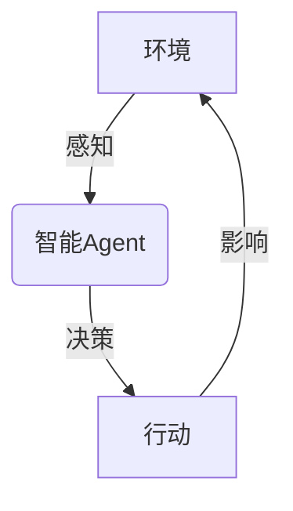

# AI人工智能 Agent：在仓储物流中的应用

## 1. 背景介绍

### 1.1 仓储物流的重要性

在当今快节奏的商业环境中，高效的仓储物流管理对于企业的成功至关重要。仓储物流是指将产品从供应商运送到分销中心或零售商的整个过程。这个过程涉及到库存管理、订单处理、包装、运输和最终交付等多个环节。良好的仓储物流管理可以确保产品及时送达客户手中,提高客户满意度,降低运营成本,提高企业竞争力。

### 1.2 传统仓储物流面临的挑战

然而,传统的仓储物流系统面临着诸多挑战:

- 人工操作效率低下且容易出错
- 库存管理复杂,难以实时跟踪
- 订单处理过程冗长且容易延误
- 物流路线规划不够优化,导致成本高昂

为了应对这些挑战,企业亟需采用先进的技术来优化和自动化仓储物流流程。

### 1.3 人工智能在仓储物流中的应用前景

人工智能(AI)技术在仓储物流领域的应用前景广阔。AI可以通过机器学习、计算机视觉、自然语言处理等技术,实现智能化的决策、优化和自动化,从而大幅提高仓储物流的效率和准确性。AI Agent作为一种智能系统,可以在仓储物流的各个环节发挥重要作用,为企业带来巨大的价值。

## 2. 核心概念与联系

### 2.1 人工智能(AI)

人工智能是一门研究如何使机器模拟人类智能行为的科学,包括感知、学习、推理、规划和控制等方面。AI系统通过机器学习算法从数据中获取知识,并应用于解决实际问题。

### 2.2 智能Agent

智能Agent是AI系统的核心概念之一。Agent是一种能够感知环境、作出决策并采取行动以实现目标的自主实体。在仓储物流中,AI Agent可以作为智能控制系统,对物流过程进行实时监控、决策和优化。

### 2.3 机器学习

机器学习是AI的一个重要分支,它使计算机能够从数据中自动学习和建模,而无需显式编程。在仓储物流中,机器学习可以用于预测需求、优化路线、识别异常等任务。

### 2.4 计算机视觉

计算机视觉是AI的另一个关键技术,它使计算机能够从图像或视频中获取有意义的信息。在仓储物流中,计算机视觉可以用于自动化包装、条形码扫描、库存盘点等环节。

### 2.5 自然语言处理

自然语言处理(NLP)是AI的一个分支,它研究如何让计算机能够理解和生成人类语言。在仓储物流中,NLP可以用于处理订单、客户服务等涉及语言交互的场景。

## 3. 核心算法原理具体操作步骤

在仓储物流中应用AI Agent涉及多种算法和技术,下面将介绍其中几种核心算法的原理和具体操作步骤。

### 3.1 库存优化算法

#### 3.1.1 算法原理

库存优化算法旨在确定最佳库存水平,以满足客户需求并最小化存货成本。常用的算法包括经济订货量(EOQ)模型、安全库存模型等。

EOQ模型的基本思想是,在每次补货时,订购量应该使订购成本和库存持有成本之和最小化。EOQ公式如下:

$$EOQ = \sqrt{\frac{2DC}{H}}$$

其中,D是年度需求量,C是每次订货的固定成本,H是每单位产品的年度库存持有成本。

#### 3.1.2 具体操作步骤

1. 收集历史销售数据和相关成本数据
2. 建立需求预测模型,预测未来一段时间的需求量
3. 根据预测需求量和相关成本,使用EOQ公式计算最优订货量
4. 设置适当的安全库存水平,以应对需求波动
5. 持续监控实际需求和库存水平,及时调整订货策略

### 3.2 路径规划算法

#### 3.2.1 算法原理

路径规划算法旨在为车辆或机器人找到从起点到终点的最优路径。常用的算法包括A*算法、迪杰斯特拉算法等。

A*算法是一种启发式搜索算法,它结合了广度优先搜索和贪心最佳优先搜索的优点。算法的基本思想是,在每一步中,选择估计总代价最小的节点进行扩展,直到找到目标节点。

估计总代价f(n)由两部分组成:

$$f(n) = g(n) + h(n)$$

其中,g(n)是从起点到当前节点n的实际代价,h(n)是从当前节点n到目标节点的估计代价(启发函数)。

#### 3.2.2 具体操作步骤

1. 构建地图表示,包括节点和边的信息
2. 定义启发函数h(n),通常使用曼哈顿距离或欧几里得距离
3. 初始化开放列表和闭合列表,将起点加入开放列表
4. 循环执行以下步骤,直到找到目标节点或开放列表为空:
   a. 从开放列表中选择估计总代价f(n)最小的节点n
   b. 如果n是目标节点,则返回路径
   c. 将n从开放列表移到闭合列表
   d. 对n的每个邻居节点m:
      - 计算从起点到m的新代价g(m)
      - 如果m在开放列表中,并且新代价更小,则更新m的代价和父节点
      - 如果m不在开放列表和闭合列表中,则将m加入开放列表,设置其代价和父节点
5. 如果开放列表为空,则说明没有路径可达

### 3.3 异常检测算法

#### 3.3.1 算法原理

异常检测算法旨在从大量数据中发现异常模式或数据点,这些异常可能表示错误、欺诈或其他异常情况。常用的算法包括基于统计的方法、基于聚类的方法、基于深度学习的方法等。

其中,基于深度学习的方法利用神经网络从数据中自动学习特征表示,并对异常进行检测和分类。常用的神经网络模型包括自编码器(Autoencoder)、生成对抗网络(GAN)等。

自编码器是一种无监督学习模型,它通过将输入数据压缩到低维空间,再从低维空间重构出原始数据,从而学习数据的潜在特征表示。对于正常数据,重构误差较小;对于异常数据,重构误差较大,从而可以检测出异常。

#### 3.3.2 具体操作步骤

1. 收集正常数据样本,对数据进行预处理(标准化、去噪等)
2. 构建自编码器模型,包括编码器和解码器两部分
3. 训练自编码器模型,使其学习正常数据的特征表示
4. 对新的数据输入进行编码和解码,计算重构误差
5. 设置异常阈值,将重构误差超过阈值的数据标记为异常
6. 可选:对检测到的异常进行进一步分析和处理

## 4. 数学模型和公式详细讲解举例说明

在仓储物流中应用AI Agent涉及多种数学模型和公式,下面将详细讲解其中几种常用模型。

### 4.1 经济订货量(EOQ)模型

EOQ模型是库存管理中最基本和最广泛使用的模型之一。它旨在确定每次订货的最优数量,使订货成本和库存持有成本之和最小化。

EOQ公式如下:

$$EOQ = \sqrt{\frac{2DC}{H}}$$

其中:

- D是年度需求量
- C是每次订货的固定成本
- H是每单位产品的年度库存持有成本

例如,假设一家零售商每年需求10000件产品,每次订货的固定成本为100元,每件产品的年度库存持有成本为2元。那么,经济订货量为:

$$EOQ = \sqrt{\frac{2 \times 10000 \times 100}{2}} = 1000 (件)$$

也就是说,零售商应该每次订购1000件产品,这样可以最小化订货成本和库存持有成本的总和。

需要注意的是,EOQ模型基于一些简化假设,如需求率已知且恒定、无缺货等。在实际应用中,可能需要结合其他模型和约束条件进行优化。

### 4.2 车辆路径规划模型

在仓储物流中,合理规划车辆路径可以显著提高运输效率和降低成本。常用的路径规划模型包括旅行商问题(TSP)和车辆路径问题(VRP)等。

#### 4.2.1 旅行商问题(TSP)

TSP是一个经典的组合优化问题,旨在找到一条最短的闭合路径,使给定的一组城市都被访问一次且仅一次。TSP可以用整数线性规划模型表示:

$$\min \sum_{i=1}^{n}\sum_{j=1}^{n}c_{ij}x_{ij}$$
$$\text{s.t.} \begin{cases}
\sum_{i=1}^{n}x_{ij}=1, & \forall j\\
\sum_{j=1}^{n}x_{ij}=1, & \forall i\\
\sum_{i\in S}\sum_{j\in S}x_{ij}\leq|S|-1, & \forall S\subset\{1,\ldots,n\},\ 2\leq|S|\leq n-1\\
x_{ij}\in\{0,1\}, & \forall i,j
\end{cases}$$

其中:

- n是城市数量
- $c_{ij}$是从城市i到城市j的距离或成本
- $x_{ij}$是决策变量,如果车辆从城市i前往城市j,则$x_{ij}=1$,否则为0

第一个约束确保每个城市被离开一次,第二个约束确保每个城市被访问一次,第三个约束消除了子环路。

TSP是一个NP难问题,对于大规模实例,通常使用启发式算法(如蚁群算法、模拟退火算法等)来求解近似最优解。

#### 4.2.2 车辆路径问题(VRP)

VRP是TSP的扩展,它考虑了多辆车辆、车辆容量限制、时间窗口等实际约束条件。VRP的目标是设计最小成本的路径,使所有客户点都被访问,且满足相关约束。

VRP可以用混合整数线性规划模型表示,模型的具体形式取决于所考虑的约束条件。一般来说,VRP比TSP更加复杂,求解更加困难。

### 4.3 异常检测模型

异常检测是数据挖掘和机器学习中的一个重要问题,在仓储物流中也有广泛应用。常用的异常检测模型包括基于统计的模型、基于聚类的模型和基于深度学习的模型等。

#### 4.3.1 基于统计的模型

基于统计的异常检测模型假设正常数据服从某种已知分布(如高斯分布),将偏离该分布的数据点视为异常。

例如,假设某个连续特征x服从均值为$\mu$、方差为$\sigma^2$的正态分布,那么x的异常分数可以定义为:

$$\text{异常分数}(x) = \frac{|x-\mu|}{\sigma}$$

如果异常分数超过一个阈值(如3),则将x标记为异常。

#### 4.3.2 基于聚类的模型

基于聚类的异常检测模型将数据划分为多个聚类,离群点或小聚类被视为异常。常用的聚类算法包括K-Means、DBSCAN等。

例如,在DBSCAN算法中,如果一个点的邻域半径eps内的点数少于minPts,则该点被标记为噪声点,视为异常。

#### 4.3.3 基于深度学习的模型

基于深度学习的异常检测模型利用神经网络从数据中自动学习特征表示,并对异常进行检测和分类。常用的模型包括自编码器、生成对抗网络等。

自编码器是一种无监督学习