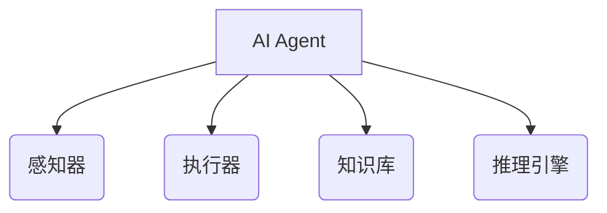
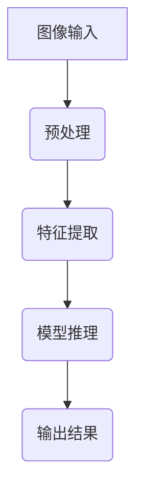
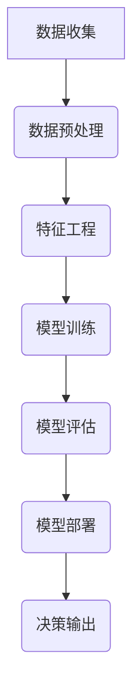
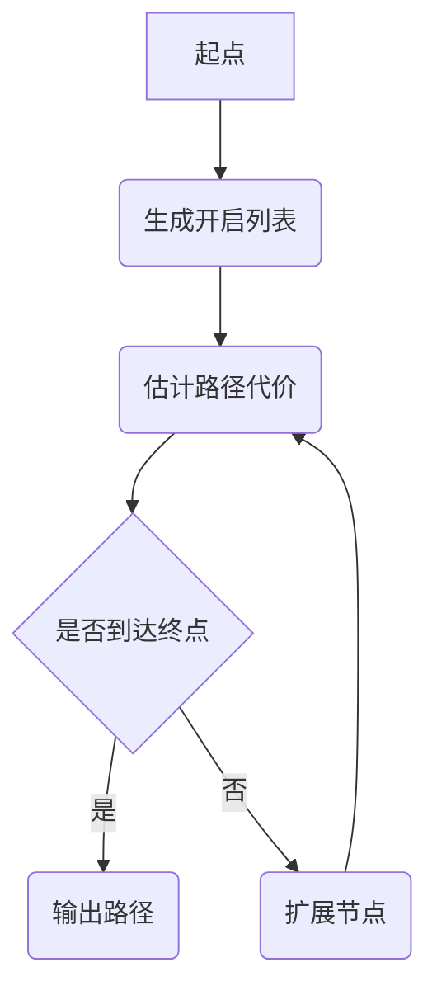
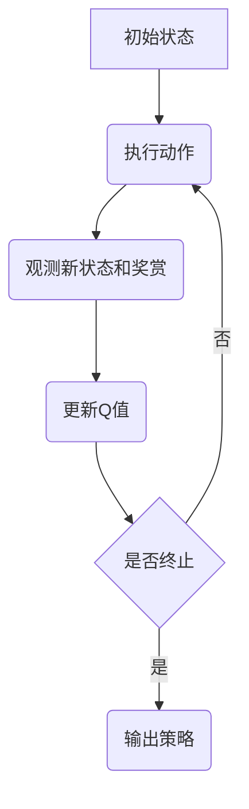

# AI人工智能 Agent：在新零售中的应用

## 1.背景介绍

### 1.1 新零售概念

新零售是阿里巴巴集团提出的一种融合线上线下、现代物流技术和大数据分析的新型零售模式。它旨在通过移动互联网、大数据和人工智能等现代信息技术手段,重塑传统零售业的生产、销售和流通环节,为消费者提供全新的购物体验。

### 1.2 人工智能在新零售中的作用

人工智能(AI)作为新零售的核心驱动力之一,在新零售各个环节发挥着重要作用。AI技术可以实现对消费者行为的精准分析和预测,优化供应链和物流,提升客户服务质量,并支持智能决策等,从而全面提升新零售的运营效率和用户体验。

### 1.3 AI Agent在新零售中的应用前景

作为人工智能的一个重要分支,AI Agent(智能代理)具有自主性、反应性、主动性和社会性等特点,在新零售场景中具有广阔的应用前景。AI Agent可以作为虚拟购物助理、智能推荐系统、客户服务机器人等角色,为消费者提供个性化的服务和购物体验。

## 2.核心概念与联系

### 2.1 AI Agent概念

AI Agent是一种具有自主性、反应性、主动性和社会性的智能系统,能够感知环境、处理信息、作出决策并采取行动。AI Agent通常由以下几个核心组件构成:

- 感知器(Sensors):用于获取环境信息
- 执行器(Actuators):用于对环境进行操作
- 知识库(Knowledge Base):存储Agent的知识和规则
- 推理引擎(Inference Engine):根据知识库进行推理和决策

### 2.2 AI Agent在新零售中的作用

在新零售场景中,AI Agent可以扮演多种角色,如虚拟购物助理、智能推荐系统、客户服务机器人等,为消费者提供个性化的服务和购物体验。AI Agent可以通过以下方式发挥作用:

- 个性化推荐:基于用户行为和偏好,为用户推荐感兴趣的商品和服务
- 智能客服:通过自然语言处理技术,提供7*24小时的智能客户服务
- 购物导航:根据用户需求,规划最优购物路线和方案
- 供应链优化:利用大数据分析和机器学习,优化供应链和物流安排

## 3.核心算法原理具体操作步骤  

### 3.1 AI Agent核心算法概述

AI Agent的核心算法主要包括以下几个方面:

1. **感知算法**:用于从环境中获取信息,如计算机视觉、自然语言处理等。
2. **决策算法**:根据感知信息和知识库,作出相应决策,如规则推理、机器学习等。
3. **行为规划算法**:将决策转化为具体的行动计划,如路径规划、任务分解等。
4. **学习算法**:通过与环境的交互,不断优化知识库和决策模型,如强化学习、迁移学习等。

### 3.2 感知算法

感知算法是AI Agent获取环境信息的基础,主要包括以下几种类型:

1. **计算机视觉**:通过图像处理和模式识别技术,从视觉信号中提取有用信息,如目标检测、图像分类等。
2. **自然语言处理**:通过语音识别、语义分析等技术,从自然语言中提取有用信息,如意图识别、情感分析等。
3. **传感器融合**:将来自多种传感器的信息进行融合,获取更加全面的环境信息,如激光雷达、惯性测量单元等。

以计算机视觉为例,其基本流程如下:

1. 图像输入:获取来自摄像头或图像文件的图像数据。
2. 预处理:对图像进行resize、归一化等预处理操作。
3. 特征提取:使用卷积神经网络等模型,从图像中提取有用的特征。
4. 模型推理:将提取的特征输入到分类器或检测器中,进行推理和预测。
5. 输出结果:输出分类或检测的结果,如物体类别、位置等。

### 3.3 决策算法

决策算法是AI Agent作出决策的核心,主要包括以下几种类型:

1. **规则推理**:基于预定义的规则和知识库,进行逻辑推理和决策,如专家系统、语义网络等。
2. **机器学习**:通过学习大量数据,构建决策模型,如决策树、支持向量机等。
3. **深度学习**:利用深层神经网络模型,从原始数据中自动学习特征和模式,如卷积神经网络、递归神经网络等。
4. **强化学习**:通过与环境的交互,不断优化决策策略,获得最优行为序列,如Q-Learning、策略梯度等。

以机器学习决策为例,其基本流程如下:

1. 数据收集:从各种来源收集相关数据,如用户行为日志、商品信息等。
2. 数据预处理:对数据进行清洗、标注、切分等预处理操作。
3. 特征工程:从原始数据中提取有用的特征,作为模型的输入。
4. 模型训练:使用机器学习算法,基于特征和标签数据训练决策模型。
5. 模型评估:在测试集上评估模型的性能,如准确率、召回率等指标。
6. 模型部署:将训练好的模型部署到生产环境中。
7. 决策输出:输入新的数据,由模型进行决策并输出结果。

### 3.4 行为规划算法

行为规划算法用于将AI Agent的决策转化为具体的行动计划,主要包括以下几种类型:

1. **路径规划**:计算从起点到终点的最优路径,如A*算法、RRT算法等。
2. **任务规划**:将复杂任务分解为多个子任务,并安排执行顺序,如层次任务网络、部分序计划等。
3. **运动规划**:计算机器人或机械臂的运动轨迹,避免碰撞和满足约束,如采样规划、优化规划等。
4. **决策过程建模**:将决策过程建模为马尔可夫决策过程或其他形式,求解最优策略,如动态规划、蒙特卡罗树搜索等。

以路径规划为例,A*算法的基本流程如下:

1. 起点:确定路径规划的起始位置。
2. 生成开启列表:将起点加入开启列表(Open List)。
3. 估计路径代价:对开启列表中的每个节点,估计从该节点到终点的代价。
4. 是否到达终点:检查是否有节点到达终点,如果有,则输出路径;否则继续执行。
5. 扩展节点:从开启列表中选取代价最小的节点,将其相邻节点加入开启列表。
6. 重复3-5步,直到找到终点或开启列表为空。

### 3.5 学习算法

学习算法使AI Agent能够通过与环境的交互,不断优化自身的知识库和决策模型,主要包括以下几种类型:

1. **监督学习**:基于标注的训练数据,学习映射关系,如分类、回归等。
2. **无监督学习**:从未标注的数据中发现潜在模式和结构,如聚类、降维等。
3. **强化学习**:通过与环境交互获得奖赏信号,不断优化决策策略,如Q-Learning、策略梯度等。
4. **迁移学习**:将在一个领域学习到的知识迁移到另一个领域,加速学习过程。
5. **元学习**:学习如何更好地学习,提高学习效率和泛化能力。

以强化学习为例,Q-Learning算法的基本流程如下:

1. 初始状态:获取当前环境状态。
2. 执行动作:根据当前状态,选择一个动作执行。
3. 观测新状态和奖赏:观测执行动作后的新状态,并获得相应的奖赏信号。
4. 更新Q值:根据新状态、奖赏和Q函数,更新状态-动作对的Q值估计。
5. 是否终止:检查是否达到终止条件,如任务完成或步数上限。如果终止,则输出最终策略;否则继续执行。
6. 重复2-5步,不断优化Q函数,直到收敛或达到性能要求。

## 4.数学模型和公式详细讲解举例说明

在AI Agent的各个核心算法中,都涉及到一些重要的数学模型和公式,下面将对其中几个代表性模型进行详细讲解和举例说明。

### 4.1 机器学习模型

#### 4.1.1 线性回归

线性回归是一种常用的监督学习模型,用于预测连续值目标变量。其数学表达式如下:

$$y = w_0 + w_1x_1 + w_2x_2 + ... + w_nx_n$$

其中:
- $y$是目标变量
- $x_1, x_2, ..., x_n$是特征变量
- $w_0, w_1, w_2, ..., w_n$是模型参数(权重)

通过最小化损失函数(如均方误差)来学习模型参数:

$$\min_{w} \sum_{i=1}^{m} (y_i - (w_0 + w_1x_{i1} + ... + w_nx_{in}))^2$$

其中$m$是训练样本数量。

**示例**:假设我们要预测某城市的房价,特征变量包括房屋面积、卧室数量和距市中心距离。我们可以构建如下线性回归模型:

$$\text{房价} = 50000 + 500 \times \text{面积} + 10000 \times \text{卧室数} - 2000 \times \text{距离}$$

#### 4.1.2 逻辑回归

逻辑回归是一种常用的分类模型,用于预测二值或多值目标变量。其数学表达式如下:

对于二值分类:
$$P(y=1|x) = \sigma(w_0 + w_1x_1 + ... + w_nx_n)$$

对于多值分类:
$$P(y=k|x) = \frac{e^{w_k^Tx}}{\sum_{j=1}^K e^{w_j^Tx}}$$

其中:
- $y$是目标变量,取值为0或1(二值分类)或$1,2,...,K$(多值分类)
- $x$是特征向量
- $w$是模型参数(权重向量)
- $\sigma(z) = \frac{1}{1+e^{-z}}$是Sigmoid函数

通过最大似然估计或交叉熵损失函数来学习模型参数。

**示例**:假设我们要构建一个二值分类模型,预测某人是否会购买某款产品,特征变量包括年龄、性别、收入等。我们可以构建如下逻辑回归模型:

$$P(\text{购买}=1|x) = \sigma(0.5 - 0.02 \times \text{年龄} + 0.8 \times \text{性别} + 0.005 \times \text{收入})$$

其中性别特征被编码为0(女性)或1(男性)。

### 4.2 深度学习模型

#### 4.2.1 多层感知机

多层感知机(Multilayer Perceptron, MLP)是一种基础的前馈