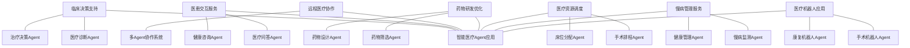

# AI人工智能 Agent：在智能医疗中的应用

## 1. 背景介绍

### 1.1 人工智能在医疗领域的发展历程

人工智能(Artificial Intelligence, AI)自1956年达特茅斯会议提出以来，经历了几次起起伏伏的发展。近年来，随着大数据、云计算、深度学习等技术的突破，AI迎来了新一轮的高速发展期。医疗健康作为AI技术的重要应用领域之一，正吸引着越来越多研究者的目光。

从20世纪60年代的专家系统，到90年代的机器学习，再到如今的深度学习，AI在医疗领域的应用不断深入。一方面，AI可以辅助医生进行疾病诊断、治疗方案制定、药物研发等，提高医疗效率和质量；另一方面，AI驱动的可穿戴设备、健康管理App等，让医疗服务触达更广泛的群体，实现了"智慧医疗"。

### 1.2 Agent技术概述

Agent是人工智能的一个重要分支，它是一种能感知环境、做出决策并采取行动的自主实体。相比传统的AI系统，Agent具有更强的自主性、社会性、反应性等特点。常见的Agent类型包括：

- 反应型Agent：根据当前感知做出决策，适合在动态环境中工作
- 目标型Agent：根据预先设定的目标选择行动，具有一定的规划能力  
- 效用型Agent：根据行为的效用(收益)选择最优决策
- 学习型Agent：通过与环境的交互不断学习和优化策略

在构建Agent系统时，需要考虑Agent的体系结构、知识表示、推理决策、学习优化等关键技术。目前，多Agent系统(MAS)作为一种分布式AI范式，在复杂问题求解中显示出独特优势，成为Agent研究的新热点。

### 1.3 将Agent应用于智能医疗的意义

医疗场景错综复杂，涉及疾病诊断、治疗、康复、照护等多个环节，同时还需平衡医疗资源配置、控制医疗成本等问题，对智能化提出了更高要求。引入Agent技术，有望突破医疗AI发展的瓶颈，主要表现在：

1. 支持医疗决策的自主性。Agent可根据医学知识和临床数据自主推理决策，辅助医生制定诊疗方案。

2. 增强医患交互的灵活性。医疗服务Agent可以与患者进行多轮对话，提供个性化咨询服务。

3. 优化医疗资源的协同性。多Agent协作有助于实现院内院外、区域内区域间的医疗资源优化配置。

4. 强化医疗服务的连续性。Agent可以跟踪患者全周期医疗数据，实现诊前诊后、院内院外的连续照护。

因此，研究智能医疗中的Agent应用，对于推动医疗服务的智能化升级、建设智慧医疗新生态具有重要意义。

## 2. 核心概念与联系

### 2.1 智能Agent的定义与特征

智能Agent是一种计算机系统，它能够根据环境的变化自主地采取行动，以实现预定的目标。智能Agent通常具有以下特征：

- 自主性(Autonomy)：Agent能够独立地感知环境、推理决策和执行任务，无需人工干预。
- 社会性(Sociality)：Agent之间能够通过一定机制进行通信、协商与合作。
- 反应性(Reactivity)：Agent能够及时感知环境的变化，并做出相应的反应。
- 主动性(Proactivity)：Agent不仅被动地响应环境，还能主动地执行任务以实现目标。
- 适应性(Adaptivity)：Agent能够根据环境的变化调整自身的行为策略。
- 移动性(Mobility)：Agent可在不同的主机或平台之间迁移。
- 柔性(Flexibility)：Agent的行为具有一定的灵活性，能处理不完全或不确定的信息。

### 2.2 Agent与传统AI系统的区别

相比传统的AI系统，Agent具有更强的自主性和适应性。传统AI系统通常采用集中式的问题求解模式，由人工设计输入、推理规则和控制流程，难以应对开放、动态的环境。而Agent采用分布式的架构，每个Agent根据局部信息独立地做出决策，通过Agent间的协同实现整体智能，更适合解决复杂问题。

此外，Agent强调与环境的交互，通过感知、行动、学习的反馈循环不断提升自身性能。传统AI系统则侧重知识的表示和推理，往往缺乏与环境的实时交互。

### 2.3 Agent在智能医疗中的应用场景

Agent技术在智能医疗中有广泛的应用前景，主要场景包括：

1. 临床决策支持：医疗诊断Agent可以辅助医生进行疾病诊断、治疗方案制定等。

2. 医患交互服务：医疗问答Agent可以为患者提供智能问诊、健康咨询等服务。

3. 远程医疗协作：多Agent系统可以支撑院间会诊、分级诊疗等远程医疗协作。

4. 药物研发优化：制药研发Agent可以加速新药筛选、药物设计等药物研发流程。

5. 医疗资源调度：医疗调度Agent可以优化手术排程、床位分配等医疗资源调度。

6. 慢病管理服务：慢病管理Agent可以为慢性病患者提供个性化的健康管理服务。

7. 医疗机器人应用：医疗机器人Agent可以执行手术操作、康复训练等医疗任务。

下图展示了Agent在智能医疗中的应用场景及其关联关系：



由上可见，将Agent应用于智能医疗，有助于打通医疗服务的各个环节，形成全流程、全周期的智慧医疗闭环，让医疗服务更加精准、高效、普惠。

## 3. 核心算法原理与操作步骤

### 3.1 Agent的体系结构

Agent的体系结构是实现其智能行为的基础。常见的Agent体系结构包括：

1. 反应型结构：通过"感知-行动"规则直接建立起环境状态到行为的映射。
2. BDI结构：由信念(Belief)、欲望(Desire)和意图(Intention)三部分组成，分别表示Agent对世界的认知、期望达到的目标和当前正在执行的计划。
3. 分层结构：将Agent的功能划分为反应层、规划层和交互层，分别负责快速响应、任务规划和Agent通信。
4. 黑板结构：通过共享黑板实现Agent内部模块间的通信与协作。

以BDI Agent为例，其核心算法可表示为：

```
Initialize-state();
while true do
  state = Get-new-state();
  options = Option-generator(state);
  selected_options = Deliberate(options);
  Update-intentions(selected_options);
  plan = Plan(intentions);
  Execute(plan);
  Update-beliefs(state);
end while
```

算法主要包括以下步骤：

1. 初始化Agent的内部状态，包括初始信念、欲望等。
2. 感知环境，获取当前状态。
3. 根据当前信念集生成可行的欲望集。 
4. 对欲望集进行审议，选出要达成的意图。
5. 根据当前意图生成可行的计划。
6. 执行计划，完成意图。
7. 根据环境反馈更新信念集。

BDI结构通过引入"心智"概念，使得Agent具备了更接近人类的推理决策模式，在应对复杂任务时表现出色。

### 3.2 多Agent协同算法

在智能医疗场景中，往往需要多个Agent协同完成任务，如远程会诊、分级诊疗等。多Agent协同的核心是设计高效的协商机制，以解决任务分配、资源共享、冲突消解等问题。常用的多Agent协同算法包括：

1. 契约网协议(Contract Net Protocol)：通过管理者Agent将任务分解并招标，由承包者Agent竞标并完成任务。

2. 分布式约束优化(DCOP)：每个Agent控制部分变量，通过传递消息优化全局约束。

3. argumentat ion：Agent通过论辩的方式解决冲突，达成一致。

4. 蚁群算法(Ant Colony Optimization)：通过模拟蚂蚁群体的信息素机制，实现Agent群体的涌现智能。

以契约网协议为例，其核心算法可表示为：

```
Manager:
  Decompose the task into subtasks;
  for each subtask do
    Announce the subtask to contractors;
    Receive and evaluate bids;
    Award the subtask to best bidder;
  end for
  Synthesize the results;

Contractor:  
  Receive the announced task;
  Evaluate capability to perform the task;
  if capable then
    Compute the bid;
    Submit the bid;
    if awarded then
      Perform the task;
      Report the result;
    end if
  end if  
```

算法主要包括以下步骤：

1. 管理者Agent将任务分解为多个子任务。
2. 管理者将子任务通过广播的方式发布给潜在的承包者Agent。
3. 承包者Agent评估自身能力，决定是否投标以及投标价格。
4. 管理者收集投标，选出最优承包者，并分配任务。
5. 中标的承包者执行子任务，并将结果返回给管理者。
6. 管理者收集各承包者的结果，合成为整体结果。

契约网协议通过"分布式任务分解与竞价"模式，可有效平衡负载、提升系统鲁棒性，被广泛应用于智能医疗的多Agent协同场景。

### 3.3 Agent博弈学习算法

在开放、动态的环境中，Agent往往面临着不确定性和部分可观察性的挑战。博弈学习是一种重要的范式，通过建模其他Agent的策略，不断调整自身策略以获得更优收益。常见的多Agent博弈学习算法包括：

1. 迭代最优响应(Fictitious Play)：每个Agent根据其他Agent的历史策略选择当前最优策略。

2. Nash Q-learning：在Q-learning框架下求解Nash均衡策略。

3. WoLF-PHC(Win or Learn Fast Policy Hill Climbing)：根据Agent的获胜或学习状态调整学习率。

4. 策略梯度(Policy Gradient)方法：通过随机梯度上升优化联合策略。

以Nash Q-learning为例，其核心算法可表示为：

```
Initialize Q(s,a1,a2) arbitrarily;
for each episode do
  Initialize s;
  while s is not terminal do
    Choose a1 using ε-greedy policy from Q1(s,·);
    Choose a2 using ε-greedy policy from Q2(s,·);
    Execute actions (a1,a2), observe r1, r2, s';
    Q1(s,a1) = (1-α)Q1(s,a1) + α[r1 + γ NashQ1(s')];
    Q2(s,a2) = (1-α)Q2(s,a2) + α[r2 + γ NashQ2(s')];
    s = s';
  end while  
end for

function NashQ(s')
  for each a1, a2 do
    NashQ1(s',a1) = min(Q2(s',·)) over a2;
    NashQ2(s',a2) = min(Q1(s',·)) over a1;
  end for
  return (NashQ1(s'), NashQ2(s'))
```

算法主要包括以下步骤：

1. 初始化联合Q值表Q(s,a1,a2)。
2. 每个episode开始时，初始化状态s。
3. 根据ε-贪婪策略选择联合动作(a1,a2)