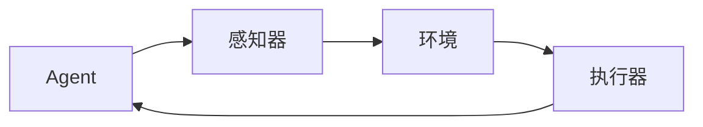

# AI人工智能 Agent：对生活的影响

## 1. 背景介绍

### 1.1 人工智能的兴起

人工智能(Artificial Intelligence, AI)作为一门新兴的交叉学科,已经在过去几十年里取得了长足的进步。从最初的专家系统和机器学习算法,到现在的深度学习和神经网络技术,AI已经渗透到了我们生活的方方面面。随着计算能力的不断提高和大数据时代的到来,AI技术的发展正在呈现出前所未有的加速态势。

### 1.2 AI Agent的概念

在人工智能领域中,AI Agent是一个非常重要的概念。AI Agent指的是一个感知环境、处理信息、做出决策并执行行动的自主系统。它可以是一个软件程序、机器人或其他具有一定智能的实体。AI Agent需要具备感知、学习、推理、规划和行动等多种能力,以便在特定环境中完成既定任务。

### 1.3 AI Agent的重要性

AI Agent在当今社会扮演着越来越重要的角色。它们可以应用于各个领域,如医疗保健、金融服务、制造业、交通运输、教育等,为人类生活带来了巨大的便利。同时,AI Agent也面临着一些挑战,如算法偏差、隐私和安全问题、伦理道德等,需要我们高度重视并加以解决。

## 2. 核心概念与联系

### 2.1 智能Agent

智能Agent是AI Agent的核心概念。它是一个具有自主性、反应性、主动性和持续性的系统,能够感知环境、处理信息、做出决策并采取行动。智能Agent需要具备以下几个关键特征:

1. **感知能力**:能够从环境中获取信息和数据。
2. **学习能力**:能够从经验中学习和改进自身。
3. **推理能力**:能够基于知识和规则进行推理和决策。
4. **规划能力**:能够制定行动计划以实现目标。
5. **行动能力**:能够在环境中执行行动。

### 2.2 Agent与环境的交互

智能Agent与其所处的环境之间存在着密切的交互关系。Agent通过感知器获取环境信息,并通过执行器对环境进行操作。这种交互过程可以用下面的Mermaid流程图来表示:



其中,Agent通过感知器感知环境状态,并根据感知到的信息做出决策,通过执行器对环境进行操作,从而改变环境状态。这个循环不断重复,直到Agent完成任务或者终止运行。

### 2.3 Agent类型

根据Agent的不同特征和功能,可以将其分为以下几种类型:

1. **简单反射Agent**:只根据当前感知到的信息做出反应,没有任何状态或记忆。
2. **基于模型的Agent**:维护一个内部状态,可以根据状态和感知信息做出决策。
3. **基于目标的Agent**:具有明确的目标,能够制定行动计划以实现目标。
4. **基于效用的Agent**:根据效用函数评估不同行为的效用,选择效用最大的行为。
5. **学习Agent**:能够从经验中学习和改进自身行为。

## 3. 核心算法原理具体操作步骤

### 3.1 搜索算法

搜索算法是AI Agent中常用的一种算法,用于在给定的问题空间中寻找解决方案。常见的搜索算法包括:

1. **盲目搜索算法**:
   - 广度优先搜索(Breadth-First Search, BFS)
   - 深度优先搜索(Depth-First Search, DFS)
   - 迭代加深搜索(Iterative Deepening Search, IDS)

2. **启发式搜索算法**:
   - 贪心搜索(Greedy Search)
   - A*搜索(A* Search)

以A*搜索算法为例,其具体操作步骤如下:

1. 初始化开放列表和闭合列表,将起点加入开放列表。
2. 从开放列表中选取估价函数值最小的节点作为当前节点。
3. 如果当前节点是目标节点,则搜索成功,返回路径。
4. 否则,将当前节点从开放列表移到闭合列表,并将其所有邻居节点加入开放列表。
5. 重复步骤2-4,直到找到目标节点或开放列表为空(搜索失败)。

### 3.2 机器学习算法

机器学习算法是AI Agent中另一种重要的算法类型,它使Agent能够从数据中学习和改进自身。常见的机器学习算法包括:

1. **监督学习算法**:
   - 线性回归
   - 逻辑回归
   - 支持向量机(SVM)
   - 决策树
   - 神经网络

2. **无监督学习算法**:
   - 聚类算法(K-Means、层次聚类等)
   - 关联规则挖掘
   - 降维算法(PCA、t-SNE等)

3. **强化学习算法**:
   - Q-Learning
   - Sarsa
   - 策略梯度算法

以Q-Learning算法为例,其具体操作步骤如下:

1. 初始化Q表,所有状态-动作对的Q值设为0或随机值。
2. 对于每个时间步:
   a. 根据当前状态,选择一个动作(利用探索-利用权衡策略)。
   b. 执行选择的动作,观察到新状态和奖励。
   c. 更新Q表中相应的Q值。
3. 重复步骤2,直到收敛或达到最大迭代次数。

## 4. 数学模型和公式详细讲解举例说明

### 4.1 马尔可夫决策过程(MDP)

马尔可夫决策过程(Markov Decision Process, MDP)是强化学习中常用的数学模型,用于描述Agent与环境的交互过程。MDP由以下几个要素组成:

- 状态集合 $S$
- 动作集合 $A$
- 转移概率 $P(s'|s,a)$,表示在状态 $s$ 下执行动作 $a$ 后转移到状态 $s'$ 的概率
- 奖励函数 $R(s,a,s')$,表示在状态 $s$ 下执行动作 $a$ 后转移到状态 $s'$ 所获得的奖励
- 折扣因子 $\gamma \in [0,1]$,用于权衡即时奖励和长期奖励的重要性

MDP的目标是找到一个最优策略 $\pi^*$,使得在该策略下的期望累积奖励最大化:

$$
\pi^* = \arg\max_\pi \mathbb{E}\left[\sum_{t=0}^\infty \gamma^t R(s_t, a_t, s_{t+1}) \mid \pi\right]
$$

其中 $s_t$ 和 $a_t$ 分别表示时间步 $t$ 的状态和动作。

### 4.2 Q-Learning算法

Q-Learning是一种基于时间差分的强化学习算法,用于求解MDP的最优策略。它维护一个Q表,其中每个元素 $Q(s,a)$ 表示在状态 $s$ 下执行动作 $a$ 的期望累积奖励。Q-Learning算法的更新规则如下:

$$
Q(s_t, a_t) \leftarrow Q(s_t, a_t) + \alpha \left[r_t + \gamma \max_{a'} Q(s_{t+1}, a') - Q(s_t, a_t)\right]
$$

其中:

- $\alpha$ 是学习率,控制新信息对Q值的影响程度
- $r_t$ 是在时间步 $t$ 获得的即时奖励
- $\gamma$ 是折扣因子,用于权衡即时奖励和长期奖励的重要性
- $\max_{a'} Q(s_{t+1}, a')$ 是在状态 $s_{t+1}$ 下可获得的最大期望累积奖励

通过不断更新Q表,Q-Learning算法最终会收敛到最优策略。

### 4.3 深度强化学习

传统的强化学习算法存在一些局限性,如状态空间和动作空间过大时计算效率低下、难以处理高维观测数据等。深度强化学习(Deep Reinforcement Learning)通过将深度神经网络引入强化学习,克服了这些局限性。

在深度强化学习中,我们使用神经网络来近似Q函数或策略函数,而不是维护一个巨大的Q表。神经网络的输入是当前状态(或观测),输出是对应的Q值或动作概率。通过反向传播算法,神经网络可以从经验数据中学习,从而逐渐改进Q函数或策略函数的近似。

深度强化学习算法包括深度Q网络(Deep Q-Network, DQN)、策略梯度算法(Policy Gradient)等,它们在许多领域取得了突破性的进展,如游戏AI、机器人控制等。

## 5. 项目实践:代码实例和详细解释说明

为了更好地理解AI Agent的工作原理,我们将通过一个简单的网格世界示例来实现一个基于Q-Learning的智能Agent。

### 5.1 问题描述

假设我们有一个4x4的网格世界,其中包含以下几个元素:

- 起点(S):Agent的初始位置
- 终点(G):Agent的目标位置
- 障碍物(X):Agent无法通过的区域
- 空地(O):Agent可以自由移动的区域

Agent的目标是从起点出发,找到一条路径到达终点,并且尽可能获得更多的奖励。每移动一步,Agent会获得-1的奖励(代表能量消耗);到达终点时,Agent会获得+10的奖励。

### 5.2 环境实现

我们首先定义一个`GridWorld`类来表示网格世界环境:

```python
class GridWorld:
    def __init__(self):
        self.grid = [
            ['S', 'O', 'O', 'X'],
            ['O', 'O', 'X', 'O'],
            ['X', 'O', 'O', 'O'],
            ['O', 'X', 'O', 'G']
        ]
        self.agent_pos = (0, 0)  # 初始位置
        self.goal_pos = (3, 3)   # 目标位置
        self.actions = ['up', 'down', 'left', 'right']

    def step(self, action):
        # 根据动作更新Agent位置
        # 返回新状态、奖励和是否到达终点
        pass

    def reset(self):
        # 重置环境状态
        pass

    def render(self):
        # 渲染网格世界
        pass
```

`step`函数用于执行Agent的动作,并返回新状态、奖励和是否到达终点。`reset`函数用于重置环境状态。`render`函数用于渲染网格世界的可视化界面。

### 5.3 Q-Learning Agent实现

接下来,我们实现一个基于Q-Learning的智能Agent:

```python
class QLearningAgent:
    def __init__(self, env, alpha=0.1, gamma=0.9, epsilon=0.1):
        self.env = env
        self.q_table = {}  # 初始化Q表
        self.alpha = alpha  # 学习率
        self.gamma = gamma  # 折扣因子
        self.epsilon = epsilon  # 探索率

    def get_q_value(self, state, action):
        # 从Q表中获取Q值,如果不存在则返回0
        pass

    def update_q_value(self, state, action, next_state, reward):
        # 根据Q-Learning更新规则更新Q值
        pass

    def choose_action(self, state):
        # 根据epsilon-greedy策略选择动作
        pass

    def learn(self, num_episodes):
        # 进行多轮训练
        pass
```

在`QLearningAgent`类中,我们定义了获取Q值、更新Q值、选择动作和进行训练的方法。其中,`choose_action`方法使用了epsilon-greedy策略,即以一定概率选择最优动作,以一定概率随机选择动作,这样可以在利用已学习的知识和探索新知识之间达成平衡。

### 5.4 训练和测试

最后,我们编写一个主函数来训练和测试我们的智能Agent:

```python
def main():
    env = GridWorld()
    agent = QLearningAgent(env)

    # 训练Agent
    num_episodes = 1000
    agent.learn(num_episodes)

    # 测试Agent
    state = env.reset()
    while True:
        action = agent.choose_action(state)
        next_state, reward, done = env.step(action)
        env.render()
        if done:
            break
        state = next_state

if __name__ == "__main__":
    main()
```

在主函数中,我们首先创