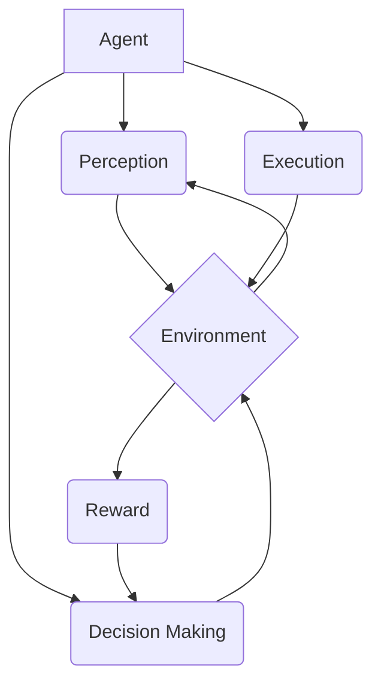

# AI人工智能 Agent：智能体策略迭代与优化

## 1. 背景介绍
### 1.1 人工智能的发展历程
#### 1.1.1 人工智能的起源与定义
#### 1.1.2 人工智能的三次浪潮
#### 1.1.3 人工智能的现状与挑战

### 1.2 智能体的概念与特点  
#### 1.2.1 智能体的定义
#### 1.2.2 智能体的特点
#### 1.2.3 智能体与传统AI系统的区别

### 1.3 智能体在人工智能中的地位与作用
#### 1.3.1 智能体是实现人工智能的关键
#### 1.3.2 智能体在各领域的应用
#### 1.3.3 智能体研究的意义

## 2. 核心概念与联系
### 2.1 智能体的组成要素
#### 2.1.1 感知模块
#### 2.1.2 决策模块 
#### 2.1.3 执行模块

### 2.2 智能体的分类
#### 2.2.1 按自主性分类
#### 2.2.2 按学习能力分类  
#### 2.2.3 按应用领域分类

### 2.3 智能体与环境的交互
#### 2.3.1 感知-决策-执行循环
#### 2.3.2 马尔可夫决策过程
#### 2.3.3 部分可观察马尔可夫决策过程

### 2.4 智能体策略
#### 2.4.1 策略的定义与表示
#### 2.4.2 确定性策略与随机性策略
#### 2.4.3 策略搜索空间

## 3. 核心算法原理具体操作步骤
### 3.1 策略迭代算法
#### 3.1.1 策略评估 
#### 3.1.2 策略改进
#### 3.1.3 策略迭代算法流程

### 3.2 值迭代算法
#### 3.2.1 贝尔曼最优方程 
#### 3.2.2 值迭代算法流程
#### 3.2.3 异步值迭代

### 3.3 蒙特卡洛方法
#### 3.3.1 蒙特卡洛估计 
#### 3.3.2 蒙特卡洛控制
#### 3.3.3 蒙特卡洛树搜索

### 3.4 时序差分学习
#### 3.4.1 TD(0)算法
#### 3.4.2 Sarsa算法
#### 3.4.3 Q-learning算法

### 3.5 深度强化学习
#### 3.5.1 DQN算法
#### 3.5.2 Policy Gradient算法
#### 3.5.3 Actor-Critic算法

## 4. 数学模型和公式详细讲解举例说明
### 4.1 马尔可夫决策过程
#### 4.1.1 MDP的数学定义
#### 4.1.2 MDP的贝尔曼方程
#### 4.1.3 MDP的最优策略存在性证明

### 4.2 值函数与贝尔曼方程
#### 4.2.1 状态值函数与动作值函数 
#### 4.2.2 贝尔曼期望方程
#### 4.2.3 贝尔曼最优方程

### 4.3 策略梯度定理
#### 4.3.1 策略梯度定理的数学表示
#### 4.3.2 策略梯度定理的推导过程
#### 4.3.3 策略梯度定理在算法中的应用

### 4.4 函数逼近器
#### 4.4.1 线性函数逼近器
#### 4.4.2 非线性函数逼近器
#### 4.4.3 深度神经网络作为函数逼近器

## 5. 项目实践：代码实例和详细解释说明
### 5.1 经典控制问题
#### 5.1.1 倒立摆问题
#### 5.1.2 山地车问题
#### 5.1.3 CartPole问题

### 5.2 Atari游戏
#### 5.2.1 Pong游戏
#### 5.2.2 Breakout游戏
#### 5.2.3 MsPacman游戏  

### 5.3 机器人控制
#### 5.3.1 机器人避障
#### 5.3.2 机器人寻路
#### 5.3.3 机械臂控制

### 5.4 代码实现与讲解
#### 5.4.1 Q-learning算法代码实现
#### 5.4.2 DQN算法代码实现
#### 5.4.3 REINFORCE算法代码实现

## 6. 实际应用场景
### 6.1 自动驾驶
#### 6.1.1 端到端学习方法
#### 6.1.2 模仿学习方法
#### 6.1.3 强化学习方法

### 6.2 智能推荐系统
#### 6.2.1 协同过滤推荐
#### 6.2.2 基于内容的推荐
#### 6.2.3 强化学习推荐

### 6.3 智能电网调度
#### 6.3.1 需求侧响应
#### 6.3.2 微电网能量管理
#### 6.3.3 电动汽车充电调度

### 6.4 智能医疗
#### 6.4.1 辅助诊断
#### 6.4.2 药物研发
#### 6.4.3 医疗机器人

## 7. 工具和资源推荐 
### 7.1 开发框架
#### 7.1.1 OpenAI Gym
#### 7.1.2 DeepMind Lab
#### 7.1.3 Unity ML-Agents

### 7.2 算法库
#### 7.2.1 Stable Baselines
#### 7.2.2 Ray RLlib
#### 7.2.3 Keras-RL

### 7.3 学习资源
#### 7.3.1 在线课程
#### 7.3.2 经典书籍
#### 7.3.3 论文与博客

## 8. 总结：未来发展趋势与挑战
### 8.1 智能体研究的前沿方向
#### 8.1.1 多智能体系统
#### 8.1.2 层次化强化学习
#### 8.1.3 迁移学习与元学习

### 8.2 智能体面临的挑战
#### 8.2.1 样本效率问题
#### 8.2.2 稳定性与收敛性问题
#### 8.2.3 安全性与可解释性问题

### 8.3 智能体的未来展望
#### 8.3.1 通用人工智能的实现路径
#### 8.3.2 智能体与人类的协作
#### 8.3.3 智能体的道德与伦理问题

## 9. 附录：常见问题与解答
### 9.1 如何选择合适的智能体算法？
### 9.2 如何设计智能体的奖励函数？
### 9.3 如何处理智能体学习中的探索与利用问题？
### 9.4 如何评估智能体策略的性能？
### 9.5 智能体技术在实际应用中需要注意哪些问题？

智能体（Agent）是人工智能领域的一个重要概念，它是一个能够感知环境、做出决策并采取行动的自主实体。智能体通过不断与环境交互，利用从环境获得的奖励信号来优化自身的决策策略，以期望获得最大的累积奖励。

智能体的决策过程通常被建模为马尔可夫决策过程（MDP），一个MDP由状态集合S、动作集合A、状态转移概率P和奖励函数R组成。智能体的目标是寻找一个最优策略 $\pi^*$，使得在该策略下智能体能够获得最大的期望累积奖励：

$$\pi^* = \arg\max_\pi \mathbb{E}[\sum_{t=0}^{\infty} \gamma^t R(s_t, a_t)]$$

其中，$\gamma \in [0,1]$ 是折扣因子，用于平衡当前奖励和未来奖励的重要性。

为了求解最优策略，研究者提出了多种智能体算法，包括动态规划、蒙特卡洛方法、时序差分学习等。这些算法通过不同的方式估计状态值函数 $V(s)$ 或动作值函数 $Q(s,a)$，并基于估计值来更新策略。以Q-learning算法为例，其更新公式为：

$$Q(s_t, a_t) \leftarrow Q(s_t, a_t) + \alpha [R(s_t, a_t) + \gamma \max_{a} Q(s_{t+1}, a) - Q(s_t, a_t)]$$

其中，$\alpha \in (0,1]$ 是学习率，控制每次更新的步长。

随着深度学习的发展，研究者开始将深度神经网络引入智能体算法，形成了深度强化学习范式。深度神经网络强大的函数拟合能力使得智能体能够处理高维、连续的状态空间，极大地拓展了强化学习的应用范围。

以深度Q网络（DQN）为例，它使用深度神经网络来逼近动作值函数 $Q(s,a)$。DQN的损失函数定义为：

$$L(\theta) = \mathbb{E}_{(s,a,r,s')\sim D} [(r + \gamma \max_{a'} Q(s', a'; \theta^-) - Q(s, a; \theta))^2]$$

其中，$\theta$ 是当前网络的参数，$\theta^-$ 是目标网络的参数，用于计算TD目标值。DQN通过最小化损失函数来更新网络参数，使得估计的Q值不断逼近真实的Q值。

除了DQN，还有多种深度强化学习算法，如Policy Gradient、Actor-Critic等。这些算法在不同的问题设定下展现出各自的优势，推动了智能体技术的不断发展。

智能体技术在许多领域都有广泛的应用，如自动驾驶、智能推荐系统、智能电网调度、智能医疗等。以自动驾驶为例，智能体可以通过强化学习算法来学习驾驶策略，根据车辆传感器采集的数据（如摄像头图像、雷达信号等）来控制车辆的加速、刹车和转向，实现自动驾驶功能。

尽管智能体技术取得了长足的进步，但它仍然面临诸多挑战，如样本效率问题、稳定性与收敛性问题、安全性与可解释性问题等。此外，如何实现通用人工智能、探讨智能体的道德与伦理问题也是亟待解决的难题。

展望未来，智能体技术有望在多智能体系统、层次化强化学习、迁移学习与元学习等前沿方向取得突破，并在更广泛的领域发挥重要作用。同时，智能体与人类的协作也将成为一个重要的研究课题，探索如何让智能体更好地理解和适应人类的需求，与人类和谐共处，共同应对未来的挑战。

作者：禅与计算机程序设计艺术 / Zen and the Art of Computer Programming