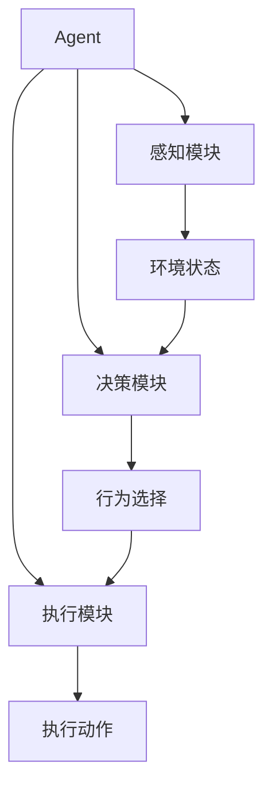

# AI人工智能 Agent：高级概念剖析

## 1. 背景介绍
### 1.1 人工智能的发展历程
#### 1.1.1 早期人工智能的探索
#### 1.1.2 专家系统的兴起
#### 1.1.3 机器学习的崛起
### 1.2 智能Agent的概念
#### 1.2.1 Agent的定义
#### 1.2.2 Agent的特点
#### 1.2.3 Agent与传统软件的区别
### 1.3 智能Agent的研究意义
#### 1.3.1 推动人工智能的发展
#### 1.3.2 解决复杂问题
#### 1.3.3 提高系统的自主性和适应性

## 2. 核心概念与联系
### 2.1 Agent的组成要素
#### 2.1.1 感知模块
#### 2.1.2 决策模块
#### 2.1.3 执行模块
### 2.2 Agent的分类
#### 2.2.1 反应型Agent
#### 2.2.2 基于模型的Agent
#### 2.2.3 基于目标的Agent
#### 2.2.4 基于效用的Agent
### 2.3 多Agent系统
#### 2.3.1 多Agent系统的定义
#### 2.3.2 多Agent系统的特点
#### 2.3.3 多Agent系统的应用



## 3. 核心算法原理具体操作步骤
### 3.1 强化学习算法
#### 3.1.1 马尔可夫决策过程
#### 3.1.2 值函数近似
#### 3.1.3 策略梯度方法
### 3.2 博弈论算法
#### 3.2.1 纳什均衡
#### 3.2.2 最优反应
#### 3.2.3 重复博弈
### 3.3 规划算法
#### 3.3.1 状态空间搜索
#### 3.3.2 启发式搜索
#### 3.3.3 分层规划

## 4. 数学模型和公式详细讲解举例说明
### 4.1 马尔可夫决策过程
#### 4.1.1 状态转移概率
$P(s'|s,a)$表示在状态$s$下执行动作$a$后转移到状态$s'$的概率。
#### 4.1.2 奖励函数
$R(s,a)$表示在状态$s$下执行动作$a$获得的即时奖励。
#### 4.1.3 贝尔曼方程
$$V(s) = \max_{a} \left\{ R(s,a) + \gamma \sum_{s'} P(s'|s,a) V(s') \right\}$$
其中，$V(s)$表示状态$s$的价值函数，$\gamma$为折扣因子。
### 4.2 博弈论模型
#### 4.2.1 策略
$\pi_i(a_i|s)$表示在状态$s$下，玩家$i$选择动作$a_i$的概率。
#### 4.2.2 纳什均衡
如果所有玩家的策略满足以下条件，则称为纳什均衡：
$$\forall i, \pi_i^* \in \arg\max_{\pi_i} U_i(\pi_i, \pi_{-i}^*)$$
其中，$U_i$表示玩家$i$的效用函数，$\pi_{-i}^*$表示其他玩家的均衡策略。

## 5. 项目实践：代码实例和详细解释说明
### 5.1 基于Q-learning的智能Agent
```python
import numpy as np

class QLearningAgent:
    def __init__(self, state_size, action_size, learning_rate, discount_factor, epsilon):
        self.state_size = state_size
        self.action_size = action_size
        self.learning_rate = learning_rate
        self.discount_factor = discount_factor
        self.epsilon = epsilon
        self.q_table = np.zeros((state_size, action_size))

    def choose_action(self, state):
        if np.random.uniform(0, 1) < self.epsilon:
            action = np.random.choice(self.action_size)
        else:
            action = np.argmax(self.q_table[state, :])
        return action

    def learn(self, state, action, reward, next_state):
        q_predict = self.q_table[state, action]
        q_target = reward + self.discount_factor * np.max(self.q_table[next_state, :])
        self.q_table[state, action] += self.learning_rate * (q_target - q_predict)
```
上述代码实现了一个基于Q-learning的智能Agent。Agent通过与环境交互，不断更新Q值表，学习最优策略。`choose_action`方法根据$\epsilon$-贪婪策略选择动作，`learn`方法根据Q-learning算法更新Q值表。

### 5.2 基于深度强化学习的智能Agent
```python
import numpy as np
import tensorflow as tf

class DQNAgent:
    def __init__(self, state_size, action_size, learning_rate, discount_factor, epsilon, memory_size, batch_size):
        self.state_size = state_size
        self.action_size = action_size
        self.learning_rate = learning_rate
        self.discount_factor = discount_factor
        self.epsilon = epsilon
        self.memory = []
        self.memory_size = memory_size
        self.batch_size = batch_size
        self.model = self._build_model()

    def _build_model(self):
        model = tf.keras.Sequential([
            tf.keras.layers.Dense(24, input_shape=(self.state_size,), activation='relu'),
            tf.keras.layers.Dense(24, activation='relu'),
            tf.keras.layers.Dense(self.action_size, activation='linear')
        ])
        model.compile(loss='mse', optimizer=tf.keras.optimizers.Adam(lr=self.learning_rate))
        return model

    def remember(self, state, action, reward, next_state, done):
        self.memory.append((state, action, reward, next_state, done))
        if len(self.memory) > self.memory_size:
            self.memory.pop(0)

    def choose_action(self, state):
        if np.random.uniform(0, 1) < self.epsilon:
            action = np.random.choice(self.action_size)
        else:
            q_values = self.model.predict(state)
            action = np.argmax(q_values[0])
        return action

    def replay(self):
        if len(self.memory) < self.batch_size:
            return
        minibatch = random.sample(self.memory, self.batch_size)
        states, actions, rewards, next_states, dones = zip(*minibatch)
        states = np.array(states)
        actions = np.array(actions)
        rewards = np.array(rewards)
        next_states = np.array(next_states)
        dones = np.array(dones)

        q_values = self.model.predict(states)
        next_q_values = self.model.predict(next_states)
        targets = rewards + (1 - dones) * self.discount_factor * np.max(next_q_values, axis=1)
        q_values[range(self.batch_size), actions] = targets
        self.model.fit(states, q_values, epochs=1, verbose=0)
```
上述代码实现了一个基于深度Q网络(DQN)的智能Agent。Agent使用神经网络来近似Q值函数，通过经验回放(Experience Replay)的方式进行训练。`remember`方法将交互数据存储到经验池中，`replay`方法从经验池中随机采样一个批次的数据进行训练，更新神经网络的参数。

## 6. 实际应用场景
### 6.1 智能游戏AI
智能Agent可以用于开发游戏AI，通过强化学习算法学习游戏策略，提高游戏的挑战性和趣味性。例如AlphaGo就是一个成功的案例，它通过深度强化学习的方法掌握了围棋的高超技巧，击败了世界顶尖的人类棋手。

### 6.2 自动驾驶
智能Agent可以应用于自动驾驶领域，通过感知环境信息，预测其他交通参与者的行为，规划最优的行驶路径和控制策略，实现安全、高效的自动驾驶。

### 6.3 智能推荐系统
智能Agent可以用于构建个性化推荐系统，通过分析用户的行为数据，学习用户的偏好和兴趣，为用户推荐最感兴趣的内容或商品，提高用户的满意度和粘性。

## 7. 工具和资源推荐
### 7.1 开源框架
- OpenAI Gym：强化学习环境库，提供了各种标准化的测试环境。
- TensorFlow：Google开源的深度学习框架，提供了强大的神经网络构建和训练功能。
- PyTorch：Facebook开源的深度学习框架，具有动态计算图和良好的可用性。
### 7.2 学习资源
- 《人工智能：一种现代的方法》：经典的人工智能教材，系统介绍了人工智能的基本概念和方法。
- 《强化学习导论》：强化学习领域的入门教材，深入浅出地讲解了强化学习的基本原理和算法。
- 《多智能体系统》：介绍多智能体系统的基本概念、理论和应用，是了解多智能体领域的好资源。

## 8. 总结：未来发展趋势与挑战
### 8.1 智能Agent的发展趋势
#### 8.1.1 多模态感知与决策
#### 8.1.2 跨领域迁移学习
#### 8.1.3 人机协同与交互
### 8.2 面临的挑战
#### 8.2.1 样本效率与泛化能力
#### 8.2.2 安全性与可解释性
#### 8.2.3 伦理与法律问题

## 9. 附录：常见问题与解答
### 9.1 智能Agent与传统软件的区别是什么？
智能Agent具有自主性、社会性、反应性和主动性等特点，能够根据环境的变化自主地做出决策和行动。而传统软件则是按照预先设定的流程和规则执行任务，缺乏自主性和适应性。

### 9.2 强化学习和监督学习有什么区别？
监督学习需要标注好的训练数据，通过最小化预测值与真实值之间的误差来学习。而强化学习通过智能体与环境的交互，根据奖励信号来学习最优策略，不需要预先准备标注数据。

### 9.3 如何评估智能Agent的性能？
可以通过以下几个方面来评估智能Agent的性能：
1. 任务完成的准确率和效率
2. 泛化能力，即在未见过的环境中的表现
3. 样本效率，即学习所需的交互数据量
4. 鲁棒性，即面对噪声和干扰的稳定性
5. 可解释性，即决策过程的可理解性和可追溯性

作者：禅与计算机程序设计艺术 / Zen and the Art of Computer Programming