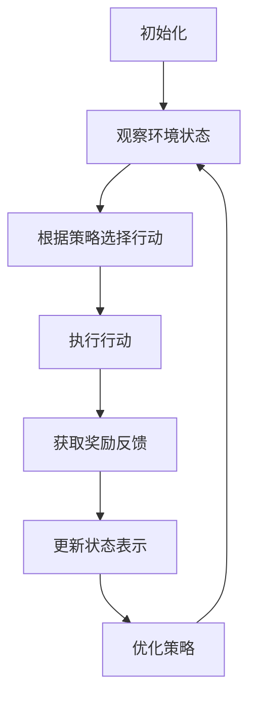

# AI人工智能代理工作流 AI Agent WorkFlow：动作的选择与执行

## 1.背景介绍

在当今时代,人工智能(AI)已经渗透到我们生活的方方面面。无论是智能助理、自动驾驶汽车,还是推荐系统和自然语言处理,AI都发挥着越来越重要的作用。然而,要构建一个真正智能的AI系统并非易事,它需要能够理解复杂的环境,做出明智的决策,并采取相应的行动。这就需要一个精心设计的AI代理工作流程。

AI代理工作流程描述了智能体如何感知环境,评估可行的行动选择,并执行最优行动。这是一个循环过程,代理需要不断地观察环境的变化,更新其状态表示,并相应地调整其行为。该工作流程是AI系统的核心,它确保了代理能够有效地与环境交互,并朝着既定目标前进。

## 2.核心概念与联系

在探讨AI代理工作流程之前,我们需要了解几个核心概念:

### 2.1 代理(Agent)

代理是指能够感知环境并在环境中采取行动的实体。它可以是一个软件程序、机器人或任何其他具有一定智能的系统。代理的目标是最大化某种预定义的效用函数或奖励信号。

### 2.2 环境(Environment)

环境是指代理所处的外部世界。它可以是物理世界、虚拟世界或任何其他可观测和可交互的领域。环境可以是完全可观测的(fully observable),也可以是部分可观测的(partially observable)。

### 2.3 状态(State)

状态是对环境的数学表示,它捕获了代理所需的所有相关信息。状态可以是离散的或连续的,静态的或动态的,确定性的或随机的。

### 2.4 行动(Action)

行动是代理可以在环境中执行的操作。它们可以是物理运动、决策或任何其他可能影响环境状态的操作。

### 2.5 奖励函数(Reward Function)

奖励函数定义了代理的目标。它将每个状态-行动对映射到一个数值奖励,代理的目标是最大化长期累积奖励。

### 2.6 策略(Policy)

策略是一个映射函数,它指导代理在给定状态下选择行动。一个好的策略应该能够最大化代理的长期累积奖励。

这些概念相互关联,构成了AI代理工作流程的基础。代理通过感知环境的状态,根据策略选择行动,并根据奖励函数评估行动的效果,不断优化其策略。

## 3.核心算法原理具体操作步骤

AI代理工作流程可以概括为以下几个步骤:



1. **初始化**: 设置代理的初始状态、策略和其他必要的参数。

2. **观察环境状态**: 代理通过感知器(sensors)获取环境的当前状态信息。

3. **根据策略选择行动**: 基于当前状态和策略,代理选择一个合适的行动。不同的策略可能会导致不同的行动选择,如贪婪策略(greedy policy)、随机策略(random policy)或基于价值函数的策略(value-based policy)等。

4. **执行行动**: 代理通过执行器(actuators)在环境中执行选定的行动。

5. **获取奖励反馈**: 环境根据奖励函数为代理的行动提供奖励或惩罚信号。

6. **更新状态表示**: 代理根据执行的行动和获得的奖励,更新其对环境状态的表示。

7. **优化策略**: 根据累积的经验,代理可以使用各种算法(如Q-Learning、Policy Gradient等)来优化其策略,以获得更好的长期累积奖励。

这个循环过程持续进行,直到达到终止条件(如任务完成或资源耗尽)。通过不断地与环境交互、学习和优化,代理可以逐步提高其策略的质量,从而更好地完成任务。

## 4.数学模型和公式详细讲解举例说明

为了更好地理解AI代理工作流程,我们需要引入一些数学模型和公式。

### 4.1 马尔可夫决策过程(Markov Decision Process, MDP)

马尔可夫决策过程是描述AI代理与环境交互的标准数学框架。一个MDP可以用一个元组 $(S, A, P, R, \gamma)$ 来表示,其中:

- $S$ 是状态集合
- $A$ 是行动集合
- $P(s'|s,a)$ 是状态转移概率,表示在状态 $s$ 下执行行动 $a$ 后,转移到状态 $s'$ 的概率
- $R(s,a,s')$ 是奖励函数,表示在状态 $s$ 下执行行动 $a$ 并转移到状态 $s'$ 时获得的奖励
- $\gamma \in [0,1)$ 是折现因子,用于权衡即时奖励和长期奖励的重要性

代理的目标是找到一个策略 $\pi: S \rightarrow A$,使得在遵循该策略时,从任意初始状态开始的长期累积奖励的期望值最大化:

$$
\max_\pi \mathbb{E}\left[\sum_{t=0}^\infty \gamma^t R(s_t, a_t, s_{t+1}) \Big| \pi, s_0\right]
$$

其中 $s_t$ 和 $a_t$ 分别表示在时间步 $t$ 的状态和行动。

### 4.2 价值函数(Value Function)

价值函数是评估一个状态或状态-行动对的好坏的指标。在MDP中,我们定义了两种价值函数:

1. **状态价值函数** $V^\pi(s)$: 表示在状态 $s$ 下遵循策略 $\pi$ 时,期望获得的长期累积奖励:

$$
V^\pi(s) = \mathbb{E}_\pi\left[\sum_{t=0}^\infty \gamma^t R(s_t, a_t, s_{t+1}) \Big| s_0 = s\right]
$$

2. **行动价值函数** $Q^\pi(s,a)$: 表示在状态 $s$ 下执行行动 $a$,之后遵循策略 $\pi$ 时,期望获得的长期累积奖励:

$$
Q^\pi(s,a) = \mathbb{E}_\pi\left[\sum_{t=0}^\infty \gamma^t R(s_t, a_t, s_{t+1}) \Big| s_0 = s, a_0 = a\right]
$$

价值函数满足以下递推关系式(Bellman方程):

$$
\begin{aligned}
V^\pi(s) &= \sum_{a \in A} \pi(a|s) \sum_{s' \in S} P(s'|s,a) \left[R(s,a,s') + \gamma V^\pi(s')\right] \\
Q^\pi(s,a) &= \sum_{s' \in S} P(s'|s,a) \left[R(s,a,s') + \gamma \sum_{a' \in A} \pi(a'|s')Q^\pi(s',a')\right]
\end{aligned}
$$

这些方程为我们提供了计算和优化价值函数的方法,例如通过动态规划或时序差分学习(Temporal Difference Learning)等算法。

### 4.3 策略优化

优化策略的目标是找到一个最优策略 $\pi^*$,使得对于任意状态 $s$,都有 $V^{\pi^*}(s) \geq V^\pi(s)$,即该策略在所有状态下的价值函数都不小于其他策略。

一种常见的策略优化方法是价值迭代(Value Iteration),它通过不断更新价值函数,直到收敛到最优价值函数,然后从最优价值函数中导出最优策略:

$$
\pi^*(s) = \arg\max_{a \in A} \sum_{s' \in S} P(s'|s,a) \left[R(s,a,s') + \gamma V^*(s')\right]
$$

另一种方法是策略迭代(Policy Iteration),它交替执行策略评估(Policy Evaluation)和策略改进(Policy Improvement)两个步骤,直到收敛到最优策略。

此外,还有一些基于梯度的策略优化算法,如REINFORCE、Actor-Critic等,它们通过估计策略的梯度,并沿着梯度方向更新策略参数,从而优化策略。

## 5.项目实践:代码实例和详细解释说明

为了更好地理解AI代理工作流程,我们将通过一个简单的网格世界(Gridworld)示例来实践。在这个示例中,代理需要从起点导航到终点,同时避免障碍物和陷阱。我们将使用Python和OpenAI Gym库来实现这个示例。

### 5.1 环境设置

首先,我们需要定义环境。在这个示例中,我们将使用OpenAI Gym的FrozenLake环境,它是一个4x4的网格世界。

```python
import gym
import numpy as np

env = gym.make('FrozenLake-v1')
```

我们可以通过以下方式查看环境的状态和行动空间:

```python
print("Observation space:", env.observation_space)
print("Action space:", env.action_space)
```

输出:

```
Observation space: Discrete(16)
Action space: Discrete(4)
```

这表示环境有16种可能的状态(4x4的网格),代理可以执行4种行动(上、下、左、右)。

### 5.2 Q-Learning算法实现

我们将使用Q-Learning算法来训练一个代理,以学习最优策略。Q-Learning是一种基于价值函数的强化学习算法,它通过不断更新行动价值函数 $Q(s,a)$ 来优化策略。

```python
import random

# 初始化Q表
Q = np.zeros((env.observation_space.n, env.action_space.n))

# 超参数
alpha = 0.1  # 学习率
gamma = 0.99  # 折现因子
epsilon = 0.1  # 探索率

# 训练episodes
for episode in range(10000):
    state = env.reset()
    done = False
    
    while not done:
        # 选择行动
        if random.uniform(0, 1) < epsilon:
            action = env.action_space.sample()  # 探索
        else:
            action = np.argmax(Q[state])  # 利用
        
        # 执行行动
        next_state, reward, done, _ = env.step(action)
        
        # 更新Q值
        Q[state, action] += alpha * (reward + gamma * np.max(Q[next_state]) - Q[state, action])
        
        state = next_state

# 导出最优策略
policy = np.argmax(Q, axis=1)
```

在这段代码中,我们首先初始化了一个Q表,用于存储每个状态-行动对的Q值。然后,我们进行了多次训练episodes,在每个episode中,代理与环境交互并不断更新Q表。

在每个时间步,代理根据当前状态和一定的探索策略(epsilon-greedy)选择行动。执行行动后,代理获得奖励并转移到下一个状态。然后,我们使用Q-Learning更新规则来更新Q表中相应的Q值。

经过足够的训练后,我们可以从Q表中导出最优策略,即在每个状态下选择Q值最大的行动。

### 5.3 可视化和评估

为了可视化代理的行为,我们可以使用OpenAI Gym提供的渲染功能:

```python
import time

state = env.reset()
done = False

while not done:
    env.render()
    action = policy[state]
    state, reward, done, _ = env.step(action)
    time.sleep(0.5)  # 暂停0.5秒,方便观察

print("Final reward:", reward)
```

这段代码将在每个时间步渲染环境,并根据学习到的策略执行相应的行动。我们还可以评估策略的性能,例如计算平均奖励:

```python
rewards = []
for episode in range(1000):
    state = env.reset()
    done = False
    total_reward = 0
    
    while not done:
        action = policy[state]
        state, reward, done, _ = env.step(action)
        total_reward += reward
    
    rewards.append(total_reward)

print("Average reward:", np.mean(rewards))
```

通过这个示例,我们可以更好地理解AI代理工作流程在实践中的应用。虽然这是一个简单的例子,但同样的原理也适用于更复杂的环境和任务。

## 6.实际应用场景

AI代理工作流程在许多实际应用场景中发挥着重要作用,例如: