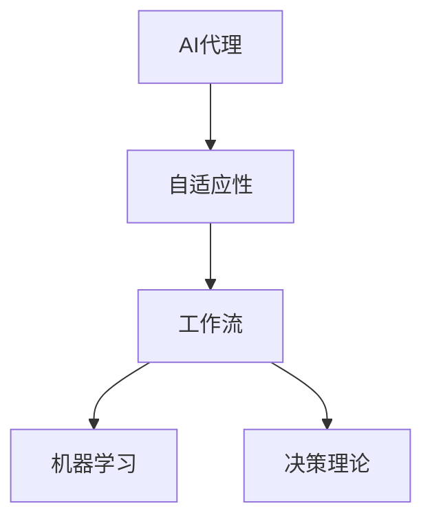
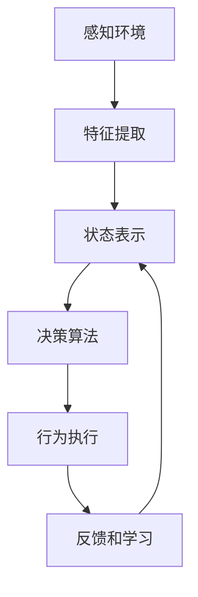

# AI人工智能代理工作流AI Agent WorkFlow：AI代理在视频游戏中的自适应机制

## 1.背景介绍

### 1.1 游戏AI代理的重要性

在视频游戏行业中,人工智能(AI)代理扮演着越来越重要的角色。AI代理是指在游戏环境中模拟智能行为的虚拟实体或代理。它们负责控制非玩家角色(NPCs)的行为,使游戏世界更加生动、有趣和具有挑战性。

### 1.2 游戏AI代理的挑战

然而,设计和实现高质量的游戏AI代理面临着诸多挑战。游戏环境通常是高度动态和不确定的,需要AI代理能够快速适应不断变化的情况。此外,AI代理必须表现出智能行为,例如制定策略、学习和决策,同时还要确保游戏的公平性和平衡性。

### 1.3 自适应AI代理工作流的重要性

为了应对这些挑战,研究人员和开发人员一直在探索各种技术和方法,以提高游戏AI代理的性能和适应性。其中,自适应AI代理工作流(Adaptive AI Agent Workflow)是一种有前景的方法,它利用机器学习和决策理论等技术,使AI代理能够动态调整其行为以适应不断变化的环境。

## 2.核心概念与联系

### 2.1 AI代理

AI代理是指在特定环境中感知和行动的自主实体。在游戏环境中,AI代理通常控制非玩家角色(NPCs)的行为,例如敌人、盟友或其他虚拟角色。

### 2.2 自适应性

自适应性是指系统根据环境变化动态调整其行为的能力。在游戏AI代理的背景下,自适应性意味着AI代理能够根据游戏状态、玩家行为和其他因素实时调整其决策和行为。

### 2.3 工作流

工作流是指一系列有序的步骤或阶段,用于完成特定任务或过程。在自适应AI代理工作流中,这些步骤包括感知环境、决策和执行行为,并通过反馈循环不断优化和调整。

### 2.4 机器学习

机器学习是人工智能的一个重要分支,它赋予系统从数据中学习和改进的能力。在自适应AI代理工作流中,机器学习技术可用于从游戏数据中学习模式和策略,从而优化AI代理的决策过程。

### 2.5 决策理论

决策理论是一个跨学科领域,研究如何在不确定性和风险条件下做出最优决策。在自适应AI代理工作流中,决策理论提供了一种框架,用于评估不同行为选择的后果并做出明智的决策。

### 2.6 核心概念关系图



## 3.核心算法原理具体操作步骤

自适应AI代理工作流的核心算法原理可以概括为以下步骤:

### 3.1 感知环境

AI代理首先需要从游戏环境中获取相关信息,包括游戏状态、玩家行为和其他重要数据。这可以通过各种传感器和观测机制来实现,例如视觉、听觉或其他虚拟传感器。

### 3.2 特征提取

从原始观测数据中提取有意义的特征是机器学习算法的关键输入。这些特征可能包括游戏对象的位置、玩家的行为模式或其他相关信息。特征提取过程通常需要领域知识和数据预处理技术。

### 3.3 状态表示

基于提取的特征,AI代理需要构建一个紧凑的状态表示,以捕获当前环境的关键方面。这种状态表示将用作决策算法的输入,因此它需要足够丰富以捕获相关信息,同时又足够紧凑以确保计算效率。

### 3.4 决策算法

决策算法是自适应AI代理工作流的核心部分。它基于当前状态表示,结合预定义的目标和约束,选择最佳的行为策略。常用的决策算法包括强化学习、蒙特卡罗树搜索、多臂老虎机算法等。

### 3.5 行为执行

一旦决策算法选择了最佳策略,AI代理就需要在游戏环境中执行相应的行为。这可能涉及移动、攻击、交互或其他游戏相关操作。

### 3.6 反馈和学习

在执行行为后,AI代理需要从环境中获取反馈,以评估其行为的效果。这种反馈可用于更新决策算法的参数或策略,从而在未来做出更好的决策。这种持续的学习过程是自适应性的关键。

### 3.7 算法流程图



## 4.数学模型和公式详细讲解举例说明

在自适应AI代理工作流中,常见的数学模型和公式包括:

### 4.1 马尔可夫决策过程 (MDP)

马尔可夫决策过程(Markov Decision Process, MDP)是一种广泛使用的数学框架,用于描述序贯决策问题。它由以下要素组成:

- 状态集合 $\mathcal{S}$
- 行为集合 $\mathcal{A}$
- 转移概率 $P(s' | s, a)$,表示在状态 $s$ 下执行行为 $a$ 后,转移到状态 $s'$ 的概率
- 奖励函数 $R(s, a, s')$,表示在状态 $s$ 下执行行为 $a$ 并转移到状态 $s'$ 时获得的奖励

MDP的目标是找到一个策略 $\pi: \mathcal{S} \rightarrow \mathcal{A}$,使得期望的累积奖励最大化。

$$
\max_\pi \mathbb{E}\left[\sum_{t=0}^\infty \gamma^t R(s_t, a_t, s_{t+1})\right]
$$

其中 $\gamma \in [0, 1]$ 是折现因子,用于权衡当前奖励和未来奖励的重要性。

### 4.2 Q-Learning

Q-Learning是一种基于MDP的强化学习算法,用于估计状态-行为对的价值函数 $Q(s, a)$,表示在状态 $s$ 下执行行为 $a$ 后可获得的期望累积奖励。Q-Learning的更新规则如下:

$$
Q(s_t, a_t) \leftarrow Q(s_t, a_t) + \alpha \left[R(s_t, a_t, s_{t+1}) + \gamma \max_{a'} Q(s_{t+1}, a') - Q(s_t, a_t)\right]
$$

其中 $\alpha$ 是学习率,控制着新信息对旧估计的影响程度。

### 4.3 蒙特卡罗树搜索 (MCTS)

蒙特卡罗树搜索(Monte Carlo Tree Search, MCTS)是一种基于随机采样的决策算法,常用于复杂的序贯决策问题,如国际象棋和围棋。MCTS通过构建一棵搜索树来逐步改进策略,其核心思想是在有限的时间内,通过多次随机模拟来评估每个可能的行为序列。

MCTS算法通常包括以下四个步骤:

1. **选择 (Selection)**: 从根节点开始,递归地选择最有前景的子节点,直到到达一个尚未完全探索的节点。
2. **扩展 (Expansion)**: 从未探索的节点创建一个或多个子节点,表示可能的后续状态。
3. **模拟 (Simulation)**: 从新创建的节点开始,通过随机模拟完成游戏,获得最终结果。
4. **反向传播 (Backpropagation)**: 将模拟结果反向传播到树中的所有祖先节点,更新它们的统计信息。

通过多次迭代上述步骤,MCTS可以逐步改进其策略,并在有限时间内做出较好的决策。

### 4.4 多臂老虎机 (MAB)

多臂老虎机(Multi-Armed Bandit, MAB)问题是一种经典的探索与利用权衡问题,常见于在线学习和决策场景。在MAB问题中,代理需要在一组不同的选择(臂)中做出决策,每个选择都有一个未知的奖励分布。目标是最大化累积奖励。

一种常见的MAB算法是上确信界(Upper Confidence Bound, UCB)算法,它通过估计每个臂的上确信界来权衡探索和利用:

$$
\text{UCB}(a) = \hat{\mu}_a + c \sqrt{\frac{\log n}{n_a}}
$$

其中 $\hat{\mu}_a$ 是臂 $a$ 的估计平均奖励, $n_a$ 是选择该臂的次数, $n$ 是总的决策次数, $c$ 是一个控制探索程度的常数。UCB算法倾向于选择具有较高上确信界的臂,从而在探索和利用之间达成平衡。

MAB算法在自适应AI代理工作流中可用于在线调整决策策略,以适应不断变化的环境。

## 5.项目实践:代码实例和详细解释说明

为了更好地理解自适应AI代理工作流的实现,我们将使用Python和OpenAI Gym环境进行一个简单的示例项目。在这个项目中,我们将训练一个强化学习代理来玩经典的"CartPole"游戏。

### 5.1 环境设置

首先,我们需要导入必要的库并创建环境:

```python
import gym
import numpy as np

# 创建环境
env = gym.make('CartPole-v1')
```

`CartPole-v1`是OpenAI Gym中的一个经典环境,代理需要通过向左或向右施加力来保持杆子直立。

### 5.2 Q-Learning实现

我们将使用Q-Learning算法来训练代理。首先,我们定义一个函数来初始化Q表:

```python
def initialize_q_table(state_space, action_space):
    q_table = np.zeros((state_space.shape[0], action_space.n))
    return q_table
```

接下来,我们实现Q-Learning算法的核心部分:

```python
def q_learning(env, q_table, episodes, learning_rate, discount_factor, exploration_rate, exploration_decay):
    for episode in range(episodes):
        state = env.reset()
        done = False
        while not done:
            # 探索与利用
            if np.random.uniform() < exploration_rate:
                action = env.action_space.sample()  # 探索
            else:
                action = np.argmax(q_table[state])  # 利用

            # 执行行为并获取反馈
            next_state, reward, done, _ = env.step(action)

            # 更新Q表
            q_table[state, action] += learning_rate * (
                reward + discount_factor * np.max(q_table[next_state]) - q_table[state, action]
            )

            state = next_state

        # 探索率衰减
        exploration_rate *= exploration_decay

    return q_table
```

这个函数实现了Q-Learning算法的核心逻辑,包括探索与利用、执行行为、获取反馈和更新Q表。我们还引入了探索率衰减机制,以确保代理在训练后期更多地利用已学习的策略。

### 5.3 训练和评估

现在,我们可以训练代理并评估其性能:

```python
# 初始化Q表
q_table = initialize_q_table(env.observation_space, env.action_space)

# 训练参数
episodes = 10000
learning_rate = 0.1
discount_factor = 0.99
exploration_rate = 1.0
exploration_decay = 0.999

# 训练代理
q_table = q_learning(env, q_table, episodes, learning_rate, discount_factor, exploration_rate, exploration_decay)

# 评估代理
total_rewards = 0
for _ in range(100):
    state = env.reset()
    done = False
    rewards = 0
    while not done:
        action = np.argmax(q_table[state])
        next_state, reward, done, _ = env.step(action)
        rewards += reward
        state = next_state
    total_rewards += rewards

print(f"Average reward over 100 episodes: {total_rewards / 100}")
```

在这个示例中,我们训练了10000个episodes,并在训练后评估代理在100个episodes中的平均奖励。

### 5.4 结果分析

通过运行上述代码,您应该能够看到代理在"CartPole"游戏中取得了不