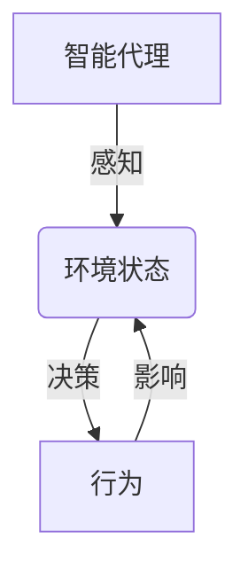
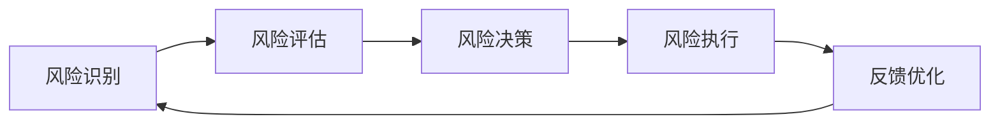
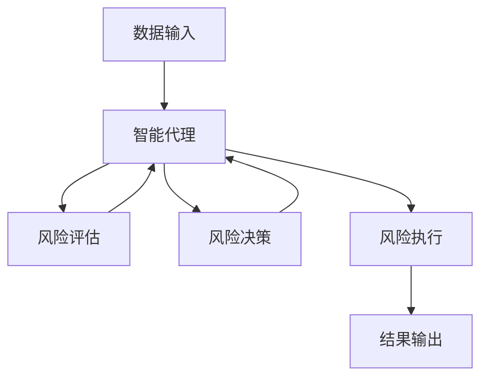
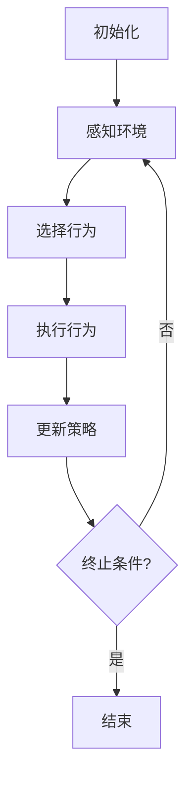

# AI人工智能代理工作流AI Agent WorkFlow：智能代理在保险风险管理系统中的应用

## 1.背景介绍

### 1.1 保险风险管理的重要性

保险行业是一个风险管理的重要领域。保险公司需要评估和管理各种风险,包括承保风险、理赔风险、投资风险等。有效的风险管理对于保险公司的盈利能力、声誉和长期可持续发展至关重要。

### 1.2 传统风险管理方法的局限性

传统的风险管理方法主要依赖人工处理,存在以下局限性:

- 效率低下:大量繁琐的手工操作,工作效率低下
- 人为失误:人工处理过程中容易出现失误和遗漏
- 缺乏智能化:无法对海量数据进行深入分析和智能决策

### 1.3 AI技术在风险管理中的应用前景

随着人工智能(AI)技术的快速发展,AI技术在保险风险管理领域展现出巨大的应用潜力。AI可以通过机器学习、自然语言处理、计算机视觉等技术,实现风险评估和决策的自动化和智能化,从而提高风险管理的效率和准确性。

## 2.核心概念与联系

### 2.1 智能代理(Intelligent Agent)

智能代理是AI系统中的一个关键概念。智能代理是指能够感知环境,并根据环境状态采取行动以实现既定目标的软件实体。在保险风险管理系统中,智能代理可以扮演风险评估、决策和执行的角色。



### 2.2 AI工作流(AI Workflow)

AI工作流是指将AI技术集成到业务流程中,实现智能化自动化的过程。在保险风险管理系统中,AI工作流可以将智能代理嵌入到风险管理的各个环节,如风险识别、评估、决策和执行等,形成一个端到端的智能化风险管理流程。



### 2.3 AI代理工作流(AI Agent Workflow)

AI代理工作流是指将智能代理嵌入到AI工作流中,形成一个以智能代理为核心的智能化业务流程。在保险风险管理系统中,AI代理工作流可以将智能代理作为风险管理的决策和执行中心,实现风险管理的自动化和智能化。



## 3.核心算法原理具体操作步骤

在AI代理工作流中,智能代理是核心组件,其算法原理和具体操作步骤如下:

### 3.1 智能代理算法原理

智能代理算法通常基于强化学习(Reinforcement Learning)和决策理论(Decision Theory)。智能代理会根据当前的环境状态和预定目标,选择一个最优行为,并执行该行为。然后,智能代理会观察行为执行后的新环境状态,并根据获得的奖励或惩罚来更新其决策策略。

$$
\begin{aligned}
\pi^*(s) &= \underset{a}{\mathrm{argmax}}\ Q^*(s, a) \\
Q^*(s, a) &= \mathbb{E}\left[R_t + \gamma \underset{a'}{\mathrm{max}}\ Q^*(S_{t+1}, a')\middle|S_t = s, A_t = a\right]
\end{aligned}
$$

其中:

- $\pi^*(s)$ 表示在状态 $s$ 下的最优策略
- $Q^*(s, a)$ 表示在状态 $s$ 下采取行为 $a$ 的最大预期累计奖励
- $R_t$ 表示在时间 $t$ 获得的即时奖励
- $\gamma$ 是折现因子,用于平衡即时奖励和长期奖励

### 3.2 智能代理具体操作步骤

1. **初始化**:初始化智能代理的状态、策略和参数。
2. **感知环境**:智能代理观察当前环境状态。
3. **选择行为**:根据当前状态和策略,选择一个最优行为。
4. **执行行为**:执行所选择的行为,并观察环境的反馈。
5. **更新策略**:根据行为执行后的新状态和获得的奖励或惩罚,更新智能代理的策略。
6. **重复步骤2-5**:重复上述步骤,直到达到预定目标或满足终止条件。



## 4.数学模型和公式详细讲解举例说明

在AI代理工作流中,数学模型和公式扮演着重要的角色,用于描述和优化智能代理的决策过程。以下是一些常用的数学模型和公式,以及详细的讲解和举例说明。

### 4.1 马尔可夫决策过程(Markov Decision Process, MDP)

马尔可夫决策过程是描述智能代理与环境交互的数学框架。MDP可以用一个元组 $(S, A, P, R, \gamma)$ 来表示,其中:

- $S$ 是状态集合
- $A$ 是行为集合
- $P(s'|s, a)$ 是状态转移概率,表示在状态 $s$ 下采取行为 $a$ 后转移到状态 $s'$ 的概率
- $R(s, a, s')$ 是奖励函数,表示在状态 $s$ 下采取行为 $a$ 后转移到状态 $s'$ 所获得的即时奖励
- $\gamma$ 是折现因子,用于平衡即时奖励和长期奖励

例如,在保险风险管理系统中,我们可以将风险评估过程建模为一个MDP:

- 状态 $s$ 可以表示风险案例的特征,如投保人年龄、职业、健康状况等
- 行为 $a$ 可以表示不同的风险评估决策,如承保、拒保或附加条件
- 状态转移概率 $P(s'|s, a)$ 可以表示在当前风险案例 $s$ 下采取决策 $a$ 后,下一个风险案例 $s'$ 出现的概率
- 奖励函数 $R(s, a, s')$ 可以表示在当前风险案例 $s$ 下采取决策 $a$ 后,获得的利润或损失

通过建模为MDP,智能代理可以学习一个最优策略 $\pi^*$,以最大化预期的累计奖励。

### 4.2 Q-Learning算法

Q-Learning是一种基于MDP的强化学习算法,用于学习最优策略。Q-Learning算法的核心思想是估计每个状态-行为对 $(s, a)$ 的价值函数 $Q(s, a)$,表示在状态 $s$ 下采取行为 $a$ 后的预期累计奖励。

$$
Q(s, a) \leftarrow Q(s, a) + \alpha \left[r + \gamma \underset{a'}{\mathrm{max}}\ Q(s', a') - Q(s, a)\right]
$$

其中:

- $\alpha$ 是学习率,控制更新步长
- $r$ 是即时奖励
- $\gamma$ 是折现因子
- $\underset{a'}{\mathrm{max}}\ Q(s', a')$ 是下一状态 $s'$ 下所有可能行为的最大预期累计奖励

通过不断更新 $Q(s, a)$,算法可以逐渐收敛到最优策略 $\pi^*(s) = \underset{a}{\mathrm{argmax}}\ Q(s, a)$。

例如,在保险风险管理系统中,我们可以使用Q-Learning算法训练智能代理,根据风险案例的特征和历史数据,学习最优的风险评估策略。每个状态 $s$ 表示一个风险案例,行为 $a$ 表示不同的评估决策,奖励 $r$ 可以是相应的利润或损失。通过不断更新 $Q(s, a)$,智能代理可以逐步优化其风险评估策略,最大化预期利润。

### 4.3 深度强化学习(Deep Reinforcement Learning)

深度强化学习是将深度神经网络与强化学习相结合的一种技术。在传统的强化学习算法中,状态和行为空间通常是离散的,并且需要手工设计状态特征。而深度强化学习可以直接从原始输入数据(如图像、文本等)中自动提取特征,并处理连续的状态和行为空间。

深度强化学习的核心思想是使用深度神经网络来近似价值函数 $Q(s, a; \theta)$ 或策略函数 $\pi(a|s; \theta)$,其中 $\theta$ 是神经网络的参数。通过反向传播算法,可以根据奖励信号来优化神经网络参数,从而学习最优的策略。

$$
\begin{aligned}
Q(s, a; \theta) &\approx \mathbb{E}\left[R_t + \gamma \underset{a'}{\mathrm{max}}\ Q(S_{t+1}, a'; \theta)\middle|S_t = s, A_t = a\right] \\
\pi(a|s; \theta) &= \underset{a}{\mathrm{argmax}}\ Q(s, a; \theta)
\end{aligned}
$$

在保险风险管理系统中,我们可以使用深度强化学习技术来处理复杂的风险案例数据,如图像、文本等。例如,智能代理可以从投保人的医疗影像中自动提取特征,并根据这些特征进行风险评估和决策。深度神经网络可以捕捉到复杂的模式和关系,从而提高风险评估的准确性和鲁棒性。

## 5.项目实践:代码实例和详细解释说明

为了更好地理解AI代理工作流在保险风险管理系统中的应用,我们提供了一个简单的代码实例,用Python实现了一个基于Q-Learning算法的智能代理。

### 5.1 环境模拟

首先,我们定义一个简化的保险风险环境,用于模拟智能代理与环境的交互。该环境包含以下要素:

- 状态空间:投保人的年龄和健康状况
- 行为空间:承保、拒保或附加条件
- 奖励函数:根据决策的利润或损失计算奖励

```python
import numpy as np

class InsuranceEnv:
    def __init__(self):
        self.age_range = [20, 80]
        self.health_range = [0, 10]
        self.actions = ['insure', 'reject', 'add_conditions']
        self.rewards = {
            'insure': {
                'good': 100,
                'bad': -200
            },
            'reject': {
                'good': -50,
                'bad': 50
            },
            'add_conditions': {
                'good': 50,
                'bad': -100
            }
        }

    def reset(self):
        self.age = np.random.randint(self.age_range[0], self.age_range[1])
        self.health = np.random.randint(self.health_range[0], self.health_range[1])
        return self.age, self.health

    def step(self, action):
        if self.health >= 8:
            health_state = 'good'
        else:
            health_state = 'bad'
        reward = self.rewards[action][health_state]
        return reward
```

### 5.2 Q-Learning智能代理实现

接下来,我们实现一个基于Q-Learning算法的智能代理,用于在保险风险环境中学习最优策略。

```python
import numpy as np

class QLearningAgent:
    def __init__(self, env, alpha=0.1, gamma=0.9, epsilon=0.1):
        self.env = env
        self.q_table = np.zeros((env.age_range[1] - env.age_range[0],
                                  env.health_range[1] - env.health_range[0],
                                  len(env.actions)))
        self.alpha = alpha
        self.gamma = gamma
        self.epsilon = epsilon

    def choose_action(self, state):
        if np.random.uniform() < self.epsilon:
            action = np.random.choice(self.env.actions)
        else:
            action = self.env.actions[np.argmax(self.q_table[state])]
        return action

    def update_q_table(self, state, action, reward, next