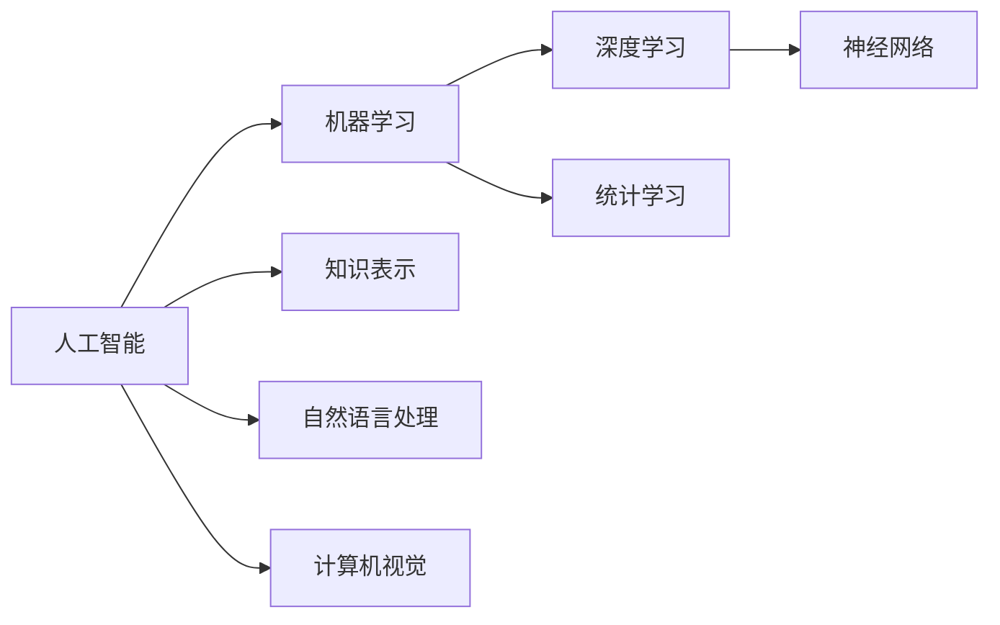

# AI人工智能核心算法原理与代码实例讲解：概述

## 1.背景介绍
### 1.1 人工智能的发展历程
#### 1.1.1 人工智能的起源与概念
#### 1.1.2 人工智能的三次浪潮
#### 1.1.3 人工智能的现状与未来

### 1.2 人工智能算法概述  
#### 1.2.1 人工智能算法的分类
#### 1.2.2 经典人工智能算法
#### 1.2.3 现代人工智能算法

## 2.核心概念与联系
### 2.1 机器学习
#### 2.1.1 监督学习
#### 2.1.2 无监督学习  
#### 2.1.3 强化学习

### 2.2 深度学习
#### 2.2.1 神经网络基础
#### 2.2.2 卷积神经网络(CNN)
#### 2.2.3 循环神经网络(RNN)

### 2.3 概念之间的联系


## 3.核心算法原理具体操作步骤
### 3.1 线性回归
#### 3.1.1 算法原理
#### 3.1.2 梯度下降法
#### 3.1.3 正则化

### 3.2 逻辑回归
#### 3.2.1 算法原理 
#### 3.2.2 sigmoid函数
#### 3.2.3 多分类逻辑回归

### 3.3 支持向量机(SVM) 
#### 3.3.1 算法原理
#### 3.3.2 核函数
#### 3.3.3 软间隔与正则化

### 3.4 决策树
#### 3.4.1 算法原理
#### 3.4.2 信息增益与基尼指数
#### 3.4.3 剪枝

### 3.5 随机森林
#### 3.5.1 算法原理
#### 3.5.2 Bagging与随机子空间
#### 3.5.3 特征重要性

### 3.6 k近邻(KNN)
#### 3.6.1 算法原理
#### 3.6.2 距离度量
#### 3.6.3 k值选择

### 3.7 k均值聚类
#### 3.7.1 算法原理
#### 3.7.2 初始化方法
#### 3.7.3 性能评估

### 3.8 主成分分析(PCA)
#### 3.8.1 算法原理  
#### 3.8.2 特征值与特征向量
#### 3.8.3 降维与可视化

## 4.数学模型和公式详细讲解举例说明
### 4.1 线性回归的数学模型
假设有数据集 $D=\{(x_1,y_1),(x_2,y_2),...,(x_m,y_m)\}$，其中 $x_i\in \mathbf{R}^n$，$y_i\in \mathbf{R}$。线性回归的目标是学习一个线性模型：

$$h_\theta(x)=\theta_0+\theta_1x_1+...+\theta_nx_n=\theta^Tx$$

使得 $h_\theta(x)$ 尽可能接近 $y$。其中 $\theta=(\theta_0,\theta_1,...,\theta_n)^T$ 为模型参数。通过最小化损失函数来求解最优参数：

$$J(\theta)=\frac{1}{2m}\sum_{i=1}^m(h_\theta(x^{(i)})-y^{(i)})^2$$

### 4.2 逻辑回归的数学模型
逻辑回归是一种常用的二分类模型，其输出表示为正例的概率。设 $P(y=1|x;\theta)$ 表示在给定 $x$ 和参数 $\theta$ 的条件下 $y=1$ 的概率，逻辑回归模型为：

$$P(y=1|x;\theta)=\frac{1}{1+e^{-\theta^Tx}}$$

其中 $\theta$ 为待学习的参数。对于二分类问题，可以使用极大似然估计来估计参数。令 $h_\theta(x)=P(y=1|x;\theta)$，似然函数为：

$$L(\theta)=\prod_{i=1}^m(h_\theta(x^{(i)}))^{y^{(i)}}(1-h_\theta(x^{(i)}))^{1-y^{(i)}}$$

最大化似然函数等价于最小化负对数似然函数：

$$J(\theta)=-\frac{1}{m}\sum_{i=1}^m[y^{(i)}\log h_\theta(x^{(i)})+(1-y^{(i)})\log(1-h_\theta(x^{(i)}))]$$

### 4.3 支持向量机的数学模型
支持向量机(SVM)是一种经典的分类算法，其基本思想是在特征空间中寻找一个最大间隔超平面将不同类别的样本分开。对于线性可分的数据集，SVM的目标是找到一个超平面 $w^Tx+b=0$，使得两个类别的样本都能被正确分类，且距离超平面最近的样本点（支持向量）到超平面的距离（几何间隔）最大化。

令 $y_i\in\{+1,-1\}$ 表示样本的类别标签，SVM的优化目标可表示为：

$$\begin{aligned}
\min_{w,b} & \frac{1}{2}\|w\|^2 \\
s.t. & y_i(w^Tx_i+b)\geq1, i=1,2,...,m
\end{aligned}$$

引入拉格朗日乘子 $\alpha_i\geq0$，可得到拉格朗日函数：

$$L(w,b,\alpha)=\frac{1}{2}\|w\|^2-\sum_{i=1}^m\alpha_i[y_i(w^Tx_i+b)-1]$$

根据对偶性，上述问题可转化为等价的对偶问题：

$$\begin{aligned}
\max_\alpha & \sum_{i=1}^m\alpha_i-\frac{1}{2}\sum_{i=1}^m\sum_{j=1}^m\alpha_i\alpha_jy_iy_jx_i^Tx_j \\
s.t. & \sum_{i=1}^m\alpha_iy_i=0 \\
     & \alpha_i\geq0, i=1,2,...,m
\end{aligned}$$

求解出最优的 $\alpha^*$ 后，可得到超平面参数：

$$w^*=\sum_{i=1}^m\alpha_i^*y_ix_i$$

$$b^*=-\frac{1}{2}(w^{*T}x_{+}+w^{*T}x_{-})$$

其中 $x_{+}$ 和 $x_{-}$ 分别为两个类别中的任意支持向量。

对于线性不可分的情况，可以通过引入松弛变量 $\xi_i$ 和惩罚系数 $C$ 将优化目标改写为：

$$\begin{aligned}
\min_{w,b,\xi} & \frac{1}{2}\|w\|^2+C\sum_{i=1}^m\xi_i \\
s.t. & y_i(w^Tx_i+b)\geq1-\xi_i, i=1,2,...,m \\
     & \xi_i\geq0, i=1,2,...,m
\end{aligned}$$

通过求解上述优化问题，可以得到软间隔SVM的最优解。

## 5.项目实践：代码实例和详细解释说明
### 5.1 线性回归代码实例
```python
import numpy as np

class LinearRegression:
    def __init__(self):
        self.theta = None
        
    def fit(self, X, y, alpha=0.01, num_iters=1000):
        m, n = X.shape
        self.theta = np.zeros(n+1)
        X = np.c_[np.ones(m), X]
        
        for _ in range(num_iters):
            h = np.dot(X, self.theta)
            grad = np.dot(X.T, h-y) / m
            self.theta -= alpha * grad
            
    def predict(self, X):
        m = X.shape[0]
        X = np.c_[np.ones(m), X]
        return np.dot(X, self.theta)
```

上述代码实现了一个简单的线性回归模型，使用梯度下降法进行参数估计。主要步骤包括：

1. 初始化模型参数 $\theta$ 为零向量。
2. 对数据集进行预处理，添加全为1的一列作为偏置项。
3. 进行若干次迭代，每次迭代中：
   - 计算当前参数下的预测值 $h$。
   - 计算损失函数对参数的梯度 $\nabla_\theta J(\theta)$。
   - 使用梯度下降法更新参数 $\theta:=\theta-\alpha\nabla_\theta J(\theta)$。
4. 返回学习到的参数 $\theta$。

在预测阶段，对新的输入数据进行预处理后，使用学习到的参数进行预测。

### 5.2 逻辑回归代码实例
```python
import numpy as np

class LogisticRegression:
    def __init__(self):
        self.theta = None
        
    def sigmoid(self, z):
        return 1 / (1 + np.exp(-z))
    
    def fit(self, X, y, alpha=0.01, num_iters=1000):
        m, n = X.shape
        self.theta = np.zeros(n+1)
        X = np.c_[np.ones(m), X]
        
        for _ in range(num_iters):
            h = self.sigmoid(np.dot(X, self.theta))
            grad = np.dot(X.T, h-y) / m
            self.theta -= alpha * grad
            
    def predict(self, X, threshold=0.5):
        m = X.shape[0]
        X = np.c_[np.ones(m), X]
        prob = self.sigmoid(np.dot(X, self.theta))
        return (prob >= threshold).astype(int)
```

上述代码实现了一个简单的逻辑回归模型，使用梯度下降法进行参数估计。主要步骤包括：

1. 初始化模型参数 $\theta$ 为零向量。
2. 对数据集进行预处理，添加全为1的一列作为偏置项。
3. 定义 Sigmoid 函数 $g(z)=\frac{1}{1+e^{-z}}$。
4. 进行若干次迭代，每次迭代中：
   - 计算当前参数下的预测概率 $h=g(X\theta)$。
   - 计算负对数似然函数对参数的梯度 $\nabla_\theta J(\theta)$。
   - 使用梯度下降法更新参数 $\theta:=\theta-\alpha\nabla_\theta J(\theta)$。
5. 返回学习到的参数 $\theta$。

在预测阶段，对新的输入数据进行预处理后，使用学习到的参数计算预测概率，并根据阈值进行分类。

### 5.3 支持向量机代码实例
```python
from sklearn import svm

# 加载数据集
X = [[0, 0], [1, 1], [1, 0], [0, 1]]
y = [0, 1, 1, 0]

# 创建SVM分类器
clf = svm.SVC(kernel='linear')

# 训练模型
clf.fit(X, y)

# 预测新样本
print(clf.predict([[0.5, 0.5]]))  # 输出 [1]
```

上述代码使用了scikit-learn库中的SVM模块，展示了如何使用SVM进行二分类任务。主要步骤包括：

1. 加载数据集，其中X为特征矩阵，y为对应的类别标签。
2. 创建一个线性核的SVM分类器。
3. 使用fit方法训练模型，即求解SVM的对偶优化问题。
4. 使用predict方法对新的样本进行预测。

scikit-learn库提供了多种SVM的变体和参数选项，如核函数、惩罚系数等，可以根据具体任务进行选择和调整。

## 6.实际应用场景
### 6.1 图像识别
卷积神经网络(CNN)在图像识别任务中取得了巨大成功。CNN通过卷积层和池化层提取图像的局部特征，并通过全连接层进行分类。典型的应用包括：
- 人脸识别
- 物体检测与识别
- 图像分割
- 医学图像分析

### 6.2 自然语言处理
循环神经网络(RNN)和注意力机制在自然语言处理任务中得到广泛应用。RNN可以处理序列数据，捕捉文本的上下文信息。注意力机制可以帮助模型关注输入序列中的重要部分。常见的应用包括：
- 机器翻译
- 情感分析
- 文本分类
- 命名实体识别
- 问答系统

### 6.3 推荐系统
机