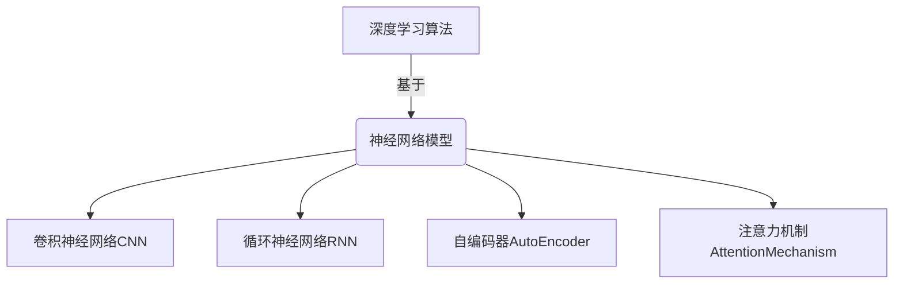

# AI人工智能深度学习算法：在个性化推荐中的应用

## 1.背景介绍

### 1.1 个性化推荐系统概述

在当今信息时代,我们每天都会遇到大量的信息和选择。无论是在网上浏览新闻、观看视频,还是在电商平台购物,我们都会面临着海量的信息和商品。在这种情况下,个性化推荐系统应运而生,它能够根据用户的兴趣爱好、浏览记录和购买历史等数据,为用户推荐最感兴趣的内容或商品,从而提高用户体验,增加转化率。

个性化推荐系统广泛应用于新闻推荐、视频推荐、音乐推荐、电商产品推荐等多个领域。准确的个性化推荐不仅能为用户带来更好的体验,也能为企业带来更多的收益。因此,构建高效准确的个性化推荐系统一直是业界和学术界的重点研究方向。

### 1.2 个性化推荐系统发展历程

传统的个性化推荐系统主要基于内容过滤(Content-based Filtering)和协同过滤(Collaborative Filtering)两种方法。内容过滤根据用户历史行为对内容的偏好来推荐相似内容,而协同过滤则根据用户之间的相似性来推荐其他相似用户喜欢的内容。

随着深度学习技术的不断发展,个性化推荐系统也逐渐从传统的方法转向基于深度学习的方法。深度学习能够从海量原始数据中自动学习有效特征表示,并捕捉用户行为和内容之间的复杂关系,从而显著提高推荐系统的准确性。目前,基于深度学习的推荐算法已经成为主流方法,在工业界和学术界都得到了广泛的应用和研究。

## 2.核心概念与联系

### 2.1 深度学习基础

深度学习(Deep Learning)是机器学习的一个新的研究热点,它模仿人脑的机制来解释数据,通过对数据的特征进行多层次非线性变换来学习数据的层次模式,并用所学习到的模式对复杂的数据进行预测和决策。

深度学习的核心是神经网络,特别是前馈神经网络(Feedforward Neural Networks)。前馈神经网络由多个隐藏层组成,每一层由多个神经元构成。神经网络通过对输入数据进行层层非线性变换,从而学习数据的特征表示。

深度学习在计算机视觉、自然语言处理、语音识别等领域取得了巨大的成功。在推荐系统领域,深度学习也展现出了强大的能力,能够从海量的用户行为数据和内容数据中学习出有效的特征表示,从而提高推荐的准确性。

### 2.2 个性化推荐中的深度学习

在个性化推荐系统中,深度学习主要用于以下几个方面:

1. **特征工程**: 传统的推荐系统需要人工设计特征,而深度学习能够自动从原始数据中学习高质量的特征表示,大大减少了特征工程的工作量。

2. **建模用户偏好**: 深度学习能够通过神经网络模型来学习用户的偏好,捕捉用户行为和内容之间的复杂关系。

3. **内容理解**: 对于文本、图像、视频等非结构化数据,深度学习能够自动提取有效的语义特征,从而更好地理解内容的语义信息。

4. **上下文建模**: 除了用户和内容特征之外,深度学习还能够融合时间、地点等上下文信息,从而提高推荐的准确性。

5. **多任务学习**: 通过多任务学习的方式,深度学习模型能够同时完成评分预测、排序等多个任务,提高模型的泛化能力。

总的来说,深度学习为个性化推荐系统带来了革命性的变化,使得推荐系统能够更好地理解用户需求、内容语义,并捕捉复杂的用户偏好模式,从而显著提高了推荐的准确性和用户体验。

## 3.核心算法原理具体操作步骤

在个性化推荐系统中,常用的基于深度学习的算法主要包括:

### 3.1 基于神经网络的协同过滤(Neural Collaborative Filtering, NCF)

NCF是将神经网络应用于协同过滤的一种尝试,它使用前馈神经网络来学习用户和物品的隐含特征向量,并通过它们的内积来预测用户对物品的评分。NCF的核心思想是将传统的矩阵分解方法与神经网络模型相结合,利用神经网络的非线性特性来提高模型的表达能力。

NCF的具体操作步骤如下:

1. **输入层**: 将用户ID和物品ID通过独热编码(One-Hot Encoding)转换为高维稀疏向量作为输入。

2. **嵌入层**: 将用户ID和物品ID分别通过嵌入层(Embedding Layer)映射到低维的稠密向量空间,得到用户嵌入向量和物品嵌入向量。

3. **隐含层**: 将用户嵌入向量和物品嵌入向量进行元素级别的相乘(Element-wise Multiplication),然后通过一个或多个全连接隐含层(Fully Connected Hidden Layers)进行非线性变换。

4. **输出层**: 在输出层,NCF通过计算用户嵌入向量和物品嵌入向量的内积,得到预测的评分值。

5. **模型训练**: 使用均方根误差(RMSE)或其他损失函数,通过反向传播算法优化模型参数。

NCF的优点是能够自动学习用户和物品的隐含特征表示,并捕捉它们之间的非线性关系。但它也存在一些缺陷,如无法处理序列数据、难以融合其他辅助信息等。

### 3.2 基于注意力机制的推荐模型(Attentive Collaborative Filtering, ACF)

ACF是在NCF的基础上引入注意力机制的一种改进模型。它利用注意力机制来自适应地学习用户对不同物品特征的关注程度,从而更好地捕捉用户的个性化偏好。

ACF的具体操作步骤如下:

1. **输入层和嵌入层**: 与NCF类似,将用户ID和物品ID通过独热编码转换为高维稀疏向量,然后分别通过嵌入层映射到低维稠密向量空间。

2. **注意力层**: 对物品嵌入向量的不同维度应用注意力机制,根据用户嵌入向量计算每个维度的注意力权重,从而获得用户对不同物品特征的关注程度。

3. **特征组合层**: 将加权后的物品嵌入向量与用户嵌入向量进行元素级别的相乘,然后通过一个或多个全连接隐含层进行非线性变换。

4. **输出层和模型训练**: 与NCF类似,在输出层计算用户嵌入向量和加权物品嵌入向量的内积作为预测评分,使用均方根误差或其他损失函数进行模型训练。

ACF的优点是能够自适应地学习用户对不同物品特征的关注程度,从而更好地捕捉用户的个性化偏好。但它也存在一些缺陷,如难以处理序列数据、无法融合其他辅助信息等。

### 3.3 基于序列的推荐模型(Sequential Recommendation)

基于序列的推荐模型旨在从用户的历史行为序列中捕捉用户的动态兴趣,并预测用户下一步可能感兴趣的内容。这类模型通常采用循环神经网络(RNN)或注意力机制来建模用户行为序列。

一种典型的基于序列的推荐模型是GRU4Rec,它使用门控循环单元(GRU)来捕捉用户的动态兴趣。GRU4Rec的具体操作步骤如下:

1. **输入层和嵌入层**: 将用户历史行为序列中的物品ID通过独热编码转换为高维稀疏向量,然后通过嵌入层映射到低维稠密向量空间,得到物品嵌入序列。

2. **GRU层**: 将物品嵌入序列输入到GRU层中,GRU通过递归地更新隐藏状态,从而捕捉用户的动态兴趣。

3. **输出层**: 在每个时间步,GRU输出对应的隐藏状态作为用户当前兴趣的表示,然后计算该隐藏状态与所有候选物品嵌入向量的相似度,得到候选物品的打分。

4. **模型训练**: 使用排序损失函数(如BPR损失)或其他评估指标,通过反向传播算法优化模型参数。

基于序列的推荐模型的优点是能够捕捉用户的动态兴趣,并根据用户的历史行为序列进行个性化推荐。但它也存在一些缺陷,如难以融合其他辅助信息、对长期兴趣建模能力有限等。

### 3.4 融合多种信息源的推荐模型

除了用户行为数据和内容数据之外,还有许多其他信息源可以用于改进推荐系统的性能,如社交网络信息、知识图谱信息等。深度学习模型能够灵活地融合这些异构信息源,从而提高推荐的准确性。

一种典型的融合多种信息源的推荐模型是NeuralCF,它将协同过滤和基于内容的推荐相结合。NeuralCF的具体操作步骤如下:

1. **输入层和嵌入层**: 将用户ID、物品ID和物品内容特征(如文本、图像等)分别通过独热编码和嵌入层映射到低维稠密向量空间。

2. **特征融合层**: 将用户嵌入向量、物品嵌入向量和物品内容嵌入向量进行拼接,然后通过一个或多个全连接隐含层进行非线性变换,从而融合不同信息源。

3. **输出层和模型训练**: 在输出层计算融合后的向量与用户嵌入向量的内积作为预测评分,使用均方根误差或其他损失函数进行模型训练。

NeuralCF的优点是能够灵活地融合用户行为数据、物品内容数据等多种信息源,从而提高推荐的准确性。但它也存在一些缺陷,如难以处理序列数据、融合方式较为简单等。

除了NeuralCF,还有许多其他融合多种信息源的推荐模型,如融合社交网络信息的SocialNF、融合知识图谱信息的KnowledgeGraphCF等。这些模型通过灵活地融合不同类型的辅助信息,进一步提高了推荐系统的性能。

## 4.数学模型和公式详细讲解举例说明

在个性化推荐系统中,常用的数学模型和公式主要包括:

### 4.1 矩阵分解(Matrix Factorization)

矩阵分解是协同过滤的一种经典方法,它将用户-物品评分矩阵 $R$ 分解为用户隐向量矩阵 $U$ 和物品隐向量矩阵 $V$ 的乘积,即:

$$R \approx U^T V$$

其中, $U \in \mathbb{R}^{K \times M}$ 表示 $M$ 个用户的 $K$ 维隐向量, $V \in \mathbb{R}^{K \times N}$ 表示 $N$ 个物品的 $K$ 维隐向量。对于任意一个用户 $u$ 和物品 $i$,其预测评分 $\hat{r}_{ui}$ 可以通过两个隐向量的内积计算:

$$\hat{r}_{ui} = u_u^T v_i$$

其中 $u_u$ 和 $v_i$ 分别表示用户 $u$ 和物品 $i$ 的隐向量。

在训练过程中,我们需要通过优化损失函数来学习隐向量矩阵 $U$ 和 $V$,常用的损失函数是均方根误差(RMSE):

$$\min_{U,V} \sqrt{\frac{1}{|R|} \sum_{(