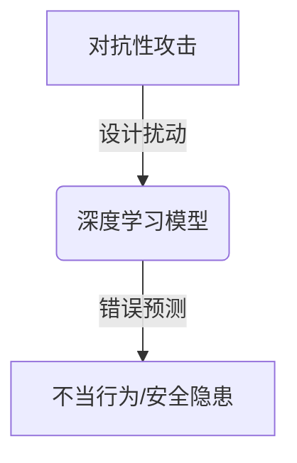
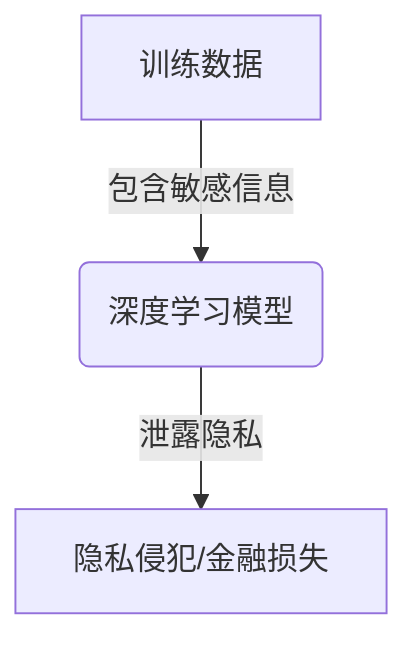
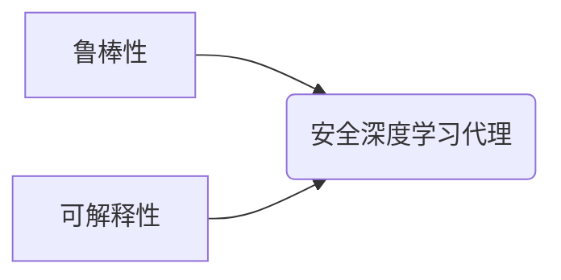
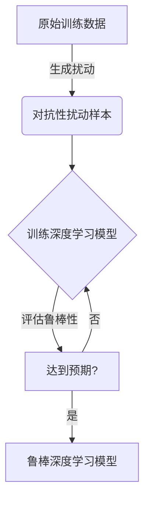
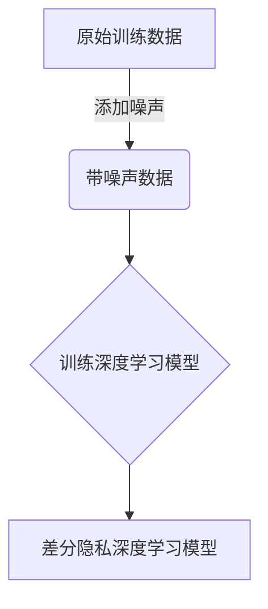

# AI人工智能深度学习算法：智能深度学习代理的安全与隐私保护

## 1.背景介绍

### 1.1 人工智能和深度学习的兴起

人工智能(AI)和深度学习技术在过去十年中取得了长足的进步,催生了诸多创新应用和服务。从语音助手到自动驾驶汽车,从医疗诊断到金融风险评估,AI系统正在渗透到我们生活的方方面面。然而,随着AI系统的广泛部署,确保其安全性和隐私保护也变得至关重要。

### 1.2 智能代理的概念

智能代理是指能够感知环境、处理信息并采取行动的自主系统。深度学习代理是一种特殊的智能代理,它利用深度神经网络模型从数据中学习,并基于所学知识做出决策和行动。这种代理广泛应用于游戏、机器人控制、自然语言处理等领域。

### 1.3 安全和隐私挑战

尽管深度学习代理展现出了惊人的能力,但它们也面临着严峻的安全和隐私挑战。例如,对抗性攻击可能会误导代理做出错误决策;隐私泄露则可能导致敏感信息被窃取。因此,保护智能代理的安全性和隐私至关重要。

## 2.核心概念与联系

### 2.1 对抗性攻击

对抗性攻击是指针对机器学习模型的输入数据进行精心设计的扰动,以误导模型做出错误预测或决策。这种攻击手段对于深度学习代理来说是一个严重威胁,可能导致代理做出不当行为,造成安全隐患。



### 2.2 隐私保护

深度学习代理通常需要从大量数据中学习,这些数据可能包含敏感的个人信息或商业机密。如果这些信息被泄露,可能会造成隐私侵犯、金融损失等严重后果。因此,保护训练数据和模型参数的隐私是确保智能代理安全的关键环节。



### 2.3 鲁棒性和可解释性

为了提高深度学习代理的安全性,我们需要设计出鲁棒的模型,能够抵御对抗性攻击。同时,提高模型的可解释性也很重要,有助于发现潜在的安全漏洞并促进人类对代理决策的理解和信任。



## 3.核心算法原理具体操作步骤

### 3.1 对抗性训练

对抗性训练是提高深度学习模型鲁棒性的一种有效方法。其基本思想是在训练过程中加入对抗性扰动样本,使模型学会识别和抵御这些攻击。具体操作步骤如下:

1. 生成对抗性扰动样本
2. 将扰动样本加入训练数据
3. 在扰动样本上训练模型
4. 评估模型在对抗性攻击下的性能
5. 重复上述步骤,直至模型达到预期鲁棒性



### 3.2 差分隐私

差分隐私是一种用于保护个人隐私的强大技术。它通过在训练数据或模型输出中引入一定程度的噪声,使得单个记录的影响被掩盖,从而防止个人信息泄露。具体操作步骤如下:

1. 确定隐私预算 $\epsilon$ 和 $\delta$
2. 选择噪声机制(如高斯噪声或拉普拉斯噪声)
3. 在训练数据或模型输出中添加噪声
4. 训练或使用带噪声的模型
5. 分析隐私保护水平

$$
\Pr[K(D) \in S] \leq e^\epsilon \Pr[K(D') \in S] + \delta
$$

上式表示,对于任意相邻数据集 $D$ 和 $D'$,以及任意输出集合 $S$,差分隐私机制 $K$ 在 $D$ 上产生 $S$ 中的输出的概率,最多比在 $D'$ 上产生同样输出的概率高 $e^\epsilon$ 倍,外加一个很小的概率 $\delta$。



## 4.数学模型和公式详细讲解举例说明

### 4.1 对抗性攻击的数学模型

对抗性攻击可以形式化为一个优化问题,目标是找到一个最小扰动 $r$,使得:

$$
\arg\max_r \mathcal{L}(x+r, y) \quad \text{s.t. } \|r\|_p \leq \epsilon
$$

其中 $\mathcal{L}$ 是模型的损失函数, $x$ 是原始输入, $y$ 是真实标签, $\|r\|_p$ 是 $r$ 的 $\ell_p$ 范数, $\epsilon$ 是允许的最大扰动量。

例如,在图像分类任务中,我们可以通过求解上述优化问题来生成对抗性扰动图像,使分类器做出错误预测。

### 4.2 差分隐私的拉普拉斯机制

拉普拉斯机制是实现差分隐私的一种常用方法。对于一个函数 $f: \mathcal{D} \rightarrow \mathbb{R}^k$,其全局敏感度定义为:

$$
\Delta f = \max_{D_1, D_2} \|f(D_1) - f(D_2)\|_1
$$

其中 $D_1$ 和 $D_2$ 是相邻数据集(只相差一条记录)。

拉普拉斯机制通过在函数输出上添加拉普拉斯噪声来实现差分隐私:

$$
K(D) = f(D) + \text{Lap}(\Delta f / \epsilon)
$$

其中 $\text{Lap}(\lambda)$ 是以 $\lambda$ 为尺度参数的拉普拉斯分布。可以证明,这种机制满足 $(\epsilon, 0)$-差分隐私。

例如,在计算用户数据的均值时,我们可以使用拉普拉斯机制来保护个人隐私。

## 5.项目实践:代码实例和详细解释说明

### 5.1 对抗性训练示例

以下是一个使用PyTorch实现对抗性训练的示例代码:

```python
import torch
import torch.nn as nn
import torch.optim as optim

# 定义模型和损失函数
model = MyModel()
criterion = nn.CrossEntropyLoss()

# 对抗性攻击函数
def fgsm_attack(image, epsilon, data_grad):
    sign_data_grad = data_grad.sign()
    perturbed_image = image + epsilon*sign_data_grad
    perturbed_image = torch.clamp(perturbed_image, 0, 1)
    return perturbed_image

# 对抗性训练
for epoch in range(num_epochs):
    for data, labels in trainloader:
        
        # 清除梯度
        model.zero_grad()
        
        # 前向传播
        outputs = model(data)
        loss = criterion(outputs, labels)
        
        # 反向传播
        loss.backward()
        
        # 获取梯度
        data_grad = data.grad.data
        
        # 生成对抗性扰动样本
        perturbed_data = fgsm_attack(data, epsilon, data_grad)
        
        # 重新计算损失和梯度
        outputs = model(perturbed_data)
        loss = criterion(outputs, labels)
        loss.backward()
        
        # 更新权重
        optimizer.step()
```

在这个示例中,我们使用快速梯度符号方法(FGSM)生成对抗性扰动样本,然后在这些扰动样本上训练模型,提高其对抗性攻击的鲁棒性。

### 5.2 差分隐私示例

以下是一个使用TensorFlow实现差分隐私的示例代码:

```python
import tensorflow as tf
import numpy as np

# 加载数据
train_data, train_labels = load_data()

# 定义隐私参数
epsilon = 1.0
delta = 1e-5

# 定义模型
model = tf.keras.Sequential([
    tf.keras.layers.Flatten(input_shape=(28, 28)),
    tf.keras.layers.Dense(128, activation='relu'),
    tf.keras.layers.Dropout(0.2),
    tf.keras.layers.Dense(10, activation='softmax')
])

# 定义差分隐私优化器
optimizer = tf.train.GradientDescentOptimizer(learning_rate=0.001)
loss = tf.keras.losses.SparseCategoricalCrossentropy()
dp_optimizer = dp_optimizer_lib.DPGradientDescentGaussianOptimizer(
    l2_norm_clip=1.0,
    noise_multiplier=1.1,
    num_microbatches=256,
    learning_rate=0.15,
    optimizer=optimizer,
    loss=loss)

# 编译模型
model.compile(optimizer=dp_optimizer, loss=loss, metrics=['accuracy'])

# 训练模型
model.fit(train_data, train_labels, epochs=10, batch_size=256)
```

在这个示例中,我们使用TensorFlow Privacy库中的差分隐私优化器`DPGradientDescentGaussianOptimizer`来训练模型。该优化器会在梯度更新过程中添加高斯噪声,从而实现差分隐私保护。

## 6.实际应用场景

### 6.1 自动驾驶

自动驾驶汽车系统通常包含深度学习代理,用于感知环境、规划路径和控制车辆。确保这些代理的安全性对于保护乘客生命至关重要。例如,我们需要防止对抗性攻击误导代理做出错误决策,从而导致交通事故发生。

### 6.2 医疗诊断

深度学习模型在医疗诊断领域有着广泛的应用,如肿瘤检测、疾病预测等。然而,如果模型训练数据中包含患者的隐私信息(如基因数据)被泄露,将会给患者带来严重的隐私风险。因此,在训练这些模型时,必须采取有效的隐私保护措施。

### 6.3 金融服务

银行和金融机构越来越多地使用深度学习模型进行风险评估、欺诈检测等任务。这些模型通常会处理大量敏感的客户数据,如果不加以适当保护,就可能导致隐私泄露和经济损失。差分隐私技术可以在保护客户隐私的同时,仍然允许模型从数据中学习有用的模式。

## 7.工具和资源推荐

### 7.1 对抗性攻击库

- Adversarial Robustness Toolbox (ART): 一个用于机器学习模型对抗性攻击和防御的开源Python库。
- Foolbox: 另一个流行的对抗性攻击库,支持多种深度学习框架。

### 7.2 差分隐私库

- TensorFlow Privacy: TensorFlow官方的差分隐私库,提供了多种差分隐私算法和工具。
- OpenDP: 一个跨平台的开源差分隐私库,支持多种编程语言。
- SmartNoise: 微软开发的一款差分隐私库,专注于大规模数据集的隐私保护。

### 7.3 在线课程和教程

- Coursera上的"机器学习安全与隐私"课程,由专家讲解相关理论和实践。
- OpenAI的"对抗性攻击和防御"教程,包含代码示例和最新研究进展。
- Google的"差分隐私简介"系列视频,深入浅出地解释差分隐私概念。

## 8.总结:未来发展趋势与挑战

随着人工智能系统在各个领域的广泛应用,确保其安全性和隐私保护将变得越来越重要。未来,我们可以预见以下几个发展趋势和挑战:

1. **新型攻击手