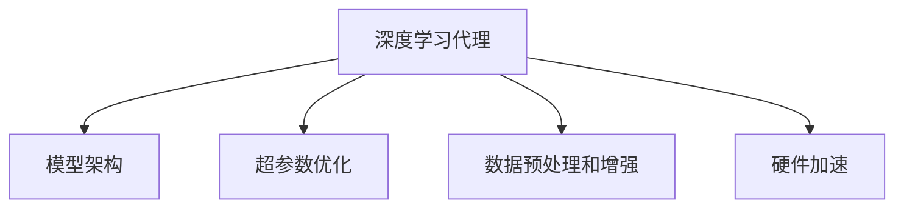

# AI人工智能深度学习算法：智能深度学习代理的性能调整与优化

## 1.背景介绍

在当今的科技时代，人工智能（AI）和深度学习（DL）已经成为推动技术进步的核心力量。深度学习算法在图像识别、自然语言处理、自动驾驶等领域取得了显著的成果。然而，随着模型复杂度的增加和数据量的爆炸式增长，如何有效地调整和优化深度学习代理的性能成为了一个关键问题。本文将深入探讨智能深度学习代理的性能调整与优化方法，旨在为研究人员和工程师提供实用的指导和技术洞察。

## 2.核心概念与联系

### 2.1 深度学习代理

深度学习代理是指利用深度学习算法进行任务处理的智能系统。它们通常由多个神经网络层组成，通过大量数据进行训练，以实现特定的功能。

### 2.2 性能调整与优化

性能调整与优化是指通过各种技术手段提高深度学习模型的效率和效果。包括但不限于模型架构调整、超参数优化、数据预处理和增强、硬件加速等。

### 2.3 核心联系

深度学习代理的性能调整与优化是一个多维度的过程，需要综合考虑模型、数据和硬件等多个方面。以下是一个简化的Mermaid流程图，展示了这些核心概念之间的联系：



## 3.核心算法原理具体操作步骤

### 3.1 模型架构调整

模型架构是深度学习代理的基础，选择合适的架构可以显著提高模型性能。常见的架构包括卷积神经网络（CNN）、循环神经网络（RNN）和变换器（Transformer）等。

#### 3.1.1 卷积神经网络（CNN）

CNN在图像处理领域表现出色，其核心在于卷积层和池化层的设计。通过调整卷积核大小、层数和激活函数，可以优化模型性能。

#### 3.1.2 循环神经网络（RNN）

RNN适用于序列数据处理，如自然语言处理。通过引入长短期记忆（LSTM）和门控循环单元（GRU），可以缓解梯度消失问题，提高模型效果。

#### 3.1.3 变换器（Transformer）

变换器在自然语言处理和其他序列任务中表现优异。其核心在于自注意力机制，通过调整注意力头数和层数，可以优化模型性能。

### 3.2 超参数优化

超参数是指在模型训练前需要设置的参数，如学习率、批量大小和正则化系数。超参数优化是提高模型性能的重要手段。

#### 3.2.1 网格搜索

网格搜索是最简单的超参数优化方法，通过遍历所有可能的参数组合，找到最优解。

#### 3.2.2 随机搜索

随机搜索通过随机选择参数组合，减少了计算量，同时在大多数情况下能找到接近最优的解。

#### 3.2.3 贝叶斯优化

贝叶斯优化通过构建代理模型，预测最优参数组合，显著提高了优化效率。

### 3.3 数据预处理和增强

数据质量直接影响模型性能，通过数据预处理和增强，可以提高模型的泛化能力。

#### 3.3.1 数据清洗

数据清洗包括去除噪声、处理缺失值和异常值等步骤，确保数据质量。

#### 3.3.2 数据增强

数据增强通过对原始数据进行变换，如旋转、缩放和翻转，增加数据多样性，提高模型泛化能力。

### 3.4 硬件加速

硬件加速是提高模型训练速度的重要手段。常见的硬件加速技术包括GPU加速和TPU加速。

#### 3.4.1 GPU加速

GPU具有强大的并行计算能力，适用于大规模矩阵运算。通过使用CUDA和cuDNN等库，可以显著提高模型训练速度。

#### 3.4.2 TPU加速

TPU是谷歌专门为深度学习设计的加速器，具有更高的计算效率和能效比，适用于大规模深度学习任务。

## 4.数学模型和公式详细讲解举例说明

### 4.1 卷积神经网络（CNN）

卷积神经网络的核心在于卷积运算，其数学表达式为：

$$
Y_{i,j,k} = \sum_{m=0}^{M-1} \sum_{n=0}^{N-1} X_{i+m,j+n} \cdot W_{m,n,k}
$$

其中，$Y_{i,j,k}$ 是输出特征图，$X_{i+m,j+n}$ 是输入特征图，$W_{m,n,k}$ 是卷积核。

### 4.2 循环神经网络（RNN）

RNN的核心在于时间步的递归计算，其数学表达式为：

$$
h_t = \sigma(W_h \cdot h_{t-1} + W_x \cdot x_t + b)
$$

其中，$h_t$ 是当前时间步的隐藏状态，$h_{t-1}$ 是前一时间步的隐藏状态，$x_t$ 是当前时间步的输入，$W_h$ 和 $W_x$ 是权重矩阵，$b$ 是偏置，$\sigma$ 是激活函数。

### 4.3 变换器（Transformer）

变换器的核心在于自注意力机制，其数学表达式为：

$$
\text{Attention}(Q, K, V) = \text{softmax}\left(\frac{QK^T}{\sqrt{d_k}}\right) V
$$

其中，$Q$ 是查询矩阵，$K$ 是键矩阵，$V$ 是值矩阵，$d_k$ 是键的维度。

## 5.项目实践：代码实例和详细解释说明

### 5.1 卷积神经网络（CNN）实例

以下是一个简单的CNN实现，用于图像分类任务：

```python
import tensorflow as tf
from tensorflow.keras import layers, models

# 构建模型
model = models.Sequential()
model.add(layers.Conv2D(32, (3, 3), activation='relu', input_shape=(28, 28, 1)))
model.add(layers.MaxPooling2D((2, 2)))
model.add(layers.Conv2D(64, (3, 3), activation='relu'))
model.add(layers.MaxPooling2D((2, 2)))
model.add(layers.Conv2D(64, (3, 3), activation='relu'))

# 添加全连接层
model.add(layers.Flatten())
model.add(layers.Dense(64, activation='relu'))
model.add(layers.Dense(10, activation='softmax'))

# 编译模型
model.compile(optimizer='adam',
              loss='sparse_categorical_crossentropy',
              metrics=['accuracy'])

# 训练模型
model.fit(train_images, train_labels, epochs=5, validation_data=(test_images, test_labels))
```

### 5.2 超参数优化实例

以下是使用Keras Tuner进行超参数优化的示例：

```python
import keras_tuner as kt
from tensorflow.keras import layers, models

def build_model(hp):
    model = models.Sequential()
    model.add(layers.Conv2D(hp.Int('units', min_value=32, max_value=128, step=32), (3, 3), activation='relu', input_shape=(28, 28, 1)))
    model.add(layers.MaxPooling2D((2, 2)))
    model.add(layers.Conv2D(hp.Int('units', min_value=32, max_value=128, step=32), (3, 3), activation='relu'))
    model.add(layers.MaxPooling2D((2, 2)))
    model.add(layers.Conv2D(hp.Int('units', min_value=32, max_value=128, step=32), (3, 3), activation='relu'))
    model.add(layers.Flatten())
    model.add(layers.Dense(hp.Int('units', min_value=32, max_value=128, step=32), activation='relu'))
    model.add(layers.Dense(10, activation='softmax'))
    model.compile(optimizer='adam',
                  loss='sparse_categorical_crossentropy',
                  metrics=['accuracy'])
    return model

tuner = kt.Hyperband(build_model,
                     objective='val_accuracy',
                     max_epochs=10,
                     factor=3,
                     directory='my_dir',
                     project_name='intro_to_kt')

tuner.search(train_images, train_labels, epochs=10, validation_data=(test_images, test_labels))
```

## 6.实际应用场景

### 6.1 图像识别

深度学习在图像识别领域取得了显著成果，如人脸识别、物体检测和图像分割等。通过优化模型架构和超参数，可以提高识别精度和速度。

### 6.2 自然语言处理

自然语言处理是深度学习的重要应用领域，包括机器翻译、文本生成和情感分析等。通过使用变换器和RNN等模型，可以实现高效的语言处理。

### 6.3 自动驾驶

自动驾驶是深度学习的前沿应用，通过使用CNN和强化学习等技术，可以实现车辆的自动感知和决策。

## 7.工具和资源推荐

### 7.1 开发工具

- TensorFlow：谷歌开发的开源深度学习框架，支持多种平台和硬件加速。
- PyTorch：Facebook开发的开源深度学习框架，具有灵活的动态计算图和强大的社区支持。
- Keras：高层次的神经网络API，支持快速构建和训练深度学习模型。

### 7.2 资源推荐

- 《深度学习》：Ian Goodfellow等人编写的经典教材，系统介绍了深度学习的基本概念和技术。
- Coursera深度学习课程：由Andrew Ng教授讲授的在线课程，涵盖了深度学习的核心内容和实践。
- GitHub：开源代码库，包含大量深度学习项目和资源，便于学习和参考。

## 8.总结：未来发展趋势与挑战

深度学习代理的性能调整与优化是一个不断发展的领域，未来的发展趋势包括：

### 8.1 自动化机器学习（AutoML）

AutoML通过自动化超参数优化和模型选择，降低了深度学习的门槛，提高了开发效率。

### 8.2 联邦学习

联邦学习通过分布式训练，保护数据隐私，提高了模型的安全性和泛化能力。

### 8.3 量子计算

量子计算具有巨大的计算潜力，未来有望在深度学习中发挥重要作用，解决当前计算资源的瓶颈。

然而，深度学习代理的性能调整与优化也面临诸多挑战，如数据隐私、模型解释性和计算资源等问题。研究人员和工程师需要不断探索和创新，推动深度学习技术的发展。

## 9.附录：常见问题与解答

### 9.1 如何选择合适的模型架构？

选择模型架构需要根据具体任务和数据特点进行综合考虑。可以通过实验和调优，选择最优的架构。

### 9.2 如何进行超参数优化？

超参数优化可以使用网格搜索、随机搜索和贝叶斯优化等方法。可以结合具体任务和资源，选择合适的优化方法。

### 9.3 如何提高模型的泛化能力？

提高模型的泛化能力可以通过数据增强、正则化和交叉验证等方法。确保模型在训练数据和测试数据上都能取得良好的表现。

### 9.4 如何进行硬件加速？

硬件加速可以使用GPU和TPU等加速器。通过使用相应的库和工具，可以显著提高模型训练速度。

### 9.5 如何处理数据隐私问题？

数据隐私问题可以通过联邦学习和差分隐私等技术进行解决。确保数据在训练过程中得到有效保护。

---

作者：禅与计算机程序设计艺术 / Zen and the Art of Computer Programming