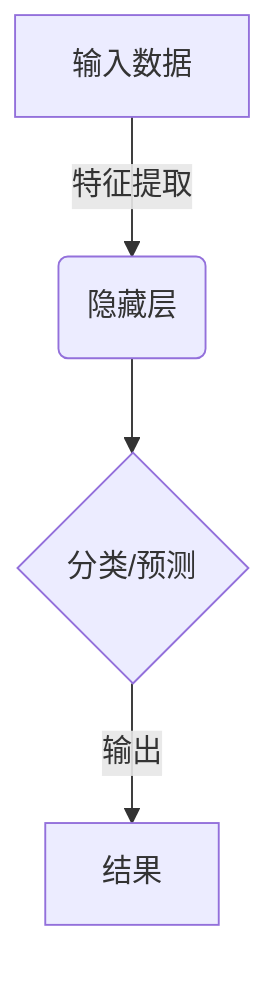
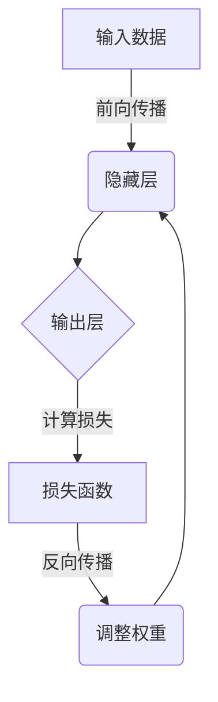
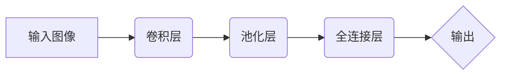
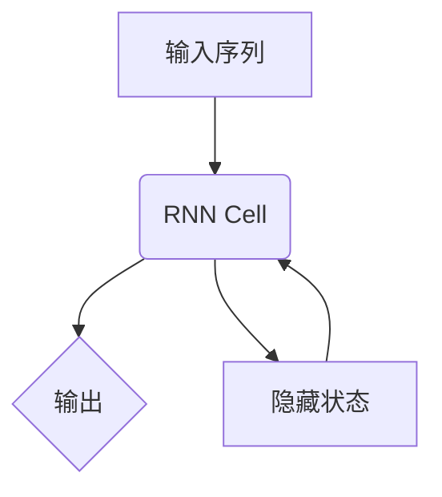

# AI人工智能深度学习算法：深度学习软件框架的掌握与应用

## 1.背景介绍

### 1.1 人工智能的兴起

人工智能(Artificial Intelligence, AI)是当代科技发展的重要领域,近年来受到了前所未有的关注和投资。人工智能技术的快速发展正在深刻影响和改变着各行各业,催生了新的商业模式和应用场景。

### 1.2 深度学习的核心地位

在人工智能的多种技术路线中,深度学习(Deep Learning)作为一种有效的机器学习方法,凭借其在计算机视觉、自然语言处理、语音识别等领域取得的卓越表现,已成为人工智能技术发展的核心和主流方向。

### 1.3 深度学习框架的重要性

深度学习算法的实现和应用离不开强大的软件框架支持。优秀的深度学习框架能够高效构建、训练和部署深度神经网络模型,提供了统一的编程模型和工具集,极大降低了深度学习的使用门槛,推动了人工智能技术的快速发展和广泛应用。

## 2.核心概念与联系

### 2.1 深度学习基本概念

深度学习是机器学习的一种新技术,它模仿人脑的神经网络结构和工作原理,通过构建多层神经网络模型对输入数据进行特征提取和转换,并基于这些特征对输入数据进行分类或预测。



### 2.2 深度学习核心要素

- **神经网络模型**：深度学习的核心是多层神经网络模型,常见的有前馈神经网络、卷积神经网络、递归神经网络等。
- **激活函数**：神经元的激活函数决定了神经网络的表达能力,如Sigmoid、ReLU等。
- **损失函数**：衡量模型输出与期望值的差异,是模型优化的目标函数。
- **优化算法**：通过迭代优化算法(如梯度下降)来不断调整模型参数,使损失函数最小化。

### 2.3 深度学习框架作用

深度学习框架为深度学习算法的实现提供了系统级的支持,包括:

- **模型构建**：提供各种神经网络模型结构的实现。
- **数据处理**：实现数据加载、预处理和增强等功能。
- **模型训练**：支持多种优化算法,GPU加速等加速训练。
- **模型部署**：支持模型在不同硬件环境的高效部署。

## 3.核心算法原理具体操作步骤

### 3.1 前馈神经网络

前馈神经网络(Feedforward Neural Network)是深度学习中最基本的网络结构,信息只从输入层单向传播到输出层。

1. **网络初始化**:随机初始化网络权重和偏置。
2. **前向传播**:输入数据通过层层激活函数计算,传播到输出层。
   $$
   h_l = f(W_l \cdot h_{l-1} + b_l)
   $$
   其中 $h_l$ 为第 $l$ 层的输出, $W_l$ 和 $b_l$ 分别为该层的权重和偏置, $f$ 为激活函数。

3. **计算损失**:将输出与标签计算损失函数值,如交叉熵损失。
4. **反向传播**:根据链式法则,计算每层权重和偏置相对于损失的梯度。
   $$
   \frac{\partial L}{\partial W_l} = \frac{\partial L}{\partial h_l} \cdot \frac{\partial h_l}{\partial W_l}
   $$

5. **权重更新**:根据梯度下降等优化算法更新网络参数。
   $$
   W_l \leftarrow W_l - \eta \frac{\partial L}{\partial W_l}
   $$

6. **迭代训练**:重复上述过程,直至收敛或满足停止条件。



### 3.2 卷积神经网络

卷积神经网络(Convolutional Neural Network, CNN)在计算机视觉领域表现出色,擅长对图像等高维数据进行处理。

1. **卷积层**:通过滑动卷积核对输入数据进行特征提取。
   $$
   h_{i,j} = f\left(\sum_{m,n} w_{m,n} \cdot x_{i+m,j+n} + b\right)
   $$

2. **池化层**:对卷积层输出进行下采样,减小特征图尺寸。
3. **全连接层**:将池化层输出进行展平,连接到全连接层进行分类或回归。

4. **反向传播**:与前馈网络类似,根据损失函数对各层参数进行梯度更新。



### 3.3 循环神经网络

循环神经网络(Recurrent Neural Network, RNN)擅长处理序列数据,如自然语言、语音、时间序列等。

1. **展开计算**:将序列数据一个时间步一个时间步地输入到网络中。
   $$
   h_t = f(W_{hh} \cdot h_{t-1} + W_{xh} \cdot x_t + b_h)
   $$

2. **反向传播**:通过反向传播训练网络,计算每个时间步的梯度。
   $$
   \frac{\partial L}{\partial h_t} = \frac{\partial L}{\partial h_{t+1}} \cdot \frac{\partial h_{t+1}}{\partial h_t} + \frac{\partial L}{\partial o_t} \cdot \frac{\partial o_t}{\partial h_t}
   $$

3. **长期依赖问题**:传统RNN存在梯度消失或爆炸问题,LSTM和GRU等改进版本能更好地捕捉长期依赖关系。



## 4.数学模型和公式详细讲解举例说明

### 4.1 前馈神经网络数学模型

前馈神经网络的数学模型可以表示为:

$$
y = f(W_2 \cdot (f(W_1 \cdot x + b_1)) + b_2)
$$

其中:

- $x$ 为输入向量
- $W_1, W_2$ 为权重矩阵
- $b_1, b_2$ 为偏置向量
- $f$ 为激活函数,如Sigmoid、ReLU等

例如,对于一个两层的前馈网络,输入为 $x = [0.5, 0.1, 0.2]^T$,权重为:

$$
W_1 = \begin{bmatrix}
    0.1 & 0.2 & 0.4\\
    0.3 & 0.5 & 0.1\\
    0.2 & 0.3 & 0.3
\end{bmatrix}, W_2 = \begin{bmatrix}
    0.4 & 0.2 & 0.6\\
    0.1 & 0.5 & 0.3
\end{bmatrix}
$$

偏置为 $b_1 = [0.2, 0.1, 0.4]^T, b_2 = [0.1, 0.3]^T$,激活函数为ReLU,则第一层输出为:

$$
h_1 = \text{ReLU}(W_1x + b_1) = \begin{bmatrix}
    0.5\\
    0.6\\
    0.7
\end{bmatrix}
$$

最终输出为:

$$
y = W_2h_1 + b_2 = \begin{bmatrix}
    1.3\\
    0.9
\end{bmatrix}
$$

### 4.2 卷积神经网络数学模型

卷积神经网络中的卷积运算可以表示为:

$$
h_{i,j} = f\left(\sum_{m,n} w_{m,n} \cdot x_{i+m,j+n} + b\right)
$$

其中:

- $x$ 为输入特征图
- $w$ 为卷积核权重
- $b$ 为偏置
- $f$ 为激活函数
- $h$ 为输出特征图

例如,对于一个 $3\times 3$ 的卷积核,输入特征图为:

$$
x = \begin{bmatrix}
    1 & 0 & 2\\
    3 & 2 & 1\\
    0 & 1 & 2
\end{bmatrix}, w = \begin{bmatrix}
    1 & 0 & 1\\
    2 & 1 & 0\\
    0 & 1 & 1
\end{bmatrix}, b = 0
$$

则卷积运算的过程为:

$$
h_{1,1} = f(1\cdot 1 + 0\cdot 0 + 1\cdot 2 + 2\cdot 3 + 1\cdot 2 + 0\cdot 1 + 0\cdot 0 + 1\cdot 1 + 1\cdot 2) = 13
$$

### 4.3 循环神经网络数学模型

循环神经网络的数学模型可以表示为:

$$
\begin{aligned}
h_t &= f(W_{hh} \cdot h_{t-1} + W_{xh} \cdot x_t + b_h)\\
o_t &= g(W_{ho} \cdot h_t + b_o)
\end{aligned}
$$

其中:

- $x_t$ 为时间步 $t$ 的输入
- $h_t$ 为时间步 $t$ 的隐藏状态
- $o_t$ 为时间步 $t$ 的输出
- $W_{hh}, W_{xh}, W_{ho}$ 为权重矩阵
- $b_h, b_o$ 为偏置向量
- $f, g$ 为激活函数

例如,对于一个简单的RNN模型,输入序列为 $[0.1, 0.2, 0.3]$,权重为:

$$
W_{hh} = 0.5, W_{xh} = 0.3, W_{ho} = 0.4
$$

偏置为 $b_h = 0.1, b_o = 0.2$,激活函数为Tanh,则在时间步 $t=2$ 时,隐藏状态和输出为:

$$
\begin{aligned}
h_2 &= \tanh(0.5 \cdot h_1 + 0.3 \cdot 0.2 + 0.1)\\
    &= \tanh(0.5 \cdot 0.094 + 0.06 + 0.1) = 0.172\\
o_2 &= 0.4 \cdot 0.172 + 0.2 = 0.268
\end{aligned}
$$

## 5.项目实践：代码实例和详细解释说明

为了更好地理解深度学习框架的使用,我们将使用Python中的PyTorch框架,构建一个简单的前馈神经网络模型,用于手写数字识别任务。

### 5.1 导入库和数据

```python
import torch
import torch.nn as nn
import torchvision
import torchvision.transforms as transforms

# 下载MNIST数据集
train_dataset = torchvision.datasets.MNIST(root='./data', train=True, transform=transforms.ToTensor(), download=True)
test_dataset = torchvision.datasets.MNIST(root='./data', train=False, transform=transforms.ToTensor())

# 加载数据
train_loader = torch.utils.data.DataLoader(dataset=train_dataset, batch_size=64, shuffle=True)
test_loader = torch.utils.data.DataLoader(dataset=test_dataset, batch_size=64, shuffle=False)
```

### 5.2 定义网络模型

```python
# 定义网络模型
class Net(nn.Module):
    def __init__(self):
        super(Net, self).__init__()
        self.fc1 = nn.Linear(28 * 28, 512)
        self.fc2 = nn.Linear(512, 256)
        self.fc3 = nn.Linear(256, 10)

    def forward(self, x):
        x = x.view(-1, 28 * 28)
        x = torch.relu(self.fc1(x))
        x = torch.relu(self.fc2(x))
        x = self.fc3(x)
        return x

model = Net()
```

这里定义了一个包含两个隐藏层的前馈神经网络,输入为 $28 \times 28$ 的图像数据,经过两个ReLU激活的全连接层,最后输出10个分类结果。

### 5.3 训练模型

```python
# 定义损失函数和优化器
criterion = nn.CrossEntropyLoss()
optimizer = torch.optim.