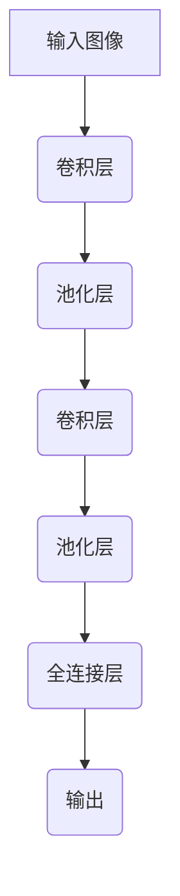

# AI人工智能深度学习算法：计算机视觉在深度学习代理中的集成

## 1.背景介绍

### 1.1 人工智能与深度学习的兴起

人工智能(AI)是当代科技发展的热点领域,近年来得到了前所未有的关注和投资。其中,深度学习作为人工智能的一个重要分支,在图像识别、自然语言处理、决策系统等多个领域取得了突破性进展。深度学习通过对大量数据的训练,能够自动学习数据的特征,并对新的输入数据做出预测和决策。

### 1.2 计算机视觉与深度学习代理

计算机视觉是人工智能的一个重要应用领域,旨在使计算机能够获取、处理和理解数字图像或视频的内容。随着深度学习技术的发展,计算机视觉的性能得到了极大提升。深度学习代理(Deep Learning Agent)是指集成了深度学习算法的智能体系统,能够根据环境状态做出决策并执行相应动作。将计算机视觉与深度学习代理相结合,可以赋予智能体视觉感知和理解能力,使其能够更好地与环境交互。

### 1.3 应用前景

计算机视觉在深度学习代理中的集成,为众多领域带来了创新应用,如自动驾驶、机器人视觉、智能监控、医疗影像分析等。这种融合不仅提高了系统的智能化水平,还能够解决复杂的实际问题,具有广阔的应用前景。

## 2.核心概念与联系

### 2.1 深度学习

深度学习(Deep Learning)是机器学习的一种,它通过对大量数据的训练,使用多层非线性变换来自动学习数据的特征表示,并对新的输入数据做出预测或决策。深度学习模型通常由神经网络构成,能够捕捉输入数据的复杂结构和模式。常见的深度学习模型包括卷积神经网络(CNN)、递归神经网络(RNN)、长短期记忆网络(LSTM)等。

### 2.2 计算机视觉

计算机视觉(Computer Vision)是人工智能的一个分支,旨在使计算机能够获取、处理和理解数字图像或视频的内容。它涉及图像处理、模式识别、场景重建等技术,广泛应用于目标检测、图像分类、视频跟踪等领域。传统的计算机视觉方法主要基于手工设计的特征提取和分类算法,而深度学习则能够自动学习图像的特征表示,极大提高了计算机视觉的性能。

### 2.3 深度学习代理

深度学习代理(Deep Learning Agent)是指集成了深度学习算法的智能体系统。它能够根据当前环境状态,通过深度神经网络做出决策,并执行相应的动作,从而与环境进行交互。深度学习代理广泛应用于强化学习、决策控制、游戏AI等领域。

### 2.4 核心联系

将计算机视觉与深度学习代理相结合,可以赋予智能体视觉感知和理解能力。深度学习算法能够从大量图像数据中自动学习视觉特征,而深度学习代理则能够根据视觉输入做出智能决策和行为响应。这种融合不仅提高了系统的智能化水平,还能够解决复杂的实际问题,如自动驾驶、机器人视觉导航等。

## 3.核心算法原理具体操作步骤

### 3.1 卷积神经网络

卷积神经网络(Convolutional Neural Network, CNN)是深度学习在计算机视觉领域的核心算法之一。CNN由多个卷积层、池化层和全连接层组成,能够自动从图像数据中提取视觉特征。

CNN的工作原理如下:

1. **卷积层(Convolutional Layer)**: 通过滑动卷积核(Kernel)在输入图像上进行卷积操作,提取局部特征。
2. **池化层(Pooling Layer)**: 对卷积层的输出进行下采样,减小特征图的尺寸,提高模型的鲁棒性。
3. **全连接层(Fully Connected Layer)**: 将前面层的特征映射到最终的分类或回归输出。

CNN的训练过程采用反向传播算法,通过梯度下降优化网络参数,使得模型在训练数据上的损失函数最小化。

### 3.2 目标检测算法

目标检测是计算机视觉的一个重要任务,旨在从图像或视频中定位并识别出感兴趣的目标。常见的目标检测算法包括:

1. **基于区域的卷积神经网络(R-CNN)**:
    - 步骤1: 选择性搜索生成候选区域
    - 步骤2: 对每个候选区域提取特征
    - 步骤3: 分类器判断目标类别和位置

2. **You Only Look Once (YOLO)**:
    - 步骤1: 将输入图像划分为网格
    - 步骤2: 每个网格预测边界框和类别概率
    - 步骤3: 非极大值抑制去除重复检测

3. **单次目标检测(Single Shot Detector, SSD)**:
    - 步骤1: 提取不同尺度的特征图
    - 步骤2: 在每个特征图上预测边界框和类别
    - 步骤3: 非极大值抑制去除重复检测

这些算法通过深度神经网络自动学习图像特征,实现端到端的目标检测,大大提高了检测精度和效率。

### 3.3 强化学习算法

强化学习(Reinforcement Learning)是机器学习的一个重要分支,它通过与环境的交互来学习如何做出最优决策。在深度学习代理中,强化学习算法被广泛应用于决策控制和行为优化。

常见的强化学习算法包括:

1. **Q-Learning**: 基于Q值(状态-动作值函数)进行学习和决策。
2. **深度Q网络(Deep Q-Network, DQN)**: 将Q函数用深度神经网络来近似,解决高维状态空间问题。
3. **策略梯度(Policy Gradient)**: 直接优化策略函数,使得期望回报最大化。
4. **Actor-Critic**: 将策略函数和值函数分开学习,提高收敛速度。

这些算法通过不断与环境交互,根据获得的奖励信号调整决策策略,最终达到最优控制。在集成了计算机视觉的深度学习代理中,强化学习算法能够基于视觉输入做出智能决策和行为响应。

## 4.数学模型和公式详细讲解举例说明

### 4.1 卷积神经网络数学模型

卷积神经网络(CNN)的核心操作是卷积(Convolution)和池化(Pooling)。

**卷积操作**:

设输入特征图为 $I$, 卷积核为 $K$, 则卷积操作可表示为:

$$
(I * K)(i, j) = \sum_{m} \sum_{n} I(i+m, j+n) K(m, n)
$$

其中 $i, j$ 表示输出特征图的坐标, $m, n$ 表示卷积核的坐标。

**池化操作**:

最大池化(Max Pooling)是常用的池化方法,它在池化窗口内取最大值作为输出:

$$
\text{max\_pool}(X)_{i, j} = \max_{(i', j') \in R_{i, j}} X_{i', j'}
$$

其中 $R_{i, j}$ 表示以 $(i, j)$ 为中心的池化窗口区域。

**损失函数**:

CNN通常采用交叉熵损失函数进行训练:

$$
\mathcal{L}(\theta) = -\frac{1}{N} \sum_{n=1}^{N} \sum_{c=1}^{C} y_{n, c} \log p_{\theta}(c | x_n)
$$

其中 $\theta$ 表示网络参数, $N$ 表示样本数, $C$ 表示类别数, $y_{n, c}$ 是样本 $n$ 的真实标签, $p_{\theta}(c | x_n)$ 是网络对样本 $x_n$ 预测为类别 $c$ 的概率。

通过梯度下降算法优化网络参数 $\theta$, 使得损失函数 $\mathcal{L}(\theta)$ 最小化。

### 4.2 目标检测算法数学模型

目标检测算法通常将问题建模为一个回归和分类的联合优化问题。

**边界框回归**:

设ground truth边界框为 $(x, y, w, h)$, 预测边界框为 $(x', y', w', h')$, 则边界框回归损失可定义为:

$$
\begin{aligned}
\mathcal{L}_{\text{reg}} &= \sum_{i \in \{x, y, w, h\}} \text{smooth}_{L_1}(t_i - t_i') \\
\text{smooth}_{L_1}(x) &= \begin{cases}
0.5x^2, & \text{if } |x| < 1 \\
|x| - 0.5, & \text{otherwise}
\end{cases}
\end{aligned}
$$

其中 $t_i = (x, y, w, h)$, $t_i' = (x', y', w', h')$ 分别表示ground truth和预测的边界框参数。

**分类损失**:

设ground truth类别为 $c$, 预测概率为 $p_c$, 则分类损失可定义为交叉熵损失:

$$
\mathcal{L}_{\text{cls}} = -\log p_c
$$

**联合优化**:

目标检测算法通常将边界框回归损失和分类损失加权求和,作为联合优化的目标函数:

$$
\mathcal{L} = \lambda_1 \mathcal{L}_{\text{reg}} + \lambda_2 \mathcal{L}_{\text{cls}}
$$

其中 $\lambda_1$, $\lambda_2$ 为权重系数。通过梯度下降优化该目标函数,可以同时学习边界框回归和目标分类。

### 4.3 强化学习数学模型

强化学习算法的目标是找到一个最优策略 $\pi^*$, 使得在环境 $\mathcal{M}$ 中的期望回报 $\mathbb{E}_{\pi}[R]$ 最大化。

**马尔可夫决策过程**:

强化学习问题通常建模为马尔可夫决策过程(Markov Decision Process, MDP),定义为 $\mathcal{M} = (\mathcal{S}, \mathcal{A}, \mathcal{P}, \mathcal{R}, \gamma)$, 其中:

- $\mathcal{S}$ 是状态空间
- $\mathcal{A}$ 是动作空间
- $\mathcal{P}(s' | s, a)$ 是状态转移概率
- $\mathcal{R}(s, a, s')$ 是即时奖励函数
- $\gamma \in [0, 1)$ 是折现因子

**状态-动作值函数**:

状态-动作值函数 $Q^{\pi}(s, a)$ 定义为在策略 $\pi$ 下,从状态 $s$ 执行动作 $a$,之后能获得的期望回报:

$$
Q^{\pi}(s, a) = \mathbb{E}_{\pi}\left[ \sum_{t=0}^{\infty} \gamma^t r_{t+1} | s_0 = s, a_0 = a \right]
$$

其中 $r_t$ 是第 $t$ 时刻的即时奖励。

**Bellman方程**:

Bellman方程描述了状态-动作值函数与即时奖励和下一状态值函数之间的关系:

$$
Q^{\pi}(s, a) = \mathbb{E}_{s' \sim \mathcal{P}}\left[ r(s, a, s') + \gamma \max_{a'} Q^{\pi}(s', a') \right]
$$

**策略梯度**:

策略梯度算法直接优化策略函数 $\pi_{\theta}(a | s)$,使得期望回报最大化:

$$
\nabla_{\theta} J(\theta) = \mathbb{E}_{\pi_{\theta}}\left[ \sum_{t=0}^{\infty} \nabla_{\theta} \log \pi_{\theta}(a_t | s_t) Q^{\pi_{\theta}}(s_t, a_t) \right]
$$

其中 $J(\theta)$ 是期望回报, $Q^{\pi_{\theta}}(s_t, a_t)$ 是状态-动作值函数。

通过梯度上升法优化策略参数 $\theta$, 可以使得