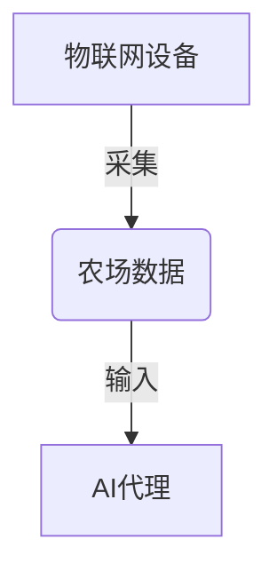
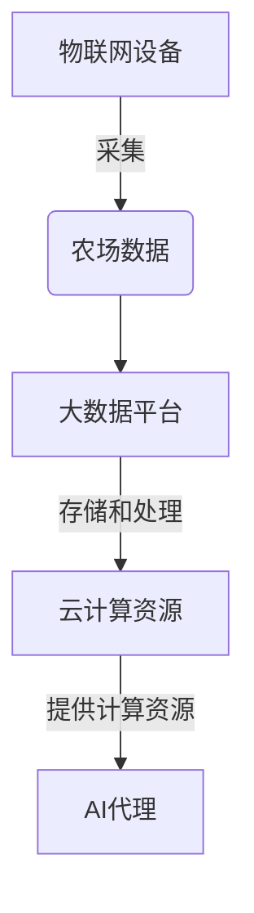
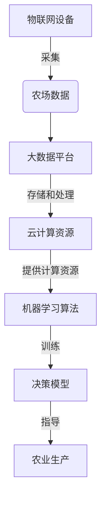
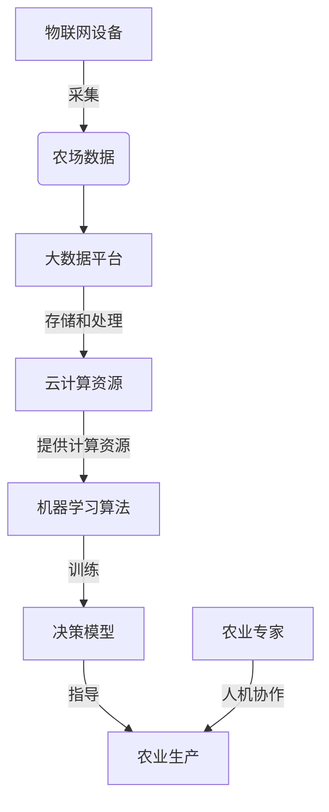
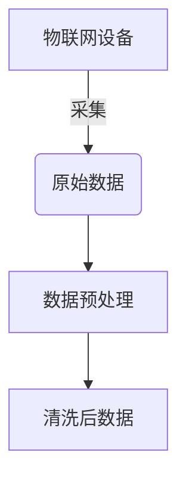
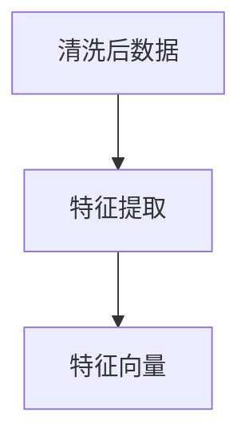
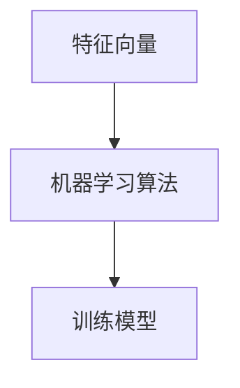
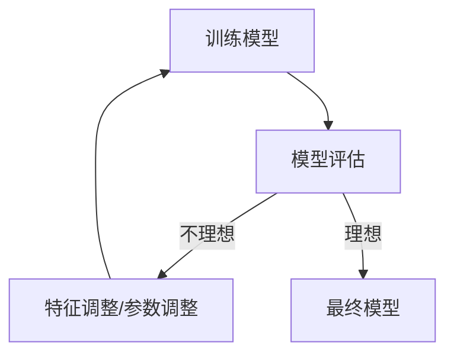
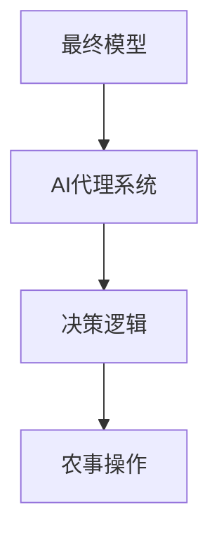
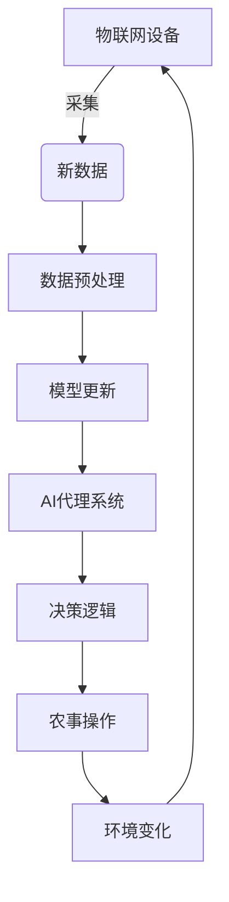

# AI代理在智慧农业中的工作流与决策支持

## 1.背景介绍

### 1.1 智慧农业的兴起

随着世界人口的不断增长和气候变化的加剧,确保粮食安全和可持续农业生产已成为全球关注的重点。传统的农业生产方式面临诸多挑战,如资源利用效率低下、环境污染严重、劳动力短缺等。为了应对这些挑战,智慧农业应运而生。

智慧农业是一种新兴的农业生产模式,它利用物联网、大数据、人工智能等先进技术,实现农业生产的精准管理和自动化操作。通过采集和分析农场数据,智慧农业可以优化资源利用、提高生产效率、减少环境影响,从而实现可持续发展。

### 1.2 AI代理在智慧农业中的作用

在智慧农业的框架下,人工智能(AI)代理扮演着至关重要的角色。AI代理是指具有一定智能的软件系统,能够根据环境信息做出决策并采取相应行动。在农业生产中,AI代理可以执行诸如作物管理、病虫害防治、环境监控等任务,大大减轻了农民的劳动强度。

AI代理的优势在于能够快速处理大量数据,并基于机器学习算法做出准确的决策。与传统的规则系统相比,AI代理具有更强的适应性和智能性,能够处理复杂的非线性问题。此外,AI代理还可以通过持续学习不断优化自身的决策能力。

本文将重点探讨AI代理在智慧农业中的工作流程和决策支持机制,为读者提供实用的技术见解和实践指导。

## 2.核心概念与联系

在深入探讨AI代理的工作流程和决策支持之前,我们需要先了解几个核心概念及其相互关系。

### 2.1 物联网(IoT)

物联网是智慧农业的基础设施,它通过各种传感器和网络设备采集农场数据,如土壤湿度、温度、光照等环境参数,以及作物生长状况等。这些数据为AI代理的决策提供了必要的输入。



### 2.2 大数据与云计算

由于农场数据量巨大且种类繁多,因此需要大数据技术来存储、处理和分析这些数据。云计算则为AI代理提供了可扩展的计算资源,使其能够高效地运行复杂的机器学习算法。



### 2.3 机器学习与决策模型

AI代理的"大脑"是机器学习算法和决策模型。根据农场数据,AI代理可以训练出各种预测模型,如作物生长模型、病虫害发生模型等。基于这些模型,AI代理就能做出精准的决策,指导农业生产。



### 2.4 人机协作

虽然AI代理具有强大的决策能力,但人类专家的经验和判断力同样不可或缺。因此,AI代理需要与农业专家紧密协作,将人工智能与人类智慧有机结合,以取得最佳的生产效果。



通过上述核心概念的介绍,我们可以看到AI代理是智慧农业的核心组成部分,它与物联网、大数据、云计算等技术紧密相连,共同构建了一个高效、智能的农业生产系统。

## 3.核心算法原理具体操作步骤

AI代理的核心是机器学习算法和决策模型,下面我们将详细介绍其工作原理和具体操作步骤。

### 3.1 数据采集与预处理

AI代理的第一步是从物联网设备采集农场数据,包括环境数据(温度、湿度、光照等)和作物数据(生长状况、病虫害等)。由于这些数据通常存在噪声、缺失值等问题,因此需要进行预处理,如去噪、插补、标准化等,以确保数据质量。



### 3.2 特征工程

特征工程是机器学习中一个关键步骤,它从原始数据中提取有价值的特征,作为模型的输入。在农业场景中,特征可能包括气象条件、土壤属性、作物品种等,需要根据具体问题选择合适的特征。



### 3.3 模型训练

有了特征向量作为输入,我们就可以训练各种机器学习模型了。常用的模型包括决策树、随机森林、支持向量机等。模型的选择取决于具体问题的特点和数据的性质。

$$
y = f(X; \theta)
$$

其中,$ y $是模型的输出(如作物产量预测),$X$是特征向量,$\theta$是模型参数,$ f $是机器学习算法(如决策树)。通过优化目标函数(如均方误差),我们可以学习到最优参数$\theta^*$。



### 3.4 模型评估

训练好的模型需要在测试数据上进行评估,以检验其准确性和泛化能力。常用的评估指标包括准确率、精确率、召回率、F1分数等。如果模型的性能不理想,我们需要调整特征或算法参数,重新训练模型。



### 3.5 模型部署与决策

通过上述步骤,我们就获得了满意的机器学习模型。接下来,我们需要将模型部署到AI代理系统中,并设计决策逻辑,根据模型输出做出相应的决策,如浇水、施肥、喷药等农事操作。



需要注意的是,AI代理的决策过程并不是一次性的,而是一个循环的过程。它需要持续地采集新的农场数据,更新模型,优化决策,以适应不断变化的环境。



通过上述步骤,我们可以看到AI代理是如何通过机器学习算法和决策模型,从海量农场数据中提取有价值的信息,并指导农业生产的。这种基于数据驱动的智能决策方式,大大提高了农业生产的效率和质量。

## 4.数学模型和公式详细讲解举例说明

在上一节中,我们介绍了AI代理的核心算法原理和工作流程。现在,我们将重点讨论其中涉及的一些数学模型和公式,并通过具体例子加深理解。

### 4.1 线性回归

线性回归是一种常用的机器学习算法,它试图找到一个最佳拟合的线性方程,将自变量(特征)与因变量(目标值)关联起来。在农业领域,线性回归可以用于预测作物产量、估计肥料用量等。

假设我们有 $n$ 个训练样本 $(x_i, y_i)$,其中 $x_i$ 是特征向量,$ y_i $是目标值。线性回归的目标是找到一个线性方程:

$$
y = \theta_0 + \theta_1 x_1 + \theta_2 x_2 + \cdots + \theta_m x_m
$$

使得预测值 $\hat{y}_i$ 与实际值 $y_i$ 的差异最小。这可以通过最小化均方误差来实现:

$$
J(\theta) = \frac{1}{2n} \sum_{i=1}^n (\hat{y}_i - y_i)^2
$$

其中,$ \theta = (\theta_0, \theta_1, \cdots, \theta_m) $是模型参数。通过梯度下降等优化算法,我们可以找到最优参数$\theta^*$,从而获得最佳拟合的线性方程。

**示例:** 假设我们想预测某种作物的产量,特征包括温度、降雨量、施肥量等。通过线性回归训练,我们可以得到如下模型:

$$
\text{产量} = 2.5 + 0.3 \times \text{温度} - 0.1 \times \text{降雨量} + 1.2 \times \text{施肥量}
$$

根据这个模型,如果温度为25℃、降雨量为100mm、施肥量为50kg/亩,预测的产量就是:

$$
\begin{aligned}
\text{产量} &= 2.5 + 0.3 \times 25 - 0.1 \times 100 + 1.2 \times 50 \\
          &= 2.5 + 7.5 - 10 + 60 \\
          &= 60 \text{千克/亩}
\end{aligned}
$$

线性回归模型虽然简单,但在许多情况下效果不错。它为我们展示了如何将实际问题转化为数学模型,并通过算法求解模型参数的过程。

### 4.2 决策树

决策树是另一种常用的机器学习算法,它通过递归地对特征空间进行划分,构建一棵决策树,将输入数据映射到目标值。决策树在农业领域可以用于作物分类、病虫害诊断等任务。

决策树的构建过程可以形式化为一个最优化问题。假设数据集 $D$ 包含 $m$ 个特征,我们需要找到一个特征 $j$ 和一个阈值 $t_j$,将数据集划分为两个子集 $D_1(j, t_j)$ 和 $D_2(j, t_j)$,使得一个指标函数 $G$ 最小:

$$
G(D, j, t_j) = \frac{|D_1|}{|D|} G(D_1) + \frac{|D_2|}{|D|} G(D_2)
$$

其中,$ |D_1| $和$ |D_2| $分别表示两个子集的大小,$|D|$是原始集合的大小。$G(D_1)$ 和 $G(D_2)$ 则分别衡量了两个子集的不纯度(impurity),常用的指标有基尼系数(Gini index)、交叉熵(cross-entropy)等。

通过贪心算法,我们可以递归地构建决策树,直到满足停止条件(如最大深度、最小样本数等)。最终得到的决策树模型可以表示为一个嵌套的 if-else 语句:

```
if feature_j <= t_j:
    if ...:
        ...
    else:
        ...
else:
    if ...:
        ...
    else:
        ...
```

**示例:** 假设我们要构建一个决策树模型,判断某种作物是否会发生病虫害。特征包括温度、湿度、叶片颜色等。通过训练,我们可能得到如下决策树:

```mermaid
graph TD
    A[根节点] --> B[温度 > 