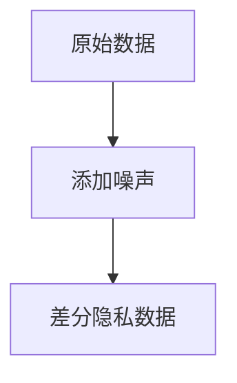
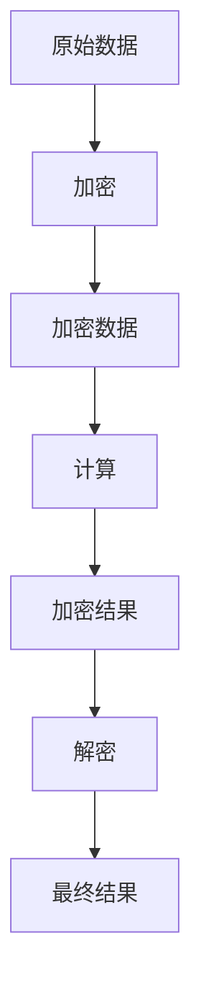
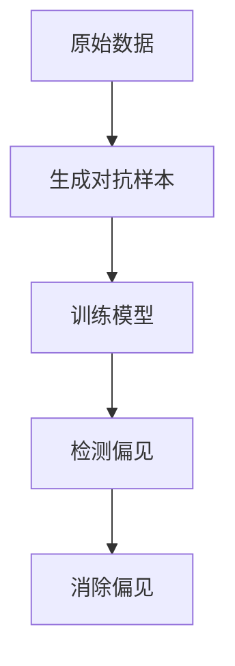
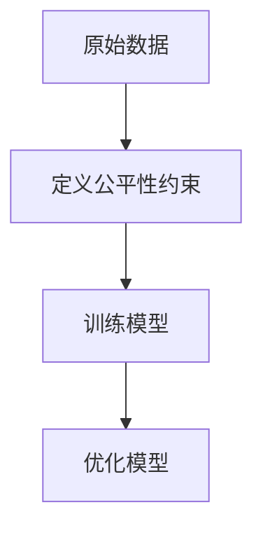

# AI伦理视角下的技术创新6大策略

## 1.背景介绍

在当今科技迅猛发展的时代，人工智能（AI）已经成为推动社会进步的重要力量。然而，随着AI技术的广泛应用，伦理问题也日益凸显。如何在技术创新的同时，确保AI的伦理性和社会责任，成为了一个亟待解决的重要课题。本文将从AI伦理的视角出发，探讨技术创新的六大策略，旨在为技术开发者和决策者提供有价值的参考。

## 2.核心概念与联系

### 2.1 AI伦理的定义

AI伦理是指在开发和应用人工智能技术时，遵循一系列道德和伦理原则，以确保技术的公平性、安全性、透明性和责任性。其核心目标是避免技术滥用，保护用户隐私，防止歧视和偏见。

### 2.2 技术创新的定义

技术创新是指通过新的技术手段和方法，提升产品或服务的性能、效率和用户体验。技术创新不仅包括新技术的发明，还包括现有技术的改进和优化。

### 2.3 AI伦理与技术创新的联系

AI伦理与技术创新密不可分。技术创新为AI的发展提供了动力，而AI伦理则为技术创新提供了方向和约束。只有在伦理框架内进行技术创新，才能确保AI技术的可持续发展和社会认可。

## 3.核心算法原理具体操作步骤

### 3.1 数据隐私保护算法

数据隐私保护是AI伦理的重要组成部分。常用的隐私保护算法包括差分隐私（Differential Privacy）和同态加密（Homomorphic Encryption）。

#### 3.1.1 差分隐私

差分隐私通过在数据中添加噪声，确保个体数据的隐私性。其基本原理是使查询结果在加入或删除一个数据点时，变化不大，从而保护个体隐私。



#### 3.1.2 同态加密

同态加密允许在加密数据上进行计算，而无需解密，从而保护数据隐私。其基本操作步骤如下：

1. 数据加密
2. 在加密数据上进行计算
3. 解密计算结果



### 3.2 公平性算法

公平性是AI伦理的另一个重要方面。常用的公平性算法包括对抗性公平（Adversarial Fairness）和公平性约束优化（Fairness Constraint Optimization）。

#### 3.2.1 对抗性公平

对抗性公平通过生成对抗样本，检测和消除模型中的偏见。其基本操作步骤如下：

1. 生成对抗样本
2. 训练模型
3. 检测和消除偏见



#### 3.2.2 公平性约束优化

公平性约束优化通过在模型训练过程中，加入公平性约束，确保模型的公平性。其基本操作步骤如下：

1. 定义公平性约束
2. 训练模型
3. 优化模型



## 4.数学模型和公式详细讲解举例说明

### 4.1 差分隐私的数学模型

差分隐私的核心思想是通过添加噪声，保护个体数据的隐私。其数学定义如下：

$$
\text{Pr}[M(D) \in S] \leq e^{\epsilon} \cdot \text{Pr}[M(D') \in S]
$$

其中，$M$ 是一个随机化算法，$D$ 和 $D'$ 是两个相邻的数据集，$S$ 是一个结果集，$\epsilon$ 是隐私参数。

### 4.2 同态加密的数学模型

同态加密允许在加密数据上进行计算，其基本数学模型如下：

$$
E(m_1 + m_2) = E(m_1) \cdot E(m_2)
$$

其中，$E$ 是加密函数，$m_1$ 和 $m_2$ 是两个明文数据。

### 4.3 对抗性公平的数学模型

对抗性公平通过生成对抗样本，检测和消除模型中的偏见。其基本数学模型如下：

$$
\min_{G} \max_{D} \mathbb{E}_{x \sim P_{data}(x)} [\log D(x)] + \mathbb{E}_{z \sim P_{z}(z)} [\log (1 - D(G(z)))]
$$

其中，$G$ 是生成器，$D$ 是判别器，$P_{data}$ 是数据分布，$P_{z}$ 是噪声分布。

### 4.4 公平性约束优化的数学模型

公平性约束优化通过在模型训练过程中，加入公平性约束，确保模型的公平性。其基本数学模型如下：

$$
\min_{w} \mathcal{L}(w) + \lambda \cdot \mathcal{C}(w)
$$

其中，$w$ 是模型参数，$\mathcal{L}$ 是损失函数，$\mathcal{C}$ 是公平性约束，$\lambda$ 是权重参数。

## 5.项目实践：代码实例和详细解释说明

### 5.1 差分隐私的代码实例

以下是一个简单的差分隐私实现代码示例：

```python
import numpy as np

def add_noise(data, epsilon):
    noise = np.random.laplace(0, 1/epsilon, size=data.shape)
    return data + noise

data = np.array([1, 2, 3, 4, 5])
epsilon = 0.1
noisy_data = add_noise(data, epsilon)
print(noisy_data)
```

### 5.2 同态加密的代码实例

以下是一个简单的同态加密实现代码示例：

```python
from phe import paillier

public_key, private_key = paillier.generate_paillier_keypair()

data1 = 5
data2 = 10

encrypted_data1 = public_key.encrypt(data1)
encrypted_data2 = public_key.encrypt(data2)

encrypted_sum = encrypted_data1 + encrypted_data2
decrypted_sum = private_key.decrypt(encrypted_sum)

print(decrypted_sum)
```

### 5.3 对抗性公平的代码实例

以下是一个简单的对抗性公平实现代码示例：

```python
import torch
import torch.nn as nn
import torch.optim as optim

class Generator(nn.Module):
    def __init__(self):
        super(Generator, self).__init__()
        self.fc = nn.Linear(100, 784)

    def forward(self, x):
        return torch.sigmoid(self.fc(x))

class Discriminator(nn.Module):
    def __init__(self):
        super(Discriminator, self).__init__()
        self.fc = nn.Linear(784, 1)

    def forward(self, x):
        return torch.sigmoid(self.fc(x))

G = Generator()
D = Discriminator()

criterion = nn.BCELoss()
optimizer_G = optim.Adam(G.parameters(), lr=0.0002)
optimizer_D = optim.Adam(D.parameters(), lr=0.0002)

for epoch in range(10000):
    # 训练判别器
    optimizer_D.zero_grad()
    real_data = torch.randn(64, 784)
    real_labels = torch.ones(64, 1)
    fake_data = G(torch.randn(64, 100))
    fake_labels = torch.zeros(64, 1)
    real_loss = criterion(D(real_data), real_labels)
    fake_loss = criterion(D(fake_data), fake_labels)
    d_loss = real_loss + fake_loss
    d_loss.backward()
    optimizer_D.step()

    # 训练生成器
    optimizer_G.zero_grad()
    fake_data = G(torch.randn(64, 100))
    g_loss = criterion(D(fake_data), real_labels)
    g_loss.backward()
    optimizer_G.step()
```

### 5.4 公平性约束优化的代码实例

以下是一个简单的公平性约束优化实现代码示例：

```python
import cvxpy as cp

# 定义变量
w = cp.Variable(10)
loss = cp.norm(w, 2)
fairness_constraint = cp.norm(w, 1)

# 定义问题
problem = cp.Problem(cp.Minimize(loss + 0.1 * fairness_constraint))

# 求解问题
problem.solve()

print(w.value)
```

## 6.实际应用场景

### 6.1 医疗领域

在医疗领域，AI技术可以用于疾病诊断、药物研发和个性化治疗。然而，数据隐私和公平性问题尤为重要。通过差分隐私和同态加密技术，可以保护患者数据的隐私；通过对抗性公平和公平性约束优化，可以确保AI模型的公平性，避免对特定群体的歧视。

### 6.2 金融领域

在金融领域，AI技术可以用于风险评估、欺诈检测和投资决策。然而，数据隐私和公平性问题同样重要。通过差分隐私和同态加密技术，可以保护用户的金融数据；通过对抗性公平和公平性约束优化，可以确保AI模型的公平性，避免对特定群体的歧视。

### 6.3 教育领域

在教育领域，AI技术可以用于个性化学习、智能评估和教育资源分配。然而，数据隐私和公平性问题也不容忽视。通过差分隐私和同态加密技术，可以保护学生的数据隐私；通过对抗性公平和公平性约束优化，可以确保AI模型的公平性，避免对特定群体的歧视。

## 7.工具和资源推荐

### 7.1 工具推荐

1. **TensorFlow Privacy**：一个用于实现差分隐私的TensorFlow库。
2. **PySyft**：一个用于实现同态加密的PyTorch库。
3. **Fairlearn**：一个用于实现公平性约束优化的Python库。

### 7.2 资源推荐

1. **《差分隐私：理论与实践》**：一本详细介绍差分隐私理论和实践的书籍。
2. **《同态加密：原理与应用》**：一本详细介绍同态加密原理和应用的书籍。
3. **《公平性算法：理论与实践》**：一本详细介绍公平性算法理论和实践的书籍。

## 8.总结：未来发展趋势与挑战

### 8.1 未来发展趋势

随着AI技术的不断发展，AI伦理问题将变得更加复杂和重要。未来，AI伦理将成为技术创新的重要组成部分，技术开发者和决策者需要在技术创新的同时，充分考虑伦理问题，确保技术的公平性、安全性、透明性和责任性。

### 8.2 挑战

尽管AI伦理在技术创新中具有重要作用，但其实现仍面临诸多挑战。首先，如何在保护数据隐私的同时，确保数据的可用性，是一个亟待解决的问题。其次，如何在模型训练过程中，平衡公平性和性能，也是一个重要的挑战。最后，如何在全球范围内，建立统一的AI伦理标准和规范，也是一个亟待解决的问题。

## 9.附录：常见问题与解答

### 9.1 什么是差分隐私？

差分隐私是一种保护数据隐私的技术，通过在数据中添加噪声，确保个体数据的隐私性。

### 9.2 什么是同态加密？

同态加密是一种允许在加密数据上进行计算的技术，从而保护数据隐私。

### 9.3 什么是对抗性公平？

对抗性公平是一种通过生成对抗样本，检测和消除模型中偏见的技术。

### 9.4 什么是公平性约束优化？

公平性约束优化是一种通过在模型训练过程中，加入公平性约束，确保模型公平性的技术。

### 9.5 如何在实际项目中应用AI伦理？

在实际项目中，可以通过使用差分隐私、同态加密、对抗性公平和公平性约束优化等技术，确保AI模型的伦理性。

---

作者：禅与计算机程序设计艺术 / Zen and the Art of Computer Programming