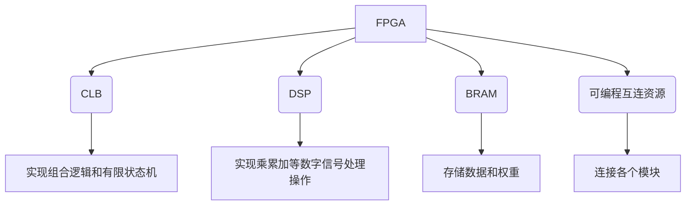
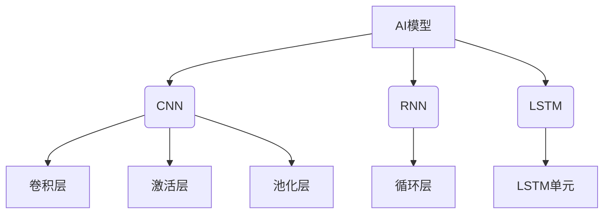
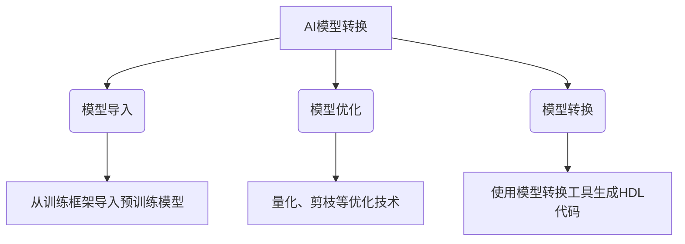
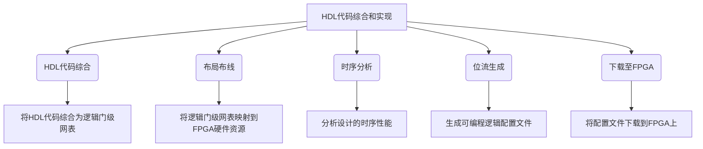

# AI模型部署到FPGA原理与代码实战案例讲解

## 1.背景介绍

随着人工智能(AI)和深度学习技术的快速发展,越来越多的AI模型被应用于各种领域,如计算机视觉、自然语言处理、语音识别等。然而,传统的CPU和GPU在处理这些AI模型时,存在着计算能力有限、功耗较高等问题。因此,将AI模型部署到现场可编程门阵列(FPGA)上成为了一种有效的解决方案。

FPGA是一种可重构的硬件,具有高度的并行处理能力、低功耗和可重构性等优势。将AI模型部署到FPGA上,可以显著提高推理性能,降低功耗,并实现边缘计算。这对于一些对实时性、能耗和成本要求较高的应用场景(如无人驾驶、工业自动化等)尤为重要。

## 2.核心概念与联系

### 2.1 FPGA架构

FPGA由可编程逻辑块(CLB)、数字信号处理(DSP)块、块RAM(BRAM)和可编程互连资源组成。CLB用于实现组合逻辑和有限状态机,DSP块用于实现乘累加等数字信号处理操作,BRAM用于存储数据和权重,可编程互连资源用于连接各个模块。



### 2.2 AI模型

常见的AI模型包括卷积神经网络(CNN)、递归神经网络(RNN)、长短期记忆网络(LSTM)等。这些模型由大量的矩阵乘法、激活函数和池化操作组成。



### 2.3 FPGA加速AI模型

将AI模型部署到FPGA上,需要将模型转换为硬件描述语言(HDL)代码,如Verilog或VHDL。然后,使用FPGA工具将HDL代码综合、布局布线,生成可编程逻辑配置文件,最后将配置文件下载到FPGA上。

在FPGA上实现AI模型时,需要利用FPGA的并行处理能力,将计算密集型操作(如矩阵乘法)映射到DSP块上,将存储密集型操作(如权重存储)映射到BRAM上,并通过流水线和数据流编程技术进行优化。

## 3.核心算法原理具体操作步骤

### 3.1 AI模型转换为HDL代码

将AI模型转换为HDL代码的主要步骤如下:

1. **模型导入**: 从训练框架(如TensorFlow、PyTorch等)中导入预训练的AI模型。
2. **模型优化**: 对模型进行优化,如量化、剪枝等,以减小模型大小和计算复杂度。
3. **模型转换**: 使用模型转换工具(如DNNDK、hls4ml等)将优化后的模型转换为HDL代码。



### 3.2 HDL代码综合和实现

将HDL代码综合并实现到FPGA上的主要步骤如下:

1. **HDL代码综合**: 使用FPGA工具将HDL代码综合为逻辑门级网表。
2. **布局布线**: 将逻辑门级网表映射到FPGA的硬件资源上,包括CLB、DSP块、BRAM等。
3. **时序分析**: 分析设计的时序性能,确保满足时钟约束。
4. **位流生成**: 生成可编程逻辑配置文件(位流文件)。
5. **下载至FPGA**: 将位流文件下载到FPGA上,完成部署。



## 4.数学模型和公式详细讲解举例说明

### 4.1 卷积神经网络

卷积神经网络(CNN)是一种常用的深度学习模型,广泛应用于计算机视觉任务中。CNN由多个卷积层、激活层和池化层组成。

卷积层的核心操作是卷积运算,其数学表达式如下:

$$
y_{ij} = \sum_{m}\sum_{n}x_{m,n}w_{ij}^{m,n}
$$

其中,$ y_{ij} $表示输出特征图的第(i,j)个元素,$ x_{m,n} $表示输入特征图的第(m,n)个元素,$ w_{ij}^{m,n} $表示卷积核的第(m,n)个权重。

激活层通常使用非线性激活函数,如ReLU函数:

$$
f(x) = \max(0, x)
$$

池化层用于下采样特征图,常用的池化操作有最大池化和平均池化。最大池化的数学表达式如下:

$$
y_{ij} = \max_{(m,n) \in R_{ij}}x_{m,n}
$$

其中,$ y_{ij} $表示输出特征图的第(i,j)个元素,$ R_{ij} $表示输入特征图的对应池化区域,$ x_{m,n} $表示输入特征图的第(m,n)个元素。

### 4.2 矩阵乘法

矩阵乘法是深度学习模型中的核心操作之一,在卷积层、全连接层等都有广泛应用。矩阵乘法的数学表达式如下:

$$
C = A \times B
$$

其中,$ A $为m×k矩阵,$ B $为k×n矩阵,$ C $为m×n矩阵。矩阵乘法的计算过程可以表示为:

$$
c_{ij} = \sum_{r=1}^{k}a_{ir}b_{rj}
$$

在FPGA上实现矩阵乘法时,通常采用分块矩阵乘法和流水线技术,以充分利用FPGA的并行处理能力和DSP资源。

## 5.项目实践:代码实例和详细解释说明

以下是一个使用HLS工具将卷积神经网络模型部署到FPGA上的代码示例,包括卷积层、激活层和最大池化层的实现。

### 5.1 卷积层

```cpp
void conv(
    const int input_height,
    const int input_width,
    const int input_channels,
    const int output_channels,
    const int kernel_height,
    const int kernel_width,
    const int stride_height,
    const int stride_width,
    const int pad_height,
    const int pad_width,
    const float input_data[INPUT_SIZE],
    const float kernel_data[KERNEL_SIZE],
    float output_data[OUTPUT_SIZE]
) {
#pragma HLS INTERFACE m_axi port=input_data  offset=slave bundlebundle=gmem
#pragma HLS INTERFACE m_axi port=kernel_data offset=slave bundlebundle=gmem
#pragma HLS INTERFACE m_axi port=output_data offset=slave bundlebundle=gmem

#pragma HLS ARRAY_PARTITION variable=input_data complete dim=3
#pragma HLS ARRAY_PARTITION variable=kernel_data complete dim=4
#pragma HLS ARRAY_PARTITION variable=output_data complete dim=3

    // 卷积计算
    for (int out_ch = 0; out_ch < output_channels; out_ch++) {
        for (int in_ch = 0; in_ch < input_channels; in_ch++) {
            for (int out_y = 0; out_y < output_height; out_y++) {
                for (int out_x = 0; out_x < output_width; out_x++) {
#pragma HLS PIPELINE II=1
                    float acc = 0;
                    for (int k_y = 0; k_y < kernel_height; k_y++) {
                        for (int k_x = 0; k_x < kernel_width; k_x++) {
                            int in_y = out_y * stride_height + k_y - pad_height;
                            int in_x = out_x * stride_width + k_x - pad_width;
                            if (in_y >= 0 && in_y < input_height && in_x >= 0 && in_x < input_width) {
                                acc += input_data[(in_ch * input_height + in_y) * input_width + in_x] *
                                       kernel_data[(out_ch * input_channels + in_ch) * kernel_height * kernel_width +
                                                   k_y * kernel_width + k_x];
                            }
                        }
                    }
                    output_data[(out_ch * output_height + out_y) * output_width + out_x] = acc;
                }
            }
        }
    }
}
```

上述代码实现了卷积层的计算过程。主要步骤如下:

1. 使用`#pragma HLS INTERFACE`指令指定输入、权重和输出数据的接口类型和bundlebundle。
2. 使用`#pragma HLS ARRAY_PARTITION`指令对输入、权重和输出数据进行分区,以提高并行度。
3. 使用多重循环实现卷积计算,其中最内层循环使用`#pragma HLS PIPELINE II=1`指令进行流水线优化。
4. 在最内层循环中,计算输出特征图的每个元素值,包括权重乘积和累加操作。

### 5.2 激活层

```cpp
void relu(
    const int size,
    const float input_data[INPUT_SIZE],
    float output_data[OUTPUT_SIZE]
) {
#pragma HLS INTERFACE m_axi port=input_data  offset=slave bundlebundle=gmem
#pragma HLS INTERFACE m_axi port=output_data offset=slave bundlebundle=gmem

#pragma HLS ARRAY_PARTITION variable=input_data complete dim=1
#pragma HLS ARRAY_PARTITION variable=output_data complete dim=1

    for (int i = 0; i < size; i++) {
#pragma HLS PIPELINE II=1
        output_data[i] = input_data[i] > 0 ? input_data[i] : 0;
    }
}
```

上述代码实现了ReLU激活层的计算过程。主要步骤如下:

1. 使用`#pragma HLS INTERFACE`指令指定输入和输出数据的接口类型和bundlebundle。
2. 使用`#pragma HLS ARRAY_PARTITION`指令对输入和输出数据进行分区,以提高并行度。
3. 使用循环实现ReLU激活函数,其中使用`#pragma HLS PIPELINE II=1`指令进行流水线优化。
4. 在循环中,对每个输入元素应用ReLU激活函数,计算输出元素值。

### 5.3 最大池化层

```cpp
void max_pool(
    const int input_height,
    const int input_width,
    const int input_channels,
    const int output_height,
    const int output_width,
    const int kernel_height,
    const int kernel_width,
    const int stride_height,
    const int stride_width,
    const int pad_height,
    const int pad_width,
    const float input_data[INPUT_SIZE],
    float output_data[OUTPUT_SIZE]
) {
#pragma HLS INTERFACE m_axi port=input_data  offset=slave bundlebundle=gmem
#pragma HLS INTERFACE m_axi port=output_data offset=slave bundlebundle=gmem

#pragma HLS ARRAY_PARTITION variable=input_data complete dim=3
#pragma HLS ARRAY_PARTITION variable=output_data complete dim=3

    for (int out_ch = 0; out_ch < input_channels; out_ch++) {
        for (int out_y = 0; out_y < output_height; out_y++) {
            for (int out_x = 0; out_x < output_width; out_x++) {
#pragma HLS PIPELINE II=1
                float max_val = -FLT_MAX;
                for (int k_y = 0; k_y < kernel_height; k_y++) {
                    for (int k_x = 0; k_x < kernel_width; k_x++) {
                        int in_y = out_y * stride_height + k_y - pad_height;
                        int in_x = out_x * stride_width + k_x - pad_width;
                        if (in_y >= 0 && in_y < input_height && in_x >= 0 && in_x < input_width) {
                            float val = input_data[(out