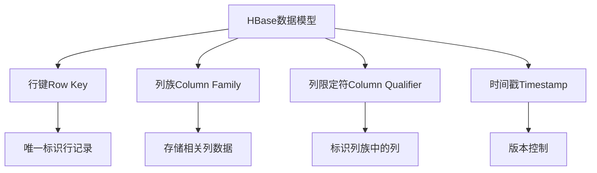
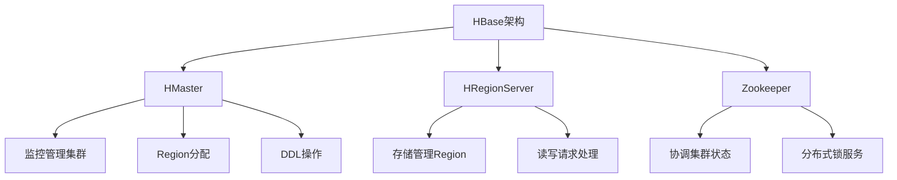
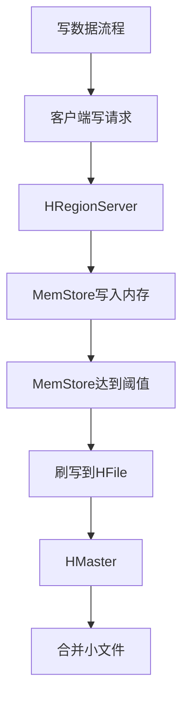
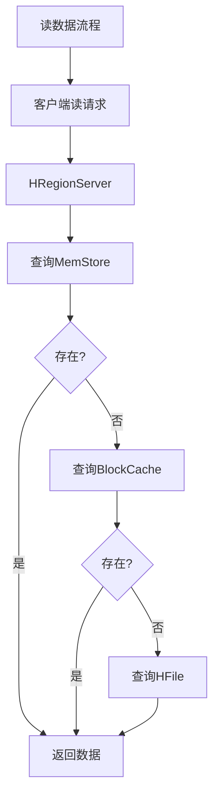

# AI系统HBase原理与代码实战案例讲解

## 1.背景介绍

在当今大数据时代,海量数据的存储和处理成为了一个巨大的挑战。传统的关系型数据库由于其固有的架构限制,很难满足大规模数据集的需求。为了解决这一问题,诞生了一种全新的数据存储方案——HBase。

HBase是一个分布式、可伸缩、面向列的开源数据库,它建立在Hadoop文件系统之上,能够对海量数据提供随机、实时的读写访问。作为Google BigTable的开源克隆版本,HBase继承了BigTable的数据模型,同时增加了一些特性,使其能够更好地与其他大数据工具集成。

## 2.核心概念与联系

### 2.1 HBase数据模型

HBase的数据模型与传统关系型数据库有着根本的区别。它将数据存储在一个三维的稀疏、持久、分布式的多维度映射表中。这三个维度分别是:

- **行键(Row Key)**: 用于唯一标识表中的每一行记录。
- **列族(Column Family)**: 将相关的列数据存储在一起,类似于关系型数据库中的表。
- **列限定符(Column Qualifier)**: 标识列族中的列,相当于关系型数据库中的列名。
- **时间戳(Timestamp)**: 每个单元格都会自动分配一个时间戳,可以用于版本控制。

HBase通过行键对数据进行水平拆分,通过列族对数据进行垂直拆分,从而实现了高效的数据存储和访问。



### 2.2 HBase架构

HBase的架构主要由三个核心组件构成:

1. **HMaster**: 负责监控和管理整个HBase集群,包括Region的分配、DDL操作等。
2. **HRegionServer**: 负责存储和管理HBase中的Region,处理客户端的读写请求。
3. **Zookeeper**: 用于协调和维护HBase集群的状态,提供分布式锁服务。



## 3.核心算法原理具体操作步骤

### 3.1 写数据流程

1. 客户端向HRegionServer发送写请求。
2. HRegionServer将数据写入内存中的MemStore。
3. 当MemStore达到一定阈值时,将数据刷写到HFile(Hadoop文件系统)中。
4. HMaster定期合并小文件,形成更大的HFile。



### 3.2 读数据流程

1. 客户端向HRegionServer发送读请求。
2. HRegionServer先查询MemStore,如果没有则查询BlockCache。
3. 如果BlockCache也没有,则从HFile中读取数据。
4. 将数据返回给客户端。



## 4.数学模型和公式详细讲解举例说明

在HBase中,数据是按照Region进行分布式存储的。为了实现负载均衡和高可用性,需要合理地对Region进行分割和迁移。HBase采用了一种基于预分区的Region分割策略,通过预先设置分割键(Split Key)来控制Region的大小。

假设我们有一个存储用户信息的表,行键是由用户ID组成的字符串。为了防止数据热点,我们可以将行键按照Hash前缀进行分区。设定的分割键为:

$$
\begin{aligned}
&\text{Split Keys} = \{0|, 1|, 2|, 3|, 4|, 5|, 6|, 7|, 8|, 9|, a|, b|, c|, d|, e|, f|\} \\
&\text{其中} | \text{表示字符串的结束符}
\end{aligned}
$$

这样,用户ID以0开头的数据将被存储在第一个Region,以1开头的存储在第二个Region,以此类推。每个Region的数据量大约为总数据量的1/16。

当某个Region的大小超过了设定的阈值时,HBase会自动对该Region进行分割。假设第一个Region(0|)的大小超过了阈值,HBase将按照下面的公式计算新的分割键:

$$
\text{New Split Key} = \text{16#} \lfloor \frac{\text{16#(Region的起始行键)} + \text{16#(Region的结束行键)}}{2} \rfloor
$$

其中,16#表示将字符串转换为16进制数。假设Region的起始行键为0|,结束行键为1|,则新的分割键为:

$$
\begin{aligned}
\text{New Split Key} &= \text{16#} \lfloor \frac{\text{16#(0|)} + \text{16#(1|)}}{2} \rfloor \\
                     &= \text{16#} \lfloor \frac{0x30 + 0x31}{2} \rfloor \\
                     &= \text{16#} \lfloor 0x305 \rfloor \\
                     &= \text{0|8}
\end{aligned}
$$

因此,原来的Region(0|,1|)将被分割为两个新的Region:(0|,0|8)和(0|8,1|)。通过这种分割策略,HBase可以动态地调整Region的大小,实现数据的均衡分布。

## 5.项目实践:代码实例和详细解释说明

下面是一个使用Java代码操作HBase的示例:

```java
// 创建HBase连接
Configuration config = HBaseConfiguration.create();
Connection connection = ConnectionFactory.createConnection(config);

// 获取表对象
TableName tableName = TableName.valueOf("user_info");
Table table = connection.getTable(tableName);

// 插入数据
Put put = new Put(Bytes.toBytes("user_001"));
put.addColumn(Bytes.toBytes("info"), Bytes.toBytes("name"), Bytes.toBytes("John Doe"));
put.addColumn(Bytes.toBytes("info"), Bytes.toBytes("age"), Bytes.toBytes("35"));
table.put(put);

// 获取单行数据
Get get = new Get(Bytes.toBytes("user_001"));
Result result = table.get(get);
byte[] name = result.getValue(Bytes.toBytes("info"), Bytes.toBytes("name"));
byte[] age = result.getValue(Bytes.toBytes("info"), Bytes.toBytes("age"));
System.out.println("Name: " + Bytes.toString(name));
System.out.println("Age: " + Bytes.toString(age));

// 扫描表数据
Scan scan = new Scan();
ResultScanner scanner = table.getScanner(scan);
for (Result res : scanner) {
    System.out.println("Row Key: " + Bytes.toString(res.getRow()));
    // 处理每一行数据
}

// 关闭资源
scanner.close();
table.close();
connection.close();
```

1. 首先创建HBase连接,获取表对象。
2. 使用`Put`对象插入一行数据,包含两个列族`info`下的`name`和`age`列。
3. 使用`Get`对象获取单行数据。
4. 使用`Scan`对象扫描整个表的数据。
5. 最后关闭相关资源。

通过这个示例,我们可以看到HBase提供了简单易用的API,方便进行数据的插入、查询和扫描操作。

## 6.实际应用场景

HBase作为一种高性能、可伸缩的NoSQL数据库,在许多领域都有广泛的应用:

1. **物联网(IoT)数据处理**: 物联网设备产生的海量时序数据可以使用HBase进行高效存储和实时查询。
2. **网络日志分析**: 对网站访问日志进行存储和分析,用于用户行为分析、广告投放等。
3. **内容存储**: 存储大规模的非结构化数据,如社交网络中的用户信息、图片、视频等。
4. **基因组学研究**: 存储和处理大规模的基因组序列数据。
5. **推荐系统**: 存储用户偏好数据,为用户提供个性化推荐服务。

## 7.工具和资源推荐

1. **HBase Shell**: HBase自带的命令行工具,可以方便地执行DDL和DML操作。
2. **HBase REST Server**: 提供RESTful API,使用HTTP协议与HBase进行交互。
3. **HBase Backup**: 用于备份和恢复HBase表数据的工具。
4. **HBase Online Merge Tool**: 在线合并小文件,优化存储空间利用率。
5. **HBase书籍和教程**: 如《HBase实战》、《HBase权威指南》等。
6. **HBase社区**: 包括邮件列表、Stack Overflow等,可以寻求帮助和分享经验。

## 8.总结:未来发展趋势与挑战

HBase作为一种成熟的大数据存储解决方案,在未来仍将有广阔的发展空间:

1. **云原生支持**: 提供更好的云原生支持,方便在云环境中部署和管理HBase集群。
2. **AI/ML集成**: 将HBase与人工智能和机器学习技术更好地集成,支持在海量数据上训练模型。
3. **性能优化**: 持续优化HBase的读写性能、并发能力和容错能力。
4. **安全性增强**: 加强数据安全性,提供更好的身份认证、授权和加密机制。
5. **可观测性提升**: 提供更丰富的监控和诊断工具,提高系统的可观测性。

同时,HBase在实际应用中也面临一些挑战:

1. **大规模集群管理**: 如何高效管理和维护大规模的HBase集群。
2. **数据迁移**: 如何平滑地将数据从其他系统迁移到HBase。
3. **性能调优**: 如何根据不同的应用场景对HBase进行性能调优。
4. **人才培养**: 培养更多掌握HBase技术的人才。

## 9.附录:常见问题与解答

1. **HBase是否适合做实时查询?**

   HBase主要面向的是海量数据的随机读写,虽然可以支持实时查询,但如果查询涉及大量数据扫描,性能可能不如专门的实时查询引擎(如Apache Druid)。因此,HBase更适合作为操作型数据存储,而不是分析型数据存储。

2. **HBase的数据是否具有schema?**

   HBase的数据是无模式的,这意味着不需要预先定义列。但是,为了提高查询效率,建议在设计时根据业务需求合理规划列族。

3. **如何备份和恢复HBase数据?**

   可以使用HBase自带的`export`和`import`命令,或者第三方工具如HBase Backup来完成数据的备份和恢复操作。

4. **HBase是否支持事务?**

   HBase本身不支持多行事务,但可以通过Phoenix等工具提供有限的事务支持。对于需要严格事务的场景,可以考虑使用关系型数据库。

5. **如何监控HBase集群的状态?**

   可以通过HBase的Web UI、JMX指标和第三方监控工具(如Prometheus、Grafana)来监控HBase集群的各项指标,包括Region分布、写入率、读取率等。

作者: 禅与计算机程序设计艺术 / Zen and the Art of Computer Programming