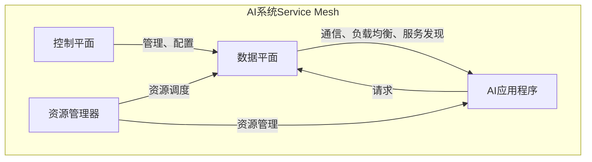
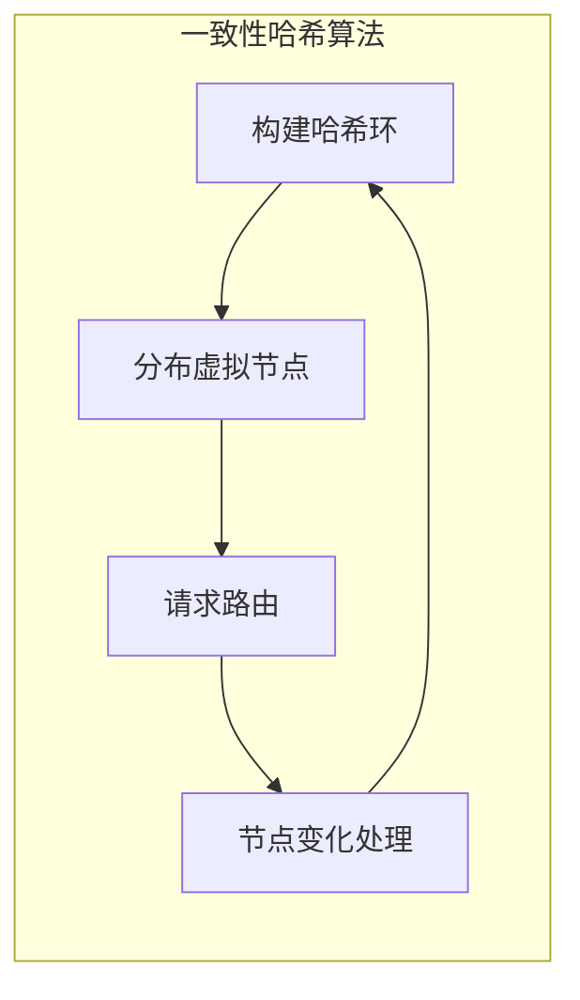
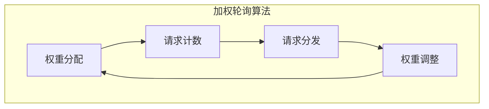

# AI系统Service Mesh原理与代码实战案例讲解

## 1.背景介绍

在当今快速发展的数字时代，人工智能(AI)系统的复杂性和规模与日俱增。随着AI系统的不断扩展和演进,传统的系统架构和管理方式已经无法满足其需求。为了解决这一挑战,Service Mesh(服务网格)作为一种新兴的架构模式应运而生。

Service Mesh为分布式微服务架构带来了一种统一的可靠性和可观察性层。它通过将智能代理作为sidecar(侧挂载)部署在每个微服务实例中,从而实现了服务间通信的可控性、可观察性和安全性。这种模式使得开发人员可以专注于业务逻辑的开发,而将基础设施的复杂性外包给Service Mesh。

然而,在AI系统中引入Service Mesh并非一蹴而就。AI系统具有独特的特征,如大规模并行计算、异构资源管理、实时数据处理等,这些特征对Service Mesh提出了新的挑战。因此,我们需要探索AI系统Service Mesh的原理,并通过实际案例来深入理解其实现方式。

## 2.核心概念与联系

### 2.1 Service Mesh

Service Mesh是一种专门为解决微服务架构中的通信和管理问题而设计的基础设施层。它由一组轻量级的网络代理组成,这些代理被部署为sidecar,与应用程序代码一起运行。Service Mesh负责处理服务间的通信,并提供了一致的可靠性特性,如负载均衡、服务发现、Circuit Breaking、重试等。

### 2.2 AI系统

AI系统是一类专门用于执行人工智能任务的软件系统,如机器学习、深度学习、自然语言处理等。这些系统通常具有以下特点:

- 大规模并行计算
- 异构资源管理(CPU、GPU、TPU等)
- 实时数据处理
- 模型训练和推理

### 2.3 AI系统Service Mesh

AI系统Service Mesh是将Service Mesh的概念应用于AI系统的一种架构模式。它旨在解决AI系统中的通信、管理和资源调度等挑战。AI系统Service Mesh需要考虑AI系统的特殊需求,如异构资源管理、大规模并行计算等。

AI系统Service Mesh的核心组件包括:

- **数据平面(Data Plane)**: 由一组智能代理组成,负责处理服务间的通信、负载均衡、服务发现等。
- **控制平面(Control Plane)**: 负责管理和配置数据平面,提供集中式控制和策略执行。
- **资源管理器(Resource Manager)**: 负责管理和调度AI系统中的异构资源,如CPU、GPU、TPU等。

这些组件协同工作,为AI系统提供了一个统一的可靠性和可观察性层。



## 3.核心算法原理具体操作步骤

### 3.1 服务发现

在AI系统Service Mesh中,服务发现是一个关键的功能。它允许服务实例相互发现和通信,从而实现分布式系统的弹性和可扩展性。

服务发现的核心算法是基于一致性哈希(Consistent Hashing)的算法。具体操作步骤如下:

1. **哈希环构建**: 将所有服务实例的IP地址或主机名通过哈希函数映射到一个环形空间(哈希环)上。

2. **虚拟节点分布**: 为了提高负载均衡的效果,每个实际节点会在哈希环上分布多个虚拟节点。

3. **请求路由**: 当有新的请求到来时,将请求的键值(如HTTP请求的URL)通过哈希函数映射到哈希环上。顺时针找到第一个虚拟节点,将请求路由到该虚拟节点对应的实际节点上。

4. **节点变化处理**: 当有新节点加入或现有节点移除时,只需要在哈希环上添加或删除相应的虚拟节点,而不需要重新构建整个哈希环。这样可以最小化对现有请求的影响。



### 3.2 负载均衡

在AI系统Service Mesh中,负载均衡是另一个关键功能。它确保系统中的资源被合理利用,并提高整体性能和可用性。

负载均衡的核心算法是基于加权轮询(Weighted Round Robin)的算法。具体操作步骤如下:

1. **权重分配**: 根据服务实例的性能和负载情况,为每个实例分配一个权重值。

2. **请求计数**: 维护一个请求计数器,初始值为0。

3. **请求分发**: 当有新的请求到来时,将请求计数器加上当前实例的权重值。选择请求计数器值对应的实例处理该请求。

4. **权重调整**: 定期或根据实例的负载情况动态调整每个实例的权重值,以实现更好的负载均衡效果。



## 4.数学模型和公式详细讲解举例说明

### 4.1 一致性哈希算法数学模型

一致性哈希算法的核心思想是将节点和请求键值映射到同一个哈希环上,从而实现请求的均匀分布。

设有 $n$ 个节点 $\{node_1, node_2, \dots, node_n\}$,每个节点通过哈希函数 $hash()$ 映射到 $[0, 2^{32})$ 的环形空间上。为了提高负载均衡效果,每个实际节点会在哈希环上分布 $m$ 个虚拟节点。

对于一个请求键值 $key$,通过 $hash(key)$ 映射到环形空间上,顺时针找到第一个虚拟节点 $v_i$,将请求路由到 $v_i$ 对应的实际节点 $node_j$ 上。

数学模型如下:

$$
node_j = argmin_{node_k} \{hash(v_i) - hash(key)\}, \quad \forall v_i \in V(node_k)
$$

其中 $V(node_k)$ 表示节点 $node_k$ 在环形空间上的所有虚拟节点集合。

当有节点加入或移除时,只需要在环形空间上添加或删除相应的虚拟节点,而不需要重新构建整个哈希环。这样可以最小化对现有请求的影响,提高系统的可扩展性和可用性。

### 4.2 加权轮询算法数学模型

加权轮询算法的核心思想是根据节点的权重值分配请求,从而实现合理的负载均衡。

设有 $n$ 个节点 $\{node_1, node_2, \dots, node_n\}$,每个节点的权重值分别为 $\{w_1, w_2, \dots, w_n\}$。定义一个请求计数器 $c$,初始值为0。

当有新的请求到来时,将请求计数器 $c$ 加上当前节点的权重值 $w_i$,即 $c = c + w_i$。选择请求计数器值对应的节点处理该请求,即:

$$
node_j = argmin_{node_k} \{c - \sum_{i=1}^{k-1} w_i\}, \quad 1 \leq j \leq n
$$

如果 $c$ 大于所有节点权重之和,则对 $c$ 取模运算,即 $c = c \bmod \sum_{i=1}^{n} w_i$。

通过动态调整每个节点的权重值 $w_i$,可以实现更好的负载均衡效果。例如,对于负载较高的节点,可以降低其权重值;对于负载较低的节点,可以提高其权重值。

## 5.项目实践:代码实例和详细解释说明

### 5.1 一致性哈希算法实现

下面是一个基于Python实现的一致性哈希算法示例:

```python
import hashlib

class ConsistentHashRing:
    def __init__(self, nodes, num_replicas=3):
        self.nodes = nodes
        self.num_replicas = num_replicas
        self.ring = {}
        self.build_ring()

    def build_ring(self):
        for node in self.nodes:
            for i in range(self.num_replicas):
                key = f"{node}:{i}"
                hash_value = self.hash(key)
                self.ring[hash_value] = node

    def hash(self, key):
        return int(hashlib.sha1(key.encode()).hexdigest(), 16)

    def get_node(self, key):
        hash_value = self.hash(key)
        sorted_ring = sorted(self.ring.keys())
        for i in range(len(sorted_ring)):
            if sorted_ring[i] >= hash_value:
                return self.ring[sorted_ring[i]]
        return self.ring[sorted_ring[0]]
```

在这个示例中,我们定义了一个 `ConsistentHashRing` 类来实现一致性哈希算法。

- `__init__` 方法初始化了节点列表 `nodes` 和虚拟节点数量 `num_replicas`。
- `build_ring` 方法构建了哈希环,将每个节点的虚拟节点映射到环形空间上。
- `hash` 方法使用 SHA-1 哈希函数将字符串映射到一个整数值。
- `get_node` 方法根据给定的键值找到对应的节点。它首先计算键值的哈希值,然后在哈希环上顺时针找到第一个大于或等于该哈希值的虚拟节点,返回该虚拟节点对应的实际节点。

使用示例:

```python
nodes = ["node1", "node2", "node3"]
ring = ConsistentHashRing(nodes)

print(ring.get_node("key1"))  # 输出: node3
print(ring.get_node("key2"))  # 输出: node1
```

### 5.2 加权轮询算法实现

下面是一个基于Python实现的加权轮询算法示例:

```python
class WeightedRoundRobin:
    def __init__(self, nodes):
        self.nodes = nodes
        self.weights = [1] * len(nodes)  # 初始权重值为1
        self.current_weight = 0
        self.max_weight = sum(self.weights)

    def get_node(self):
        self.current_weight = (self.current_weight + 1) % self.max_weight
        for i, weight in enumerate(self.weights):
            self.current_weight -= weight
            if self.current_weight < 0:
                return self.nodes[i]

    def update_weight(self, node, weight):
        index = self.nodes.index(node)
        self.weights[index] = weight
        self.max_weight = sum(self.weights)
```

在这个示例中,我们定义了一个 `WeightedRoundRobin` 类来实现加权轮询算法。

- `__init__` 方法初始化了节点列表 `nodes` 和权重列表 `weights`。初始时,所有节点的权重值都设置为1。
- `get_node` 方法返回下一个要处理请求的节点。它首先更新当前权重值 `current_weight`,然后遍历权重列表,找到第一个使 `current_weight` 小于0的节点,返回该节点。
- `update_weight` 方法用于动态更新指定节点的权重值。它首先找到该节点在节点列表中的索引,然后更新对应的权重值,并重新计算最大权重值 `max_weight`。

使用示例:

```python
nodes = ["node1", "node2", "node3"]
wrr = WeightedRoundRobin(nodes)

print(wrr.get_node())  # 输出: node1
print(wrr.get_node())  # 输出: node2
print(wrr.get_node())  # 输出: node3

wrr.update_weight("node2", 2)

print(wrr.get_node())  # 输出: node2
print(wrr.get_node())  # 输出: node1
print(wrr.get_node())  # 输出: node2
```

在这个示例中,我们首先创建了一个 `WeightedRoundRobin` 实例,并获取了前三个节点。然后,我们将 `node2` 的权重值更新为2,可以看到后续的请求分发更倾向