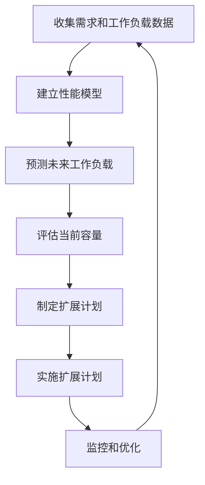

# AI系统容量规划原理与代码实战案例讲解

## 1.背景介绍

### 1.1 什么是AI系统容量规划?

随着人工智能(AI)技术的快速发展,越来越多的企业和组织开始采用AI系统来提高效率、优化决策和创造新的商业价值。然而,AI系统的高效运行需要大量的计算资源,如CPU、GPU、内存和存储。因此,合理规划AI系统的容量以满足当前和未来的需求变得至关重要。

AI系统容量规划是一个复杂的过程,需要考虑多个因素,如工作负载特征、数据量、模型复杂度、响应时间要求等。准确的容量规划不仅可以确保AI系统的高效运行,还可以避免资源浪费和不必要的成本支出。

### 1.2 AI系统容量规划的重要性

适当的AI系统容量规划可以带来以下好处:

- **提高系统性能**:足够的计算资源可以确保AI模型的高效训练和推理,从而提高系统的整体性能。
- **优化资源利用**:通过精心规划,可以最大限度地利用现有资源,避免资源浪费和过度配置。
- **控制成本**:合理的容量规划有助于控制硬件和基础设施成本,实现成本效益最大化。
- **满足未来需求**:通过预测未来的工作负载增长,可以提前做好扩展准备,确保系统能够顺利扩展以满足未来需求。
- **降低风险**:充足的容量可以降低系统过载和性能下降的风险,确保AI系统的稳定运行。

因此,AI系统容量规划是确保AI系统高效、可靠和经济运行的关键因素。

## 2.核心概念与联系

### 2.1 核心概念

在AI系统容量规划中,有几个核心概念需要了解:

1. **工作负载(Workload)**: 指AI系统需要处理的任务或请求的总量,包括模型训练、推理、数据处理等。工作负载的特征对容量规划至关重要。

2. **资源类型(Resource Type)**: AI系统所需的计算资源类型,包括CPU、GPU、内存、存储等。不同的资源类型适用于不同的工作负载。

3. **资源利用率(Resource Utilization)**: 指系统中每种资源的实际使用量与最大可用量之比。资源利用率过高会导致性能下降,过低则意味着资源浪费。

4. **服务水平目标(Service Level Objective, SLO)**: 定义了系统性能的目标,如响应时间、吞吐量等。容量规划需要确保满足这些SLO。

5. **扩展策略(Scaling Strategy)**: 根据工作负载变化动态调整资源分配的策略,包括垂直扩展(增加单个节点资源)和水平扩展(增加节点数量)。

### 2.2 核心概念之间的联系

上述核心概念相互关联,共同影响AI系统的容量规划决策:

1. **工作负载特征**决定了所需的**资源类型**和**数量**。不同的工作负载对CPU、GPU、内存和存储的需求不同。

2. **资源利用率**需要与**服务水平目标(SLO)**相匹配。过高或过低的利用率都可能导致SLO无法满足。

3. **扩展策略**需要根据**工作负载变化**和**资源利用率**动态调整,以满足SLO并优化资源利用。

4. **容量规划决策**需要综合考虑所有这些因素,确保系统能够高效、可靠地运行,同时控制成本。

这些核心概念的有机结合是AI系统容量规划的基础。下面将详细介绍容量规划的核心算法原理和实践案例。

## 3.核心算法原理具体操作步骤

### 3.1 AI系统容量规划流程

AI系统容量规划通常遵循以下流程:

1. **收集需求和工作负载数据**:了解业务需求、SLO目标,收集历史工作负载数据,包括CPU、GPU、内存和存储的使用情况。

2. **建立性能模型**:根据收集的数据,建立AI系统的性能模型,描述工作负载与资源利用之间的关系。

3. **预测未来工作负载**:基于历史数据和业务发展规划,预测未来一段时间内的工作负载变化趋势。

4. **评估当前容量**:根据性能模型和预测的工作负载,评估当前资源容量是否足以满足未来需求和SLO目标。

5. **制定扩展计划**:如果当前容量不足,则制定扩展计划,确定扩展时间、资源类型和数量,以及扩展策略(垂直扩展或水平扩展)。

6. **实施扩展计划**:按照扩展计划,增加或调整计算资源。

7. **监控和优化**:持续监控系统性能和资源利用情况,根据实际情况对容量规划进行优化调整。

这个流程是循环的,需要定期重复执行,以适应不断变化的业务需求和工作负载。

### 3.2 工作负载建模

工作负载建模是容量规划的关键步骤之一。它旨在建立工作负载与资源利用之间的数学模型,以便对系统性能进行预测和优化。

常用的工作负载建模方法包括:

1. **线性回归模型**:假设工作负载和资源利用之间存在线性关系,使用线性回归方程拟合历史数据。

2. **时间序列模型**:将工作负载视为时间序列数据,使用自回归移动平均(ARMA)、自回归综合移动平均(ARIMA)等模型进行预测。

3. **队列模型**:将AI系统视为队列系统,使用排队理论模型(如M/M/1、M/G/1等)描述工作负载和资源利用的关系。

4. **机器学习模型**:利用神经网络、决策树等机器学习算法,从历史数据中学习工作负载与资源利用的非线性映射关系。

不同的建模方法适用于不同的场景和数据特征。在实际应用中,需要根据具体情况选择合适的方法,并进行模型训练和验证。

### 3.3 资源扩展策略

根据工作负载预测和性能模型,如果发现当前资源容量不足以满足未来需求,就需要制定资源扩展策略。常见的扩展策略包括:

1. **垂直扩展(Scale Up)**:增加单个计算节点的资源,如升级CPU、增加内存等。垂直扩展通常更简单,但存在单节点资源上限。

2. **水平扩展(Scale Out)**:增加计算节点的数量,形成集群。水平扩展具有更好的扩展性,但需要解决负载均衡和数据一致性等问题。

3. **自动扩展(Auto Scaling)**:根据实时工作负载自动调整资源分配,实现按需扩展。这需要云计算或容器技术的支持。

4. **混合扩展**:结合垂直扩展和水平扩展,既增加单节点资源,又增加节点数量。

选择合适的扩展策略需要考虑多个因素,如成本、可扩展性、复杂度等。通常需要在性能、成本和可管理性之间寻求平衡。

## 4.数学模型和公式详细讲解举例说明

在AI系统容量规划中,数学模型和公式可以帮助我们更好地描述和优化系统性能。下面将介绍一些常用的数学模型和公式。

### 4.1 线性回归模型

线性回归模型假设工作负载和资源利用之间存在线性关系,可以用下式表示:

$$
y = \beta_0 + \beta_1 x_1 + \beta_2 x_2 + ... + \beta_n x_n
$$

其中:
- $y$是资源利用率(如CPU利用率)
- $x_1, x_2, ..., x_n$是影响资源利用率的工作负载特征(如请求数、数据量等)
- $\beta_0, \beta_1, ..., \beta_n$是需要从历史数据中估计的模型参数

通过对历史数据进行线性回归拟合,可以得到模型参数的估计值,从而建立工作负载与资源利用之间的线性映射关系。

例如,假设我们发现CPU利用率主要受请求数和数据量的影响,可以建立如下线性回归模型:

$$
\text{CPU利用率} = 0.2 + 0.005 \times \text{请求数} + 0.00003 \times \text{数据量(GB)}
$$

根据这个模型,如果每秒请求数为1000,数据量为500GB,则预测的CPU利用率为:

$$
\text{CPU利用率} = 0.2 + 0.005 \times 1000 + 0.00003 \times 500000 = 0.725 = 72.5\%
$$

线性回归模型虽然简单,但在许多场景下能够提供足够的预测精度。

### 4.2 队列模型

队列模型将AI系统视为一个队列系统,描述了请求到达、等待和服务的过程。常用的队列模型包括M/M/1、M/G/1等。

以M/M/1模型为例,它假设请求到达服从泊松过程,服务时间服从负指数分布,且只有一个服务器。在该模型下,系统的平均响应时间可以用下式计算:

$$
R = \frac{1}{\mu - \lambda}
$$

其中:
- $R$是平均响应时间
- $\lambda$是请求到达率(每秒请求数)
- $\mu$是服务率(每秒可处理请求数)

当$\lambda < \mu$时,队列长度有限;当$\lambda \geq \mu$时,队列长度将无限增长,系统会发生过载。

因此,我们可以根据响应时间的SLO目标,确定系统的最大请求到达率$\lambda_{max}$:

$$
\lambda_{max} = \mu \times \left(1 - \frac{1}{\mu \times R_{SLO}}\right)
$$

其中$R_{SLO}$是响应时间的SLO目标。

根据$\lambda_{max}$和预测的工作负载,我们可以确定所需的服务率$\mu$,进而规划所需的计算资源。

队列模型虽然基于一些理想化假设,但能够为我们提供有价值的性能洞察和容量规划指导。

### 4.3 机器学习模型

除了传统的数学模型,我们还可以利用机器学习算法从历史数据中学习工作负载与资源利用之间的非线性映射关系。

常用的机器学习模型包括:

- **神经网络**:可以建立任意复杂的非线性映射模型,如多层感知器(MLP)、长短期记忆网络(LSTM)等。
- **决策树**:通过构建决策树,可以自动学习影响资源利用的关键特征及其组合。
- **集成模型**:将多个基础模型(如决策树)组合起来,形成性能更好的集成模型,如随机森林、Gradient Boosting等。

以神经网络为例,我们可以将工作负载特征(如请求数、数据量等)作为输入,资源利用率作为输出,构建一个前馈神经网络模型:

$$
\begin{aligned}
h_1 &= \sigma(W_1^T x + b_1) \\
h_2 &= \sigma(W_2^T h_1 + b_2) \\
\hat{y} &= W_3^T h_2 + b_3
\end{aligned}
$$

其中:
- $x$是工作负载特征向量
- $h_1, h_2$是隐藏层的输出
- $W_1, W_2, W_3, b_1, b_2, b_3$是需要通过训练学习的模型参数
- $\sigma$是非线性激活函数,如ReLU、Sigmoid等

通过在历史数据上训练该神经网络模型,可以自动学习工作负载特征与资源利用之间的复杂非线性映射关系,从而提高预测精度。

机器学习模型的优势在于能够自动发现数据中的模式和规律,但也需要足够的历史数据进行训练,并且模型的可解释性往往较差。在实际应用中,