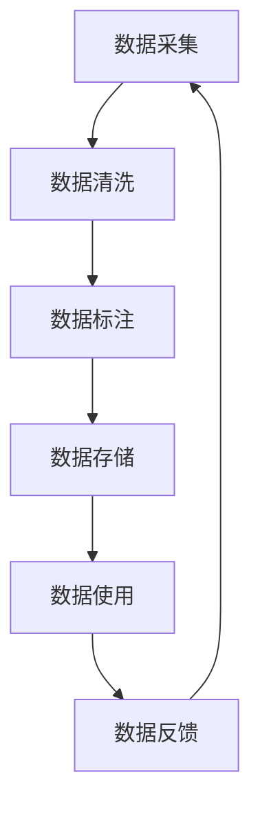

# AI系统的数据质量管理

## 1.背景介绍

在当今的数字时代,数据已成为推动人工智能(AI)系统发展的关键燃料。高质量的数据对于训练准确、高效的AI模型至关重要。然而,现实世界中的数据通常存在噪声、偏差、不完整性等质量问题,这会严重影响AI系统的性能和可靠性。因此,有效管理数据质量对于构建成功的AI系统至关重要。

数据质量管理是一个持续的过程,需要在数据生命周期的各个阶段(包括数据采集、清洗、标注、存储和使用)进行监控和优化。它涉及多个方面,包括数据完整性、一致性、准确性、相关性、及时性和隐私性等。高质量的数据不仅可以提高AI模型的准确性和泛化能力,还能确保AI系统在现实世界中的安全和可靠运行。

## 2.核心概念与联系

### 2.1 数据质量维度

数据质量通常由多个维度构成,每个维度都对应着特定的质量属性。以下是一些常见的数据质量维度:

1. **完整性(Completeness)**: 数据应该是全面和完整的,没有缺失值或丢失记录。
2. **准确性(Accuracy)**: 数据应该准确反映现实世界,没有错误或矛盾。
3. **一致性(Consistency)**: 数据在不同来源和上下文中应该保持一致,避免冲突和重复。
4. **及时性(Timeliness)**: 数据应该是最新的,能够及时反映现实世界的变化。
5. **相关性(Relevance)**: 数据应该与目标任务和用例相关,避免无关或多余的信息。
6. **可解释性(Interpretability)**: 数据应该易于理解和解释,尤其是对于人工智能系统的决策过程。
7. **隐私性(Privacy)**: 数据应该保护个人隐私,遵守相关的隐私法规和道德准则。

这些维度相互关联,需要综合考虑和权衡。例如,提高数据的完整性可能会影响及时性,而保护隐私可能会降低数据的相关性。因此,数据质量管理需要根据具体的应用场景和需求,合理平衡不同的质量维度。

### 2.2 数据质量管理生命周期

数据质量管理是一个持续的过程,贯穿于数据生命周期的各个阶段。典型的数据质量管理生命周期包括以下步骤:



1. **数据采集**: 从各种来源(如传感器、API、人工等)收集原始数据,并进行初步的质量检查和预处理。
2. **数据清洗**: 处理原始数据中的噪声、异常值、缺失值等问题,提高数据的完整性和准确性。
3. **数据标注**: 为数据添加标签或注释,以便用于监督学习任务。确保标注的一致性和准确性至关重要。
4. **数据存储**: 将清洗和标注后的数据存储在适当的数据库或存储系统中,以便后续使用。
5. **数据使用**: 将存储的数据用于训练AI模型或其他应用场景。
6. **数据反馈**: 收集来自模型或应用的反馈,评估数据质量,并将反馈纳入下一轮的数据采集和处理过程中。

在整个生命周期中,需要持续监控和评估数据质量,并采取适当的措施来解决质量问题。这可能需要人工干预或自动化工具的支持。

## 3.核心算法原理具体操作步骤

### 3.1 数据质量评估

评估数据质量是数据质量管理的关键步骤之一。常见的数据质量评估方法包括:

1. **规则检查**: 根据预定义的规则(如数据类型、范围、模式等)检查数据,识别违反规则的情况。
2. **统计分析**: 计算数据的统计量(如均值、中位数、方差等),并与预期值进行比较,发现异常情况。
3. **异常检测**: 使用机器学习算法(如聚类、隔离森林等)自动检测数据中的异常值或异常模式。
4. **数据探索**: 通过可视化和交互式数据探索,人工识别数据中的质量问题。

这些方法可以单独使用,也可以组合使用,以全面评估数据质量。评估结果可以用于指导后续的数据清洗、标注和处理过程。

### 3.2 数据清洗

数据清洗是解决数据质量问题的关键步骤,旨在提高数据的完整性、准确性和一致性。常见的数据清洗技术包括:

1. **缺失值处理**: 通过删除、插补或预测等方式处理缺失值。
2. **异常值处理**: 识别和修复或删除异常值。
3. **数据规范化**: 将数据转换为标准格式,消除不一致性。
4. **数据去重**: 识别和删除重复记录。
5. **数据转换**: 将数据从一种格式转换为另一种格式,以满足特定需求。
6. **数据增强**: 通过合成或扩充现有数据,增加数据的多样性和覆盖面。

这些技术可以手动执行,也可以使用自动化工具来加速处理过程。数据清洗通常是一个迭代的过程,需要反复评估和优化,直到达到满意的质量水平。

### 3.3 数据标注

对于监督学习任务,数据标注是确保训练数据质量的关键步骤。常见的数据标注方法包括:

1. **人工标注**: 由人工专家手动为数据添加标签或注释。
2. **众包标注**: 将标注任务分发给大量的在线工人,并聚合结果。
3. **主动学习**: 使用机器学习算法智能地选择最有价值的数据进行人工标注。
4. **弱监督学习**: 利用现有的弱标签(如正则表达式、知识库等)进行初步标注,然后通过模型迭代改进标签质量。
5. **自动标注**: 使用现有的高质量模型自动为新数据进行标注。

无论采用何种方法,都需要确保标注的一致性和准确性。常见的做法包括制定明确的标注指南、进行人工审核、计算标注者间的一致性等。高质量的标注数据对于训练准确的AI模型至关重要。

## 4.数学模型和公式详细讲解举例说明

在数据质量管理中,常常需要使用数学模型和公式来量化和评估数据质量。以下是一些常见的数学模型和公式:

### 4.1 数据完整性评估

数据完整性可以通过计算缺失值率来评估。缺失值率定义为:

$$
缺失值率 = \frac{缺失值个数}{总记录数}
$$

缺失值率越低,数据的完整性越高。在某些情况下,也可以计算不同特征或维度的缺失值率,以识别具体的问题领域。

### 4.2 数据准确性评估

评估数据准确性的一种常见方法是使用混淆矩阵(Confusion Matrix)。对于二分类问题,混淆矩阵如下所示:

```
          实际值
          正例  负例
预测值 正例  TP    FP
       负例  FN    TN
```

其中,TP(True Positive)表示正确预测为正例的个数,FP(False Positive)表示错误预测为正例的个数,FN(False Negative)表示错误预测为负例的个数,TN(True Negative)表示正确预测为负例的个数。

基于混淆矩阵,可以计算以下指标来评估数据准确性:

- 准确率(Accuracy) = (TP + TN) / (TP + FP + FN + TN)
- 精确率(Precision) = TP / (TP + FP)
- 召回率(Recall) = TP / (TP + FN)
- F1分数 = 2 * (精确率 * 召回率) / (精确率 + 召回率)

这些指标可以综合反映数据的准确性,并帮助识别具体的错误类型。

### 4.3 数据一致性评估

评估数据一致性的一种方法是使用Jaccard相似系数。对于两个数据集A和B,Jaccard相似系数定义为:

$$
J(A, B) = \frac{|A \cap B|}{|A \cup B|}
$$

其中,|A ∩ B|表示A和B的交集大小,|A ∪ B|表示A和B的并集大小。Jaccard相似系数的取值范围为[0,1],值越大表示两个数据集越相似,即一致性越高。

在实际应用中,可以将数据集A和B分别表示为不同来源或不同时间点的数据,计算它们之间的Jaccard相似系数,以评估数据的一致性。

### 4.4 数据隐私保护

在保护数据隐私的同时,也需要尽可能保留数据的有用信息。一种常见的隐私保护技术是差分隐私(Differential Privacy)。差分隐私通过在数据中引入一定程度的噪声来隐藏个人信息,同时保证对整体数据的统计分析结果几乎没有影响。

差分隐私的数学定义如下:对于任意相邻的数据集D和D'(即它们只相差一条记录),以及任意输出O,满足:

$$
\Pr[K(D) \in O] \leq e^\epsilon \times \Pr[K(D') \in O]
$$

其中,K表示隐私机制(Privacy Mechanism),ε是隐私预算(Privacy Budget),用于控制隐私保护的强度。ε越小,隐私保护越强,但同时也会引入更多噪声,影响数据的有用性。

在实际应用中,需要根据具体场景权衡隐私保护和数据有用性,选择合适的隐私预算ε。

## 5.项目实践:代码实例和详细解释说明

在本节中,我们将通过一个实际项目案例,展示如何应用数据质量管理的技术和工具。我们将使用Python编程语言和一些流行的数据处理库,如Pandas、NumPy和Scikit-learn。

### 5.1 项目概述

假设我们有一个客户服务数据集,包含了客户的基本信息(如年龄、性别、地区等)以及他们对公司产品和服务的反馈。我们的目标是构建一个机器学习模型,根据客户信息预测他们对产品的满意度。但在训练模型之前,我们需要确保数据的质量,以获得更准确的预测结果。

### 5.2 数据加载和探索

首先,我们加载数据集并进行初步探索:

```python
import pandas as pd

# 加载数据
data = pd.read_csv('customer_data.csv')

# 查看数据概览
print(data.head())
print(data.info())
print(data.describe())
```

通过查看数据概览,我们可以了解数据的结构、数据类型、缺失值情况等。这有助于我们发现潜在的质量问题,如缺失值、异常值等。

### 5.3 数据清洗

接下来,我们对数据进行清洗,处理缺失值和异常值:

```python
# 处理缺失值
data = data.dropna(subset=['age', 'satisfaction_score'])  # 删除年龄和满意度分数缺失的记录
data = data.fillna({'gender': 'Unknown'})  # 用"Unknown"填充缺失的性别

# 处理异常值
import numpy as np
data = data[np.abs(data['satisfaction_score']-data['satisfaction_score'].mean()) <= (3*data['satisfaction_score'].std())]  # 删除满意度分数的异常值
```

在这个例子中,我们删除了年龄和满意度分数缺失的记录,用"Unknown"填充了缺失的性别,并删除了满意度分数的异常值(超出3个标准差范围)。根据具体情况,我们可以采用不同的缺失值和异常值处理策略。

### 5.4 数据标注

对于监督学习任务,我们通常需要为数据添加标签。在本例中,我们将满意度分数二值化,作为目标标签:

```python
# 二值化满意度分数
data['satisfaction_label'] = (data['satisfaction_score'] > data['satisfaction_score'].mean()).astype(int)
```

### 5.5 数据划分

为了评估模型的