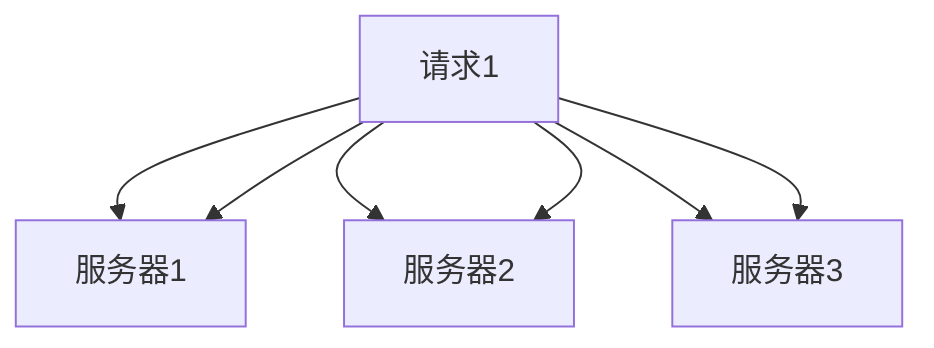
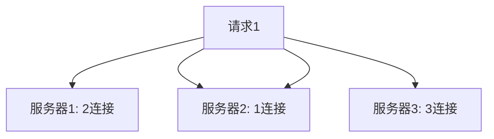
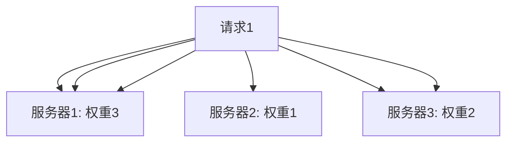
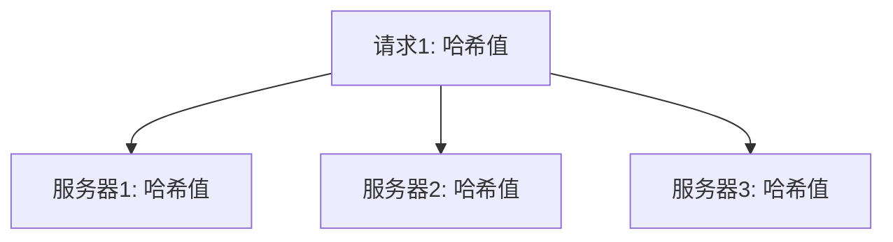

# AI系统负载均衡原理与代码实战案例讲解

## 1.背景介绍

在现代计算机系统中，负载均衡是确保系统高效运行和稳定性的关键技术之一。随着人工智能（AI）系统的广泛应用，负载均衡在AI系统中的重要性愈发凸显。AI系统通常需要处理大量的数据和复杂的计算任务，这对系统的性能和可靠性提出了更高的要求。负载均衡技术通过合理分配计算资源，确保系统在高负载情况下仍能高效运行，从而提升系统的整体性能和用户体验。

## 2.核心概念与联系

### 2.1 负载均衡的定义

负载均衡（Load Balancing）是指将工作负载分配到多个计算资源（如服务器、处理器、存储设备等）上，以提高系统的处理能力和可靠性。负载均衡可以在不同层次上实现，包括网络层、应用层和数据层。

### 2.2 AI系统中的负载均衡

在AI系统中，负载均衡主要涉及以下几个方面：

- **计算资源的分配**：将计算任务分配到不同的处理器或计算节点上，以提高计算效率。
- **数据流的管理**：合理分配数据流，确保数据处理的高效性和可靠性。
- **存储资源的优化**：优化存储资源的使用，确保数据的快速访问和处理。

### 2.3 负载均衡与高可用性

负载均衡不仅可以提高系统的处理能力，还可以增强系统的高可用性。通过将工作负载分配到多个计算资源上，即使某个资源出现故障，系统仍能继续运行，从而提高系统的可靠性。

## 3.核心算法原理具体操作步骤

### 3.1 轮询算法（Round Robin）

轮询算法是最简单的负载均衡算法之一。它将请求依次分配给每个服务器，循环往复。该算法的优点是实现简单，但在服务器性能差异较大的情况下，可能导致负载不均衡。



### 3.2 最少连接算法（Least Connections）

最少连接算法将请求分配给当前连接数最少的服务器。该算法适用于长连接的场景，可以有效平衡服务器的负载。



### 3.3 加权轮询算法（Weighted Round Robin）

加权轮询算法为每个服务器分配一个权重，根据权重分配请求。权重越高的服务器，分配到的请求越多。该算法适用于服务器性能差异较大的场景。



### 3.4 一致性哈希算法（Consistent Hashing）

一致性哈希算法将请求和服务器映射到一个哈希环上，根据哈希值分配请求。该算法在服务器动态增减时，能够最小化数据的重新分配，适用于分布式缓存和存储系统。



## 4.数学模型和公式详细讲解举例说明

### 4.1 轮询算法

轮询算法的数学模型相对简单。假设有 $n$ 台服务器，当前请求编号为 $i$，则请求将被分配到服务器 $i \mod n$。

$$
\text{服务器编号} = i \mod n
$$

### 4.2 最少连接算法

最少连接算法的数学模型基于当前连接数。假设有 $n$ 台服务器，当前连接数分别为 $C_1, C_2, \ldots, C_n$，则请求将被分配到连接数最少的服务器 $j$，其中

$$
j = \arg\min_{k} C_k
$$

### 4.3 加权轮询算法

加权轮询算法的数学模型基于服务器的权重。假设有 $n$ 台服务器，权重分别为 $W_1, W_2, \ldots, W_n$，则请求将根据权重分配。具体实现可以通过构建一个权重数组来实现。

### 4.4 一致性哈希算法

一致性哈希算法的数学模型基于哈希函数。假设有 $n$ 台服务器，哈希函数为 $H$，则请求 $r$ 将被分配到哈希值最接近的服务器 $j$，其中

$$
j = \arg\min_{k} |H(r) - H(S_k)|
$$

## 5.项目实践：代码实例和详细解释说明

### 5.1 轮询算法的实现

```python
class RoundRobinBalancer:
    def __init__(self, servers):
        self.servers = servers
        self.index = 0

    def get_server(self):
        server = self.servers[self.index]
        self.index = (self.index + 1) % len(self.servers)
        return server

# 示例使用
servers = ['server1', 'server2', 'server3']
balancer = RoundRobinBalancer(servers)
for _ in range(6):
    print(balancer.get_server())
```

### 5.2 最少连接算法的实现

```python
class LeastConnectionsBalancer:
    def __init__(self, servers):
        self.servers = {server: 0 for server in servers}

    def get_server(self):
        server = min(self.servers, key=self.servers.get)
        self.servers[server] += 1
        return server

    def release_server(self, server):
        self.servers[server] -= 1

# 示例使用
servers = ['server1', 'server2', 'server3']
balancer = LeastConnectionsBalancer(servers)
server = balancer.get_server()
print(server)
balancer.release_server(server)
```

### 5.3 加权轮询算法的实现

```python
class WeightedRoundRobinBalancer:
    def __init__(self, servers):
        self.servers = servers
        self.weights = [server['weight'] for server in servers]
        self.index = 0
        self.current_weight = 0

    def get_server(self):
        while True:
            self.index = (self.index + 1) % len(self.servers)
            if self.index == 0:
                self.current_weight -= 1
                if self.current_weight <= 0:
                    self.current_weight = max(self.weights)
            if self.weights[self.index] >= self.current_weight:
                return self.servers[self.index]['server']

# 示例使用
servers = [{'server': 'server1', 'weight': 3}, {'server': 'server2', 'weight': 1}, {'server': 'server3', 'weight': 2}]
balancer = WeightedRoundRobinBalancer(servers)
for _ in range(6):
    print(balancer.get_server())
```

### 5.4 一致性哈希算法的实现

```python
import hashlib

class ConsistentHashingBalancer:
    def __init__(self, servers):
        self.servers = servers
        self.ring = {}
        self._generate_ring()

    def _generate_ring(self):
        for server in self.servers:
            hash_value = self._hash(server)
            self.ring[hash_value] = server

    def _hash(self, key):
        return int(hashlib.md5(key.encode()).hexdigest(), 16)

    def get_server(self, key):
        hash_value = self._hash(key)
        sorted_hashes = sorted(self.ring.keys())
        for h in sorted_hashes:
            if hash_value <= h:
                return self.ring[h]
        return self.ring[sorted_hashes[0]]

# 示例使用
servers = ['server1', 'server2', 'server3']
balancer = ConsistentHashingBalancer(servers)
print(balancer.get_server('request1'))
print(balancer.get_server('request2'))
```

## 6.实际应用场景

### 6.1 Web服务器负载均衡

在Web服务器集群中，负载均衡可以将用户请求分配到不同的服务器上，以提高网站的响应速度和可靠性。常见的负载均衡器包括Nginx、HAProxy等。

### 6.2 数据库负载均衡

在数据库系统中，负载均衡可以将查询请求分配到不同的数据库实例上，以提高查询效率和系统的可扩展性。常见的数据库负载均衡器包括MySQL Proxy、Pgpool-II等。

### 6.3 分布式计算负载均衡

在分布式计算系统中，负载均衡可以将计算任务分配到不同的计算节点上，以提高计算效率和系统的可靠性。常见的分布式计算框架包括Hadoop、Spark等。

### 6.4 AI推理负载均衡

在AI推理系统中，负载均衡可以将推理请求分配到不同的推理服务器上，以提高推理速度和系统的可靠性。常见的AI推理框架包括TensorFlow Serving、ONNX Runtime等。

## 7.工具和资源推荐

### 7.1 负载均衡器

- **Nginx**：高性能的HTTP和反向代理服务器，支持多种负载均衡算法。
- **HAProxy**：高可用性、负载均衡和代理服务器，支持TCP和HTTP应用。
- **Traefik**：现代化的反向代理和负载均衡器，支持Docker、Kubernetes等多种环境。

### 7.2 分布式计算框架

- **Hadoop**：开源的分布式计算框架，支持大规模数据处理。
- **Spark**：快速、通用的分布式计算系统，支持批处理和流处理。

### 7.3 AI推理框架

- **TensorFlow Serving**：高性能的机器学习模型服务框架，支持TensorFlow模型的部署和推理。
- **ONNX Runtime**：跨平台的高性能推理引擎，支持ONNX格式的模型。

## 8.总结：未来发展趋势与挑战

随着AI技术的不断发展，负载均衡在AI系统中的应用将越来越广泛。未来，负载均衡技术将面临以下几个挑战：

- **动态负载均衡**：如何在动态变化的环境中实现高效的负载均衡。
- **智能负载均衡**：如何利用AI技术实现智能化的负载均衡，提高系统的自适应能力。
- **跨平台负载均衡**：如何在多种计算平台之间实现高效的负载均衡，提高系统的可扩展性。

## 9.附录：常见问题与解答

### 9.1 负载均衡器的选择

**问题**：如何选择合适的负载均衡器？

**解答**：选择负载均衡器时，应考虑以下几个因素：系统的性能需求、负载均衡算法的适用性、负载均衡器的可扩展性和可靠性等。常见的负载均衡器包括Nginx、HAProxy、Traefik等。

### 9.2 负载均衡算法的选择

**问题**：如何选择合适的负载均衡算法？

**解答**：选择负载均衡算法时，应考虑以下几个因素：系统的负载特性、服务器的性能差异、请求的类型等。常见的负载均衡算法包括轮询算法、最少连接算法、加权轮询算法、一致性哈希算法等。

### 9.3 负载均衡的实现

**问题**：如何实现负载均衡？

**解答**：负载均衡的实现可以通过硬件负载均衡器或软件负载均衡器来实现。硬件负载均衡器通常性能更高，但成本较高；软件负载均衡器灵活性更高，适用于多种场景。常见的软件负载均衡器包括Nginx、HAProxy、Traefik等。

---

作者：禅与计算机程序设计艺术 / Zen and the Art of Computer Programming