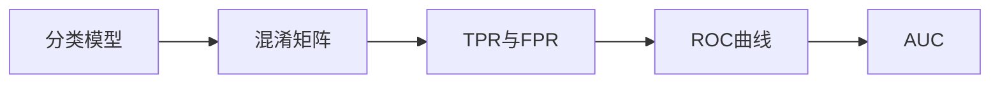

# AUC原理与代码实例讲解

## 1.背景介绍

### 1.1 什么是AUC

AUC全称为Area Under Curve，即ROC曲线下的面积。ROC曲线（Receiver Operating Characteristic Curve）是一种用于评估二分类模型性能的常用方法。ROC曲线横坐标为假阳性率（FPR），纵坐标为真阳性率（TPR），通过改变分类阈值，绘制出一条曲线。AUC就是ROC曲线下方的面积，取值范围在0到1之间。

### 1.2 AUC的重要性

AUC是一个非常重要的评估指标，特别是在样本不平衡的分类问题中。相比准确率等其他指标，AUC对分类阈值不敏感，能够更全面、客观地评估模型性能。AUC越大，说明模型的分类效果越好。当AUC为0.5时，表示模型效果等同于随机猜测；当AUC为1时，表示模型具有完美的分类能力。

## 2.核心概念与联系

### 2.1 混淆矩阵

为了理解AUC，我们首先需要了解混淆矩阵（Confusion Matrix）的概念。对于二分类问题，混淆矩阵如下：

|      | 预测正例 | 预测反例 |
|------|---------|----------|
| 实际正例 | TP      | FN       |
| 实际反例 | FP      | TN       |

- TP（True Positive）：实际为正例，预测也为正例
- FN（False Negative）：实际为正例，预测为反例
- FP（False Positive）：实际为反例，预测为正例
- TN（True Negative）：实际为反例，预测也为反例

### 2.2 TPR与FPR

有了混淆矩阵，我们可以计算出TPR和FPR：

- TPR（True Positive Rate）= TP / (TP + FN)，表示实际正例中被正确预测的比例。
- FPR（False Positive Rate）= FP / (FP + TN)，表示实际反例中被错误预测为正例的比例。

ROC曲线就是通过改变分类阈值，绘制出TPR与FPR的关系曲线。

### 2.3 AUC与ROC曲线的关系



AUC实际上就是ROC曲线下的面积。ROC曲线越靠近左上角，AUC越大，模型性能越好。

## 3.核心算法原理具体操作步骤

计算AUC的具体步骤如下：

1. 对测试集样本的预测结果按照概率从大到小排序。
2. 从高到低，依次将每个样本作为阈值，计算此时的TPR和FPR。  
3. 根据TPR和FPR绘制ROC曲线。
4. 计算ROC曲线下的面积，即为AUC。

常见的AUC计算方法有：

- 梯形法：把ROC曲线下的面积划分为若干个梯形，对每个梯形的面积进行累加。
- 矩形法：把ROC曲线下的面积近似为若干个矩形，对矩形面积进行累加。
- 积分法：直接对ROC曲线方程进行积分求解面积。

## 4.数学模型和公式详细讲解举例说明

### 4.1 TPR与FPR的计算

假设我们有10个测试样本，其真实标签和预测概率如下：

| 样本编号 | 真实标签 | 预测概率 |
|--------|--------|---------|
| 1      | 1      | 0.9     |
| 2      | 0      | 0.8     |
| 3      | 1      | 0.7     |  
| 4      | 0      | 0.6     |
| 5      | 1      | 0.55    |
| 6      | 0      | 0.52    |
| 7      | 0      | 0.4     |
| 8      | 1      | 0.38    |
| 9      | 0      | 0.3     |
| 10     | 1      | 0.2     |

我们先来计算一个点(0.52, 0.6)。此时阈值为0.52，大于等于0.52的样本预测为正例，小于0.52的预测为反例。

$TP = 3, FN = 2, FP = 2, TN = 3$

$TPR = \frac{TP}{TP + FN} = \frac{3}{3+2} = 0.6$

$FPR = \frac{FP}{FP + TN} = \frac{2}{2+3} = 0.4$

同理可得其他点的坐标。

### 4.2 梯形法计算AUC

将上述点按FPR从小到大排列，可得：

| FPR | TPR |
|-----|-----|
| 0   | 0   |
| 0.2 | 0.4 |
| 0.4 | 0.6 |
| 0.6 | 0.8 |
| 0.8 | 0.8 |
| 1.0 | 1.0 |

使用梯形法计算AUC：

$$AUC = \frac{1}{2}\sum_{i=1}^{n-1} (x_{i+1} - x_i) \cdot (y_i + y_{i+1})$$

其中，$x_i$为第$i$个点的FPR，$y_i$为第$i$个点的TPR，$n$为点的个数。

代入数据，可得：

$$AUC = \frac{1}{2} [(0.2-0)(0+0.4)+(0.4-0.2)(0.4+0.6)+(0.6-0.4)(0.6+0.8)+(0.8-0.6)(0.8+0.8)+(1.0-0.8)(0.8+1.0)]$$

$$=0.04+0.1+0.14+0.16+0.18=0.62$$

## 5.项目实践：代码实例和详细解释说明

下面使用Python实现AUC的计算：

```python
from sklearn.metrics import roc_auc_score

y_true = [1, 0, 1, 0, 1, 0, 0, 1, 0, 1] 
y_pred = [0.9, 0.8, 0.7, 0.6, 0.55, 0.52, 0.4, 0.38, 0.3, 0.2]

auc = roc_auc_score(y_true, y_pred)
print('AUC: %.3f' % auc)
```

输出结果：
```
AUC: 0.620
```

代码解释：

- `y_true`为真实标签列表。
- `y_pred`为预测概率列表。
- 调用`sklearn.metrics`中的`roc_auc_score`函数计算AUC。该函数内部自动完成了ROC曲线的绘制和AUC的计算。

除了调用现成的函数，我们也可以自己实现AUC的计算：

```python
def auc(y_true, y_pred):
    # 对样本按预测概率从大到小排序
    sorted_indices = np.argsort(y_pred)[::-1]
    y_true = np.array(y_true)[sorted_indices]
    
    # 计算每个点的坐标
    tpr_list = [0]
    fpr_list = [0]
    for i in range(len(y_true)):
        if y_true[i] == 1:
            tpr_list.append(tpr_list[-1] + 1)
            fpr_list.append(fpr_list[-1])
        else:
            tpr_list.append(tpr_list[-1])
            fpr_list.append(fpr_list[-1] + 1)
    tpr_list = [x / tpr_list[-1] for x in tpr_list]
    fpr_list = [x / fpr_list[-1] for x in fpr_list]
    
    # 计算AUC
    auc = 0
    for i in range(len(tpr_list)-1):
        auc += (fpr_list[i+1] - fpr_list[i]) * (tpr_list[i] + tpr_list[i+1]) / 2
    return auc

y_true = [1, 0, 1, 0, 1, 0, 0, 1, 0, 1]
y_pred = [0.9, 0.8, 0.7, 0.6, 0.55, 0.52, 0.4, 0.38, 0.3, 0.2]

auc_score = auc(y_true, y_pred)  
print('AUC: %.3f' % auc_score)
```

输出结果：
```
AUC: 0.620
```

代码解释：

- 首先对样本按预测概率从大到小排序。
- 遍历排序后的样本，根据真实标签计算每个点的TPR和FPR。
- 使用梯形法计算AUC。

## 6.实际应用场景

AUC在很多领域都有广泛应用，比如：

- 医疗诊断：根据某些指标预测患者是否患病，AUC可以评估诊断模型的性能。
- 信用评分：根据用户特征预测其违约风险，AUC可以评估信用评分模型的性能。
- 推荐系统：根据用户历史行为预测其对某个物品的喜好程度，AUC可以评估推荐算法的性能。
- 欺诈检测：根据交易特征预测其是否为欺诈交易，AUC可以评估反欺诈模型的性能。

总的来说，只要是二分类问题，特别是正负样本分布不平衡的情况下，AUC都是一个非常有效的评估指标。

## 7.工具和资源推荐

- Scikit-learn：Python机器学习库，提供了AUC计算函数`roc_auc_score`。
- ROCR：R语言的ROC曲线绘制和AUC计算工具包。
- pROC：另一个R语言的ROC曲线绘制和AUC计算工具包。
- AUC计算在线工具：https://www.rad.jhmi.edu/jeng/javarad/roc/JROCFITi.html

## 8.总结：未来发展趋势与挑战

AUC作为一种经典的模型评估指标，在未来仍然会被广泛使用。但同时，我们也要看到AUC的一些局限性：

- AUC只适用于二分类问题，对于多分类问题，需要考虑其他评估指标。
- AUC是一个全局指标，无法反映模型在不同阈值下的性能差异。
- AUC对预测概率的校准效果不敏感，有时候模型预测概率不准确，但AUC却很高。

为了克服这些局限性，一些新的评估指标和方法也在不断涌现，比如：

- PR曲线（Precision-Recall Curve）和AP（Average Precision）。
- 加权AUC：根据不同阈值下的业务重要性，对ROC曲线下的面积进行加权。
- 概率校准图（Calibration Plot）：评估模型预测概率的校准效果。

总之，AUC仍将是机器学习领域不可或缺的评估指标，但我们也要与时俱进，根据具体问题选择更合适的评估方法。

## 9.附录：常见问题与解答

### 9.1 为什么AUC可以评估模型性能？

AUC实际上反映了模型对正负样本的排序能力。AUC越大，说明模型越有可能将正样本排在负样本前面，即模型的分类能力越强。而这种分类能力的强弱，与模型性能直接相关。

### 9.2 AUC的最小值和最大值分别是多少？

AUC的取值范围是[0, 1]。当AUC=0.5时，表示模型的预测效果等同于随机猜测；当AUC=1时，表示模型的预测完全准确；当AUC=0时，表示模型的预测完全错误。但实际上，AUC几乎不可能等于0或1，通常在0.5到1之间。

### 9.3 AUC与准确率的区别是什么？

准确率只是模型在某个固定阈值下的性能表现，而AUC则考察了所有阈值下的性能。因此，AUC能更全面、客观地评估模型性能。特别是当正负样本分布不平衡时，准确率可能会产生误导，而AUC不受样本分布的影响。

### 9.4 如何解释AUC的物理意义？

AUC的一个物理意义是：随机抽取一个正样本和一个负样本，正样本的预测概率大于负样本的概率。因此，AUC越大，表示模型越有可能将正样本和负样本区分开。

### 9.5 AUC与ROC曲线是什么关系？

AUC是ROC曲线下的面积。ROC曲线越靠近左上角，AUC越大，模型性能越好。因此，我们通常用ROC曲线直观展示模型性能，用