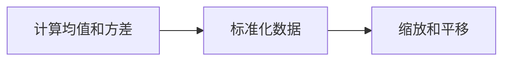

# Batch Normalization原理与代码实例讲解

## 1. 背景介绍
在深度学习的训练过程中，内部协变量偏移（Internal Covariate Shift）是一个常见问题，它指的是网络中间层的分布随着前层参数的更新而改变。这种现象会导致学习过程变得缓慢，因为每层都需要不断适应新的数据分布。2015年，Sergey Ioffe和Christian Szegedy提出了Batch Normalization（批量归一化）技术，有效地解决了这一问题，它已成为深度神经网络中不可或缺的一部分。

## 2. 核心概念与联系
Batch Normalization（BN）的核心概念是对每个小批量数据进行标准化处理，使得输出的均值为0，方差为1。这样做可以减少内部协变量偏移，加速训练过程，同时还有助于缓解过拟合问题。BN可以被应用在网络的任何层次，通常放在全连接层或卷积层的激活函数之前。

## 3. 核心算法原理具体操作步骤
Batch Normalization的操作步骤可以分为以下几个阶段：

1. 计算批量数据的均值和方差。
2. 使用均值和方差对数据进行标准化。
3. 对标准化后的数据进行缩放和平移变换。



## 4. 数学模型和公式详细讲解举例说明
给定一个小批量数据 $B = \{x_1, x_2, ..., x_m\}$，其均值 $\mu_B$ 和方差 $\sigma_B^2$ 计算如下：

$$
\mu_B = \frac{1}{m} \sum_{i=1}^{m} x_i
$$

$$
\sigma_B^2 = \frac{1}{m} \sum_{i=1}^{m} (x_i - \mu_B)^2
$$

标准化后的数据 $\hat{x}_i$ 计算如下：

$$
\hat{x}_i = \frac{x_i - \mu_B}{\sqrt{\sigma_B^2 + \epsilon}}
$$

其中，$\epsilon$ 是一个很小的数，以防止分母为零。缩放和平移变换如下：

$$
y_i = \gamma \hat{x}_i + \beta
$$

其中，$\gamma$ 和 $\beta$ 是可学习的参数，分别代表缩放和平移。

## 5. 项目实践：代码实例和详细解释说明
以TensorFlow为例，实现Batch Normalization的代码如下：

```python
import tensorflow as tf

def batch_norm(inputs, is_training, decay=0.9):
    scale = tf.Variable(tf.ones([inputs.get_shape()[-1]]))
    beta = tf.Variable(tf.zeros([inputs.get_shape()[-1]]))
    pop_mean = tf.Variable(tf.zeros([inputs.get_shape()[-1]]), trainable=False)
    pop_var = tf.Variable(tf.ones([inputs.get_shape()[-1]]), trainable=False)

    if is_training:
        batch_mean, batch_var = tf.nn.moments(inputs, [0])
        train_mean = tf.assign(pop_mean, pop_mean * decay + batch_mean * (1 - decay))
        train_var = tf.assign(pop_var, pop_var * decay + batch_var * (1 - decay))
        with tf.control_dependencies([train_mean, train_var]):
            return tf.nn.batch_normalization(inputs, batch_mean, batch_var, beta, scale, epsilon)
    else:
        return tf.nn.batch_normalization(inputs, pop_mean, pop_var, beta, scale, epsilon)
```

在这段代码中，我们首先定义了缩放参数 `scale` 和平移参数 `beta`，以及用于估计整个数据集的均值和方差的 `pop_mean` 和 `pop_var`。在训练阶段，我们计算当前批量的均值和方差，并更新 `pop_mean` 和 `pop_var`。在测试阶段，我们使用 `pop_mean` 和 `pop_var` 来进行批量归一化。

## 6. 实际应用场景
Batch Normalization在多个领域都有广泛应用，包括图像识别、语音识别和自然语言处理等。它不仅可以加速模型训练，还可以提高模型的泛化能力。

## 7. 工具和资源推荐
- TensorFlow和PyTorch等深度学习框架都内置了Batch Normalization的实现。
- 《深度学习》一书中有关于Batch Normalization的详细介绍。

## 8. 总结：未来发展趋势与挑战
Batch Normalization已经成为深度学习中的标准技术之一。未来的研究可能会集中在进一步优化BN算法，以适应更复杂的网络结构和数据分布，以及减少其对超参数的敏感性。

## 9. 附录：常见问题与解答
Q1: Batch Normalization是否适用于所有类型的网络？
A1: BN适用于大多数网络，但在某些特定情况下可能需要调整或替换。

Q2: Batch Normalization是否会影响模型的表达能力？
A2: BN通过引入可学习的缩放和平移参数，保持了模型的表达能力。

作者：禅与计算机程序设计艺术 / Zen and the Art of Computer Programming