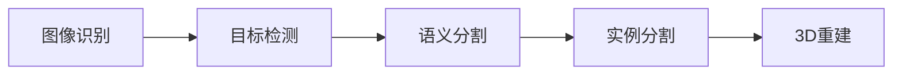

# Computer Vision原理与代码实例讲解

## 1. 背景介绍
计算机视觉作为人工智能的一个重要分支，旨在赋予机器“看”的能力。它通过对图像和视频的分析，理解和解释，使得机器能够识别物体、追踪运动、导航空间等。随着深度学习技术的发展，计算机视觉已经在医疗诊断、自动驾驶、安防监控等多个领域取得了显著的应用成果。

## 2. 核心概念与联系
计算机视觉的核心概念包括图像识别、目标检测、语义分割、实例分割、3D重建等。这些概念之间的联系在于它们共同构成了计算机视觉的理论基础和应用框架。



## 3. 核心算法原理具体操作步骤
以卷积神经网络（CNN）为例，其操作步骤包括输入图像的预处理、卷积层的特征提取、激活函数的非线性映射、池化层的下采样、全连接层的分类决策等。

## 4. 数学模型和公式详细讲解举例说明
以卷积层为例，其数学模型可以表示为：
$$
f(x,y) = \sum_{i=-k}^{k} \sum_{j=-k}^{k} w(i,j) \cdot g(x+i, y+j)
$$
其中，$f(x,y)$ 是卷积操作后的输出，$g(x,y)$ 是输入图像，$w(i,j)$ 是卷积核的权重，$k$ 是卷积核的大小。

## 5. 项目实践：代码实例和详细解释说明
以TensorFlow和Keras框架为例，展示如何实现一个简单的CNN模型来进行图像分类。

```python
import tensorflow as tf
from tensorflow.keras import layers, models

# 构建CNN模型
model = models.Sequential()
model.add(layers.Conv2D(32, (3, 3), activation='relu', input_shape=(28, 28, 1)))
model.add(layers.MaxPooling2D((2, 2)))
model.add(layers.Conv2D(64, (3, 3), activation='relu'))
model.add(layers.MaxPooling2D((2, 2)))
model.add(layers.Conv2D(64, (3, 3), activation='relu'))
model.add(layers.Flatten())
model.add(layers.Dense(64, activation='relu'))
model.add(layers.Dense(10, activation='softmax'))

# 编译和训练模型
model.compile(optimizer='adam',
              loss='sparse_categorical_crossentropy',
              metrics=['accuracy'])
```

## 6. 实际应用场景
计算机视觉在自动驾驶中的应用包括车辆检测、行人识别、交通标志识别等。在医疗领域，计算机视觉可以帮助识别病变组织，辅助医生进行诊断。

## 7. 工具和资源推荐
推荐使用的计算机视觉工具和资源包括OpenCV、TensorFlow、PyTorch等。这些工具提供了丰富的库函数和预训练模型，可以大大加速计算机视觉项目的开发。

## 8. 总结：未来发展趋势与挑战
计算机视觉的未来发展趋势包括更深层次的语义理解、跨模态学习、小样本学习等。面临的挑战包括算法的泛化能力、计算资源的消耗、隐私和伦理问题等。

## 9. 附录：常见问题与解答
Q1: 计算机视觉和图像处理的区别是什么？
A1: 图像处理关注的是图像的改善和变换，而计算机视觉则关注于从图像中提取有用的信息和理解图像内容。

Q2: 如何选择合适的计算机视觉算法？
A2: 需要根据具体的应用场景和需求，考虑算法的准确性、速度、资源消耗等因素进行选择。

作者：禅与计算机程序设计艺术 / Zen and the Art of Computer Programming