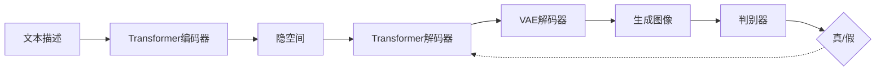

# DALL-E原理与代码实例讲解

## 1. 背景介绍

DALL-E是由OpenAI开发的一种革命性的人工智能系统,它能够根据自然语言描述生成高质量、逼真的图像。DALL-E的名字来源于著名艺术家萨尔瓦多·达利(Salvador Dalí)和皮克斯动画电影《机器人总动员》(WALL-E)中的角色。自从2021年1月DALL-E首次发布以来,它就引起了学术界和工业界的广泛关注,成为人工智能领域的一个里程碑式的成就。

DALL-E的核心是一个强大的生成对抗网络(GAN),它由两部分组成:一个生成器和一个判别器。生成器负责根据输入的文本描述生成图像,而判别器则负责判断生成的图像是否与文本描述相符。通过生成器和判别器的不断博弈,DALL-E最终学会了如何生成高质量、逼真的图像。

DALL-E的出现开启了文本到图像生成领域的新纪元,它展示了人工智能在创意领域的巨大潜力。DALL-E生成的图像不仅视觉效果惊人,而且还能够捕捉到文本描述中的语义信息,生成与描述高度吻合的图像。这一点在以往的文本到图像生成模型中是难以实现的。

### 1.1 DALL-E的发展历程

- 2021年1月:OpenAI发布DALL-E,引起广泛关注
- 2022年4月:OpenAI发布DALL-E 2,生成图像质量和分辨率大幅提升
- 2022年7月:OpenAI开放DALL-E 2的API,允许开发者将其集成到自己的应用中
- 2023年3月:OpenAI发布DALL-E 3,支持生成视频和3D模型

### 1.2 DALL-E的应用前景

DALL-E在许多领域都有广阔的应用前景,例如:

- 创意设计:DALL-E可以辅助设计师进行创意构思,快速生成多种设计方案
- 游戏开发:利用DALL-E生成游戏中的场景、角色、道具等素材
- 电影特效:DALL-E可以根据剧本生成电影场景的概念图,辅助特效制作
- 教育培训:利用DALL-E生成教学图片和视频,提升学习体验
- 医学影像:DALL-E可以生成医学影像数据,用于医学研究和诊断

## 2. 核心概念与联系

要理解DALL-E的工作原理,需要先了解以下几个核心概念:

### 2.1 生成对抗网络(GAN)

生成对抗网络由生成器(Generator)和判别器(Discriminator)组成。生成器负责生成假样本,判别器负责判断样本是真是假。两者在训练过程中不断博弈,最终使生成器能够生成以假乱真的样本。

### 2.2 变分自编码器(VAE) 

变分自编码器由编码器(Encoder)和解码器(Decoder)组成。编码器将输入数据映射到隐空间,解码器再从隐空间恢复出原始数据。VAE能够学习到数据的概率分布,从而能够生成新样本。

### 2.3 注意力机制(Attention)

注意力机制让模型能够关注输入数据中的重点部分,忽略次要信息。常见的注意力机制有:

- Additive Attention
- Dot-Product Attention
- Multi-Head Attention

### 2.4 Transformer

Transformer是一种基于自注意力机制的神经网络结构。它最初用于自然语言处理任务,后来也被广泛应用于计算机视觉等领域。Transformer的核心是自注意力层和前馈神经网络层。

DALL-E模型正是基于上述几个核心概念构建而成。它使用Transformer编码器提取文本特征,使用Transformer解码器和VAE生成图像。整个模型采用GAN的思想进行训练,以提高生成图像的质量和真实性。

下图展示了DALL-E模型的整体架构:



## 3. 核心算法原理具体操作步骤

DALL-E的训练过程可以分为以下几个步骤:

### 3.1 数据准备

1. 收集大量的图像-文本对作为训练数据
2. 对图像进行预处理,统一尺寸和格式
3. 对文本进行清洗和标准化处理
4. 将处理后的图像-文本对打包成训练集

### 3.2 模型训练

1. 初始化生成器和判别器的参数
2. 从训练集中采样一批图像-文本对
3. 将文本输入Transformer编码器,提取文本特征
4. 将文本特征输入Transformer解码器,生成图像特征
5. 将图像特征输入VAE解码器,生成图像
6. 将生成图像和真实图像输入判别器,计算对抗损失
7. 将生成图像和文本描述输入判别器,计算对齐损失
8. 反向传播,更新生成器和判别器的参数
9. 重复步骤2-8,直到模型收敛

### 3.3 模型推理

1. 给定一段文本描述
2. 将文本输入训练好的Transformer编码器,提取文本特征
3. 将文本特征输入训练好的Transformer解码器,生成图像特征
4. 将图像特征输入训练好的VAE解码器,生成图像
5. 输出生成的图像

## 4. 数学模型和公式详细讲解举例说明

### 4.1 生成器损失函数

生成器的目标是生成与真实图像尽可能相似的图像,同时还要使生成图像与文本描述相符。因此,生成器的损失函数包含两部分:对抗损失和对齐损失。

对抗损失衡量生成图像与真实图像的相似度,采用二元交叉熵损失:

$$L_{adv} = -\mathbb{E}_{z\sim p_z}[\log D(G(z))]$$

其中,$G$是生成器,$D$是判别器,$z$是隐空间向量,$p_z$是隐空间的先验分布。

对齐损失衡量生成图像与文本描述的相符程度,采用余弦相似度损失:

$$L_{align} = -\mathbb{E}_{(x,c)\sim p_{data}}\left[\frac{f(x)\cdot g(c)}{\|f(x)\|\|g(c)\|}\right]$$

其中,$x$是真实图像,$c$是对应的文本描述,$f$和$g$分别是图像编码器和文本编码器。

生成器的总损失为:

$$L_G = L_{adv} + \lambda L_{align}$$

其中,$\lambda$是平衡两种损失的超参数。

### 4.2 判别器损失函数

判别器的目标是将真实图像和生成图像区分开来,同时还要判断图像与文本描述是否相符。因此,判别器的损失函数也包含两部分:对抗损失和对齐损失。

对抗损失采用二元交叉熵损失:

$$L_{adv} = -\mathbb{E}_{x\sim p_{data}}[\log D(x)] - \mathbb{E}_{z\sim p_z}[\log(1-D(G(z)))]$$

对齐损失同样采用余弦相似度损失:

$$L_{align} = -\mathbb{E}_{(x,c)\sim p_{data}}\left[\frac{f(x)\cdot g(c)}{\|f(x)\|\|g(c)\|}\right]$$

判别器的总损失为:

$$L_D = L_{adv} + \lambda L_{align}$$

### 4.3 训练过程

DALL-E采用对抗训练的方式,生成器和判别器轮流进行优化。具体来说:

1. 固定生成器,优化判别器:

$$\min_{D} L_D$$

2. 固定判别器,优化生成器:

$$\min_{G} L_G$$

3. 重复步骤1和2,直到模型收敛。

通过这种博弈的方式,生成器和判别器的能力不断提升,最终使生成器能够生成高质量、与描述相符的图像。

## 5. 项目实践:代码实例和详细解释说明

下面是一个简化版的DALL-E模型的PyTorch实现:

```python
import torch
import torch.nn as nn
import torch.optim as optim

class Generator(nn.Module):
    def __init__(self, text_dim, noise_dim, image_dim):
        super(Generator, self).__init__()
        self.fc1 = nn.Linear(text_dim + noise_dim, 256)
        self.fc2 = nn.Linear(256, image_dim)
        
    def forward(self, text, noise):
        x = torch.cat([text, noise], dim=1)
        x = torch.relu(self.fc1(x))
        x = torch.sigmoid(self.fc2(x))
        return x

class Discriminator(nn.Module):
    def __init__(self, image_dim, text_dim):
        super(Discriminator, self).__init__()
        self.fc1 = nn.Linear(image_dim + text_dim, 128)
        self.fc2 = nn.Linear(128, 1)
        
    def forward(self, image, text):
        x = torch.cat([image, text], dim=1)
        x = torch.relu(self.fc1(x))
        x = torch.sigmoid(self.fc2(x))
        return x

def train(dataloader, generator, discriminator, g_optimizer, d_optimizer, criterion, device, epochs):
    for epoch in range(epochs):
        for text, real_image in dataloader:
            batch_size = text.size(0)
            text = text.to(device)
            real_image = real_image.to(device)
            
            # 训练判别器
            noise = torch.randn(batch_size, noise_dim).to(device)
            fake_image = generator(text, noise)
            real_score = discriminator(real_image, text)
            fake_score = discriminator(fake_image, text)
            d_loss = criterion(real_score, torch.ones_like(real_score)) + \
                     criterion(fake_score, torch.zeros_like(fake_score))
            d_optimizer.zero_grad()
            d_loss.backward()
            d_optimizer.step()
            
            # 训练生成器
            noise = torch.randn(batch_size, noise_dim).to(device)
            fake_image = generator(text, noise)
            fake_score = discriminator(fake_image, text)
            g_loss = criterion(fake_score, torch.ones_like(fake_score))
            g_optimizer.zero_grad()
            g_loss.backward()
            g_optimizer.step()
            
        print(f"Epoch [{epoch+1}/{epochs}], d_loss: {d_loss.item():.4f}, g_loss: {g_loss.item():.4f}")

# 超参数设置
text_dim = 128
noise_dim = 100
image_dim = 784
lr = 0.0002
batch_size = 64
epochs = 100

# 初始化模型
device = torch.device("cuda" if torch.cuda.is_available() else "cpu")
generator = Generator(text_dim, noise_dim, image_dim).to(device)
discriminator = Discriminator(image_dim, text_dim).to(device)
g_optimizer = optim.Adam(generator.parameters(), lr=lr)
d_optimizer = optim.Adam(discriminator.parameters(), lr=lr)
criterion = nn.BCELoss()

# 加载数据集
dataset = MyDataset(...)
dataloader = DataLoader(dataset, batch_size=batch_size, shuffle=True)

# 训练模型
train(dataloader, generator, discriminator, g_optimizer, d_optimizer, criterion, device, epochs)
```

上面的代码实现了一个简单的DALL-E模型,包含以下几个关键部分:

1. `Generator`类:定义了生成器的网络结构,输入是文本特征和随机噪声,输出是生成的图像。

2. `Discriminator`类:定义了判别器的网络结构,输入是图像和文本特征,输出是图像的真假概率。

3. `train`函数:定义了模型的训练流程。每个epoch中,先训练判别器,再训练生成器。训练判别器时,使用真实图像和生成图像分别计算损失,并更新判别器参数。训练生成器时,使用生成图像计算损失,并更新生成器参数。

4. 超参数设置:定义了模型训练所需的超参数,如文本特征维度、噪声维度、图像维度、学习率、批量大小和训练轮数等。

5. 模型初始化:根据超参数设置初始化生成器、判别器、优化器和损失函数,并将模型移动到合适的设备上(CPU或GPU)。

6. 数据加载:使用`MyDataset`类加载训练数据集,并使用`DataLoader`类进行批量读取和打乱顺序。

7. 模型训练:调用`train`函数,传入数据加载器、模型、优