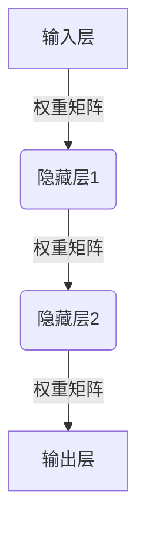
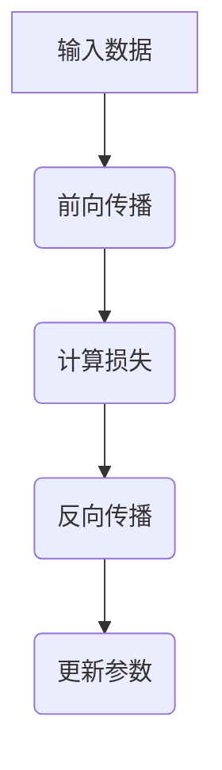
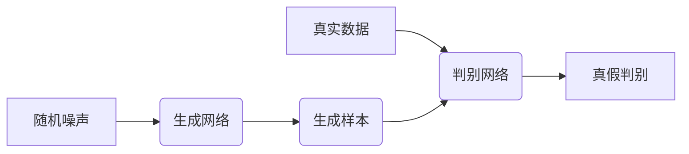
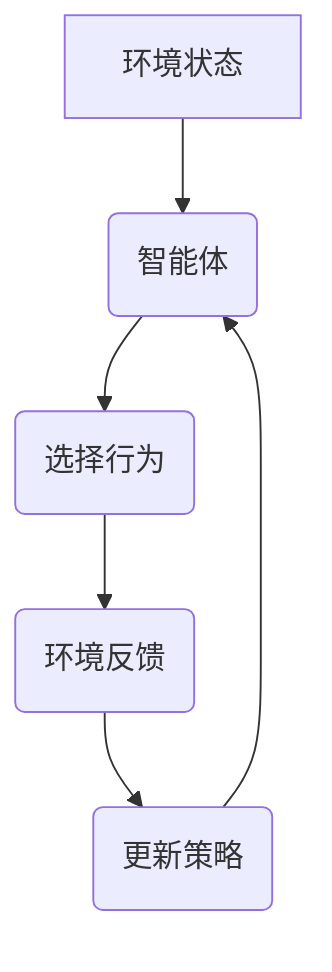

# Deep Learning (DL) 原理与代码实战案例讲解

## 1.背景介绍

深度学习(Deep Learning, DL)是机器学习的一个新的研究热点领域,它是一种基于对数据进行表示学习的机器学习方法。通过对海量数据的训练,深度学习可以自动学习数据的高层次抽象特征表示,从而解决许多机器学习领域的核心问题。近年来,深度学习在计算机视觉、自然语言处理、语音识别、推荐系统等多个领域取得了突破性进展,成为人工智能领域最有前景的技术方向之一。

### 1.1 深度学习的发展历史

深度学习的理论基础可以追溯到上世纪80年代提出的神经网络模型。但由于当时的计算能力和训练数据的限制,神经网络模型一直难以取得突破。直到2006年,受到人脑视觉皮层神经元结构和功能的启发,Hinton等人提出了深度置信网络(Deep Belief Networks)模型,并发明了层层贪婪预训练算法,从而解决了训练深度神经网络的困难。2012年,Hinton团队在ImageNet图像识别挑战赛中,使用深度卷积神经网络模型取得了巨大成功,将图像识别的错误率降低了20%以上,从而掀起了深度学习的研究热潮。

### 1.2 深度学习的关键技术

深度学习的核心在于通过构建深层次的神经网络模型,自动从训练数据中学习出多层次的特征表示。深度学习模型主要包括以下几种:

1. 全连接神经网络(Fully Connected Neural Networks)
2. 卷积神经网络(Convolutional Neural Networks, CNN)
3. 循环神经网络(Recurrent Neural Networks, RNN)
4. 生成对抗网络(Generative Adversarial Networks, GAN)
5. 深度强化学习(Deep Reinforcement Learning)
6. 深度概率模型(Deep Probabilistic Models)

这些模型通过训练数据和反向传播算法进行参数优化,可以自动学习出多层次的特征表示,从而解决复杂的机器学习问题。

## 2.核心概念与联系

深度学习的核心概念主要包括:

### 2.1 神经网络

神经网络是深度学习模型的基础,它模仿了人脑神经元的工作原理,由多层节点组成。每个节点接收上一层节点的输入,经过加权求和和非线性激活函数的计算,输出到下一层节点。通过训练,神经网络可以自动学习出输入数据的特征表示。



### 2.2 反向传播算法

反向传播算法(Backpropagation)是训练神经网络的核心算法。它通过计算损失函数对网络参数(权重和偏置)的梯度,并使用梯度下降法不断调整参数,从而使网络输出与期望输出之间的误差最小化。



### 2.3 卷积神经网络

卷积神经网络(Convolutional Neural Networks, CNN)是深度学习在计算机视觉领域的杰出代表。它通过卷积层和池化层对图像进行特征提取,最后通过全连接层对特征进行分类或回归。CNN可以自动学习出图像的层次特征表示,在图像识别、目标检测等任务中表现出色。


### 2.4 循环神经网络

循环神经网络(Recurrent Neural Networks, RNN)是处理序列数据(如文本、语音、时间序列等)的有力工具。它通过内部状态的循环传递,可以很好地捕获序列数据中的长期依赖关系。长短期记忆网络(LSTM)和门控循环单元(GRU)是RNN的两种常用变体,在自然语言处理、语音识别等领域有广泛应用。


### 2.5 生成对抗网络

生成对抗网络(Generative Adversarial Networks, GAN)是一种全新的生成模型框架。它由生成网络和判别网络组成,两个网络相互对抗,最终使生成网络能够生成与真实数据分布一致的样本。GAN在图像生成、语音合成、数据增强等领域有广泛应用。



### 2.6 深度强化学习

深度强化学习(Deep Reinforcement Learning)将深度神经网络应用于强化学习领域,使智能体能够直接从环境中学习最优策略,而无需人工设计复杂的特征工程。深度强化学习在游戏AI、机器人控制等领域取得了突破性进展。



## 3.核心算法原理具体操作步骤

### 3.1 神经网络模型训练

训练神经网络模型的核心步骤如下:

1. **构建网络结构**: 根据问题的特点,设计合适的网络结构,包括输入层、隐藏层和输出层的节点数量、层数等。

2. **初始化参数**: 对网络的权重和偏置进行随机初始化。

3. **前向传播**: 输入训练数据,通过层层传递计算,得到网络的输出。

4. **计算损失函数**: 将网络输出与期望输出计算损失函数(如均方误差、交叉熵等)。

5. **反向传播**: 根据损失函数对网络参数进行梯度计算。

6. **参数更新**: 使用优化算法(如梯度下降法、Adam等)根据梯度更新网络参数。

7. **迭代训练**: 重复步骤3-6,直到模型收敛或达到指定的迭代次数。

以下是一个简单的Python代码示例,使用TensorFlow实现一个全连接神经网络:

```python
import tensorflow as tf

# 构建网络结构
X = tf.placeholder(tf.float32, [None, 784])
W1 = tf.Variable(tf.random_normal([784, 256]))
b1 = tf.Variable(tf.zeros([256]))
L1 = tf.nn.relu(tf.matmul(X, W1) + b1)

W2 = tf.Variable(tf.random_normal([256, 10]))
b2 = tf.Variable(tf.zeros([10]))
y_pred = tf.matmul(L1, W2) + b2

# 定义损失函数和优化器
y_true = tf.placeholder(tf.float32, [None, 10])
loss = tf.reduce_mean(tf.nn.softmax_cross_entropy_with_logits(logits=y_pred, labels=y_true))
optimizer = tf.train.AdamOptimizer().minimize(loss)

# 训练模型
with tf.Session() as sess:
    sess.run(tf.global_variables_initializer())
    for epoch in range(epochs):
        for batch_xs, batch_ys in get_batches(X_train, y_train):
            _, current_loss = sess.run([optimizer, loss], feed_dict={X: batch_xs, y_true: batch_ys})
        print(f'Epoch {epoch}, Loss: {current_loss}')
```

### 3.2 卷积神经网络训练

训练卷积神经网络的步骤与普通神经网络类似,但需要额外考虑卷积层和池化层的操作。以下是一个简单的PyTorch代码示例,实现了一个用于MNIST手写数字识别的卷积神经网络:

```python
import torch
import torch.nn as nn

# 定义网络结构
class ConvNet(nn.Module):
    def __init__(self):
        super(ConvNet, self).__init__()
        self.conv1 = nn.Conv2d(1, 32, kernel_size=3, padding=1)
        self.pool = nn.MaxPool2d(2, 2)
        self.conv2 = nn.Conv2d(32, 64, kernel_size=3, padding=1)
        self.fc1 = nn.Linear(64 * 7 * 7, 128)
        self.fc2 = nn.Linear(128, 10)

    def forward(self, x):
        x = self.pool(nn.functional.relu(self.conv1(x)))
        x = self.pool(nn.functional.relu(self.conv2(x)))
        x = x.view(-1, 64 * 7 * 7)
        x = nn.functional.relu(self.fc1(x))
        x = self.fc2(x)
        return x

# 训练模型
model = ConvNet()
criterion = nn.CrossEntropyLoss()
optimizer = torch.optim.Adam(model.parameters(), lr=0.001)

for epoch in range(epochs):
    for images, labels in train_loader:
        optimizer.zero_grad()
        outputs = model(images)
        loss = criterion(outputs, labels)
        loss.backward()
        optimizer.step()
    print(f'Epoch {epoch}, Loss: {loss.item()}')
```

### 3.3 循环神经网络训练

训练循环神经网络时,需要考虑序列数据的时间维度。以下是一个简单的PyTorch代码示例,实现了一个用于情感分析的LSTM模型:

```python
import torch
import torch.nn as nn

# 定义网络结构
class LSTMClassifier(nn.Module):
    def __init__(self, embedding_dim, hidden_dim, vocab_size, label_size):
        super(LSTMClassifier, self).__init__()
        self.embedding = nn.Embedding(vocab_size, embedding_dim)
        self.lstm = nn.LSTM(embedding_dim, hidden_dim)
        self.fc = nn.Linear(hidden_dim, label_size)

    def forward(self, text, text_lengths):
        embedded = self.embedding(text)
        packed_embedded = nn.utils.rnn.pack_padded_sequence(embedded, text_lengths)
        packed_output, (hidden, cell) = self.lstm(packed_embedded)
        output, output_lengths = nn.utils.rnn.pad_packed_sequence(packed_output)
        hidden = hidden[-1]
        return self.fc(hidden)

# 训练模型
model = LSTMClassifier(embedding_dim, hidden_dim, vocab_size, label_size)
criterion = nn.CrossEntropyLoss()
optimizer = torch.optim.Adam(model.parameters(), lr=0.001)

for epoch in range(epochs):
    for texts, text_lengths, labels in train_loader:
        optimizer.zero_grad()
        outputs = model(texts, text_lengths)
        loss = criterion(outputs, labels)
        loss.backward()
        optimizer.step()
    print(f'Epoch {epoch}, Loss: {loss.item()}')
```

## 4.数学模型和公式详细讲解举例说明

深度学习中涉及到许多数学概念和公式,以下是一些核心部分的详细讲解。

### 4.1 神经网络前向传播

神经网络的前向传播过程可以用矩阵运算来表示。对于一个全连接层,输入 $\mathbf{x}$ 和输出 $\mathbf{y}$ 的关系为:

$$\mathbf{y} = f(\mathbf{Wx} + \mathbf{b})$$

其中 $\mathbf{W}$ 是权重矩阵, $\mathbf{b}$ 是偏置向量, $f$ 是非线性激活函数(如ReLU、Sigmoid等)。

对于卷积层,输入特征图 $\mathbf{X}$ 和输出特征图 $\mathbf{Y}$ 的关系为:

$$\mathbf{Y}_{i,j} = f\left(\sum_{m}\sum_{n}\mathbf{W}_{m,n}\mathbf{X}_{i+m,j+n} + b\right)$$

其中 $\mathbf{W}$ 是卷积核权重, $b$ 是偏置, $f$ 是非线性激活函数。

### 4.2 反向传播算法

反向传播算法是根据链式法则计算损失函数对网络参数的梯度。对于一个单层神经网络,如果损失函数为 $\mathcal{L}$,输出为 $\mathbf{y}$,权重为 $\mathbf{W}$,偏置为 $\mathbf{b}$,输入为 $\mathbf{x}$,则有:

$$\frac{\partial\mathcal{L}}{\partial\mathbf{W}} = \frac{\partial\mathcal{L}}{\partial\math