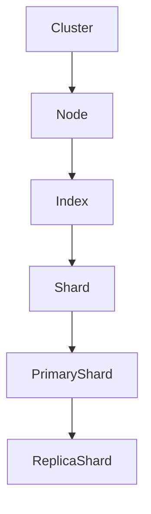
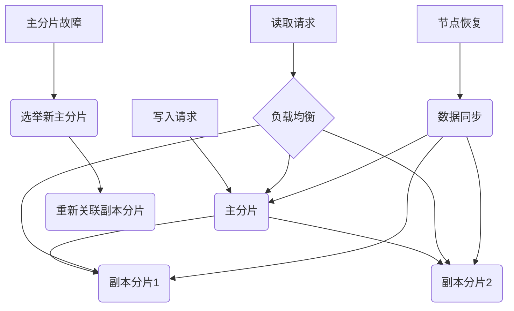

# ElasticSearch Replica原理与代码实例讲解

## 1.背景介绍

在现代分布式系统中,数据高可用性是一个非常重要的需求。为了实现这一目标,通常采用数据复制(Replication)的方式,将数据复制到多个节点上,从而实现故障转移和负载均衡。ElasticSearch作为一种分布式搜索和分析引擎,也采用了数据复制的机制,称为Replica。

ElasticSearch中的数据是按索引(Index)进行存储和管理的,每个索引又由多个分片(Shard)组成。为了提高数据的可用性和容错性,ElasticSearch允许为每个主分片(Primary Shard)创建一个或多个副本分片(Replica Shard)。当主分片出现故障时,副本分片可以接管并继续提供服务,从而保证了数据的高可用性。

## 2.核心概念与联系

在了解Replica原理之前,我们需要先掌握以下几个核心概念:

1. **节点(Node)**: ElasticSearch集群中的每个服务器实例称为一个节点。
2. **集群(Cluster)**: 一个ElasticSearch集群由一个或多个节点组成,它们共同承担数据的存储和处理工作。
3. **索引(Index)**: ElasticSearch中的数据按索引进行存储和管理,类似于关系数据库中的数据库概念。
4. **分片(Shard)**: 索引中的数据被分散存储在多个分片中,每个分片都是一个底层的Lucene索引。分片是ElasticSearch实现分布式和并行处理的关键。
5. **主分片(Primary Shard)**: 每个索引都会被分片,这些分片会分布在不同的节点上,其中一个分片是主分片,负责处理索引和搜索请求。
6. **副本分片(Replica Shard)**: 为了提高数据的可用性和容错性,ElasticSearch允许为每个主分片创建一个或多个副本分片,副本分片是主分片的精确复制。

这些概念之间的关系如下所示:



## 3.核心算法原理具体操作步骤

ElasticSearch中的Replica分片是如何工作的呢?我们来看一下其核心算法原理和具体操作步骤:

1. **索引写入**:当有新数据需要写入ElasticSearch时,首先会将数据写入主分片。
2. **数据同步**:主分片会将数据同步到所有副本分片,以确保数据的一致性。同步过程采用了乐观并发控制(Optimistic Concurrency Control)机制,通过版本号(Version Number)来检测和解决并发冲突。
3. **读取请求**:当有读取请求到来时,ElasticSearch会在主分片和副本分片之间进行负载均衡,将请求分发到不同的分片上进行处理,从而提高了系统的吞吐量和响应速度。
4. **主分片故障转移**:如果主分片发生故障,ElasticSearch会自动从副本分片中选举出一个新的主分片,并将其他副本分片重新关联到新的主分片上,整个过程对用户是透明的。
5. **数据恢复**:当故障节点恢复后,它会从主分片或其他副本分片上获取最新的数据,并进行数据同步,从而重新加入集群。

这个过程可以用以下Mermaid流程图来描述:



## 4.数学模型和公式详细讲解举例说明

在ElasticSearch中,副本分片的数量是一个非常重要的参数,它决定了系统的可用性和容错性。一般来说,副本分片的数量越多,系统的可用性就越高,但同时也会增加存储和维护成本。因此,我们需要根据实际需求和资源情况,合理设置副本分片的数量。

ElasticSearch提供了一个公式来帮助我们计算合理的副本分片数量:

$$
N = \frac{Q}{R}
$$

其中:

- $N$表示副本分片的数量
- $Q$表示集群中的节点数量
- $R$表示期望的故障转移数量,即在发生故障时,能够继续提供服务的节点数量

例如,假设我们有一个ElasticSearch集群,共有10个节点,我们希望在任意两个节点发生故障时,系统仍然能够继续提供服务。那么,我们可以计算出合理的副本分片数量为:

$$
N = \frac{10}{2} = 5
$$

因此,我们应该为每个主分片创建5个副本分片,以确保系统的高可用性。

需要注意的是,这只是一个理论公式,在实际应用中,我们还需要考虑其他因素,如硬件资源、数据量、写入频率等,才能确定最佳的副本分片数量。

## 5.项目实践:代码实例和详细解释说明

接下来,我们通过一个实际的代码示例,来演示如何在ElasticSearch中创建和管理Replica分片。

假设我们要创建一个名为"blog"的索引,它包含两个主分片和一个副本分片。我们可以使用ElasticSearch的Java REST Client来完成这个操作:

```java
// 创建RestHighLevelClient实例
RestHighLevelClient client = new RestHighLevelClient(
    RestClient.builder(
        new HttpHost("localhost", 9200, "http")));

// 创建索引请求
CreateIndexRequest request = new CreateIndexRequest("blog");

// 设置分片和副本分片数量
request.settings(Settings.builder()
    .put("index.number_of_shards", 2)
    .put("index.number_of_replicas", 1)
);

// 执行创建索引请求
CreateIndexResponse createIndexResponse = client.indices().create(request, RequestOptions.DEFAULT);

// 关闭客户端
client.close();
```

在上面的代码中,我们首先创建了一个`RestHighLevelClient`实例,用于与ElasticSearch进行交互。然后,我们创建了一个`CreateIndexRequest`对象,并设置了索引名称为"blog"。

接下来,我们使用`request.settings()`方法来设置索引的一些配置参数,包括主分片数量(`index.number_of_shards`)和副本分片数量(`index.number_of_replicas`)。在这个示例中,我们将主分片数量设置为2,副本分片数量设置为1,这意味着每个主分片将有一个副本分片。

最后,我们调用`client.indices().create()`方法来执行创建索引的请求,并关闭客户端连接。

创建索引后,我们可以使用ElasticSearch的REST API或其他客户端工具来查看索引的详细信息,包括分片和副本分片的分布情况。

例如,我们可以发送以下GET请求来获取"blog"索引的状态:

```
GET /blog/_stats
```

响应结果中的`_shards`字段将显示分片和副本分片的相关信息,包括总数、成功分片数、故障分片数等。

```json
{
  "_shards": {
    "total": 4,
    "successful": 4,
    "failed": 0
  }
}
```

从响应结果中可以看出,我们创建的"blog"索引共有4个分片(2个主分片和2个副本分片),并且全部创建成功。

## 6.实际应用场景

ElasticSearch的Replica机制在许多实际应用场景中发挥着重要作用,例如:

1. **电子商务网站**:在电子商务网站中,产品数据和用户数据通常需要高度的可用性和可靠性。使用ElasticSearch的Replica机制,可以确保即使某些节点发生故障,系统仍然能够继续提供搜索和浏览服务。

2. **日志分析系统**:许多企业都会采用ElasticSearch作为日志分析和监控系统的核心组件。通过创建多个副本分片,可以提高日志数据的可用性,并实现更高效的查询和分析。

3. **物联网(IoT)数据处理**:在物联网领域,需要处理来自各种传感器和设备的海量数据。ElasticSearch的Replica机制可以帮助构建高可用和可扩展的数据处理平台,确保数据的持久性和一致性。

4. **内容推荐系统**:在内容推荐系统中,ElasticSearch常被用于存储和检索用户行为数据、内容元数据等信息。通过创建多个副本分片,可以提高系统的吞吐量和响应速度,为用户提供更好的推荐体验。

5. **地理信息系统(GIS)**:ElasticSearch支持地理空间数据的存储和查询,可以用于构建地理信息系统。使用Replica机制,可以确保地理数据的高可用性,并提高查询性能。

总的来说,ElasticSearch的Replica机制为各种应用场景提供了数据高可用性和容错性的保障,是构建可靠和高性能分布式系统的关键技术之一。

## 7.工具和资源推荐

在使用ElasticSearch的Replica机制时,有一些工具和资源可以为我们提供帮助:

1. **ElasticSearch官方文档**:ElasticSearch官方网站提供了详细的文档,包括安装指南、API参考、最佳实践等,是学习和使用ElasticSearch的重要资源。

2. **Cerebro**:Cerebro是一个开源的ElasticSearch Web管理工具,它提供了直观的界面,可以方便地查看和管理ElasticSearch集群、索引、分片等。

3. **ElasticSearch Head**:ElasticSearch Head是另一个流行的Web管理工具,它提供了丰富的功能,如查询数据、监控集群状态、管理索引等。

4. **ElasticSearch Marvel**:Marvel是ElasticSearch官方提供的监控和管理工具,它可以帮助我们监控集群的健康状况、性能指标等。

5. **ElasticSearch Curator**:Curator是一个用于管理ElasticSearch索引和快照的命令行工具,它可以帮助我们自动化索引的生命周期管理,包括创建、删除、备份等操作。

6. **ElasticSearch社区**:ElasticSearch拥有一个活跃的社区,包括论坛、邮件列表、Stack Overflow等,在这里可以获取最新的信息和解决方案。

7. **ElasticSearch培训和认证**:ElasticSearch官方提供了各种培训课程和认证考试,有助于深入学习和掌握ElasticSearch的各项技能。

利用这些工具和资源,我们可以更高效地管理和维护ElasticSearch集群,充分发挥Replica机制的优势。

## 8.总结:未来发展趋势与挑战

ElasticSearch的Replica机制为构建高可用和容错的分布式系统提供了坚实的基础。然而,随着数据量的不断增长和应用场景的复杂化,ElasticSearch也面临着一些新的挑战和发展趋势:

1. **跨数据中心复制**:随着云计算和微服务架构的普及,越来越多的应用需要在多个数据中心之间复制数据,以实现更高的可用性和容灾能力。ElasticSearch需要提供更好的跨数据中心复制支持,确保数据的一致性和可靠性。

2. **机器学习和人工智能**:随着机器学习和人工智能技术的发展,ElasticSearch需要提供更强大的数据分析和建模功能,以支持各种智能应用场景,如预测分析、异常检测等。

3. **安全性和合规性**:随着数据隐私和安全性要求的不断提高,ElasticSearch需要加强安全性和合规性方面的能力,如数据加密、访问控制、审计跟踪等。

4. **云原生支持**:随着云计算的普及,ElasticSearch需要更好地支持云原生架构和技术,如Kubernetes、容器化部署、自动扩缩容等,以满足云环境下的需求。

5. **性能优化**:随着数据量和查询复杂度的增加,ElasticSearch需要持续优化性能,提高查询效率和吞吐量,满足高并发和实时性要求。

6. **可观测性和可维护性**:随着系统规模和复杂度的增加,ElasticSearch需要提供更好的可观测性和可维护性,如监控、日志记录、