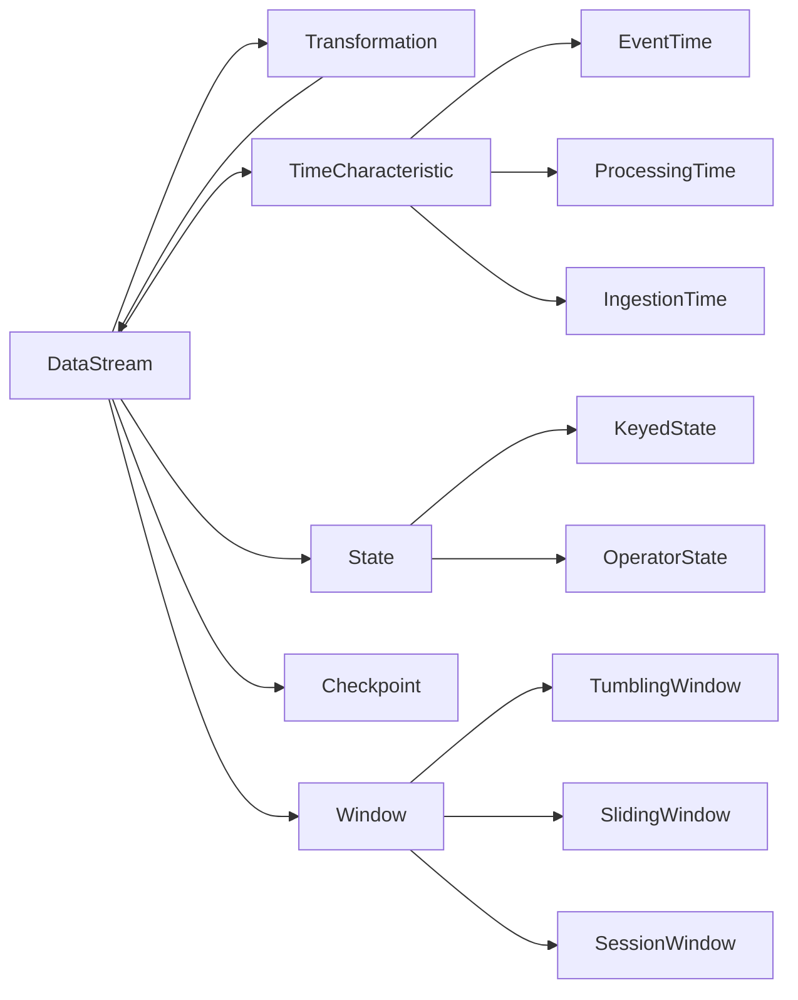

# Flink原理与代码实例讲解

## 1. 背景介绍

### 1.1 大数据处理的挑战
在当今大数据时代,海量数据的实时处理已成为众多企业面临的重大挑战。传统的批处理模式难以满足实时性要求,而流处理技术则应运而生。Apache Flink作为新一代大数据流处理引擎,以其低延迟、高吞吐、强一致性等特点备受关注。

### 1.2 Flink的崛起
Flink起源于德国柏林理工大学的研究项目,2014年由阿里巴巴贡献给Apache软件基金会,现已成为Apache顶级项目。相比Storm、Spark Streaming等流处理框架,Flink在实时性、状态管理、事件时间处理等方面具有独特优势,被誉为流处理界的"黑马"。

### 1.3 Flink的应用场景
Flink广泛应用于金融风控、电商推荐、物联网监控、实时数仓等领域。阿里巴巴、腾讯、滴滴、字节跳动等互联网巨头均已将Flink作为核心流处理引擎,构建实时计算平台。Flink正逐渐成为流处理领域的事实标准。

## 2. 核心概念与联系

### 2.1 数据流(DataStream)
在Flink中,所有数据均被视为数据流。数据流是一个无界、持续增长的数据集合,可以是实时产生的事件流,也可以是有界的历史数据集。Flink以数据流为核心抽象,提供了丰富的流处理API。

### 2.2 转换算子(Transformation)
转换算子用于对数据流进行各种转换操作,如map、filter、reduce等。通过组合不同的转换算子,可以方便地构建复杂的流处理逻辑。常见的转换算子包括:
- Map:将数据流中的每个元素映射为新元素
- FlatMap:将每个元素映射为0个、1个或多个元素 
- Filter:根据条件过滤元素
- KeyBy:根据指定的键对数据流进行分区
- Reduce:对数据流进行归约聚合
- Window:对数据流进行窗口化处理

### 2.3 时间语义
Flink支持三种时间语义:Processing Time、Event Time和Ingestion Time。
- Processing Time:以算子处理数据的系统时间为准
- Event Time:以事件自身携带的时间戳为准
- Ingestion Time:以事件进入Flink的时间为准

合理选择时间语义对于准确处理乱序事件、计算窗口结果至关重要。Flink提供了灵活的Watermark机制,可处理延迟和乱序数据。

### 2.4 状态管理
Flink内置了强大的状态管理机制。算子可以在处理过程中维护状态,状态数据可以自动容错、持久化和扩展。Flink支持两类状态:
- Keyed State:与特定键值相关联,支持更新和访问
- Operator State:与并行算子实例相关联,支持列表状态和联合列表状态

状态使Flink能够构建有状态的流应用,实现复杂的业务逻辑。

### 2.5 检查点(Checkpoint)
Flink通过分布式快照实现容错。检查点机制定期对算子状态做快照,当发生故障时,可从最近的检查点恢复状态和位置,保证exactly-once语义。Flink支持多种状态后端:MemoryStateBackend、FsStateBackend、RocksDBStateBackend,可根据状态访问特点和存储需求灵活选择。

### 2.6 时间窗口(Time Window) 
Flink提供了丰富的窗口API,支持时间窗口、计数窗口、会话窗口等。窗口可以是滚动的(Tumbling Window)、滑动的(Sliding Window)或会话的(Session Window),结合Trigger、Evictor等机制实现灵活的窗口计算。窗口聚合是流处理的核心操作之一。

### 2.7 关系图
下面使用Mermaid流程图展示Flink核心概念之间的关系:



## 3. 核心算法原理与操作步骤

### 3.1 窗口算法原理
Flink窗口计算的核心是将无界流切分成有界窗口,然后在窗口上执行聚合等计算。窗口算法主要分为以下几个步骤:
1. 窗口分配:根据时间或计数将元素分配到不同窗口
2. 触发计算:根据Trigger的定义判断何时触发窗口计算
3. 执行计算:对窗口内的元素执行聚合等计算
4. 清理元素:根据Evictor定义清理窗口内的元素

窗口算法支持增量聚合,即每个窗口维护一个聚合值,每条记录到来就更新聚合值,窗口触发时直接输出聚合结果,避免缓存大量元素。

### 3.2 水印(Watermark)算法原理
Watermark是一种衡量Event Time进展的机制,本质上是一个时间戳,用于表示"在此之前的事件都已经到达"。Watermark算法步骤如下:
1. Watermark生成:根据事件时间戳生成Watermark,常见的有Periodic Watermark、Punctuated Watermark
2. Watermark传播:Watermark在算子之间流动,每个算子根据当前Watermark值触发计算
3. Watermark更新:算子根据收到的Watermark更新自己的Watermark值,以最小值为准
4. 触发事件时间计算:当Watermark到达窗口结束时间时,触发窗口计算并输出结果

Watermark机制能够容忍一定程度的延迟和乱序,保证事件时间语义下的计算正确性。

### 3.3 状态快照(State Snapshot)算法原理 
Flink采用Chandy-Lamport分布式快照算法实现检查点,主要步骤如下:
1. Barrier注入:JobManager向每个Source注入一个带有检查点ID的Barrier
2. Barrier传播:Barrier在算子之间流动,每个算子收到Barrier后暂停处理,保存状态快照,然后将Barrier传递到下游
3. 快照完成:所有算子完成快照后向JobManager汇报,JobManager收集齐所有快照完成消息后,认为本次检查点完成
4. 状态恢复:当发生故障时,JobManager通知所有算子从最近完整检查点恢复状态,然后重新消费数据

分布式快照算法能够在不暂停整个应用的情况下获取全局一致的状态快照,是Flink实现exactly-once语义的基础。

## 4. 数学模型与公式详解

### 4.1 增量聚合模型
Flink窗口使用增量聚合模型,每个窗口维护一个聚合值,每条记录到来就更新聚合值。设第i个窗口的聚合值为 $a_i$,到来的第n个元素为 $x_n$,聚合函数为 $f$,则有:

$$
a_i=\begin{cases}
f(a_i,x_n), & x_n \in window_i \\
a_i, & x_n \notin window_i
\end{cases}
$$

当窗口触发计算时,直接输出 $a_i$ 作为窗口的计算结果,避免缓存大量元素。

### 4.2 Watermark更新公式
设算子的当前Watermark为 $w_c$,收到的Watermark为 $w_r$,则算子更新后的Watermark $w_u$为:

$$
w_u=min(w_c,w_r)
$$

即算子的Watermark取自身和收到的Watermark的较小值,以保证单调递增。

### 4.3 窗口计算触发条件
对于时间窗口,设窗口的结束时间为 $t_e$,Watermark为 $w$,则当满足以下条件时触发窗口计算:

$$
w \geq t_e
$$

即当Watermark大于等于窗口结束时间时,认为窗口内的数据都已到达,触发计算并输出结果。

## 5. 项目实践:代码实例与详解

下面以一个实际的Flink项目为例,展示如何使用Flink进行流处理。该项目实现了一个实时的用户点击事件分析,统计每个用户在每个窗口内的点击次数。

### 5.1 环境准备
首先创建一个Maven项目,引入Flink相关依赖:

```xml
<dependency>
    <groupId>org.apache.flink</groupId>
    <artifactId>flink-java</artifactId>
    <version>1.14.0</version>
</dependency>
<dependency>
    <groupId>org.apache.flink</groupId>
    <artifactId>flink-streaming-java_2.12</artifactId>
    <version>1.14.0</version>
</dependency>
```

### 5.2 数据源定义
定义点击事件的POJO类ClickEvent:

```java
public class ClickEvent {
    private String userId;
    private String url;
    private long timestamp;
    
    // 构造函数、getter和setter方法
}
```

然后创建一个自定义的数据源,模拟产生用户点击事件流:

```java
public class ClickEventSource implements SourceFunction<ClickEvent> {
    private boolean running = true;
    
    @Override
    public void run(SourceContext<ClickEvent> ctx) throws Exception {
        Random random = new Random();
        while (running) {
            String userId = "user_" + random.nextInt(10);
            String url = "http://example.com/" + random.nextInt(100);
            long timestamp = System.currentTimeMillis();
            ctx.collect(new ClickEvent(userId, url, timestamp));
            Thread.sleep(random.nextInt(1000));
        }
    }
    
    @Override
    public void cancel() {
        running = false;
    }
}
```

### 5.3 Flink程序主体
创建Flink程序的主类,编写流处理逻辑:

```java
public class ClickAnalysis {
    public static void main(String[] args) throws Exception {
        StreamExecutionEnvironment env = StreamExecutionEnvironment.getExecutionEnvironment();
        
        // 创建数据源
        DataStream<ClickEvent> clickStream = env.addSource(new ClickEventSource());
        
        // 按用户ID分区,设置Watermark
        DataStream<ClickEvent> partitionedStream = clickStream
            .assignTimestampsAndWatermarks(
                WatermarkStrategy.<ClickEvent>forBoundedOutOfOrderness(Duration.ofSeconds(5))
                    .withTimestampAssigner((event, timestamp) -> event.getTimestamp())
            )
            .keyBy(ClickEvent::getUserId);
        
        // 定义滑动窗口,统计点击次数
        DataStream<Tuple2<String, Long>> clickCounts = partitionedStream
            .window(SlidingEventTimeWindows.of(Time.seconds(60), Time.seconds(10)))
            .aggregate(new ClickCountAgg());
        
        // 打印结果
        clickCounts.print();
        
        env.execute("Click Analysis");
    }
    
    // 自定义聚合函数
    public static class ClickCountAgg implements AggregateFunction<ClickEvent, Long, Long> {
        @Override
        public Long createAccumulator() {
            return 0L;
        }
        
        @Override
        public Long add(ClickEvent value, Long accumulator) {
            return accumulator + 1;
        }
        
        @Override
        public Long getResult(Long accumulator) {
            return accumulator;
        }
        
        @Override
        public Long merge(Long a, Long b) {
            return a + b;
        }
    }
}
```

这个程序的主要步骤如下:
1. 创建Flink流执行环境
2. 添加自定义的ClickEventSource作为数据源
3. 对流按用户ID进行分区,并设置Watermark
4. 定义一个滑动事件时间窗口,窗口大小为60秒,滑动步长为10秒
5. 在窗口上应用自定义的ClickCountAgg聚合函数,统计每个用户在每个窗口的点击次数
6. 打印结果数据流
7. 启动程序执行

### 5.4 运行结果
启动程序后,可以看到控制台不断输出每个用户在每个窗口的点击次数,形如:

```
(user_3,12)
(user_7,8)
(user_1,15)
...
```

这表示user_3在最近60秒内点击了12次,user_7点击了8次,user_1点击了15次。每10秒输出一次结果,体现了流处理的实时性。

## 6. 实际应用场景

Flink在多个领域得到了广泛应用,下面列举几个典型场景:

### 6.1 实时风控
金融机构使用